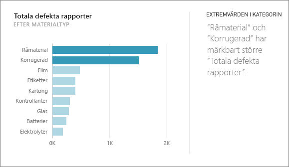
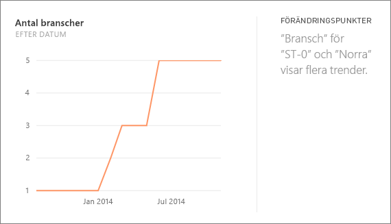
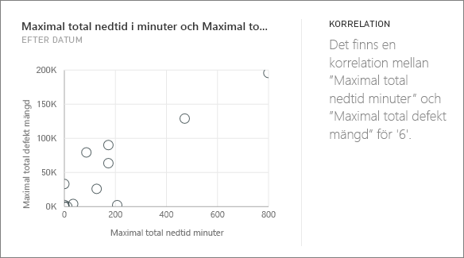
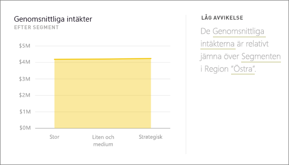
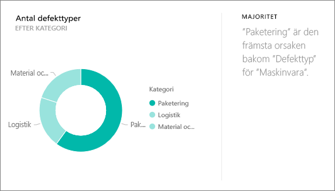
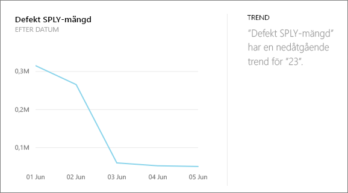
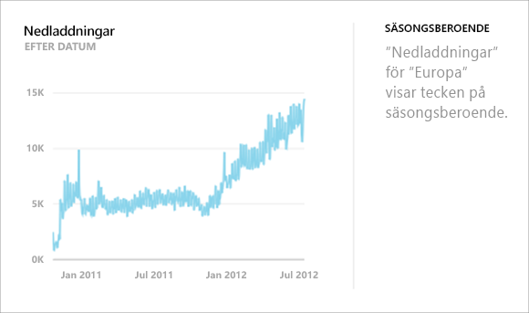
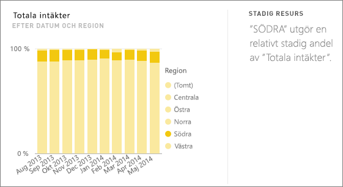
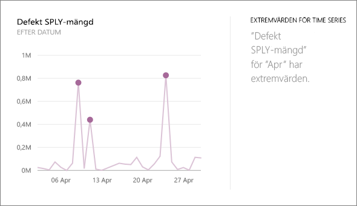

# Typer av insikter som stöds av Power BI
## Hur fungerar insikter?
Power BI söker snabbt olika delmängder av din datauppsättning samtidigt som en uppsättning avancerade algoritmer används för att identifiera potentiellt intressanta insikter. Power BI söker igenom så mycket av en datauppsättning som möjligt inom tilldelad tid.

Du kan köra insikter mot en datauppsättning eller en panel på en instrumentpanel.   

## Vilka typer av insikter kan vi hitta?
Det här är några av de algoritmer som vi använder:

## Kategoriavvikare (upp/ned)
Visar fall, för ett mått i modellen, där en eller två medlemmar i en dimension har mycket större värden än andra medlemmar i dimensionen.  

## Ändra punkterna i en tidsserie
Visar om det finns betydande förändringar i trender i en tidsserie med data.

## Korrelation
Identifierar fall där flera mått visar ett förhållande mellan varandra när de ritas mot en dimension i datauppsättningen.

## Låg varians
Identifierar fall där datapunkter inte är långt från medelvärdet.

## Majoritet (viktiga faktorer)
Söker efter fall där en majoritet av ett totalt värde kan bero på en enda faktor vid uppdelat efter en annan dimension.  

## Övergripande trender i tidsserier
Identifierar trender uppåt eller nedåt i tidsseriedata.

## Säsongsberoende i tidsserier
Söker efter periodiska mönster i tidsseriedata, till exempel säsongsvärdet för varje vecka, månad eller år.

## Stadig resurs
Visar fall där det finns en överordnad-underordnad korrelation mellan andelen av det underordnade värdet i förhållande till det övergripande värdet för det överordnade över en kontinuerlig variabel.

## Extremvärden för tidsserier
För data över en tidsserie, identifierar när det finns specifika datum- och tidsvärden som skiljer sig från andra datum-/tidsvärden.

## Nästa steg
[Power BI-insikter](service-insights.md)

Om du äger en datauppsättning kan du [optimera den för insikter](service-insights-optimize.md)

Har du fler frågor? [Prova Power BI Community](http://community.powerbi.com/)

