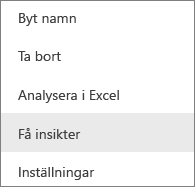
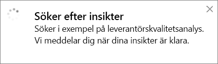
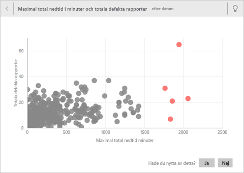
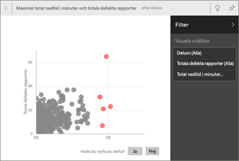
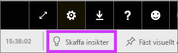
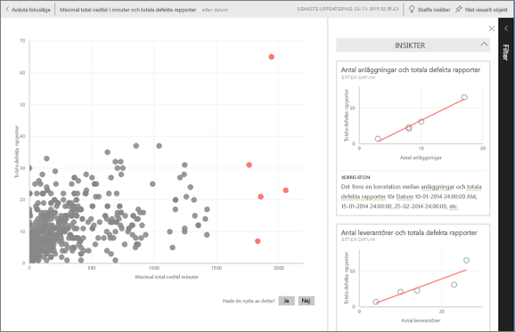

# Quick Insights med Power BI
Har du en ny datauppsättning och vet inte riktigt var du ska börja?  Behöver du skapa en instrumentpanel snabbt?  Vill du snabbt leta efter insikter som du kan ha missat?

Kör Quick Insights om du vill generera intressanta interaktiva visualiseringar utifrån dina data. Quick Insights kan köras på en hel datauppsättning (Quick Insights) eller på en specifik instrumentpanel (Scoped Insights). Du kan även köra Quick Insights på en insikt!

> **Obs**! Quick Insights fungerar inte med DirectQuery – det fungerar bara med data som överförs till Power BI.
> 
> 

Funktionen Quick Insights bygger på en växande [uppsättning avancerade analytiska algoritmer](service-insight-types.md) utvecklade tillsammans med Microsoft Research som vi kommer att fortsätta att använda så att flera användare kan söka efter insikter i sina data på nya och intuitiv sätt.

## Kör Quick Insights på en datauppsättning
Titta på när Amanda kör Quick Insights på en datauppsättning, öppnar en insikt i Fokusläge, fäster en av dessa snabba insikter som en panel på sin instrumentpanel och sedan får Quick Insights om ett visuellt objekt.

<iframe width="560" height="315" src="https://www.youtube.com/embed/et_MLSL2sA8" frameborder="0" allowfullscreen></iframe>

Nu är din tur. Utforska Quick Insights med [exemplet för analys av leverantörskvalitet](sample-supplier-quality.md).

1. Från fliken **Datauppsättningar**, välj ellipserna (...) och välj **Hämta insikter**.
   
    
   
    
2. Power BI använder [olika algoritmer](service-insight-types.md) för att söka efter trender i datauppsättningen.
   
    
3. Dina insikter är klara inom några sekunder.  Välj **Visa insikter** för att visa visualiseringar.
   
    
   
   > **Obs**! Vissa datauppsättningar kan inte generera Quick Insights eftersom data inte är statistiskt signifikanta.  Läs mer i [Optimera dina data för Quick Insights](service-insights-optimize.md).
   > 
   > 
4. Visualiseringar visas i en särskild arbetsyta för **Quick Insights** med upp till 32 separata insiktskort. Varje kort har ett diagram eller graf samt en kort beskrivning.
   
    

## Interagera med Quick Insight-korten
  

1. Hovra över ett kort och välj stiftikonen för att lägga till visualiseringen på en instrumentpanel.
2. Hovra över ett kort och välj ikonen för Fokusläge för att visa kortet i helskärmsläge.
   
    
3. I Fokusläge kan du:
   
   * [filtrera](service-interact-with-a-report-in-reading-view.md) visualiseringarna.  Välj pilen i det övre högra hörnet för att expandera filterfönstret om du vill visa filtren.
     
        
   * Fäst insiktskortet på en instrumentpanel genom att välja stiftikonen  eller **Fäst visualiseringar**.
   * Kör Quick Insights på själva kortet. Detta kallas **Scoped Quick Insights**. I det övre högra hörnet väljer du ikonen med en glödlampa  eller **Hämta insikter**.
     
       
     
     Quick Insight visas till vänster och nya kort som endast baseras på data i denna enda snabbinsikt visas till höger.
     
       
4. Om du vill återgå till den ursprungliga arbetsytan för Quick Insights väljer du **Avsluta Fokusläge** i det övre vänstra hörnet.

## Kör Quick Insights på en panel på instrumentpanelen
Begränsa sökningen till de data som används för att skapa en enda panel på instrumentpanelen i stället för att söka efter insikter mot en hel datauppsättning. Detta kallas **Scoped Quick Insights**.

1. Öppna en instrumentpanel.
2. Välj en panel och [öppna panelen i Fokusläge](service-focus-mode.md).
3. I det övre högra hörnet väljer du **Hämta insikter**.
   
    
4. Power BI visar insiktskorten längs höger sida av panelen.
   
    
5. Fångar ett insiktskort ditt intresse? Välj insiktskortet för att gå djupare. Vald Quick Insight visas till vänster och nya insiktskort som endast baseras på data i denna enda Quick Insight visas till höger.
6. Fortsätt utforska dina data och när du har hittat en intressant Quick Insight fäster du dess visuella objekt på instrumentpanelen genom att välja **Fäst visualisering** från det övre högra hörnet. Du kan också skicka feedback så att datauppsättningens ägare vet om en viss snabbinsikt var till hjälp eller inte.
   
    

## Nästa steg
Om du äger en datauppsättning, [optimera den för Quick Insights](service-insights-optimize.md)

Lär dig mer om [tillgängliga typer av Quick Insights](service-insight-types.md)

Har du fler frågor? [Försök med att fråga Power BI Community](http://community.powerbi.com/)

