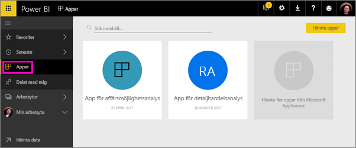
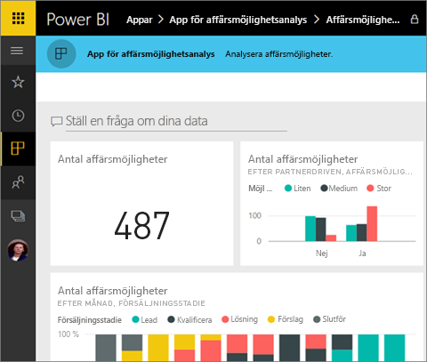
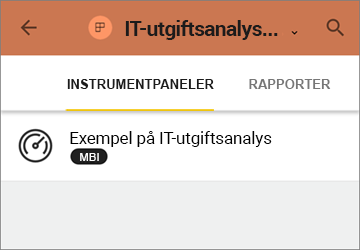
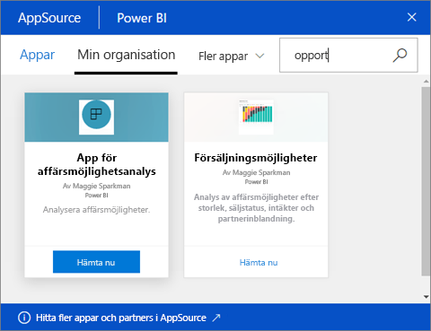
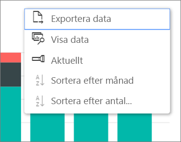

# Installera och använda appar med instrumentpaneler och rapporter i Power BI
I Power BI samordnar *appar* relaterade instrumentpaneler och rapporter på ett och samma ställe. Personer i organisationen kan skapa och distribuera appar med viktig information. [Externa tjänster](service-connect-to-services.md), som du kanske redan använder, t.ex. Google Analytics och Microsoft Dynamics CRM, erbjuder också Power BI-appar. 

Apparna är lätta att hitta och installera på Power BI-tjänsten ([https://powerbi.com](https://powerbi.com)) och på din mobila enhet. När du har installerat en app behöver du inte längre komma ihåg namnet på en massa olika instrumentpaneler eftersom de har samlats tillsammans i en och samma app, i din webbläsare eller på din mobila enhet.

Och när appförfattare släpper uppdateringar, så ser du dem automatiskt. Författaren också styr också hur ofta data schemaläggs för uppdatering, så du inte behöver bry dig om att hålla det uppdaterat. 

Funderar du på att skapa en app? Mer information finns på sidan om att [skapa arbetsytor med dina kollegor i Power BI](service-create-distribute-apps.md).

## Hämta en ny app
Du kan hämta appar på några olika sätt. App-författaren kan installera appen automatiskt i ditt Power BI-konto eller skicka dig en direktlänk till en app, eller så kan du söka efter den i AppSource, där du kan se alla appar som du har åtkomst till. I Power BI på din mobila enhet kan du bara installera den från en direktlänk och inte från AppSource. Om appförfattaren installerar appen automatiskt, så visas den i din lista över appar.

### Installera en app från en direktlänk
Det enklaste sättet att själv installera en ny app är genom att få en direktlänk från appens författare. Power BI skapar en installationslänk som författaren kan skicka till dig.

**På datorn** 

När du klickar på länken i ett e-postmeddelande öppnas Power BI-tjänsten ([https://powerbi.com](https://powerbi.com)) i webbläsaren. Du bekräftar att du vill installera appen och öppnar applandningssidan.

**På iOS- eller mobila Android-enheter** 

När du klickar på länken i ett e-postmeddelande på din mobila enhet, så installeras appen automatiskt och öppnar appens innehållslista i mobilappen. 

### Hämta appen från Microsoft AppSource
Du kan också söka efter och installera alla program som du har åtkomst till från Microsoft AppSource. 

1. Välj **Appar**  > **Hämta appar**. 
   
     
2. I AppSource under **Min organisation** kan du söka för att begränsa resultaten och hitta den apn som du letar efter.
   
     
3. Välj **Hämta den nu** om du vill lägga till den på sidan Appar. 

## Interagera med instrumentpaneler och rapporter i appen
Nu kan du utforska data i instrumentpanelerna och rapporterna i appen. Du har åtkomst till alla Power BI-standardinteraktioner som filtrering, syntaxmarkering, sortering och detaljinformation. Du kan även [exportera data till Excel ](power-bi-visualization-export-data.md) från en tabell eller annat visuellt objekt i en rapport. Läs mer i [Interagera med rapporter i Power BI](service-reading-view-and-editing-view.md). 

## Nästa steg
* [Skapa och publicera appar i Power BI](service-create-distribute-apps.md)
* [Power BI-appar för externa tjänster](service-connect-to-services.md)
* Har du några frågor? [Fråga Power BI Community](http://community.powerbi.com/)

