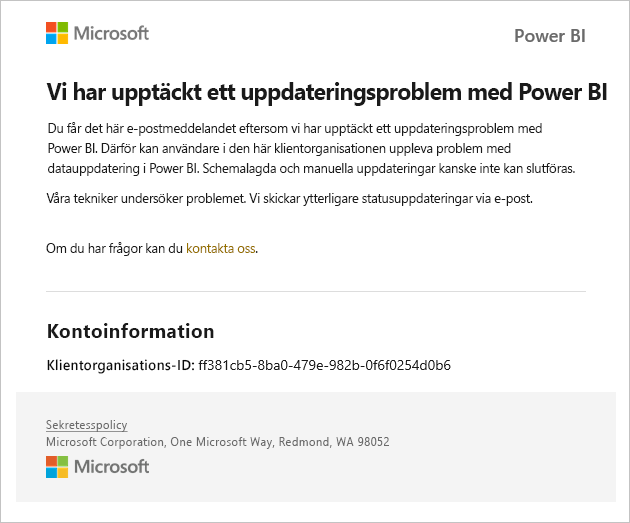
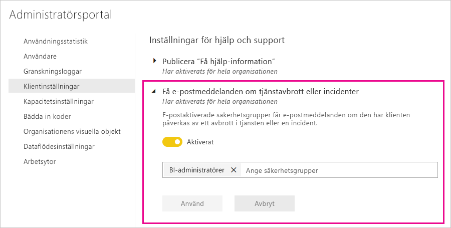

# Aviseringar om tjänstavbrott

Det är viktigt att få insyn i tillgängligheten för dina verksamhetskritiska affärs program. Power BI erbjuder incidentmeddelanden så att du kan välja att få e-post om det sker störningar eller försämring i tjänsten. Power BI-serviceavtalet på 99,9 % gör dessa händelser sällsynta, men vi vill ändå säkerställa att du informeras. Följande skärm bild visar den typ av e-post du får om du aktiverar meddelanden:

För tillfället skickar vi e-postmeddelanden för följande _tillförlitlighetsscenarier_:

- Tillförlitlighet för öppen rapport
- Tillförlitlighet för modelluppdatering
- Tillförlitlighet för frågeuppdatering

Meddelanden skickas när det uppstår _längre förseningar_ i åtgärder som att öppna rapporter, uppdatera datamängder eller köra frågor. När en incident har lösts får du ett uppföljningsmeddelande via e-post.

> [!NOTE]
> Den här funktionen är för närvarande endast tillgänglig för dedikerade kapaciteter i Power BI Premium. Den är inte tillgänglig för delad eller inbäddad kapacitet.

## Aktivera meddelanden

En Power BI-klientorganisationsadministratör aktiverar meddelanden i administratörsportalen:

1. Identifiera eller skapa en e-postaktiverad säkerhetsgrupp som ska ta emot meddelanden.

1. I administratörsportalen väljer du **Klientorganisationsinställningar**. Under **Inställningar för hjälp och support** expanderar du **Få e-postmeddelanden om tjänstavbrott eller incidenter**.

1. Aktivera meddelanden, ange en säkerhetsgrupp och välj **Använd**.

    

> [!NOTE]
> Power BI skickar meddelanden från kontot no-reply-powerbi@microsoft.com. Se till att det här kontot är tillåtet så att inga meddelanden hamnar i spam- eller skräppostmappen.

## Nästa steg

[Supportalternativ för Power BI Pro och Power BI Premium](service-support-options.md)

Har du fler frågor? [Prova Power BI Community](https://community.powerbi.com/)
