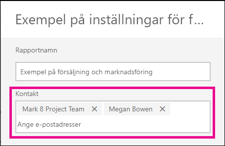

# Ange kontaktuppgifter för rapporter och instrumentpaneler i Power BI-tjänsten
I den här artikeln får du veta hur du anger kontaktuppgifter för en instrumentpanel eller rapport i Power BI-tjänsten.

> [!NOTE]
> Kontaktuppgifter kan anges för objekt i en klassisk eller ny arbetsyta. Du kan inte ange kontaktuppgifter för objekt i din Min arbetsyta. Informationskortet visas när du visar en rapport eller instrumentpanel i det [nya utseendet](service-new-look.md).

Du kan lägga till flera användare eller grupper i kontakten för ett objekt. De kan vara:
* En person
* En Office 365-grupp
* En e-postaktiverad säkerhetsgrupp
* En distributionslista

Som standard är den person som skapar en ny rapport eller instrumentpanel kontakten för den. Om du anger ett värde åsidosätts standardvärdet. Du kan givetvis ta bort alla personer eller grupper från kontaktlistan. När du gör detta för klassiska arbetsytor kommer Office 365-gruppen för arbetsytan att visas. För den nya arbetsyteupplevelsen kommer [arbetsytans kontaktlista](service-create-the-new-workspaces.md#workspace-contact-list) att användas. Om arbetsytans kontaktlista inte anges, visas arbetsytans administratörer.

Kontaktuppgifterna visas för personer som visar objektet. 

 

När du klickar på listan över kontakter skapas ett e-postmeddelande så att du kan ställa frågor eller få hjälp. 

 
 
Kontaktlistans uppgifter används även på andra platser. Den visas till exempel i vissa felscenarier i feldialogrutan. Automatiserade e-postmeddelanden relaterade till objektet, till exempel åtkomstbegäranden, skickas till kontaktlistan. 

> [!NOTE]
> När du publicerar en app anges de kontaktuppgifter som angetts för enskilda objekt till den person som publicerade eller uppdaterade appen. Du kan ställa in appens support-URL så att appanvändarna får den hjälp de behöver.

## Ange kontaktuppgifter för en rapport
1. Stanna kvar på arbetsytan och välj fliken **Rapporter**.
2. Leta upp den önskade rapporten och välj **Inställningar**-ikonen.
3. Leta upp inmatningsfältet **Kontakt** och ange ett värde.

     

## Ange kontaktuppgifter för en instrumentpanel
1. Stanna kvar på arbetsytan och välj fliken **Datauppsättningar**.
2. Leta upp den önskade instrumentpanelen och välj **Inställningar**-ikonen
3. Leta upp inmatningsfältet **Kontakt** och ange ett värde.

     

## Begränsningar och överväganden
* Kontakten anges automatiskt för nya objekt som skapas i Power BI-tjänsten. Befintliga objekt visar arbetsytans standardvärde.
* Du kan ange valfri användare eller grupp i kontaktlistan, men de kommer inte att beviljas åtkomst till objektet automatiskt. Använd delning eller ge användare som behöver det åtkomst till arbetsytan via en roll. 
* Kontaktlistan på postnivå flyttas inte till appar när de publiceras. Den nya navigeringsupplevelsen för appar ger en support-URL som du konfigurerar för att hjälpa till att hantera feedback från ett stort antal appanvändare.

## Nästa steg

Fler frågor? [Prova Power BI Community](https://community.powerbi.com/)
