# Automatiserad maskininlärning i Power BI

Med Automatiserad maskininlärning (AutoML) för dataflöden kan affärsanalytiker träna upp, validera och anropa ML-modeller direkt i Power BI. Det innehåller en enkel upplevelse för skapande av en ny ML-modell (maskininlärningsmodell) där analytiker kan använda sina dataflöden för att ange indata för träning av modellen. Tjänsten extraherar automatiskt de mest relevanta egenskaperna, väljer en lämplig algoritm samt justerar och validerar ML-modellen. När en modell har tränats upp genererar Power BI automatiskt en prestandarapport med resultatet av valideringen. Modellen kan sedan anropas på alla nya eller uppdaterade data i dataflödet.

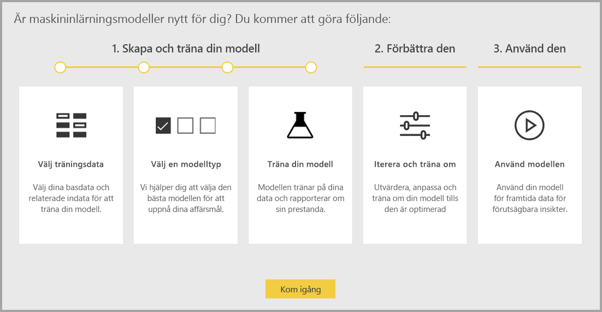

Automatiserad maskininlärning är endast tillgängligt för dataflöden som värdhanteras på Power BI Premium och inbäddade kapaciteter.

## Arbeta med AutoML

[Power BI-dataflöden](service-dataflows-overview.md) har dataförberedelse med självbetjäning för stordata. AutoML är integrerat i dataflödena så att du kan använda dina dataförberedelser när du skapar maskininlärningsmodeller direkt i Power BI.

AutoML i Power BI gör att dataanalytiker kan använda dataflöden till att skapa maskininlärningsmodeller med en förenklad upplevelse där endast kunskap om Power BI behövs. Det mesta av data science-arbetet bakom skapandet av ML-modeller är automatiserat i Power BI. Tjänsten har vägledningar så att modellen som produceras ska ha god kvalitet, och du har insyn i processen som används till att skapa din ML-modell.

Med AutoML kan du skapa **binär förutsägelse**, **klassificering** och **regressionsmodeller** för dataflöden. Det här är olika tekniker för övervakad maskininlärning, vilket innebär att de använder kända resultat av tidigare observationer till att förutsäga resultatet av nya observationer. Indatamängden för träning av en AutoML-modell är en uppsättning poster som **märks** med de kända resultaten.

AutoML i Power BI integrerar [automatiserad maskininlärning](https://docs.microsoft.com/azure/machine-learning/service/concept-automated-ml) från [Azure Machine Learning](https://docs.microsoft.com/azure/machine-learning/service/overview-what-is-azure-ml) för att skapa dina ML-modeller. Du behöver dock ingen Azure-prenumeration för att använda AutoML i Power BI. Processen med att träna och värdhantera ML-modeller hanteras helt av Power BI-tjänsten.

När en maskininlärningsmodell har tränats genererar AutoML automatiskt en Power BI-rapport som förklarar ML-modellens sannolika prestanda. Tydligheten är viktig i AutoML, så de faktorer i dina indata som är viktigast för att ta fram förutsägelser i modellen lyfts fram. Rapporten innehåller även nyckelmått för modellen.

På andra sidor i den genererade rapporten finns en statistisk sammanfattning av modellen och träningsinformationen. Den statistiska sammanfattningen är intressant för användare som vill se vanliga data science-mått för modellens prestanda. Träningsinformationen sammanfattar alla iterationer som kördes för att skapa modellen samt associerade modelleringsparametrar. Den beskriver även hur alla indata användes för att skapa ML-modellen.

Du kan sedan tillämpa ML-modellen på dina data för poängsättning. När dataflödet uppdateras så uppdateras även dina data med förutsägelser från ML-modellen. Power BI ger även en individualiserad förklaring för varje specifik förutsägelse som ML-modellen skapar.

## Skapa en maskininlärningsmodell

I det här avsnittet beskrivs hur du skapar en AutoML-modell.

### Förbereda data för skapandet av en ML-modell

För att skapa en maskininlärningsmodell i Power BI måste du först skapa ett dataflöde för dina data med informationen om historiska utfall, som används till att träna upp ML-modellen. Du bör även lägga till beräknade kolumner för eventuella affärsmått som kan vara starka förutsägande faktorer för det resultat du försöker förutsäga. Mer information om hur du konfigurerar dataflödet finns i [Dataförberedelser med självbetjäning i Power BI](service-dataflows-overview.md).

AutoML har specifika datakrav för träning av en maskininlärningsmodell. Dessa krav beskrivs i avsnitten nedan baserat på respektive modelltyp.

### Konfigurera ML-modellens indata

Du skapar en AutoML-modell genom att välja ML-ikonen i kolumnen **Åtgärder** i dataflödesentiteten och sedan välja **Lägg till en maskininlärningsmodell**.

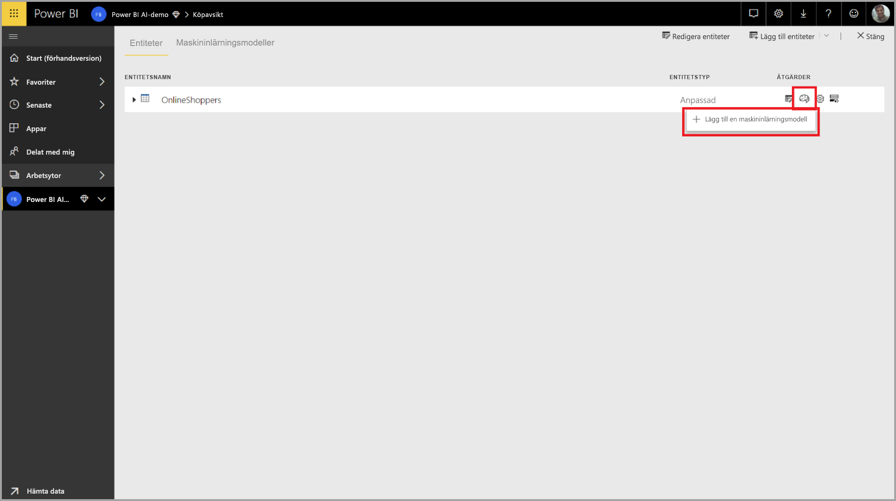

En förenklad upplevelse startas med en guide som vägleder dig genom processen för att skapa ML-modellen. Guiden innehåller följande enkla steg.

**1. Välj entiteten med historiska data samt det fält du vill ha en förutsägelse för**

Utfallsfältet identifierar etikettattributet för inträning av ML-modellen, se följande bild.

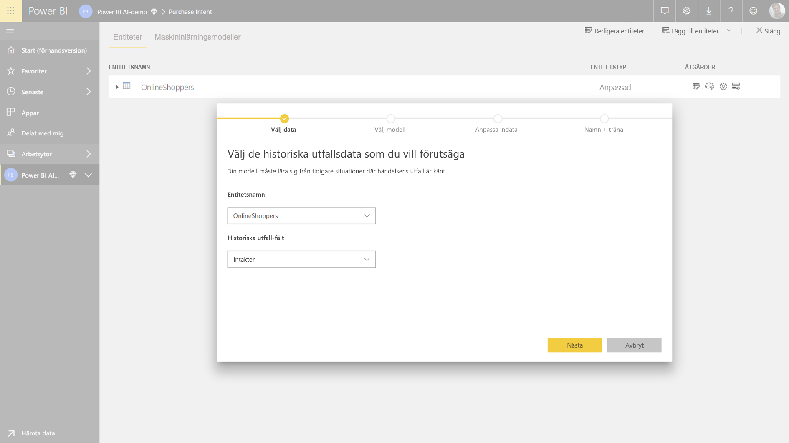

**2. Välj en modelltyp**

När du anger utfallsfältet analyserar AutoML etikettdata och rekommenderar en typ av ML-modell som mest sannolikt kan tränas upp. Du kan välja en annan modelltyp genom att klicka på ”Välj en annan modell”.

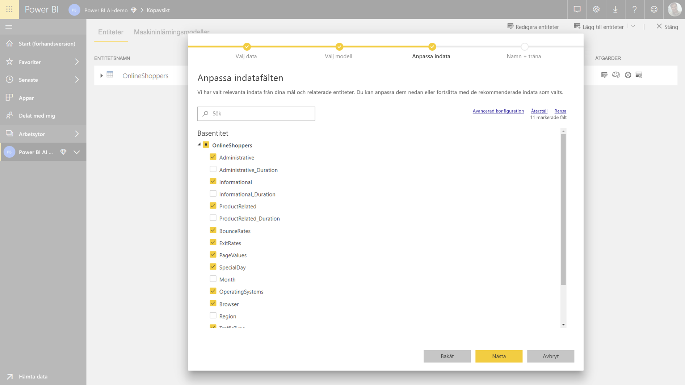

> [!NOTE]
> Vissa modelltyper stöds kanske inte för de data du har valt, och då är de inaktiverade. I exemplet ovan är Regression inaktiverat eftersom en textkolumn är vald som utfallsfält.

**3. Välj de indata du vill att modellen ska använda som förutsägelsesignaler**

AutoML analyserar ett urval av fälten i den valda entiteten och föreslår vilka indata som kan användas för inträning av ML-modellen. Förklaringar visas bredvid fält som inte är valda. Om ett visst fält har för många distinkta värden eller endast ett värde, eller särskilt låg eller hög korrelation med utfallsfältet, så rekommenderas det inte.

Du bör inte använda indata som är beroende av utfallsfältet (eller etikettfältet) när du tränar upp ML-modellen eftersom de påverkar modellens prestanda. Sådana fält flaggas med en ”misstänkt hög korrelation med utfallsfältet”. När du använder sådana fält i dina träningsdata uppstår etikettläckage, där modellen fungerar bra på verifierings- eller testdata men inte lika bra för poängsättning i produktion. Etikettläckage kan vara ett problem i AutoML-modeller när resultatet av modellträningen ser lite för bra ut för att vara sant.

Den här egenskapsrekommendationen baseras på ett urval av data, så du bör granska vilka indata som har använts. Du kan ändra urvalet så att du tar med de fält du vill att modellen ska studera. Du kan också välja alla fält genom att markera kryssrutan bredvid entitetens namn.

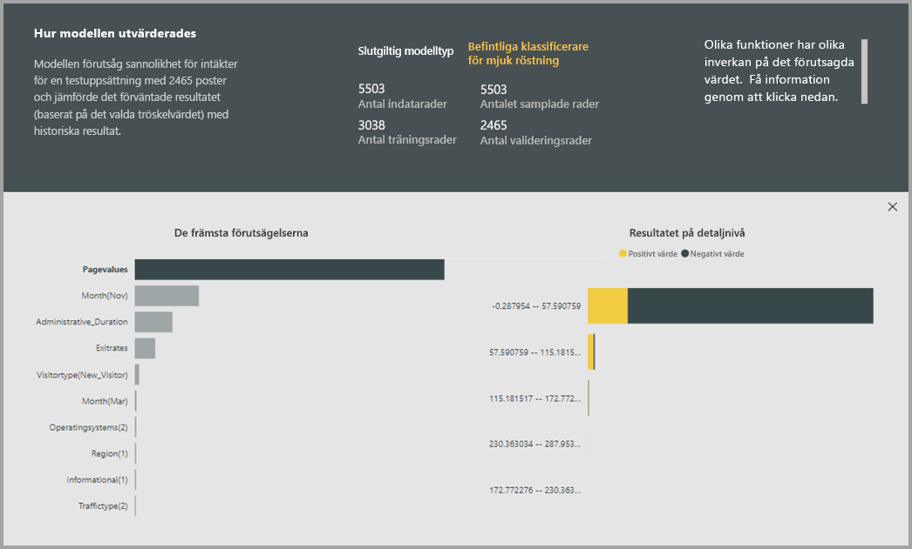

**4. Namnge modellen och spara konfigurationen**

I det sista steget namnger du modellen och väljer Spara. Då startar inträningen av ML-modellen. Du kan välja att minska inlärningstiden om du vill få resultat snabbare, eller att öka tiden för att få fram bästa möjliga modell.

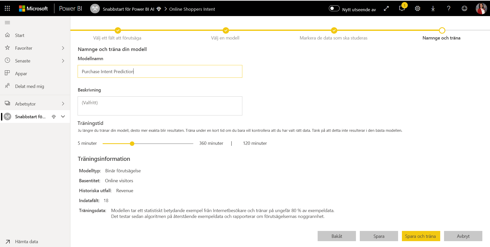

### Träning av ML-modell

Träning av AutoML-modeller är en del av dataflödesuppdateringen. AutoML förbereder först dina data för träning.
AutoML delar in de historiska data du anger i datamängder för träning respektive testning. Datamängden för testning är en uppsättning reserverade data som används för validering av modellens prestanda efter träningen. Dessa realiseras som entiteter för **träning och testning** i dataflödet. AutoML använder korsvalidering för validering av modellen.

Därefter analyseras varje indatafält och imputering tillämpas, vilket ersätter eventuella saknade värden med ersatta värden. AutoML använder några olika imputeringsstrategier. För indataattribut som hanteras som numeriska egenskaper används medelvärdet av kolumnvärdena för imputering. För indataattribut som hanteras som kategoriska egenskaper använder AutoML kolumnvärdenas läge för imputering. AutoML-ramverket beräknar de medelvärden och lägen som används för imputering baserat på ett urval av datamängden som används för inträning.

Sedan tillämpas sampling och normalisering på dina data efter behov. För klassificeringsmodeller kör AutoML indata genom stratifierad sampling och balanserar klasserna så att antalet rader är lika för alla.

AutoML tillämpar flera transformeringar på varje valt indatafält baserat på dess datatyp och statistiska egenskaper. AutoML använder dessa transformeringar för att extrahera egenskaper som används vid träning av ML-modellen.

Träningsprocessen för AutoML-modeller består av upp till 50 iterationer med olika modelleringsalgoritmer och inställningar för hyperparametrar i syfte att hitta den modell som har bäst prestanda. Inträningen kan avslutas tidigt med färre iterationer om AutoML upptäcker att modellens prestanda inte förbättras. Prestanda för var och en av dessa modeller utvärderas genom validering med testdatamängden med reserverade data. Under det här träningssteget skapar AutoML flera pipelines för träning och validering av dessa iterationer. Processen för att utvärdera modellernas prestanda kan ta tid, från några minuter till flera timmar och upp till tiden som konfigureras i guiden, beroende på datamängdens storlek och mängden tillgängliga dedikerade kapacitetsresurser.

I vissa fall kan den slutliga modell som genereras använda ensembleinlärning, där flera modeller används för att ge bättre förutsägelseprestanda.

### Förklarbarhet för AutoML-modell

När modellen har tränats analyserar AutoML relationen mellan indataegenskaperna och modellens utdata. Tjänsten utvärderar hur mycket modellens utdata måste ändras för testdatamängden med reserverade data för varje indataegenskap. Detta kallas _egenskapsprioritet_. Detta inträffar som en del av uppdateringen när inträningen är klar. Uppdateringen kan därför ta längre tid än den tid för inträning som är konfigurerad i guiden.

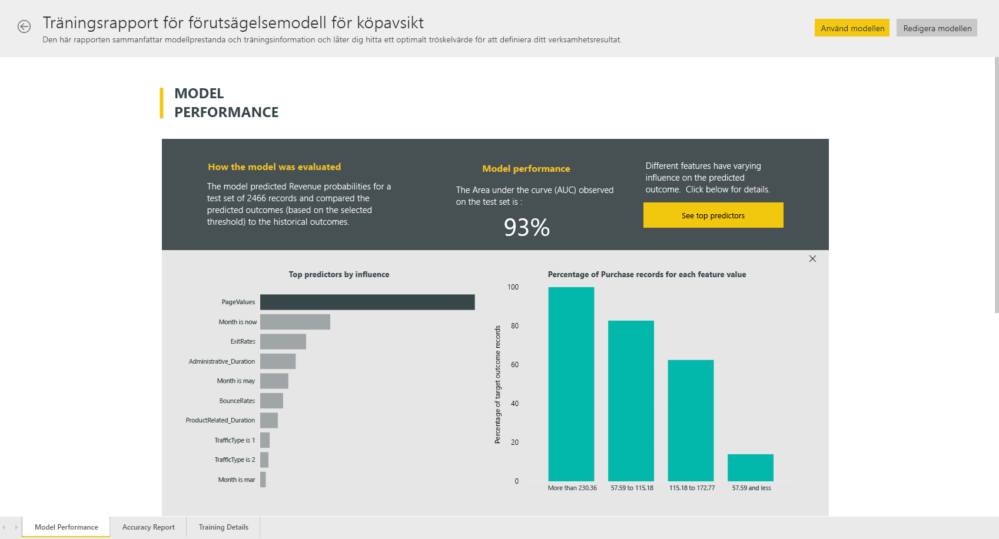

### AutoML-modellrapport

AutoML genererar en Power BI-rapport som sammanfattar modellens prestanda under valideringen samt den globala egenskapsprioriteten. Du kan komma åt den här rapporten på fliken Maskininlärningsmodell när dataflödet har uppdaterats. Rapporten sammanfattar resultatet från tillämpningen av ML-modellen på reserverade testdata och jämför förutsägelserna med de kända utfallsvärdena.

Du kan granska modellrapporten för att förstå dess prestanda. Du kan även kontrollera att modellens främsta influerare överensstämmer med affärsinsikterna om de kända utfallen.

De diagram och mått som används för att beskriva modellens prestanda i rapporten beror på modelltypen. Dessa prestandadiagram och mått beskrivs i följande avsnitt.

Ytterligare sidor i rapporten kan beskriva statistiska mått för modellen utifrån ett dataforskningsperspektiv. Till exempel innehåller rapporten om **binär förutsägelse** ett ökningsdiagram och ROC-kurvan för modellen.

Rapporterna innehåller även sidan **Träningsinformation** där du kan se hur modellen tränats upp, och ett diagram som beskriver modellens prestanda för varje iterationskörning.

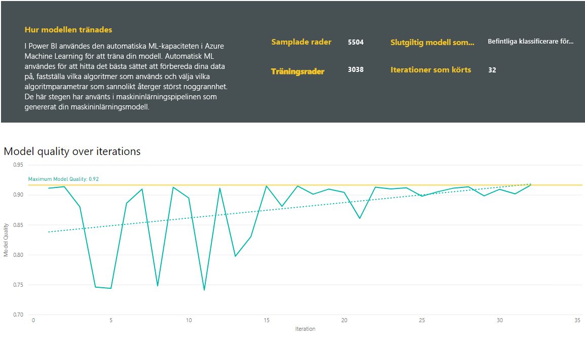

I ett annat avsnitt på den här sidan ser du typen av indatafält som identifierats och vilken imputeringsmetod som använts till att fylla i värden som saknats. Det innehåller även de parametrar som användes av den slutliga modellen.

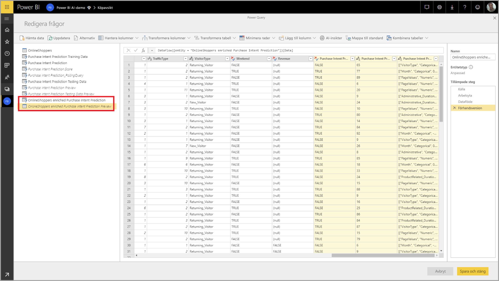

Om den modell som skapades använder ensembleinlärning så finns även ett avsnitt på sidan **Träningsinformation** som visar vikten för varje konstituerande modell i ensemblen samt dess parametrar.

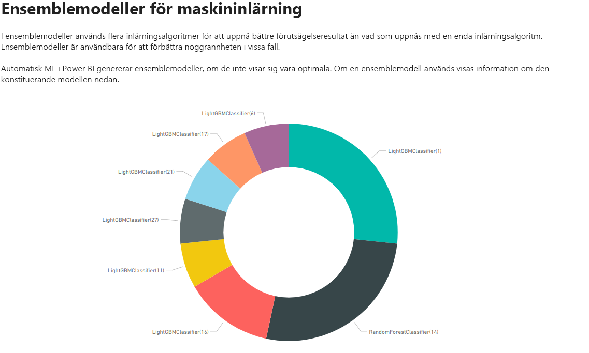

## Tillämpa AutoML-modellen

Om du är nöjd med prestandan hos den ML-modell som skapades kan du tillämpa den på nya eller uppdaterade data när ditt dataflöde uppdateras. Det här kan du göra från modellrapporten genom att välja knappen **Tillämpa** uppe till höger, eller knappen Tillämpa ML-modell under åtgärderna på fliken Maskininlärningsmodeller.

För att kunna tillämpa ML-modellen måste du ange namnet på den entitet som modellen ska tillämpas på samt ett prefix för de kolumner som ska läggas till i den här entiteten för modellens utdata. Standardprefixet för kolumnnamnen är modellnamnet. Funktionen _Tillämpa_ kan innehålla ytterligare parametrar som är specifika för modelltypen.

När du tillämpar ML-modellen skapas två nya dataflödesentiteter som innehåller förutsägelserna och de enskilda förklaringarna för varje rad som poängsätts i utfallsentiteten. Om du till exempel tillämpar modellen _PurchaseIntent_ på entiteten _OnlineShoppers_ genererar utdata entiteterna **OnlineShoppers enriched PurchaseIntent** och **OnlineShoppers enriched PurchaseIntent explanations**. För varje rad i den berikade entiteten är **Explanations** uppdelad i flera rader i den berikade entiteten med förklaringar baserat på indataegenskapen. Ett **ExplanationIndex** hjälper dig att mappa raderna i den berikade entiteten med förklaringar mot raden i den berikade entiteten.

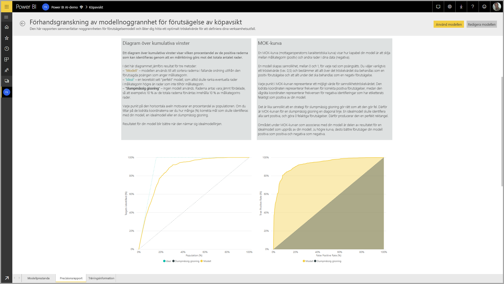

När du tillämpar modellen håller AutoML alltid dina förutsägelser uppdaterade när dataflödet uppdateras.

Om du vill använda insikter och förutsägelser från ML-modellen i en Power BI-rapport kan du ansluta till utdataentiteten från Power BI Desktop med hjälp av anslutningsprogrammet för **dataflöden**.

## Modeller för binär förutsägelse

Modeller för binär förutsägelse, som mer formellt kallas **modeller för binär klassificering**, används för att klassificera en datamängd i två grupper. De används till att förutse händelser som kan ha ett binärt utfall. Några exempel kan vara om en affärsmöjlighet realiseras, ett konto faller bort, en faktura betalas i tid eller en transaktion är bedräglig.

Utdata från en modell för binär förutsägelse är en sannolikhetspoäng som identifierar sannolikheten för det önskade utfallet.

### Träna en modell för binär förutsägelse

Förutsättningar:

- Minst 20 rader med historiska data krävs för varje klass av utfall

Processen för att skapa en modell för binär förutsägelse inbegriper samma steg som andra AutoML-modeller, vilket beskrivs i avsnittet **Konfigurera ML-modellens indata** ovan. Den enda skillnaden är i steget ”Välj en modell” där du kan välja det utfallsvärde du är mest intresserad av. Du kan också ange användarvänliga etiketter för de utfall som ska användas i den automatiskt genererade rapport där resultatet av modellens validering sammanfattas.

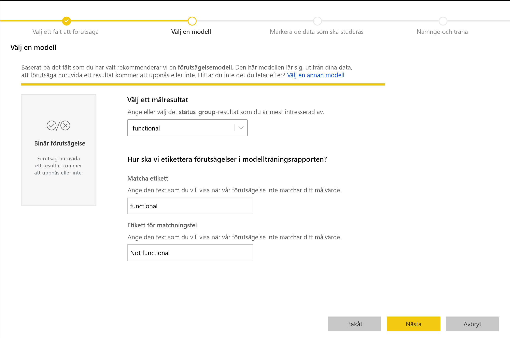

### Rapport för modell för binär förutsägelse

Modellen för binär förutsägelse genererar en sannolikhet att en post uppnår det önskade utfallet. Rapporten innehåller ett utsnitt för sannolikhetströskeln som påverkar hur poäng över och under sannolikhetströskeln tolkas.

Rapporten beskriver modellens prestanda med avseende på _sanna positiva, falska positiva, sanna negativa och falska negativa_ värden. Sanna positiva och sanna negativa värden är korrekt förutsagda utfall för de två klasserna i utfallsdata. Falska positiva värden är poster som förutsägs ha önskat utfall men egentligen inte har det. Falska negativa värden är i stället poster som har önskat utfall men inte förutspåtts att ha det.

Mått såsom precision och träffsäkerhet beskriver effekten av sannolikhetströskeln på förutsagda utfall. Du kan använda utsnittet för sannolikhetströskel för att välja ett tröskelvärde som ger en balanserad avvägning mellan precision och träffsäkerhet.

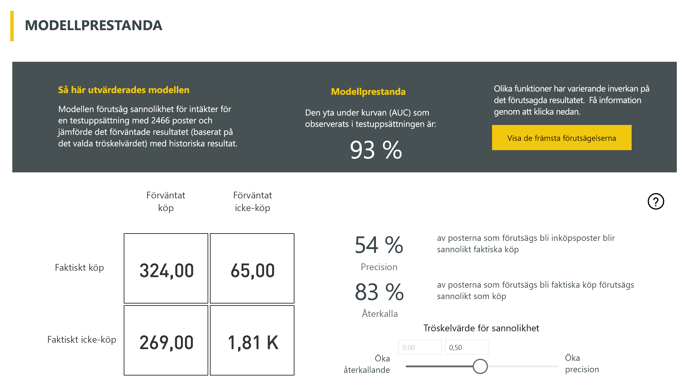

Rapporten innehåller också ett verktyg för kostnads-nyttoanalys som hjälper dig att identifiera vilken delmängd av befolkningen du ska rikta in dig mot för att ge största möjliga vinst. I analysen används en uppskattad enhetskostnad för inriktningen och en enhetsnytta för det önskade utfallet, och syftet är att maximera vinsten. Du kan använda det här verktyget till att välja tröskelvärde för sannolikheten baserat på maxpunkten i vinstmaximeringsdiagrammet. Du kan också använda diagrammet till att beräkna vinsten eller kostnaden för valet av tröskelvärde för sannolikheten.

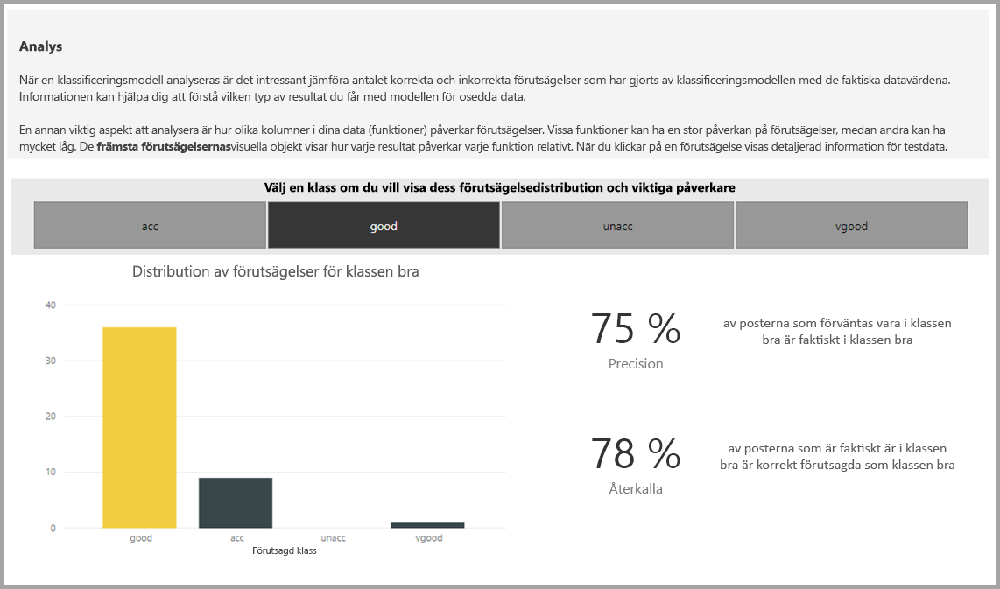

Sidan **Noggrannhetsrapport** i modellrapporten innehåller diagrammet _Kumulativa ökningar_ samt modellens ROC-kurva. Det här är statistiska mått för modellens prestanda. Rapporterna innehåller beskrivningar av de diagram som visas.

### Tillämpa en modell för binär förutsägelse

För att tillämpa en modell för binär förutsägelse måste du ange entiteten med de data som du vill tillämpa förutsägelserna från ML-modellen på. Andra parametrar är namnprefixet för utdatakolumnen sant sannolikhetströskeln för klassificering av det förväntade utfallet.

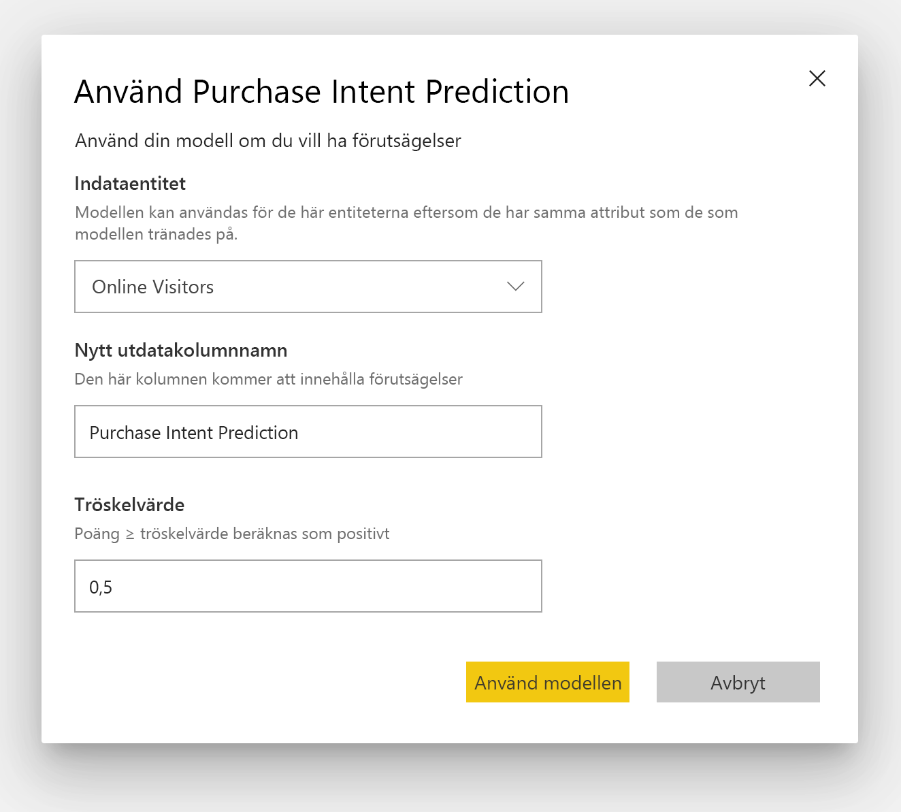

När du tillämpar en modell för binär förutsägelse läggs fyra utdatakolumner till i den berikade utfallsentiteten: **Outcome**, **PredictionScore**, **PredictionExplanation** och **ExplanationIndex**. Prefixet för kolumnnamnen anges när modellen tillämpas.

**PredictionScore** är en sannolikhet i procent för att det önskade utfallet uppnås.

Kolumnen **Outcome** innehåller märkningen för det förutsagda utfallet. Poster med en sannolikhet som överstiger tröskelvärdet förutsägs troligen uppnå utfallet och får därmed märkningen True. Poster under tröskelvärdet förutsägs troligen inte nå utfallet och får märkningen False.

Kolumnen **PredictionExplanation** innehåller en förklaring av den specifika påverkan som indataegenskaperna hade på **PredictionScore**.

## Klassificeringsmodeller

Klassificeringsmodeller används för att klassificera en datamängd i flera grupper eller klasser. De används till att förutsäga händelser som kan ha ett av flera möjliga utfall. Några exempel är om en kund troligtvis har ett mycket högt, högt, medelhögt eller lågt livslängdsvärde, huruvida risken för inställda betalningar är hög, medelhög, låg eller mycket låg och så vidare.

Utdata från en klassificeringsmodell är en sannolikhetspoäng som identifierar sannolikheten för att en post uppnår kriterierna för en viss klass.

### Träna en klassificeringsmodell

Den indataentitet som innehåller dina träningsdata för en klassificeringsmodell måste ha ett sträng- eller heltalsfält som utfallsfält där tidigare kända utfall identifieras.

Förutsättningar:

- Minst 20 rader med historiska data krävs för varje klass av utfall

Processen för att skapa en klassificeringsmodell inbegriper samma steg som andra AutoML-modeller, vilket beskrivs i avsnittet **Konfigurera ML-modellens indata** ovan.

### Rapport för klassificeringsmodell

Rapporten för klassificeringsmodell skapas genom att ML-modellen tillämpas på reserverade testdata och den förutsagda klassen för en post jämförs med den faktiska kända klassen.

Modellrapporten innehåller ett diagram med en analys av korrekt och felaktigt klassificerade poster för varje känd klass.

En ytterligare klasspecifik precisering möjliggör en analys av hur förutsägelserna för en känd klass är fördelade. Här visas de andra klasserna där poster för den kända klassen sannolikt blir felklassificerade.

Modellförklaringen i rapporten innehåller även de främsta förutsägande faktorerna för varje klass.

Rapporten för klassificeringsmodell innehåller även en sida med träningsinformation som liknar sidorna för andra modelltyper, enligt beskrivningen i avsnittet **AutoML-modellrapport** tidigare i den här artikeln.

### Tillämpa en klassificeringsmodell

För att tillämpa en ML-klassificeringsmodell måste du ange entiteten med indata och namnprefixet för utdatakolumn.

När du tillämpar en klassificeringsmodell läggs fem utfallskolumner till i den berikade utfallsentiteten: **ClassificationScore**, **ClassificationResult**, **ClassificationExplanation**, **ClassProbabilities** och **ExplanationIndex**. Prefixet för kolumnnamnen anges när modellen tillämpas.

Kolumnen **ClassProbabilities** innehåller listan med sannolikhetspoäng för att posten tillhör de möjliga klasserna.

**ClassificationScore** är en sannolikhet i procent som identifierar sannolikheten för att en post uppnår kriterierna för en viss klass.

Kolumnen **ClassificationResult** innehåller den mest sannolika förutsagda klassen för posten.

Kolumnen **ClassificationExplanation** innehåller en förklaring av den specifika påverkan som indataegenskaperna hade på **ClassificationScore**.

## Regressionsmodeller

Regressionsmodeller används till att förutsäga ett numeriskt värde. Några exempel är den troliga intäkten från en försäljning, livslängdsvärdet för ett konto, hur mycket av en betalbar faktura som sannolikt kommer att betalas, det datum då en faktura kan betalas och så vidare.

Utdata från regressionsmodell är det förutsagda värdet.

### Träna en regressionsmodell

Indataentiteten som innehåller träningsdata för en regressionsmodell måste ha en ett numeriskt fält som utfallsfält där tidigare kända utfallsvärden identifieras.

Förutsättningar:

- Minst 100 rader med historiska data krävs för en regressionsmodell

Processen för att skapa en regressionsmodell inbegriper samma steg som andra AutoML-modeller, vilket beskrivs i avsnittet **Konfigurera ML-modellens indata** ovan.

### Regressionsmodellrapport

Liksom andra AutoML-modellrapporter baseras regressionsrapporten på resultatet av tillämpningen av modellen på reserverade testdata.

Modellrapporten innehåller ett diagram som jämför de förutsagda värdena med de faktiska värdena. I det här diagrammet indikerar avståndet från diagonalen felet i förutsägelsen.

Diagrammet över återstående fel visar distributionen av procentandelen genomsnittligt fel för olika värden i testdatamängden med reserverade data. Den vågräta axeln representerar medelvärdet av det faktiska värdet för gruppen, och storleken på bubblan visar frekvensen eller antalet värden i det intervallet. Den lodräta axeln är det genomsnittliga återstående felet.

Rapporten för regressionsmodell innehåller även en sida med träningsinformation likt sidorna för andra modelltyper, enligt beskrivningen i avsnittet **AutoML-modellrapport** ovan.

### Tillämpa en regressionsmodell

För att tillämpa en ML-regressionsmodell måste du ange entiteten med indata och namnprefixet för utdatakolumn.

När du tillämpar en regressionsmodell läggs två utfallskolumner till i den berikade utfallsentiteten: **RegressionResult**, **RegressionExplanation** och **ExplanationIndex**. Prefixet för kolumnnamnen anges när modellen tillämpas.

Kolumnen **RegressionResult** innehåller det förutsagda värdet för posten baserat på indatafälten. Kolumnen **RegressionExplanation** innehåller en förklaring av den specifika påverkan som indataegenskaperna hade på **RegressionResult**.

## Nästa steg

Den här artikeln visade en översikt av automatiserad maskininlärning för dataflöden i Power BI-tjänsten. Följande artiklar kan också vara användbara.

- [Självstudie: Skapa en maskininlärningsmodell i Power BI](service-tutorial-build-machine-learning-model.md)
- [Självstudie: Använda Cognitive Services i Power BI](service-tutorial-use-cognitive-services.md)
- [Självstudie: Anropa en Machine Learning Studio-modell (klassisk) i Power BI (förhandsversion)](service-tutorial-invoke-machine-learning-model.md)
- [Cognitive Services i Power BI](service-cognitive-services.md)
- [Azure Machine Learning-integrering i Power BI](service-machine-learning-integration.md)

Mer information om dataflöden finns i de här artiklarna:

- [Skapa och använda dataflöden i Power BI](service-dataflows-create-use.md)
- [Använda beräknade entiteter i Power BI Premium](service-dataflows-computed-entities-premium.md)
- [Använda dataflöden med lokala datakällor](service-dataflows-on-premises-gateways.md)
- [Resurser för utvecklare för Power BI-dataflöden](service-dataflows-developer-resources.md)
- [Dataflöden och Azure Data Lake-integrering (förhandsversion)](service-dataflows-azure-data-lake-integration.md)
