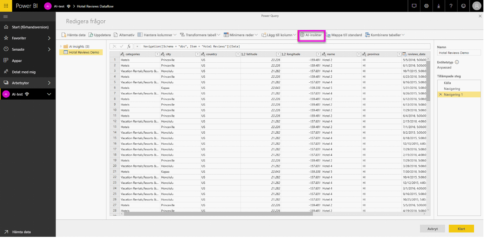

# Azure Machine Learning-integrering i Power BI

Många organisationer använder **Machine Learning**-modeller för bättre insikter och förutsägelser om verksamheten. Möjligheten att visualisera och anropa insikter från dessa modeller i dina rapporter och instrumentpaneler och andra analyser kan hjälpa att sprida dessa insikter till företagsanvändare som behöver dem som mest.  Power BI gör nu det enkelt att införliva insikter från modeller som hanteras i Azure Machine Learning med hjälp av enkla peka och klicka-åtgärder.

Om du vill använda den här funktionen kan en datatekniker bevilja åtkomst till Azure ML-modellen till den BI-analytikern som använder Azure Portal.  I början av varje session identifierar Power Query sedan alla Azure ML-modeller som användaren har åtkomst till och visar dem som dynamiska Power Query-funktioner.  Användaren kan sedan anropa dessa funktioner genom att öppna dem i menyfliksområdet i Power Query Editor eller genom att aktivera funktionen M direkt. Power BI slår automatiskt ihop åtkomstbegäranden då Azure ML-modellen anropas för en uppsättning rader för att få bättre prestanda.

Den här funktionen stöds för närvarande endast för Power BI-dataflöden och Power Query online i Power BI-tjänsten.

Mer information om dataflöden finns i [Självbetjänad dataförberedelse i Power BI](service-dataflows-overview.md).

Om du vill veta mer om Azure Machine Learning kan du läsa:

- Översikt:  [Vad är Azure Machine Learning?](https://docs.microsoft.com/azure/machine-learning/service/overview-what-is-azure-ml)
- Snabbstarter och självstudier för Azure Machine Learning:  [Dokumentation om Azure Machine Learning](https://docs.microsoft.com/azure/machine-learning/)

## Bevilja åtkomst till Azure ML-modellen till en Power BI-användare

För att komma åt Azure ML-modellen från Power BI, måste användaren ha **Läs**-åtkomst till Azure-prenumerationen.  Dessutom gäller följande:

- För Machine Learning Studio-modeller (klassisk) behövs **Läs**-åtkomst till webbtjänsten för Machine Learning Studio (klassisk)
- För Machine Learning-modeller behövs **Läs**-åtkomst till Machine Learning-arbetsytan

Stegen i den här artikeln beskriver hur du ger en Power BI-användaråtkomst till en modell som finns i Azure ML-tjänsten så att de kan komma åt den här modellen som en Power Query-funktion.  Mer information finns i [Hantera åtkomst med RBAC och Azure Portal](https://docs.microsoft.com/azure/role-based-access-control/role-assignments-portal).

1. Logga in på [Azure-portalen](https://portal.azure.com).

2. Gå till sidan **Prenumerationer**. Du hittar sidan **Prenumerationer** i listan **Alla tjänster** i navigeringsfönstrets meny i Azure-portalen.

    

3. Välj din prenumeration.

    

4. Välj **Åtkomstkontroll (IAM)** , och välj sedan knappen **Lägg till**.

    

5. Välj **Läsare** som rollen. Välj den Power BI-användare som du vill bevilja åtkomst till Azure ML-modellen för.

    

6. Välj **Spara**.

7. Upprepa steg tre till sex för att bevilja **Läsar**-åtkomst till användaren för den specifika Machine Learning Studio-webbtjänsten (klassisk) *eller* den Machine Learning-arbetsyta som är värd för modellen.

## Identifiering av schema för Machine Learning-modeller

Dataforskare använder i första hand Python för att utveckla och distribuera även sina maskininlärningsmodeller för Machine Learning.  Till skillnad från Machine Learning Studio (klassisk), som hjälper till att automatisera uppgiften med att skapa en schemafil för modellen, måste dataforskaren när det gäller Machine Learning uttryckligen skapa schemafilen med hjälp av Python.

Den här schemafilen måste inkluderas i den distribuerade webbtjänsten för Machine Learning-modeller. För att automatiskt generera schemat för webbtjänsten måste du ange ett exempel på indata/utdata i inmatningsskriptet för den distribuerade modellen. Se underavsnittet i tjänstdokumentationen om [(Valfritt) Automatisk generering av Swagger-schema för distribution av modeller med Azure Machine Learning](https://docs.microsoft.com/azure/machine-learning/how-to-deploy-and-where#optional-define-model-web-service-schema). Länken innehåller exempelinmatningsskriptet med instruktionerna för schemagenerering. 

Specifikt refererar funktionerna *\@input_schema* och *\@output_schema* i inmatningsskriptet till indata- och utdataexempelformaten i variablerna *input_sample* och *output_sample*, samt använder dessa exempel för att generera en OpenAPI-specifikation (Swagger) för webbtjänsten under distributionen.

Dessa instruktioner för schemagenerering genom uppdatering av inmatningsskriptet måste även tillämpas på de modeller som skapas med hjälp av automatiserade maskininlärningsexperiment via Azure Machine Learning SDK.

> [!NOTE]
> Modeller som skapats med hjälp av det visuella gränssnittet i Azure Machine Learning stöder för närvarande inte schemagenerering, men kommer att göra det i senare versioner. 

## Anropa Azure ML-modellen i Power BI

Du kan anropa alla Azure ML-modeller som du har beviljats åtkomst till direkt från Power Query-redigeraren i ditt dataflöde. För att komma åt Azure ML-modeller, väljer du knappen **Redigera** för den entitet som du vill utöka med insikter från din Azure ML-modell, såsom visas på följande bild.

Genom att välja knappen **Redigera** öppnas Power Query Editor för entiteter i ditt dataflöde.

Välj knappen **Alla insikter** i menyfliksområdet och välj sedan mappen _Azure Machine Learning-modeller_ i navigeringsfönstrets meny. Alla Azure ML-modeller som du har åtkomst till visas här som Power Query-funktioner. Dessutom mappas automatiskt indataparametrarna för Azure ML-modellen som parametrar för motsvarande Power Query-funktion.

Du kan ange någon av den valda entitetens kolumner som indata från listrutan för att anropa en Azure ML-modell. Du kan också ange ett konstant värde som ska användas som indata genom att klicka på kolumnikonen till vänster om dialogrutan Indata.

Välj **Anropa** för att visa förhandsversionen av Azure ML-modellens utdatafiler som en ny kolumn i entitetstabellen. Du kan även se modellanropet som ett tillämpat steg för frågan.

Om modellen returnerar flera utdataparametrar, grupperas de tillsammans som en post i utdatakolumnen. Du kan expandera kolumnen för att skapa enskilda utdataparametrar i separata kolumner.

När du sparar ditt dataflöde anropas modellen automatiskt när dataflödet uppdateras, för alla nya eller uppdaterade rader i entitetstabellen.

## Nästa steg

Den här artikeln visade en översikt över integrering av Machine Learning i Power BI-tjänsten. Följande artiklar kan också vara intressanta och användbara. 

* [Självstudie: Anropa en Machine Learning Studio-modell (klassisk) i Power BI](service-tutorial-invoke-machine-learning-model.md)
* [Självstudie: Använda Cognitive Services i Power BI](service-tutorial-use-cognitive-services.md)
* [Cognitive Services i Power BI](service-cognitive-services.md)

Mer information om dataflöden finns i de här artiklarna:
* [Skapa och använda dataflöden i Power BI](service-dataflows-create-use.md)
* [Använda beräknade entiteter i Power BI Premium](service-dataflows-computed-entities-premium.md)
* [Använda dataflöden med lokala datakällor](service-dataflows-on-premises-gateways.md)
* [Resurser för utvecklare för Power BI-dataflöden](service-dataflows-developer-resources.md)
* [Dataflöden och Azure Data Lake-integrering (förhandsversion)](service-dataflows-azure-data-lake-integration.md)

