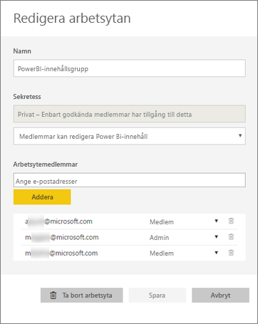
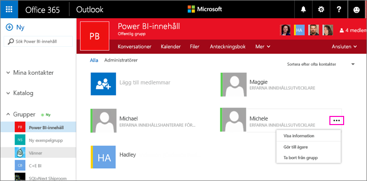
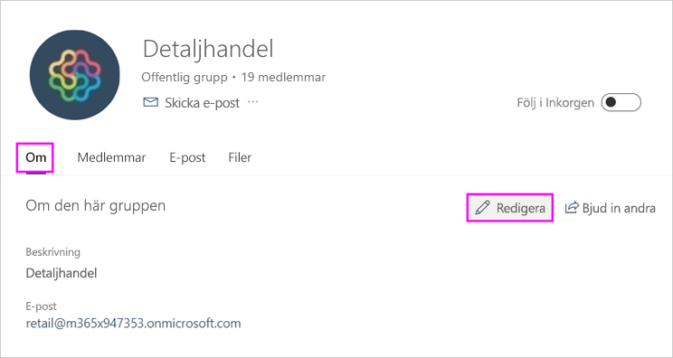
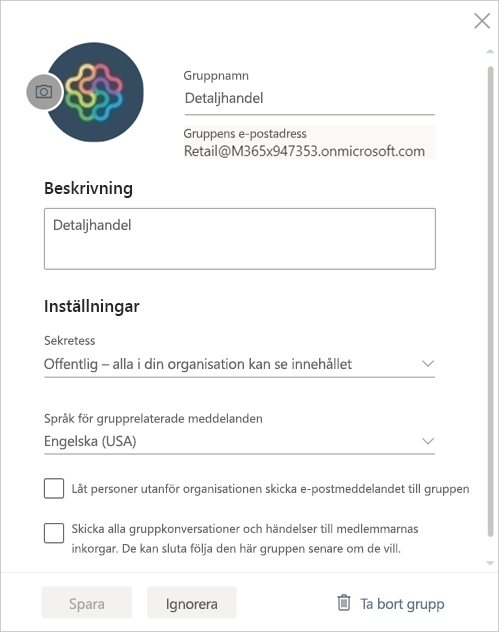

# Hantera din apparbetsyta i Power BI och Office 365

Som skapare eller administratör för en [apparbetsyta i Power BI](service-create-distribute-apps.md) eller i Office 365 kan du hantera vissa delar av arbetsytan i Power BI. Andra delar hanterar du i Office 365.

> [!NOTE]
> Förhandsversionen av den nya arbetsytan kommer att ändra förhållandet mellan Power BI-arbetsytor och Office 365-grupper. Du kommer inte automatiskt att skapa en Office 365-grupp varje gång du skapar en av de nya arbetsytorna. Läs mer om att [skapa de nya arbetsytorna](service-create-the-new-workspaces.md).

I **Power BI** kan du:

* Lägg till eller ta bort apparbetsytans medlemmar, inklusive att göra en medlem i arbetsytan till administratör.
* Redigera namnet på apparbetsytan.
* Ta bort apparbetsytan.

I **Office 365** kan du:

* Lägga till eller ta bort gruppmedlemmar i apparbetsytan, inklusive att göra en medlem till ägare.
* Redigera gruppens namn, bild, beskrivning och andra inställningar.
* Se gruppens e-postadress.
* Ta bort gruppen.

Du måste ha en [Power BI Pro-licens](service-features-license-type.md) för att kunna vara administratör eller medlem i en apparbetsyta. Dina appanvändare måste också ha en Power BI Pro-licens, såvida inte apparbetsytan finns i en Power BI Premium-kapacitet. Läs [Vad är Power BI Premium?](service-premium-what-is.md) för mer information.

## Hantera din apparbetsyta i Power BI

1. I Power BI-tjänsten väljer du pilen intill **Arbetsytor** > välj ellipsen (…) intill namnet på din arbetsyta > **Redigera den här arbetsytan**.

   

   > [!NOTE]
   > Du kan bara se **Redigera den här arbetsytan** om du är administratör för apparbetsytan.

1. Här kan du byta namn på arbetsytan, lägga till eller ta bort medlemmar eller ta bort arbetsytan.

   

1. Välj **Spara** eller **Avbryt**.

## Redigera egenskaper för Power BI-apparbetsytan i Office 365

Du kan även redigera aspekter av en apparbetsyta direkt i Outlook för Office 365.

### Redigera medlemmarna i apparbetsytans grupp

1. I Power BI-tjänsten väljer du pilen intill **Arbetsytor** > välj ellipsen (…) intill namnet på din arbetsyta > **Medlemmar**.

   

   Gruppvyn för apparbetsytan öppnas i Outlook för Office 365. Du kan behöva logga in på ditt företagskonto.

1. Välj rollen intill en teammedlems namn för att göra den personen till **Medlem** eller **Ägare**. Välj **X** för att ta bort personen från gruppen.

   

### Lägg till en bild och ange andra egenskaper för arbetsytor

När du distribuerar appen från apparbetsytan blir den bild som du lägger till här bilden för din app. Se avsnittet [Lägga till en bild i din Office 365-apparbetsyta (valfritt)](service-create-workspaces.md#add-an-image-to-your-office-365-app-workspace-optional) i artikeln **Skapa de nya arbetsytorna**.

1. I Outlook för Office 365-vyn på din apparbetsyta går du till fliken **Om** och väljer **Redigera**.

    
1. Du kan redigera namn, beskrivning och språk för grupprelaterade meddelanden. Du kan även lägga till en bild och ange andra egenskaper här.

   

1. Välj **Spara** eller **Ignorera**.

## Nästa steg

* [Publicera en app i Power BI](service-create-distribute-apps.md)

* Har du fler frågor? [Prova Power BI Community](http://community.powerbi.com/)
