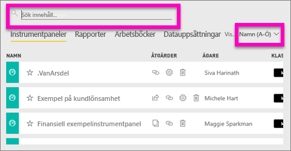
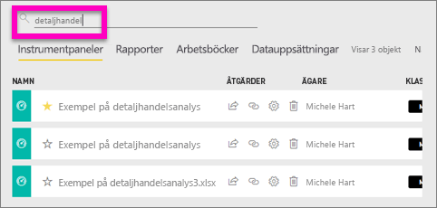
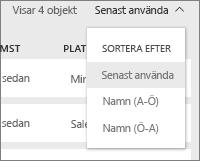
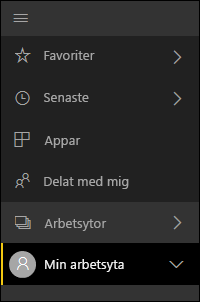
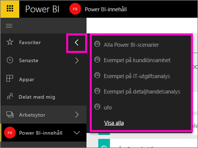

# Navigering: sökning, lokalisering och sortering av innehåll i Power BI-tjänsten
Det finns många sätt att navigera i innehållet i Power BI-tjänsten. Innehållet är organiserat efter typen av arbetsyta: instrumentpaneler, rapporter, arbetsböcker och datauppsättningar.  Och innehållet ordnas också efter användning: favoriter, senaste, appar, delas med mig och funktioner. Med dessa olika vägar till ditt innehåll kan du snabbt hitta det du söker i Power BI-tjänsten.  

>[!NOTE] 
>Den här artikeln handlar om Power BI-tjänsten (app.powerbi.com) och inte om Power BI Desktop.

## Navigera i arbetsytorna

Power BI-tjänsten separerar ditt arbetsyteinnehåll efter typ: instrumentpaneler, rapporter, arbetsböcker och datauppsättningar. Den här organisationen visas när du väljer en arbetsyta. I det här exemplet har apparbetsytan fått namnet ”Exempelapp för försäljning och marknadsföring” och innehåller två instrumentpaneler, sex rapporter, en arbetsbok och fem datauppsättningar.

________________________________________

## Söka efter och sortera i arbetsytor
En arbetsyta har fyra innehållsflikar: Instrumentpaneler, Rapporter, Arbetsböcker och Datauppsättningar.  Var och en av dessa flikar innehåller ett sökfält och en sorteringsknapp.  När du börjar med Power BI-tjänsten kanske inte dessa är användbara eftersom du bara har ett eller två objekt per flik.  Men med tiden kan det bli långa listor med innehåll.  Genom att använda sökning och sortering hittar du enkelt vad du behöver.

* Ange ett sökvillkor för att söka efter en matchning på den aktuella skärmen
  
   
* Klicka på sorteringsknappen för att visa alternativ för den aktuella sidan. Alternativen är att sortera efter namn eller ägare.
  
   

## Navigering med hjälp av vänster navigeringsfält
Vänster navigeringsfält klassificerar ditt innehåll på ett sätt som gör det ännu enklare att snabbt hitta det du behöver.  

Innehåll som du skapar för eget bruk är tillgängligt i **Min arbetsyta**, innehåll som du skapar och delar med en grupp är tillgängligt i en arbetsyta för **Appar**, innehåll som delas med dig är tillgängligt i **Delas med mig** och senast visat innehåll är tillgängligt i **Senaste**.

Dessutom kan du tagga innehåll Med [Favoriter](service-dashboard-favorite.md) och [Aktuellt](service-dashboard-featured.md). Välj den instrumentpanel som du tror att du oftast kommer att använda och ange den som din *aktuella* instrumentpanel. Varje gång du öppnar Power BI-tjänsten är det den instrumentpanelen som visas först. Har du flera instrumentpaneler och appar som du besöker ofta? Genom att ange dem som favoriter är de alltid tillgängliga i det vänstra navigeringsfältet.

.

## Överväganden och felsökning
* För datauppsättningar är **Sortera efter** inte tillgängligt per ägare.

## Nästa steg
[Power BI – grundläggande begrepp](service-basic-concepts.md)

Har du fler frågor? [Prova Power BI Community](http://community.powerbi.com/)