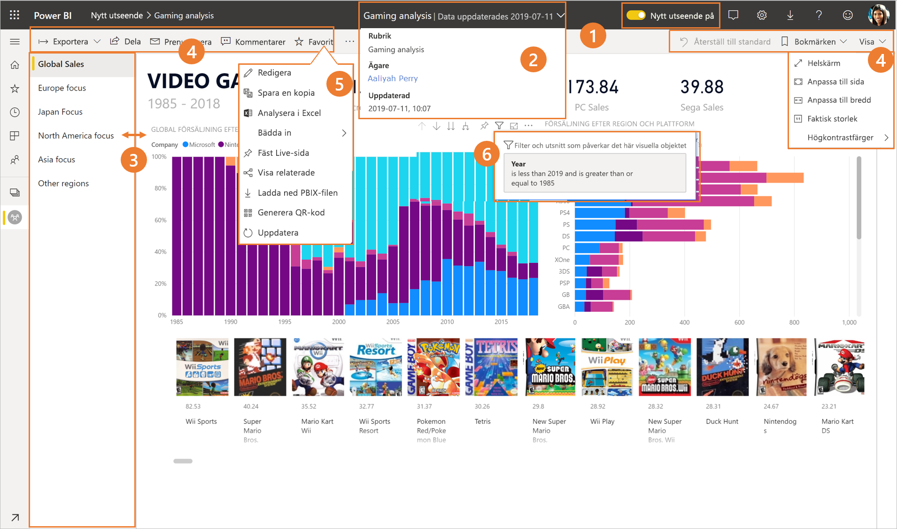
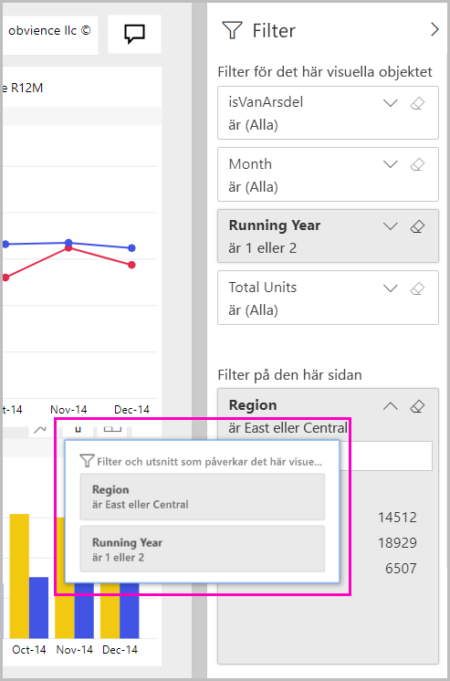

# Det nya utseendet för Power BI-tjänsten

Power BI-tjänsten (app.powerbi.com) har ett nytt utseende som gör det enklare att visa och interagera med dina rapporter. Det nya utseendet är enklare och bygger på din vana med andra Microsoft-produkter. I Power BI-tjänsten har vi satt rapportinnehållet i fokus genom att byta till ett ljusare färgtema och uppdatera ikonerna. 

Letar du efter information om det nya utseendet i **Power BI Desktop**? Se [Använda det uppdaterade menyfliksområdet i Power BI Desktop](desktop-ribbon.md).

Här är en översikt över vad som har ändrats i det nya utseendet. Mer information finns i de numrerade avsnitten:

Söker du efter en specifik åtgärd? Se [Det nya utseendet: Var finns åtgärderna?](service-new-look-where-actions.md).

## Snabb genomgång av ändringarna

Den här animeringen visar ändringarna av rapporternas utseende i praktiken.

## 1. Välj att använda det nya utseendet

Alla användare av Power BI-tjänsten kan välja det nya utseendet. Du behöver bara växla **Nytt utseende av** till **Nytt utseende på**.

Om du vill gå tillbaka till det gamla utseendet växlar du till **av** i . Om du inte ser alternativet kan du välja ellipsmenyn i det övre högra hörnet.

## 2. Visa rapportinformation 

Se snabbt information såsom det senaste uppdateringsdatumet och kontaktinformation, direkt i den översta banderollen.  Öppna menyn om du vill visa mer information om rapporten. Du kan till och med skicka ett e-postmeddelande till rapportägaren.

## 3. Lodrät lista över sidor 
Namn på rapportsidor finns nu i en lista i ett lodrätt fönster. De är framträdande och enkla att se, och de liknar navigeringen i Word och PowerPoint. Du kan öka eller minska storleken på resten av rapportområdena genom att ändra storlek på det lodräta fönstret.

## 4. Förenklat åtgärdsfält 

Det uppdaterade åtgärdsfältet längst upp innehåller de mest relevanta kommandona så att de är lättillgängliga för rapportkonsumenter. Det är enklare att exportera, prenumerera, samarbeta med andra och fördjupa sig genom filter och bokmärken.

## 5. Var finns rapportkommandona?

Vi har inte tagit bort några av funktionerna från det gamla utseendet. Du når de ytterligare kommandona såsom redigera, spara en kopia och så vidare genom att expandera ellipsen (...-menyn) i åtgärdsfältet. Du kommer även åt användningsstatistik från innehållslistan.

### Var finns åtgärderna i Arkiv-menyn?

Letar du åtgärderna i **Arkiv**-menyn? De åtgärder som förut fanns på menyn **Arkiv** finns nu även på menyn **Fler alternativ** (...). 

## 6. Ny filterupplevelse

Senaste uppdateringar, till exempel att visa tillämpade filter och det nya filterfönstret, är tillgängliga som standard med det nya utseendet. Även om din rapportdesigner inte har uppgraderat till den nya filterupplevelsen ser du det nya filterfönstret.

## Instrumentpanelens upplevelse med ”nytt utseende” 

Precis som rapporter och appar har instrumentpaneler också ett förenklat åtgärdsfält som ger en konsekvent upplevelse, samtidigt som de funktionella skillnaderna behålls. Här är en genomgång av åtgärderna på en instrumentpanel.
 

## Inga ändringar av redigeringsläget 

Redigeringsupplevelsen liknar fortfarande den som finns i Desktop. Ändringarna med det nya utseendet gäller endast läsvyn.

## Nästa steg

- [Använda det uppdaterade menyfliksområdet i Power BI Desktop](desktop-ribbon.md)
- [Välj att använda det ”nya utseendet” för arbetsytor](collaborate-share/service-workspaces-new-look.md)
- [Power BI för konsumenter](consumer/end-user-consumer.md)
