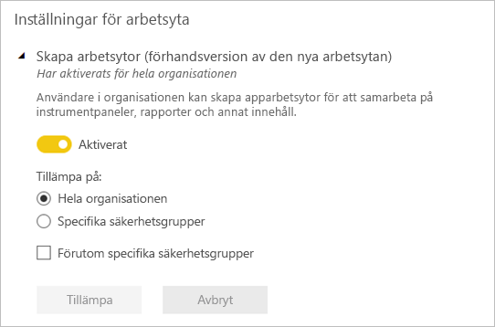

# Organisera arbete på de nya arbetsytorna i Power BI

 *Arbetsytor* är platser för samarbete med kollegor för att skapa samlingar med instrumentpaneler, rapporter och sidnumrerade rapporter. Den nya arbetsyteupplevelsen hjälper dig att bättre hantera åtkomst till innehåll. Den här artikeln beskriver de nya arbetsytorna och hur de skiljer sig åt från de klassiska arbetsytorna.  De används, precis som de klassiska arbetsytorna, för att skapa och distribuera appar. Läs om hur du [skapar en ny arbetsyteupplevelse](service-create-the-new-workspaces.md).

Den nya arbetsyteupplevelsen har blivit allmänt tillgänglig (GA) och är nu standardarbetsytan. Du kan fortfarande fortsätta att skapa och använda [klassiska arbetsytor](service-create-workspaces.md) baserat på Office 365-grupper. 

> [!NOTE]
> Om du vill inför säkerhet på radnivå (RLS) för användare som bläddrar i innehållet i en arbetsyta, kan du använda dig av läsarrollen. Om läsarrollen ännu inte finns i din klient, kan du fortsätta att använda [klassiska arbetsytor](service-create-workspaces.md) och välja alternativet **Medlemmar kan bara visa Power BI-innehåll**. Som alternativ kan du också publicera en Power BI-app till de användarna eller använda delning för att distribuera innehåll.

Med de nya arbetsytorna kan du:

- Tilldela arbetsyteroller till användargrupper: säkerhetsgrupper, distributionslistor, Office 365-grupper och enskilda användare.
- Skapa en arbetsyta i Power BI utan att skapa en Office 365-grupp.
- Använda mer detaljerade arbetsyteroller för mer flexibel hantering av behörigheter på en arbetsyta.
- Power BI-administratören kan styra vem som kan skapa arbetsytor i Power BI.

När du skapar en av de nya arbetsytorna skapar du inte en underliggande, associerad Office 365-grupp. All administration för arbetsytor sker i Power BI, inte i Office 365. I den nya arbetsyteupplevelsen kan du nu lägga till en Office 365-grupp till arbetsytans åtkomstlista för att fortsätta hantera användaråtkomst till innehåll via Office 365-grupper.

## Administrera arbetsytor för den nya arbetsyteupplevelsen
Nu går det att administrera arbetsytor för den nya arbetsyteupplevelsen i Power BI och det är Power BI-administratörerna som bestämmer vilka i en organisation som får skapa arbetsytor. De kan också hantera och återställa arbetsytor. De måste använda Power BI-administratörsportalen eller PowerShell-cmdletar för att göra detta. För klassiska arbetsytor baserade på Office 365-grupper, sker administrationen även fortsatt i administrationsportalen för Office 365 och Azure Active Directory.

I **arbetsyteinställningarna** i administrationsportalen kan administratörer använda inställningen för att skapa arbetsytor (den nya arbetsyteupplevelsen) för att tillåta alla eller ingen i en organisation att skapa arbetsytor för den nya arbetsyteupplevelsen. De kan även begränsa skapandet till medlemmar eller vissa säkerhetsgrupper.

> [!NOTE]
> Inställningen för att skapa arbetsytor (den nya arbetsyteupplevelsen) tillåter som standard bara en användare som kan skapa Office 365-grupper och skapa nya arbetsytor i Power BI. Glöm inte att ange ett värde i Power BI-administratörsportalen för att se till att lämpliga användare kan skapa arbetsytor för den nya arbetsyteupplevelsen.

[Listan över arbetsytor är tillgänglig](service-admin-portal.md#workspaces) i Power BI-administratörsportalen. 

## Nya arbetsytor sida vid sida med klassiska arbetsytor

Nya och uppgraderade arbetsytor och befintliga, klassiska arbetsytor fungerar bra sida vid sida och du kan skapa vilken som. Den nya arbetsyteupplevelsen är stardardarbetsytan. Power BI fortsätter att lista alla Office 365-grupper som användaren är medlem av i Power BI för att undvika att ändra befintliga arbetsflöden. Mer information om att skapa en ny arbetsyta finns i [Skapa nya arbetsytor](service-create-the-new-workspaces.md). Mer information om att skapa en klassisk arbetsyta finns i [Skapa klassiska arbetsytor](service-create-workspaces.md).

## Roller i de nya arbetsytorna

Om du vill bevilja åtkomst till en ny arbetsyta, lägger du till användargrupper eller enskilda personer till en av arbetsyterollerna läsare, medlemmar, deltagare eller administratörer. Alla i en användargrupp får den roll som du har definierat. Om en person finns i flera användargrupper, får personen den högsta av de behörighetsnivåer som följer av de roller som denne har tilldelats.

Med roller kan du hantera vem som kan göra vad i en arbetsyta, så att teamen kan samarbeta. De nya arbetsytorna gör att du kan tilldela roller till enskilda användare och användargrupper: säkerhetsgrupper, Office 365-grupper och distributionslistor. 

När du tilldelar roller till en användargrupp får personer i gruppen åtkomst till innehåll. Om du kapslar användargrupper får alla berörda användare behörighet. En användare som finns i flera användargrupper med olika roller får den högsta behörighetsnivån som de har tilldelats. 

Det finns fyra roller för de nya arbetsytorna: administratörer, medlemmar, deltagare och läsare.

|Kapacitet   | Admin  | Medlem  | Deltagare  | Läsare |
|---|---|---|---|---|
| Uppdatera och ta bort arbetsytan.  | X  |   |   |   | 
| Lägga till/ta bort personer, inklusive andra administratörer.  | X  |   |   |   |
| Lägga till medlemmar eller andra med lägre behörighet.  |  X | X  |   |   |
| Publicera och uppdatera en app. |  X | X  |   |   |
| Dela ett objekt eller dela en app. |  X | X  |   |   |
| Tillåta att andra delar objekt igen. |  X | X  |   |   |
| Skapa, redigera och ta bort innehåll på arbetsytan.  |  X | X  | X  |   |
| Publicera rapporter till arbetsytan och ta bort innehåll.  |  X | X  | X  |   |
| Visa ett objekt. |  X | X  | X  | X  |
 
 
## Licensiering
Alla som du lägger till i en arbetsyta i den delade kapaciteten behöver en Power BI Pro-licens. På arbetsytan kan användarna samarbeta kring instrumentpaneler och rapporter som du planerar att publicera till en bredare publik eller hela organisationen. 

Om du vill distribuera innehåll till andra i organisationen kan du tilldela Power BI Pro-licenser till de användarna eller placera arbetsytan i en Power BI Premium-kapacitet.

När arbetsytan är i en Power BI Premium-kapacitet, kan användare med läsarroll få åtkomst till arbetsytan även om de inte har en Power BI Pro-licens. Om du tilldelar dessa användare en högre roll, som administratör, medlem eller deltagare, kan de dock inte få åtkomst till arbetsytan. De uppmanas att starta en Pro-utvärderingsversion om de försöker få åtkomst till arbetsytan. Om du vill använda läsarkapaciteten för användare utan Pro-licenser, ska du se till att användarna med läsarroll inte har andra arbetsyteroller, varken individuellt eller via en användargrupp. 

> [!NOTE]
> Vid publicering av rapporter till den nya arbetsyteupplevelsen tillämpas befintliga licensieringsregler strängare. Användare som försöker publicera från Power BI Desktop eller andra klientverktyg utan en Pro-licens möts av ett meddelande om att ”endast användare med Power BI Pro-licenser kan publicera till den här arbetsytan”.

## Hur skiljer sig de nya arbetsytorna åt från aktuella arbetsytor?

Vi gör om vissa funktioner i och med de nya arbetsytorna. Här är de förändringarna som du kan förvänta dig blir permanenta. 

* När du skapar des här arbetsytorna, skapas inte Office 365-grupper som för klassiska arbetsytor. Du kan dock nu använda en Office 365-grupp för att ge användare åtkomst till din arbetsyta genom att tilldela den till en roll. 
* I klassiska arbetsytor kan du bara lägga till enskilda personer till medlems- och administratörslistor. I de nya arbetsytorna kan du lägga till flera AD-säkerhetsgrupper, distributionslistor eller Office 365-grupper till de här listorna för enklare användarhantering. 
- Du kan skapa ett innehållspaket för organisationen från en klassisk arbetsyta. Du kan inte skapa sådana från de nya arbetsytorna.
- Du kan använda ett innehållspaket för organisationen från en klassisk arbetsyta. Du kan inte använda sådana från de nya arbetsytorna.

## Arbetsytans kontaktlista
I den nya **kontaktlistan** kan du ange vilka användare som ska informeras om problem som kan uppstå i arbetsytan. Som standard informeras alla användare och grupper som angetts som arbetsyteadministratör, men du kan justera listan. Användare eller grupper som finns med i kontaktlistan visas i användargränssnittet för att hjälpa användarna att få hjälp med arbetsytan. 

Läs mer om att [ställa in arbetsytans kontaktlista](service-create-the-new-workspaces.md#workspace-contact-list).

## Arbetsytans OneDrive
Med arbetsytans OneDrive-funktion kan du konfigurera en Office 365-grupp vars fillagring för SharePoint-dokumentbiblioteket är tillgänglig för arbetsyteanvändarna. Gruppen måste skapas utanför Power BI. 

Power BI synkroniserar inte behörigheter för användare eller grupper, som är konfigurerade med arbetsyteåtkomst, med Office 365-gruppmedlemskapet. Det bästa sättet är att hantera arbetsyteåtkomst via den Office 365-grupp vars fillagring du konfigurerar i den här inställningen. 

Läs mer om hur du kan [konfigurera och få åtkomst till arbetsytans OneDrive](service-create-the-new-workspaces.md#workspace-onedrive).  
   
## Granskning
Följande aktiviteter granskas av Power BI för arbetsytor för den nya arbetsytupplevelsen.

| Eget namn |   Åtgärdsnamn |
|---|---|
| Power BI-mapp skapades | CreateFolder |
| Power BI-mapp togs bort | DeleteFolder |
| Power BI-mapp uppdaterades | UpdateFolder |
| Power BI-mappåtkomst uppdaterades| UpdateFolderAccess |

Läs mer om [Power BI-granskning](service-admin-auditing.md#activities-audited-by-power-bi).

## Begränsningar och överväganden

Begränsningar att känna till:

- Arbetsytor kan innehålla högst 1 000 datauppsättningar eller 1 000 rapporter per datauppsättning. 
- En person med Power BI Pro-licens kan vara medlem av högst 1 000 arbetsytor.
- Power BI Publisher för Excel stöds inte.

## Arbetsytefunktioner som fungerar annorlunda

Vissa funktioner fungerar annorlunda i de nya arbetsytorna jämfört med de aktuella arbetsytorna. De här skillnaderna är avsiktliga och baseras på feedback som vi har fått från kunder. De kommer att möjliggöra en mer flexibel metod för samarbete med arbetsytor:

- Licensieringskontroll: Vid publicering av rapporter till den nya arbetsyteupplevelsen aktiveras de befintliga licensieringsreglerna som kräver en Power BI Pro-licens för användare som samarbetar i arbetsytor eller som delar innehåll till andra i Power BI-tjänsten. För användare utan Pro-licens visas ett felmeddelande om att ”endast användare med Powre BI Pro-licenser kan publicera till här arbetsytan”.
- Medlemmar kan eller kan inte dela igen: ersätts med rollen Deltagare
- Skrivskyddade arbetsytor: I stället för att bevilja användare skrivskyddad åtkomst till en arbetsyta, tilldelar du användare till läsarrollen som ger liknande skrivskyddad åtkomst till innehållet i en arbetsyta.
- Användare utan Pro-licens kan få åtkomst till arbetsytan om arbetsytan är i en Power BI Premium-kapacitet, även om användarna endast har en läsarroll.
- Om du vill tillåta användare med läsarroll att exportera data, måste du se till att de har behörighet att skapa för datamängderna i arbetsytan. Läs mer om [behörighet att skapa för datamängder](service-datasets-build-permissions.md#build-permissions-for-shared-datasets).
- Det finns ingen knapp för att **lämna arbetsytan**.

## Vanliga frågor och svar

**Påverkas länkar till befintligt innehåll av den allmänna tillgängligheten för den nya arbetsyteupplevelsen?**

Nej. Länkar till befintliga objekt i klassiska arbetsytor påverkas inte av den nya arbetsyteupplevelsen. Den allmänna tillgänglighet för den nya arbetsyteupplevelsen ändrar den standardarbetsyta som du skapar, men inte befintliga arbetsytor. 

**Uppgraderas befintliga arbetsytor till den nya arbetsyteupplevelsen med allmän tillgänglighet?**

Nej. Den nya arbetsyteupplevelsen med allmän tillgänglighet ändrar bara standardarbetsytans typ till den nya arbetsyteupplevelsen. Befintliga klassiska arbetsytor som är baserade på Office 365-grupper förblir oförändrade.

**Skapas arbetsytor fortfarande automatiskt för Office 365-grupper?**

Ja. Eftersom vi stöder båda typerna av arbetsyta, sida vid sida, fortsätter vi att lista alla Office 365-grupper som användaren har åtkomst till i listan över arbetsytor.

## Nästa steg
* [Skapa de nya arbetsytorna i Power BI](service-create-the-new-workspaces.md)
* [Skapa klassiska arbetsytor](service-create-workspaces.md)
* [Installera och använda appar i Power BI](service-create-distribute-apps.md)
* Har du några frågor? [Fråga Power BI Community](http://community.powerbi.com/)
