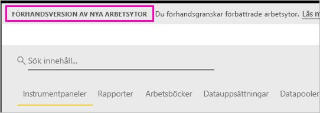

# Organisera arbete i de nya arbetsytorna (förhandsversion) i Power BI

Arbetsytor är platser för samarbete med kollegor för att skapa samlingar med instrumentpaneler och rapporter. Du kan sedan paketera samlingarna i *appar* och distribuera dem till hela organisationen eller till vissa personer eller grupper. Power BI introducerar en ny arbetsyta som en förhandsversion. 

Med förhandsversion av de nya arbetsytorna kan du nu:

- Tilldela arbetsyteroller till användargrupper: säkerhetsgrupper, distributionslistor, Office 365-grupper och enskilda användare.
- Skapa en arbetsyta i Power BI utan att skapa en Office 365-grupp.
- Använda mer detaljerade arbetsyteroller för mer flexibel hantering av behörigheter på en arbetsyta.

Läs om hur du [skapar en av de nya arbetsytorna](service-create-the-new-workspaces.md).
 
När du skapar en av de nya arbetsytorna skapar du inte en underliggande, associerad Office 365-grupp. All administration för arbetsytor sker i Power BI, inte i Office 365. Du kan fortfarande lägga till en Office 365-grupp till arbetsytan för att fortsätta hantera användaråtkomst till innehållet via Office 365-grupper. Du kan dock även använda säkerhetsgrupper och distributionslistor samt lägga till enskilda användare direkt i Power BI, vilket ger dig ett flexibelt sätt att hantera åtkomst till arbetsytor. Eftersom administration av arbetsytor nu finns i Power BI, är det Power BI-administratörerna som bestämmer vilka i en organisation som kan skapa arbetsytor. I **Arbetsyteinställningar** i administrationsportalen kan administratörer tillåta alla eller ingen i en organisation att skapa arbetsytor. De kan även begränsa skapandet till medlemmar eller vissa säkerhetsgrupper.

Läs mer om [administrationsportalen i Power BI](service-admin-portal.md).

## Lansera nya arbetsytor

Under förhandsversionsperioden kan gamla och nya arbetsytor finnas sida vid sida, och du kan skapa endera. När förhandsversionen för de nya arbetsytorna tar slut och de blir tillgängliga allmänt kan gamla arbetsytor finns kvar under en tid. Du kommer inte kunna skapa dem, och du måste förbereda att migrera dina arbetsytor till den nya infrastrukturen för arbetsytor. Oroa dig inte – du har flera månader på dig att slutföra migreringen.

## Roller i de nya arbetsytorna

Du kan lägga till användargrupper eller enskilda personer till de nya arbetsytorna som medlemmar, deltagare eller administratörer. Alla i en användargrupp får den roll som du har definierat. Om en person finns i flera användargrupper får personen den högsta behörighetsnivån som ges av rollen.

Alla som du lägger till i en arbetsyta behöver en Power BI Pro-licens. På arbetsytan kan användarna samarbeta kring instrumentpaneler och rapporter som du planerar att publicera till en bredare publik eller hela organisationen. Om du vill distribuera innehåll till andra i organisationen kan du tilldela Power BI Pro-licenser till de användarna eller placera arbetsytan i en Power BI Premium-kapacitet.

Med roller kan du hantera vem som kan göra vad i en arbetsyta, så att teamen kan samarbeta. De nya arbetsytorna gör att du kan tilldela roller till enskilda användare och användargrupper: säkerhetsgrupper, Office 365-grupper och distributionslistor. 

När du tilldelar roller till en användargrupp får personer i gruppen åtkomst till innehåll. Om du kapslar användargrupper får alla berörda användare behörighet. En användare som finns i flera användargrupper med olika roller får den högsta behörighetsnivån som de har tilldelats. 

De nya arbetsytorna erbjuder tre roller: administratörer, medlemmar och deltagare.

**Administratörer kan:**

- Uppdatera och ta bort arbetsytan. 
- Lägga till/ta bort personer, inklusive andra administratörer.
- Göra allt som medlemmar kan göra.

**Medlemmar kan:** 

- Lägga till medlemmar eller andra med lägre behörighet.
- Publicera och uppdatera en app.
- Dela ett objekt eller dela en app.
- Tillåta att andra delar objekt igen.
- Göra allt som deltagare kan göra.

**Deltagare kan:** 

- Skapa, redigera och ta bort innehåll på arbetsytan. 
- Publicera rapporter till arbetsytan och ta bort innehåll.
- Kan inte ge nya personer åtkomst till innehåll. De kan inte dela nytt innehåll men kan dela med någon som arbetsytan, objektet eller appen redan har delats med. 
- Kan inte ändra medlemmarna i gruppen.
 
Vi skapar arbetsflöden för åtkomstbegäran på olika ställen i tjänsten så att användare som inte har åtkomst kan begära det. Arbetsflöden för åtkomstbegäran finns för tillfället för instrumentpaneler, rapporter och appar.

## Konvertera gamla arbetsytor till nya arbetsytor

Under förhandsversionsperioden kan du inte automatiskt konvertera dina gamla arbetsytor till nya. Du kan dock skapa en ny arbetsyta och publicera ditt innehåll till den nya platsen. 

När de nya arbetsytorna blir allmänt tillgängliga (GA, generally available) kan du välja att gå med för att migrera gamla automatiskt. Någon gång efter GA måste du migrera dem.

## Hur skiljer sig de nya arbetsytorna åt från aktuella arbetsytor?

Vi gör om vissa funktioner i och med de nya arbetsytorna. Här är förändringarna du kan förvänta dig blir permanenta tillsammans med förhandsversionen. 

* Att skapa arbetsytor kommer inte att skapa motsvarande entiteter i Office 365 på det sätt som aktuella arbetsytor gör. (Du kan fortfarande lägga till en Office 365-grupp till din arbetsyta genom att tilldela den en roll). 
* På aktuella arbetsytor kan du bara lägga till enskilda personer till medlems- och administratörslistor. I de nya arbetsytorna kan du lägga till flera AD-säkerhetsgrupper, distributionslistor eller Office 365-grupper till de här listorna för enklare användarhantering. 
- Du kan skapa ett innehållspaket för organisationen från en aktuell arbetsyta. Du kan inte skapa sådana från de nya arbetsytorna.
- Du kan använda ett innehållspaket för organisationen från en aktuell arbetsyta. Du kan inte använda sådana från de nya arbetsytorna.
- Under förhandsversionsperioden är vissa funktioner ännu inte aktiverade för nya arbetsytor. Mer information finns i nästa avsnitt om [planerade funktioner för nya arbetsytor](service-new-workspaces.md#planned-new-workspace-preview-features).

## Begränsningar och överväganden

Begränsningar att känna till:

- Arbetsytor kan innehålla högst 1 000 datauppsättningar eller 1 000 rapporter per datauppsättning. 
- En person med en Power BI Pro-licens kan vara medlem i högst 250 arbetsytor.

## Planerade förhandsfunktioner för de nya arbetsytorna

När vi lanserar förhandsversionen utvecklar vi fortfarande några andra förhandsfunktioner för nya arbetsytor, som inte är tillgängliga än:

- Det finns ingen knapp för att **lämna arbetsytan**.
- Användningsstatistik stöds inte ännu.
- Så här fungerar Premium: Du kan tilldela och skapa arbetsytor i en Premium-kapacitet, men för att flytta en arbetsyta mellan kapaciteter går du till inställningarna för arbetsytan.
- Inbäddning för SharePoint-webbdel stöds inte ännu.
- Det finns ingen **OneDrive**-knapp för Office 365-grupper i Hämta data/filer.

## Arbetsytefunktioner som fungerar annorlunda

Vissa funktioner fungerar annorlunda i de nya arbetsytorna jämfört med de aktuella arbetsytorna. De här skillnaderna är avsiktliga och baseras på feedback som vi har fått från kunder. De kommer att möjliggöra en mer flexibel metod för samarbete med arbetsytor:

- Medlemmar kan eller kan inte dela igen: ersätts med rollen Deltagare
- Skrivskyddade arbetsytor: I stället för att bevilja användare skrivskyddad åtkomst till en arbetsyta tilldelar du användare till en kommande läsarroll som ger liknande skrivskyddad åtkomst till innehållet i en arbetsyta.

## Kända problem

Eftersom detta är en förhandsfunktion finns det vissa begränsningar som du bör känna till. Följande problem är kända och korrigeringar är under utveckling:

- Kostnadsfria användare eller användargrupper som har lagts till som mottagare för prenumerationer på e-postmeddelanden får kanske inte e-postmeddelandena, även om de borde få dem. Problemet uppstår när en av de nya arbetsytorna är i en Premium-kapacitet men Min arbetsyta för den användare som skapar prenumerationen inte finns i en Premium-kapacitet. Om Min arbetsyta är i en Premium-kapacitet får de kostnadsfria användarna och användargrupperna e-postmeddelanden.
- När en arbetsyta flyttas från en Premium-kapacitet till delad kapacitet fortsätter i vissa fall kostnadsfria användare och användargrupper att få e-postmeddelanden, även om de inte borde få dem. Problemet uppstår när Min arbetsyta för den användare som skapade prenumerationen är i en Premium-kapacitet.

## Nästa steg
* [Skapa de nya arbetsytorna (förhandsversion) i Power BI](service-create-the-new-workspaces.md)
* [Skapa de aktuella arbetsytorna](service-create-workspaces.md)
* [Installera och använda appar i Power BI](service-create-distribute-apps.md)
* Har du några frågor? [Fråga Power BI Community](http://community.powerbi.com/)
