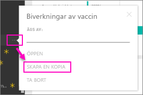

# Organisationsinnehållspaket: Kopiera, uppdatera och få åtkomst

När ett organisationsinnehållspaket publiceras, visas alla mottagare samma instrumentpanel, rapporter, Excel-arbetsböcker, datauppsättningar och data (om det inte rör sig om en SQL Server Analysis Services-datakälla).  [Endast innehållspaketets skapare kan redigera och publicera](service-organizational-content-pack-manage-update-delete.md) innehållspaketet.  Alla mottagare kan dock spara en kopia av innehållspaketet som kan existera tillsammans med originalet.

Att skapa innehållspaket skiljer sig från att dela instrumentpaneler eller samarbeta om dem i en grupp. Läs [Hur ska jag samarbeta kring och dela instrumentpaneler och rapporter?](service-how-to-collaborate-distribute-dashboards-reports.md) för att välja det bästa alternativet för din situation.

> [!NOTE]
> Du kan inte skapa eller installera innehållspaket för organisationen i den nya arbetsyteupplevelsen. Nu är ett bra tillfälle att uppgradera dina innehållspaket till appar, om du inte har börjat ännu. Lär dig [mer om den nya arbetsytan](service-create-the-new-workspaces.md).
>

## Skapa en kopia av ett organisationsinnehållspaket
Skapa din egen kopia av innehållspaketet som inte är synligt för andra.

1. Välj **Fler alternativ** (...) bredvid innehållspaketets instrumentpanel > Gör en kopia.

    
2. Välj **Spara**.  

Nu har du en kopia som du kan ändra. Ingen annan kommer att se de ändringar du gör.

> [!NOTE]
> Tidigare när du installerade ett innehållspaket eller skapade en kopia, visades en ny datamängd i innehållslistan för arbetsytan. En nyligen genomförd uppdatering förenklar upplevelsen genom att enbart visa ett objekt med hjälp av den nya ikonen för datamängden som refereras:
>
> 
>

## Hjälp!  Jag kan inte längre komma åt innehållspaketet
Detta kan bero på flera orsaker:

* **Medlemskapsändringar**:  Innehållspaket publiceras för e-postdistributionsgrupper, säkerhetsgrupper och [Power BI-grupper baserat på Office 365](https://support.office.com/article/Create-a-group-in-Office-365-7124dc4c-1de9-40d4-b096-e8add19209e9).  Om du har tagits bort från gruppen har du inte längre åtkomst till innehållspaketet.
* **Distributionsändringar**: Innehållspaketets skapare har ändrat distributionen. Om till exempel innehållspaketet ursprungligen publicerades för hela organisationen men skaparen publicerar det på nytt men nu för en mindre målgrupp, kanske du inte längre ingår i den.
* **Säkerhetsinställningar ändras**: Om instrumentpanelen och rapporterna ansluter till lokala SSAS-datakällor och ändringar görs i säkerhetsinställningarna, kan din behörighet till servern återkallas.

## Hur uppdateras organisationsinnehållspaket?
När innehållspaketet skapas ärvs uppdateringsinställningarna från datauppsättningen.  När du skapar en kopia av innehållspaketet, behåller den nya versionen en länk till den ursprungliga datauppsättningen och dess uppdateringsschema.

Se [Hantera, uppdatera och ta bort organisationsinnehållspaket](service-organizational-content-pack-manage-update-delete.md).

## Nästa steg
* [Introduktion till organisationsinnehållspaket](service-organizational-content-pack-introduction.md)
* [Skapa en grupp i Power BI](service-create-distribute-apps.md)
* Har du fler frågor? [Prova Power BI Community](https://community.powerbi.com/)
