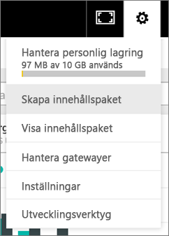
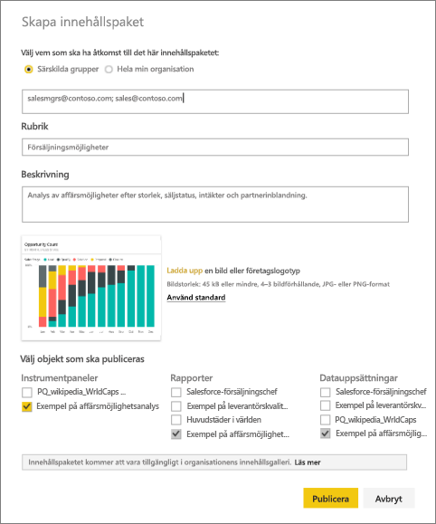
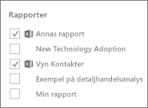
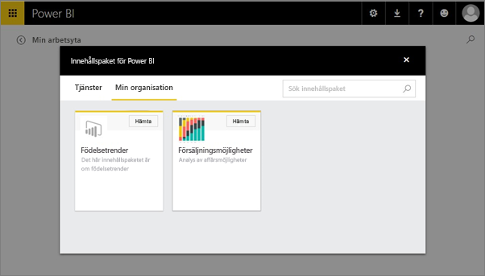

# Skapa och publicera ett organisationsinnehållspaket i Power BI (självstudier)

I de här självstudierna skapar du ett organisationsinnehållspaket, ger åtkomst till en specifik grupp och publicerar det i din organisations innehållspaketsbibliotek på Power BI.

Att skapa innehållspaket skiljer sig från att dela instrumentpaneler eller samarbeta om dem i en grupp. Läs [Hur ska jag samarbeta kring och dela instrumentpaneler och rapporter?](service-how-to-collaborate-distribute-dashboards-reports.md) för att välja det bästa alternativet för din situation.

För att kunna skapa ett organisationsinnehållspaket krävs ett [Power BI Pro-konto](https://powerbi.microsoft.com/pricing) för dig och dina kollegor. 

> [!NOTE]
> Du kan inte skapa eller installera innehållspaket för organisationen i förhandsversionen för den nya arbetsytan. Nu är ett bra tillfälle att uppgradera dina innehållspaket till appar, om du inte har börjat ännu. Lär dig [mer om den nya arbetsytan](service-create-the-new-workspaces.md).
> 

Föreställ dig att du är Release Manager på Contoso och förbereder dig inför en ny produktlansering.  Du har skapat en instrumentpanel med rapporter som du skulle vilja dela med de övriga medarbetarna som hanterar lanseringen. Du vill ha en metod för att paketera instrumentpanelen och rapporterna som en lösning som dina kollegor kan använda. 

Vill du hänga på? I [Power BI-tjänsten](https://powerbi.com) går du till **Hämta data > Exempel > Exempel på analys av affärsmöjligheter** > **Anslut** för att hämta din egna kopia. 

1. I det vänstra navigeringsfönstret väljer du instrumentpanelen **Exempel på analys av affärsmöjligheter**.
2. I det övre navigeringsfältet väljer du kugghjulsikonen  > **Skapa innehållspaket**.    
   
3. I fönstret **Skapa innehållspaket** anger du nedanstående information.  
   
   Tänk på att din organisations innehållspaketsbibliotek till slut kan innehålla hundratals innehållspaket som publicerats för organisationen eller för olika grupper. Lägg tid på att ge ditt innehållspaket ett bra och beskrivande namn, lägg till en detaljerad beskrivning och välj rätt målgrupp.  Använd ord som gör ditt innehållspaket lätt att hitta vid en sökning.
   
   1. Välj **Specifika grupper** och ange fullständiga e-postadresser för enskilda användare, [Office 365-grupper](https://support.office.com/article/Create-a-group-in-Office-365-7124dc4c-1de9-40d4-b096-e8add19209e9), distributionsgrupper eller säkerhetsgrupper. Till exempel:
      
        salesmgrs@contoso.com; sales@contoso.com
      
      Försök använda din egen eller din grupps e-postadress för de här självstudierna.
   
   2. Döp innehållspaketet till **Affärsmöjligheter**.
   
      > [!TIP]
      > Överväg att ta med namnet på instrumentpanelen i namnet på innehållspaketet. På så sätt kan dina kollegor hitta instrumentpanelen enklare när de ansluter till ditt innehållspaket.
      > 
      > 
   
   3. Rekommenderas: Lägg till en **beskrivning**. Detta hjälper dina medarbetare att lättare hitta de innehållspaket som de behöver. Lägg utöver beskrivningen även till nyckelord som dina medarbetare kan använda för att söka efter innehållspaketet. Inkludera kontaktinformation om dina medarbetare har frågor eller behöver hjälp.
   
   4. **Ladda upp en bild eller logotyp** för att göra det enklare för medlemmar i gruppen att hitta innehållspaketet &#151; det går snabbare att söka efter en bild än att söka efter text. Vi har använt en bild av stapeldiagramspanelen för ”affärsmöjligheter 100%” på skärmbilden nedan.
   
   5. Välj instrumentpanelen **Exempel på analys av affärsmöjligheter** för att lägga till den till innehållspaketet.  Power BI lägger automatiskt till associerad rapport och datauppsättning. Du kan lägga till andra, om du vill.
   
      > [!NOTE]
      >  Endast de instrumentpaneler, rapporter, datauppsättningar och arbetsböcker som du kan redigera visas. Det innebär att alla som har delats med dig inte finns i listan.
      > 
      > 
   
       
   
   6. Om du har Excel-arbetsböcker kan se dem under Rapporter, med en Excel-ikon. Du kan också lägga till dem i innehållspaketet.
   
      
   
      > [!NOTE]
      > Om medlemmar i gruppen inte kan visa Excel-arbetsboken, kan du behöva [dela arbetsboken med dem i OneDrive för företag](https://support.office.com/article/Share-documents-or-folders-in-Office-365-1fe37332-0f9a-4719-970e-d2578da4941c).
      > 
      > 
4. Välj **Publicera** för att lägga till innehållspaketet till gruppens bibliotek för organisationsinnehållspaket.  
   
   Ett meddelande visas när det publiceras. 
5. När medlemmarna i din grupp går till **Hämta data > Min organisation**, ska de trycka i sökrutan och skriva ”affärsmöjligheter”.
   
    
6. De ser ditt innehållspaket.  
    
   
   > [!TIP]
   > Den URL som visas i din webbläsare är en unik adress för det här innehållspaketet.  Vill du berätta för dina medarbetare om det här nya innehållspaketet?  Klistra in URL:en i ett e-postmeddelande.
   > 
   > 
7. De väljer **Anslut** och sedan kan de [visa och arbeta med ditt innehållspaket](service-organizational-content-pack-copy-refresh-access.md). 

### Nästa steg
* [Introduktion till organisationsinnehållspaket](service-organizational-content-pack-introduction.md)  
* [Hantera, uppdatera och ta bort organisationsinnehållspaket](service-organizational-content-pack-manage-update-delete.md)  
* [Skapa en grupp i Power BI](service-create-distribute-apps.md)  
* [Vad är OneDrive för företag?](https://support.office.com/article/What-is-OneDrive-for-Business-187f90af-056f-47c0-9656-cc0ddca7fdc2)
* Har du fler frågor? [Prova Power BI Community](http://community.powerbi.com/)

