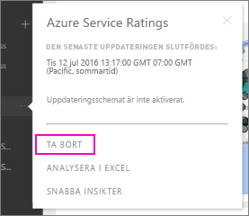

# Ta bort din anslutning till ett Power BI-organisationsinnehållspaket
En medarbetare har skapat ett innehållspaket. Du identifierade det i AppSource och har lagt till det på din Power BI-arbetsyta. Nu behöver du det inte längre.  Hur tar du bort det?

Du tar bort ett innehållspaket genom att ta bort dess datauppsättning.  

* Välj ellipsen (...) till höger om datauppsättningen i det vänstra navigeringsfönstret och välj **Ta bort \> Ja**.  
  
  

När du tar bort datauppsättningen tar du också bort alla associerade rapporter och instrumentpaneler. Men om du tar bort anslutningen till innehållspaketet, så tas inte innehållspaketet bort från din organisations AppSource.  Du kan alltid gå tillbaka till AppSource och lägga tillbaka innehållspaketet på din arbetsyta. Du kan bara [ta bort ett innehållspaket från AppSource](service-organizational-content-pack-manage-update-delete.md) om det är du som har skapat det.

## Nästa steg
* [Introduktion till organisationsinnehållspaket](service-organizational-content-pack-introduction.md) 
* [Skapa och distribuera en app i Power BI](service-create-distribute-apps.md) 
* [Grundläggande begrepp för Power BI](service-basic-concepts.md)  
* Har du fler frågor? [Prova Power BI Community](http://community.powerbi.com/)

