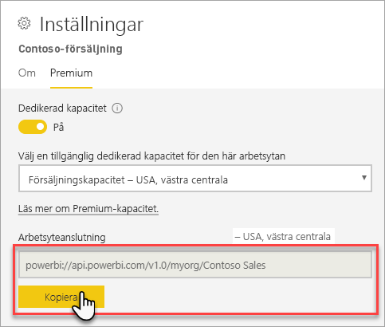

# Ansluta till datamängder med klientprogram och verktyg (förhandsversion)

Power BI Premium-arbetsytor och -datamängder har stöd för *skrivskyddade* anslutningar från Microsoft samt klientprogram och verktyg från tredje part. Som standard är anslutningar aktiverade

> [!NOTE]
> Den här artikeln är endast avsedd att införa skrivskyddade anslutningar i Power BI Premium-arbetsytor och -datamängder. Den är *inte* avsedd att ge detaljerad information om programmerbarhet, specifika verktyg och program, arkitektur och hantering av arbetsytor och datamängder. Ämnen som beskrivs i artikeln kräver en gedigen förståelse av arkitekturen för och administration av den tabellbaserade modelldatabasen i Analysis Services.

## Protokoll

Power BI Premium använder [XML for Analysis](https://docs.microsoft.com/bi-reference/xmla/xml-for-analysis-xmla-reference)-protokollet (XMLA) för kommunikation mellan klientprogram och den motor som hanterar dina arbetsytor och datamängder. Denna kommunikation sker via det som vanligtvis kallas XMLA-slutpunkter. XMLA är samma kommunikationsprotokoll som används av Microsoft Analysis Services-motorn, som under huven kör Power BI:s semantiska modellering, styrning, livscykel och datahantering. 

Den stora majoriteten av klientprogram och verktyg kommunicerar inte explicit med motorn via XMLA-slutpunkter. I stället använder de klientbibliotek som MSOLAP, ADOMD och AMO som en mellanhand mellan klientprogrammet och motor, som kommunicerar endast med hjälp av XMLA.

## Verktyg som stöds

De här verktygen stöder skrivskyddad åtkomst till Power BI Premium-arbetsytor och -datamängder:

**SQL Server Management Studio (SSMS)** – stöder frågor via DAX, MDX, XMLA och TraceEvent. Kräver version 18.0. Ladda ned [här](https://docs.microsoft.com/sql/ssms/download-sql-server-management-studio-ssms). 

**SQL Server Profiler** – ingår med SSMS 18.0 (förhandsversion). Det här verktyget tillhandahåller spårning och felsökning av serverhändelser. Du kan samla in och spara data om varje händelse till en fil eller en tabell för senare analys. Profiler har officiellt tagits ur bruk för SQL Server men ingår fortfarande i SSMS och fortsätter att stödjas för Analysis Services och nu Power BI Premium. Mer information finns i [SQL Server Profiler](https://docs.microsoft.com/sql/tools/sql-server-profiler/sql-server-profiler).

**DAX Studio** – ett communityverktyg med öppen källkod för körning och analys av DAX-frågor mot Analysis Services. Kräver version 2.8.2 eller senare. Mer information finns på [daxstudio.org](https://daxstudio.org/).

**Excel-pivottabeller** – Klicka-och-kör-version av Office 16.0.11326.10000 eller senare krävs.

**Tredje part** – innehåller program och verktyg för klientdatavisualisering som kan ansluta till, köra frågor mot och förbruka datamängder i Power BI Premium. De flesta verktyg kräver de senaste versionerna av MSOLAP-klientbiblioteken, men vissa kan använda ADOMD.

## Klientbibliotek

Klientbibliotek är nödvändiga för att klientprogram och verktyg ska kunna ansluta till Power BI Premium-arbetsytor. Samma klientbibliotek som används för att ansluta till Analysis Services stöds även i Power BI Premium. Microsoft-klientprogram som Excel, SQL Server Management Studio (SSMS) och SQL Server Data Tools (SSDT) installerar alla tre klientbiblioteken och uppdaterar dem tillsammans med regelbundna programuppdateringar. I vissa fall, särskilt med program och verktyg från tredje part, kan du behöva installera nyare versioner av klientbiblioteken. Klientbibliotek uppdateras varje månad. Mer information finns i [Klientbibliotek för anslutning till Analysis Services](https://docs.microsoft.com/azure/analysis-services/analysis-services-data-providers).

## Ansluta till en Premium-arbetsyta

Du kan ansluta till arbetsytor som har tilldelats till Premium-dedikerade kapaciteter. Arbetsytor som har tilldelats till en dedikerad kapacitet har en anslutningssträng i URL-format. 

Du hämtar arbetsytans anslutningssträng i Power BI genom att gå till **Arbetsyteinställningar** följt av fliken **Premium** och **Arbetsyteanslutning**. Där klickar du på **Kopiera**.

Arbetsyteanslutningar använder följande URL-format för att åtgärda en arbetsyta som om den vore ett Analysis Services-servernamn:   
`powerbi://api.powerbi.com/v1.0/[tenant name]/[workspace name]` 

Exempel: `powerbi://api.powerbi.com/v1.0/contoso.com/Sales Workspace`

### Ansluta i SSMS

I **Anslut till server** > **Servertyp** väljer du **Analysis Services**. I **Servernamn** anger du URL:en. I **Autentisering** väljer du **Active Directory - Universal with MFA Support** (Active Directory – Universal med MFA-stöd), och i **Användarnamn** anger du din organisations användar-ID. 

När anslutningen är upprättad visas arbetsytan som en Analysis Services-server, och datamängderna på arbetsytan visas som databaser.  

### Första katalog

Med vissa verktyg, till exempel SQL Server Profiler, kan du behöva ange en *första katalog*. Ange en datamängd (databas) på arbetsytan. I **Anslut till server** klickar du på **Alternativ**. I dialogrutan **Anslut till server** går du till fliken **Anslutningsegenskaper** och sedan **Anslut till databas** och anger namnet på datamängden.

### Duplicera namn på arbetsyta

När du ansluter till en arbetsyta med samma namn som en annan arbetsyta kan det hända att följande fel visas: **Det går inte att ansluta till powerbi://api.powerbi.com/v1.0/[namn på klientorganisation]/[namn på arbetsyta].**

För att kringgå det här problemet anger du, utöver namnet på arbetsytan, ObjectIDGuid. Det kan du kopiera från arbetsytans objekt-ID i URL:en. Lägg till objekt-ID i anslutnings-URL:en. Exempel: ”powerbi://api.powerbi.com/v1.0/myorg/Contoso Sales - 9d83d204-82a9-4b36-98f2-a40099093830”

### Duplicera namn på datamängd

Vid anslutning till en datamängd med samma namn som en annan datamängd på samma arbetsyta lägger du till datamängdens guid i datamängdens namn. Du kan hämta både datamängdens namn *och* guid med anslutning till arbetsytan i SSMS. 

### Fördröjning i datamängder som visas

När du ansluter till en arbetsyta kan ändringar från nya, borttagna och omdöpta datamängder ta upp till 5 minuter att visas. 

### Datamängder som inte stöds

Följande datamängder är inte tillgängliga med hjälp av XMLA-slutpunkter. Dessa datamängder visas *inte* under arbetsytan i SSMS eller i andra verktyg: 

- Datamängder med live-anslutning till en Analysis Services-modell. 
- Datamängder med push-data med hjälp av REST API.
- Datamängder för Excel-arbetsböcker. 

Följande datamängder stöds inte i Power BI-tjänsten:   

- Datamängder med en live-anslutning till en Power BI-datamängd.

### Roller och rollmedlemskap

För närvarande går det inte att identifiera eller visa modellroller eller rollmedlemskap med hjälp av XMLA-slutpunkter.

## Inaktivera anslutningar

Som standard är anslutningar för XMLA-slutpunkt aktiverade för arbetsbelastningen Datamängder. Du kan inaktivera anslutningar i [Inställningar för arbetsbelastningar](service-admin-premium-workloads.md#workload-settings).

## Granskningsloggar 

När klientprogram och verktyg ansluter till en arbetsyta loggas åtkomst via XMLA-slutpunkter i Power BI-spårningsloggarna under åtgärden **GetWorkspaces**. Läs mer i [Granska Power BI](service-admin-auditing.md).

## Se också

[Analysis Services-referenser](https://docs.microsoft.com/bi-reference/#pivot=home&panel=home-all)   
[SQL Server Management Studio](https://docs.microsoft.com/sql/ssms/sql-server-management-studio-ssms)   
[Tabellprotokoll för SQL Server Analysis Services](https://docs.microsoft.com/openspecs/sql_server_protocols/ms-ssas-t/b98ed40e-c27a-4988-ab2d-c9c904fe13cf)   
[Dynamiska hanteringsvyer (DMV)](https://docs.microsoft.com/sql/analysis-services/instances/use-dynamic-management-views-dmvs-to-monitor-analysis-services)   

Har du fler frågor? [Fråga Power BI Community](https://community.powerbi.com/)
