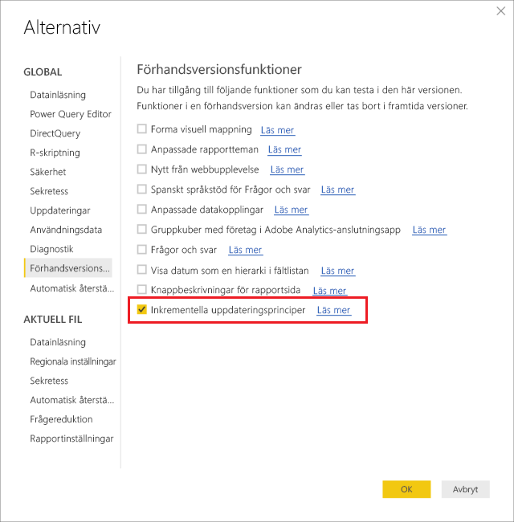
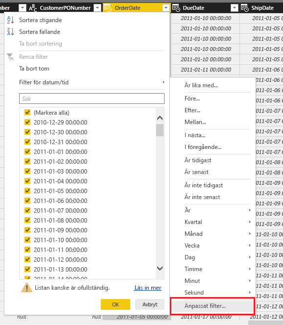
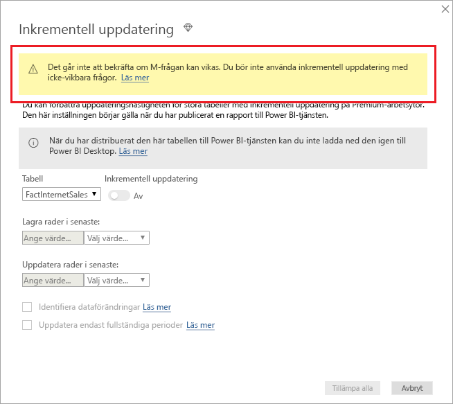
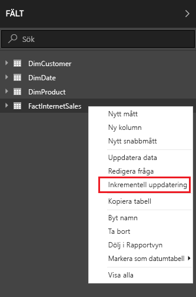
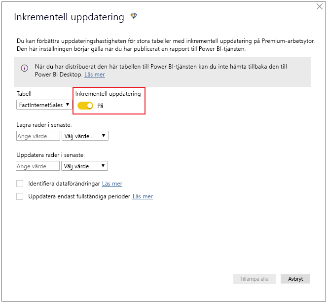
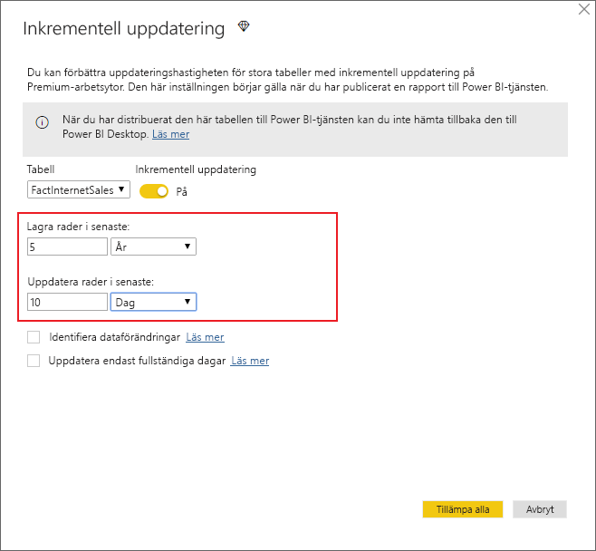
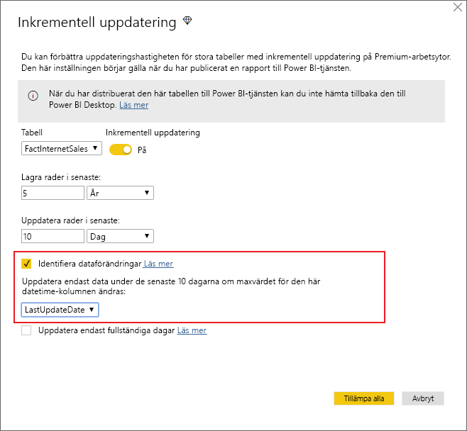
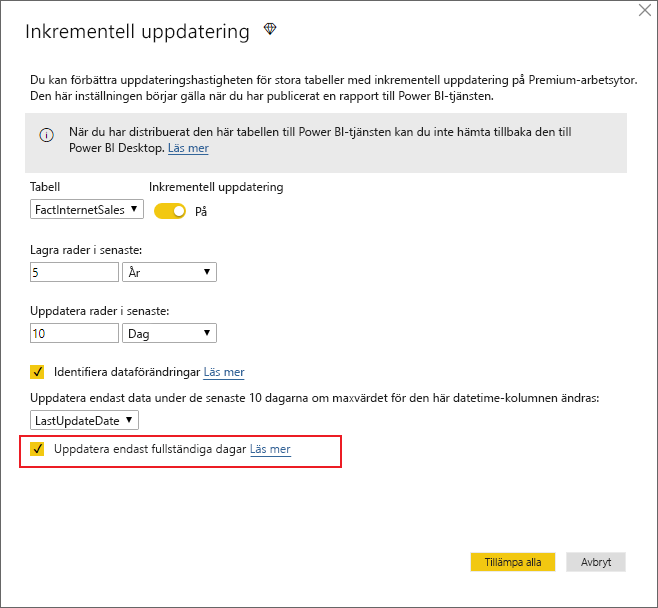
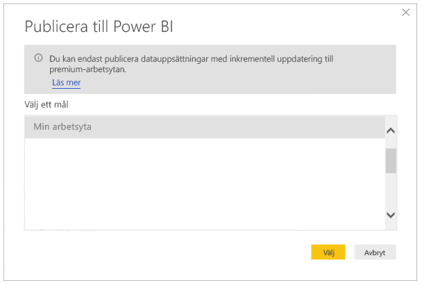

# <a name="incremental-refresh-in-power-bi-premium"></a>Inkrementell uppdatering i Power BI Premium

Inkrementell uppdatering gör det möjligt att använda mycket stora datamängder i Power BI Premium-tjänsten, vilket medför följande fördelar:

- **Snabbare uppdateringar** – Endast data som ändras behöver uppdateras. Exempelvis kan en uppdatering göras på de senaste fem dagarna i en datamängd som spänner över tio år.

- **Mer tillförlitliga uppdateringar** – Det krävs inte längre långvariga anslutningar till instabila källsystem.

- **Minskad resursförbrukning** – När färre data behöver uppdateras minskar den totala förbrukningen av minne och andra resurser.

## <a name="configure-incremental-refresh"></a>Konfigurera inkrementell uppdatering

Principerna för inkrementell uppdatering definieras i Power BI Desktop och tillämpas när de har publicerats till Power BI-tjänsten.

Börja genom att aktivera inkrementell uppdatering i **förhandsversionsfunktionerna**.



### <a name="filter-large-datasets-in-power-bi-desktop"></a>Filtrera stora datamängder i Power BI Desktop

Det går inte alltid att använda riktigt stora datamängder i en Power BI Desktop-modell eftersom PBIX-filen begränsas av de minnesresurser som är tillgängliga på datorn. Därför filtreras oftast sådana datamängder när de importeras. Den här typen av filtrering görs oavsett om du använder inkrementell uppdatering eller inte. För inkrementell uppdatering filtrerar du med Power Query-parametrarna för datum och tid.

#### <a name="rangestart-and-rangeend-parameters"></a>Parametrarna RangeStart och RangeEnd

För inkrementell uppdatering filtreras datamängder med Power Query-parametrar för datum och tid med de reserverade, skiftlägeskänsliga namnen **RangeStart** och **RangeEnd**. Dessa parametrar används för att filtrera data som importeras till Power BI Desktop och för att dynamiskt partitionera data i intervall när de har publicerats till Power BI-tjänsten. Parametervärdena ersätts av tjänsten för filtrering av varje partition. Efter publicering åsidosätts parametervärdena automatiskt av Power BI-tjänsten. Du behöver inte ange dem i inställningarna för datauppsättningen i tjänsten. Efter publicering åsidosätts parametervärdena automatiskt av Power BI-tjänsten. 

Välj **Hantera parametrar** i Power Query Editor och definiera parametrarna med standardvärden.


När parametrarna har definierats kan du tillämpa filtret genom att välja menyalternativet **Anpassat filter** för en kolumn.



Se till att raderna filtreras där kolumnvärdet *infaller efter eller är lika med* **RangeStart** och där det infaller *före* **RangeEnd**.


> [!TIP]
> Datatypen för parametrarna måste vara datum/tid, men de kan konverteras så att de uppfyller datakällans krav. Följande Power Query-funktion konverterar till exempel ett datum/tid-värde så att det liknar en surrogatnyckel i heltalsform med formatet *ååååmmdd*, vilket är vanligt för informationslager. Funktionen kan anropas i filtersteget.
>
> `(x as datetime) => Date.Year(x)*10000 + Date.Month(x)*100 + Date.Day(x)`

Välj **Close and Apply** (Stäng och använd) i Power Query Editor. Du bör ha en delmängd data i Power BI Desktop.

#### <a name="filter-date-column-updates"></a>Filtrera datumkolumnuppdateringar

Filtret för datumkolumnen används för att dynamiskt partitionera data i intervall i Power BI-tjänsten. Inkrementell uppdatering är inte avsedd att stödja fall där den filtrerade datumkolumnen uppdateras i källsystemet. En uppdatering tolkas som en infogning och en borttagning, inte en faktisk uppdatering. Om borttagningen inträffar i det historiska intervallet och inte det inkrementella intervallet hämtas den inte. Detta kan orsaka datauppdateringsfel på grund av konflikter med partitionsnyckel.

#### <a name="query-folding"></a>Frågepartitionering

Det är viktigt att partitionsfilter skickas till källsystemet när frågor skickas för uppdateringsåtgärder. Att skicka ned filtrering innebär att datakällan ska ha stöd för frågepartitionering. De flesta datakällor som stöder SQL-frågor har stöd för frågepartitionering. Men datakällor såsom flata filer, blobar samt webb- och OData-flöden har vanligtvis inte stöd. I fall där filtret inte stöds av datakällans serverdel kan den inte skickas ned. I sådana fall kompenserar kombinationsprogrammotorn och tillämpar filtret lokalt, vilket kan kräva att den fullständiga datamängden hämtas från datakällan. Detta kan göra så att inkrementell uppdatering går mycket långsamt, och processen kan få slut på resurser i Power BI-tjänsten eller i den lokala datagatewayen om den används.

Med tanke på de olika nivåerna av stöd för frågepartitionering för varje given datakälla rekommenderar vi att du kontrollerar att filterlogiken ingår i källfrågorna. För att underlätta detta försöker Power BI Desktop utföra den här kontrollen åt dig. Om kontrollen inte kan utföras visas en varning i dialogrutan för inkrementell uppdatering när du definierar principen för inkrementell uppdatering. SQL-baserade datakällor, till exempel SQL, Oracle och Teradata, kan vara beroende av den här varningen. Andra datakällor kanske inte kan göra en kontroll utan att spåra frågor. Om Power BI Desktop inte kan bekräfta visas följande varning.

 

### <a name="define-the-refresh-policy"></a>Definiera uppdateringsprincipen

Inkrementell uppdatering är tillgängligt på snabbmenyn för tabeller, förutom för Live-anslutningsmodeller.



#### <a name="incremental-refresh-dialog"></a>Dialogrutan Inkrementell uppdatering

Dialogrutan Inkrementell uppdatering visas. Aktivera dialogrutan med hjälp av växlingsknappen.



> [!NOTE]
> Om Power Query-uttrycket för tabellen inte refererar till parametrarna med reserverade namn, är växlingsknappen inaktiverad.

Rubriktexten förklarar följande:

- Inkrementell uppdatering stöds endast för arbetsytor med Premium-kapaciteter. Uppdateringsprinciper definieras i Power BI Desktop och tillämpas genom uppdateringsåtgärder i tjänsten.

- Om du laddar ned PBIX-filen som innehåller en princip för inkrementell uppdatering från Power BI-tjänsten, kan den inte öppnas i Power BI Desktop. Även om det kan finnas stöd för detta längre fram bör du ha i åtanke att dessa datamängder kan bli så stora att det är opraktiskt att ladda ned och öppna dem på en vanlig skrivbordsdator.

#### <a name="refresh-ranges"></a>Uppdateringsintervall

I följande exempel definieras en uppdateringsprincip för att lagra data i fem fullständiga kalenderår plus data för det aktuella året fram till det aktuella datumet och stegvis uppdatera tio dagars data. Den första uppdateringsåtgärden läser in historiska data. Efterföljande uppdateringar är inkrementella och (om de har schemalagts att köras dagligen) utför följande åtgärder:

- Lägg till en ny dag med data.

- Uppdatera tio dagar fram till det aktuella datumet.

- Ta bort kalenderår som är äldre än fem år räknat från det aktuella datumet. Om det aktuella datumet exempelvis är den 1 januari 2019 tas år 2013 bort.

Den första uppdateringen i Power BI-tjänsten kan ta längre tid eftersom alla fem fullständiga kalenderår importeras. Efterföljande uppdateringar slutförs på en bråkdel av tiden.



> [!NOTE]
> Definitionen av dessa intervall kanske är allt du behöver. I så fall kan du gå direkt till publiceringssteget nedan. De ytterligare nedrullningsbara avsnitten beskriver avancerade funktioner.

### <a name="advanced-policy-options"></a>Avancerade principalternativ

#### <a name="detect-data-changes"></a>Identifiera dataförändringar

Inkrementell uppdatering av tio dagar är effektivare än en fullständig uppdatering av fem år. Men det går att göra ännu bättre. Om du markerar kryssrutan **Identifiera dataförändringar** kan du välja en datum/tid-kolumn som ska användas för att identifiera och uppdatera endast de dagar då data har ändrats. Detta förutsätter att den här typen av kolumn finns i källsystemet, vilket är vanligt för granskningsändamål. **Det får inte vara samma kolumn som används för att partitionera data med parametrarna RangeStart/RangeEnd.** Maxvärdet i den här kolumnen utvärderas för varje period i det inkrementella intervallet. Om det inte har ändrats sedan den senaste uppdateringen behöver perioden inte uppdateras. I exemplet kan detta ytterligare minska antalet dagar som uppdateras inkrementellt från tio till cirka två.



> [!TIP]
> Den aktuella designen kräver att kolumnen som identifierar dataförändringar är beständig och att den cachelagras i minnet. Överväg att använda någon av följande tekniker för att minska kardinalitet och minnesförbrukning.
>
> Spara endast maxvärdet i den här kolumnen vid tidpunkten för uppdateringen, t.ex. genom att använda en Power Query-funktion.
>
> Minska precisionen till en godtagbar nivå beroende på dina krav på uppdateringsfrekvens.
>
> Vi planerar att lägga till stöd för definition av anpassade frågor för identifiering av dataförändringar längre fram. På så sätt behöver inte kolumnvärdet sparas över huvud taget.

#### <a name="only-refresh-complete-periods"></a>Uppdatera endast fullständiga perioder

Anta att din uppdatering är schemalagd att köras 04:00 varje morgon. Om data matas in i källsystemet under dessa fyra timmar kanske du inte vill att de ska registreras. Icke fullständiga dagar saknar relevans med vissa affärsmått, t.ex. antalet fat per dag inom olje- och gasindustrin.

Ett annat exempel är när data uppdateras från ett ekonomisystem där data för den föregående månaden godkänns på kalenderdag tolv i månaden. Du kan ange det inkrementella intervallet till en månad och schemalägga körningen av uppdateringen på den tolfte dagen i månaden. Om du väljer det här alternativet uppdateras exempelvis data från januari den 12 februari.



> [!NOTE]
> Uppdateringsåtgärder i tjänsten körs enligt UTC-tid. Detta kan avgöra det effektiva datumet och påverka fullständiga perioder. Vi planerar att lägga till möjligheten att åsidosätta det effektiva datumet för uppdateringsåtgärder.

## <a name="publish-to-the-service"></a>Publicera till tjänsten

Eftersom inkrementell uppdatering är en exklusiv Premium-funktion krävs Premium-kapacitet för att du ska kunna välja en arbetsyta i publiceringsdialogrutan.



Nu kan du uppdatera modellen. Den första uppdateringen kan ta längre tid eftersom historiska data importeras. Efterföljande uppdateringar går vanligtvis mycket snabbare eftersom de använder inkrementell uppdatering.

## <a name="query-timeouts"></a>Timeout för frågor

Artikeln [Felsöka uppdateringsscenarier](https://docs.microsoft.com/power-bi/refresh-troubleshooting-refresh-scenarios) förklarar hur timeouter kan uppstå i samband med uppdateringsåtgärder i Power BI-tjänsten. Frågor kan också begränsas av datakällans standardvärde för timeout. De flesta relationskällor stöder åsidosättning av timeouter i M-uttrycket. Exempelvis använder uttrycket nedan [SQL Server-funktionen data-access](https://msdn.microsoft.com/query-bi/m/sql-database) för att ange värdet till två timmar. Varje period som definieras av principintervallen skickar en fråga som tar hänsyn till kommandots timeout-inställning.

```
let
    Source = Sql.Database("myserver.database.windows.net", "AdventureWorks", [CommandTimeout=#duration(0, 2, 0, 0)]),
    dbo_Fact = Source{[Schema="dbo",Item="FactInternetSales"]}[Data],
    #"Filtered Rows" = Table.SelectRows(dbo_Fact, each [OrderDate] >= RangeStart and [OrderDate] < RangeEnd)
in
    #"Filtered Rows"
```
