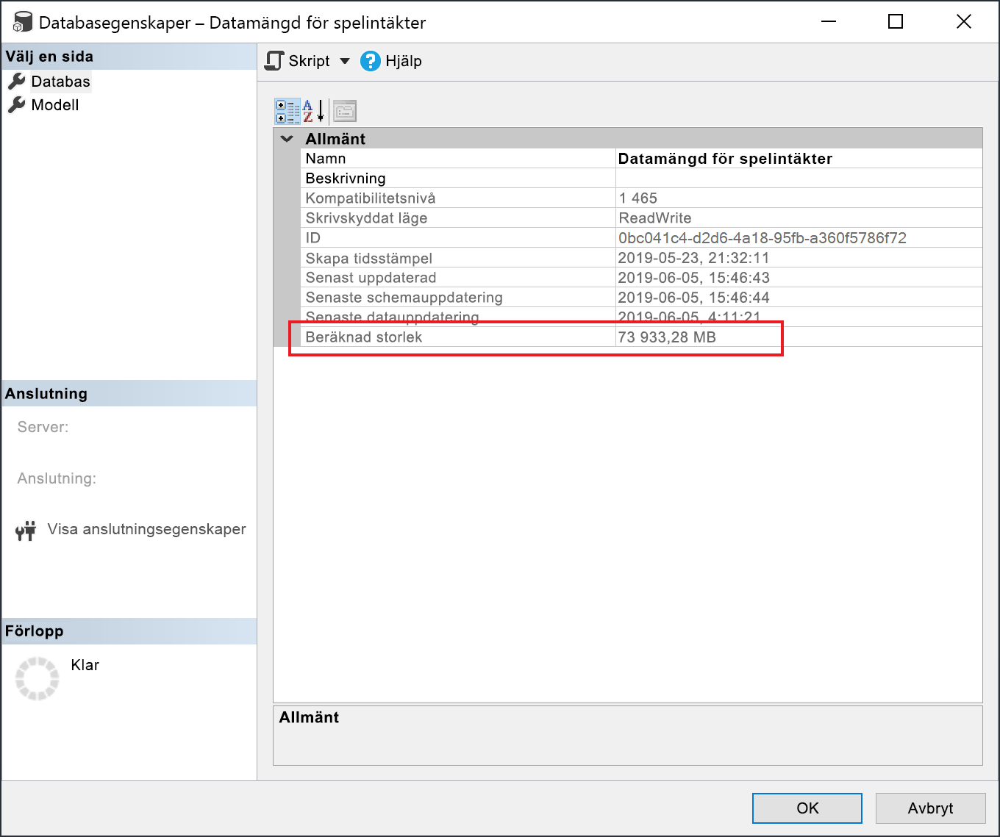

# <a name="large-models-in-power-bi-premium-preview"></a>Stora modeller i Power BI Premium (förhandsversion)

Power BI-datamängder kan lagra data i en mycket komprimerad minnesintern cache för optimerad frågeprestanda, så att snabb användarinteraktivitet för stora datamängder kan aktiveras för stora datamängder. Funktionen med stora modeller innebär att datamängder i Power BI Premium kan bli större än 10 GB. Datamängdens storlek begränsas i stället av kapacitetsstorleken för Power BI Premium, vilket liknar hur Azure Analysis Services fungerar med avseende på storleksbegränsningar för modeller. Mer information om kapacitetsstorlekar i Power BI Premium finns i Kapacitetsnoder. Du kan konfigurera stora modeller för alla Premium P SKU:er och inbäddade A SKU:er, men de fungerar bara med [nya arbetsytor](service-create-the-new-workspaces.md).

Stora modeller påverkar inte PBIX-uppladdningsstorleken, som fortfarande är begränsad till 10 GB. I stället kan datamängderna bli större än 10 GB i tjänsten vid uppdatering. Du kan använda stegvis uppdatering om du vill konfigurera att en datamängd kan bli större än 10 GB.

## <a name="enable-large-models"></a>Aktivera stora modeller

Följ dessa steg om du vill skapa en datamängd som kan bli större än 10 GB:

1. Skapa en datamängd i Power BI Desktop och konfigurera en [stegvis uppdatering](service-premium-incremental-refresh.md).

1. Publicera datamängden i Power BI Premium-tjänsten.

1. Aktivera datamängden för stora modeller genom att köra PowerShell-cmdletarna nedan. Dessa cmdletar innebär att Power BI lagrar datamängden i Azure Premium-filer i stället för att tillämpa gränsen på 10 GB.

1. Anropa en uppdatering för att läsa in historiska data baserat på den stegvisa uppdateringsprincipen. Det kan ta en stund att läsa in historiken vid den första uppdateringen. Efterföljande uppdateringar bör gå snabbare eftersom de är stegvisa.

### <a name="powershell-cmdlets"></a>PowerShell-cmdletar

I den aktuella versionen för stora modeller aktiverar du datamängden för lagring i Premium-filer med hjälp av PowerShell-cmdletar. Du måste ha behörighet som administratör för kapaciteter och arbetsytor för att kunna köra PowerShell-cmdletar.

1. Hitta datauppsättnings-ID:t (GUID). På fliken **Datauppsättningar** i arbetsytan, kan du se ID:t i URL:en under datamängdsinställningarna.

    

1. Installera modulen [MicrosoftPowerBIMgmt](/powershell/module/microsoftpowerbimgmt.data/) från en kommandotolk för administratörer i PowerShell.

    ```powershell
    Install-Module -Name MicrosoftPowerBIMgmt
    ```

1. Kör följande cmdletar för att logga in och kontrollera lagringsläget för datamängden.

    ```powershell
    Login-PowerBIServiceAccount

    (Get-PowerBIDataset -Scope Organization -Id <Dataset ID> -Include actualStorage).ActualStorage
    ```

    Svaret bör vara det som anges nedan. Lagringsläget är ABF (säkerhetskopierad Analysis Services-fil), vilket är standard.

    ```
    Id                   StorageMode

    --                   -----------

    <Dataset ID>         Abf
    ```

1. Kör följande cmdletar för att ange lagringsläget till Premium-filer och markera det. Det kan ta ett par sekunder att konvertera till Premium-filer.

    ```powershell
    Set-PowerBIDataset -Id <Dataset ID> -TargetStorageMode PremiumFiles

    (Get-PowerBIDataset -Scope Organization -Id <Dataset ID> -Include actualStorage).ActualStorage
    ```

    Svaret bör vara det som anges nedan. Lagringsläget är nu inställt på Premium-filer.

    ```
    Id                   StorageMode
    
    --                   -----------
    
    <Dataset ID>         PremiumFiles
    ```

Du kan kontrollera statusen för datamängdskonverteringar till och från Premium-filer med hjälp av cmdleten [Get-PowerBIWorkspaceMigrationStatus](/powershell/module/microsoftpowerbimgmt.workspaces/get-powerbiworkspacemigrationstatus).

## <a name="dataset-eviction"></a>Ta bort datamängder

Power BI använder dynamisk minneshantering för att ta bort inaktiva datamängder från minnet. Power BI tar bort datamängderna så att andra datamängder kan läsas in för användarfrågor. Med dynamisk minneshantering kan summan av datamängdsstorlekarna vara betydligt större än det tillgängliga minnet i kapaciteten, men en enskild datamängd måste få plats i minnet. Mer information om dynamisk minneshantering finns i [Så här fungerar kapaciteter](service-premium-what-is.md#how-capacities-function).

Du bör ta hänsyn till effekten när stora modeller tas bort. Trots relativt snabba inläsningstider av datamängderna, kan det fortfarande uppstå en märkbar fördröjning för användarna om de behöver vänta på att stora borttagna datamängder ska läsas in igen. Av den anledningen rekommenderas funktionen för stora modeller i nuvarande form främst för kapaciteter som är dedikerade för företagens BI-krav, i stället för kapaciteter som är blandade med krav på självservice-BI. Det är mindre sannolikt att kapaciteter som är avsedda för företagens BI-krav ofta utlöser borttagning och att datamängderna behöver läsas in igen. Kapaciteter för självservice-BI kan å andra sidan ha många små datamängder som ofta läses in och ut från minnet.

## <a name="checking-dataset-size"></a>Kontrollera datamängdsstorlek

När du har läst in historiska data kan du använda [SSMS](https://docs.microsoft.com/sql/ssms/download-sql-server-management-studio-ssms) via [XMLA-slutpunkten](service-premium-connect-tools.md) till att kontrollera den beräknade datamängdsstorleken i fönstret för modellegenskaper.



Du kan också kontrollera datamängdens storlek genom att köra följande DMV-frågor från SSMS. Summera kolumnerna DICTIONARY\_SIZE och USED\_SIZE från utdatan för att se datamängdens storlek i byte.

```sql
SELECT * FROM SYSTEMRESTRICTSCHEMA
($System.DISCOVER_STORAGE_TABLE_COLUMNS,
 [DATABASE_NAME] = '<Dataset Name>') //Sum DICTIONARY_SIZE (bytes)

SELECT * FROM SYSTEMRESTRICTSCHEMA
($System.DISCOVER_STORAGE_TABLE_COLUMN_SEGMENTS,
 [DATABASE_NAME] = '<Dataset Name>') //Sum USED_SIZE (bytes)
```

## <a name="limitations-and-considerations"></a>Begränsningar och överväganden

Tänk på följande begränsningar när du använder stora modeller:

- **BYOK-kryptering (Bring Your Own Key)** : Datamängder som är aktiverade för Premium-filer krypteras inte av [BYOK](service-encryption-byok.md).
- **Stöd för Multi-Geo**: Datamängder som är aktiverade för Premium-filer kommer inte att fungera i kapaciteter där [Multi-Geo](service-admin-premium-multi-geo.md) också är aktiverat.

- **Ladda ned till Power BI Desktop**: Om en datamängd lagras på Premium-filer kommer [nedladdning som .pbix](service-export-to-pbix.md)-fil att misslyckas.
- **Regioner som stöds**: Stora modeller stöds i alla Azure-regioner som stöder lagring av Premium-filer. Mer information finns i [Produkttillgänglighet efter region](https://azure.microsoft.com/global-infrastructure/services/?products=storage). Se även tabellen i följande avsnitt.


## <a name="availability-in-regions"></a>Tillgänglighet i regioner

Stora modeller i Power BI är endast tillgängliga i vissa Azure-regioner som stöder [Azure Premium-fillagring](https://docs.microsoft.com/azure/storage/files/storage-files-planning#storage-tiers).

Följande lista visar i vilka regioner de största Power BI-modellerna är tillgängliga. Regioner som inte finns med på följande lista stöds inte för stora modeller:


|Azure-region  |Förkortning av Azure-region  |
|---------|---------|
|Australien, östra     | australienöstra        |
|Australien, sydöstra     | australiensydöstra        |
|USA, centrala     | usacentrala        |
|Asien, östra     | eastasia        |
|USA, östra     | eastus        |
|USA, östra 2     | usaöstra2        |
|Japan, östra     | japanöstra        |
|Japan, västra     | japanvästra        |
|Sydkorea, centrala     | koreacentrala        |
|Sydkorea, södra     | koreasödra        |
|USA, norra centrala     | usanorracentrala        |
|Europa, norra     | northeurope        |
|USA, södra centrala     | southcentralus        |
|Sydostasien     | sydostasien        |
|Storbritannien, södra     | södrastorbritannien        |
|Storbritannien, västra     | västrastorbritannien        |
|Europa, västra     | västeuropa        |
|USA, västra     | westus        |
|USA, västra 2     | westus2        |


## <a name="next-steps"></a>Nästa steg

Följande länk erbjuder information som du kan ha glädje av när du arbetar med stora modeller:

* [Azure Premium-fillagring](https://docs.microsoft.com/azure/storage/files/storage-files-planning#storage-tiers)
* [Konfigurera Multi-Geo-stöd för Power BI Premium](service-admin-premium-multi-geo.md)
* [Använda egna krypteringsnycklar för Power BI](service-encryption-byok.md)
* [Så fungerar kapaciteter](service-premium-what-is.md#how-capacities-function)
* [Inkrementell uppdatering](service-premium-incremental-refresh.md).