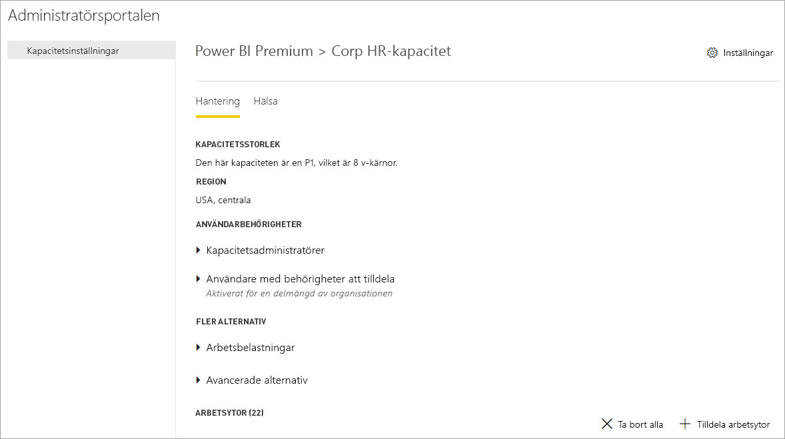
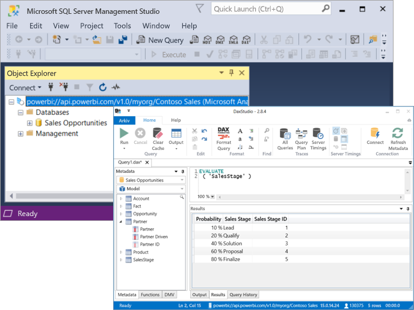

# Vad är Power BI Premium?

Power BI Premium innehåller dedikerade och förbättrade resurser för att köra Power BI-tjänsten för din organisation. Till exempel:

- Större skalning och prestanda
- Flexibiliteten att licens av kapacitet
- Skapa en enhetlig självbetjänings- och enterprise BI
- Utöka lokala BI med Power BI-rapportserver
- Stöd för dataplacering per region (Multi-Geo)
- Dela data med vem som helst utan köpa en licens per användare

Den här artikeln är inte avsedd att ge detaljerad information om alla funktioner i Power BI Premium – i själva verket, den når bara på ytan. Vid behov, finns länkar till ytterligare artiklar med mer detaljerad information.

## Prenumerationer och licensiering

Power BI Premium är en prenumeration på klientnivå för Office 365, tillgänglig för två SKU-serier (lagerhållningsenhet):

- **EM** SKU: er (EM1-EM3) för att bädda in, kräver ett årligt åtagande faktureras månadsvis.
- **P** SKU: er (P1-P3) för inbäddning och enterprise-funktioner som kräver ett åtagande per månad eller år, faktureras månadsvis och inkluderar en licens för att installera Power BI-rapportservern lokalt.

En annan metod är att köpa en **Azure Power BI Embedded** prenumeration, som har en enda **A** (A1-A6) SKU-familjen för inbäddning och kapacitetstestning av i utvärderingssyfte. Alla SKU: er ger virtuella kärnor för att skapa kapacitet, utan EM-SKU: er är begränsade för inbäddning av mindre skala. EM1, EM2, A1 och A2 SKU: er med färre än fyra kärnor körs inte på dedikerad infrastruktur.

Fokus i den här artikeln är för P-SKU: er, är mycket av vad som beskrivs också relevant för A-SKU: er. Till skillnad från SKU:er för Premium-prenumeration, kräver Azure SKU:er ingen tid för åtagande och de faktureras per timme. De levererar fullständig flexibilitet att aktivera uppskalning, nedskalning, pausa, återuppta och ta bort. 

Azure Power BI Embedded är i stort sett utanför omfånget för den här artikeln, men det beskrivs i den [testning metoder](service-premium-capacity-optimize.md#testing-approaches) i artikeln för optimera Premium-kapaciteter som ett praktiskt och ekonomiska alternativ för att testa och mäta arbetsbelastningar. Läs mer om Azure SKU: er i [Azure Power BI Embedded-dokumentation](https://azure.microsoft.com/services/power-bi-embedded/).

### Köpa

Power BI Premium-prenumerationer köps av administratörer i Microsoft 365 Administrationscenter. Mer specifikt kan köper endast globala Office 365 eller fakturering administratörer SKU: er. När du har köpt, klienten tar emot ett motsvarande antal v-kärnor för att tilldela kapaciteter som kallas *v-kärnor poolning*. Köp av en P3 SKU ger till exempel klienten 32 v-kärnor. Mer information finns i [så här köper du Power BI Premium](service-admin-premium-purchase.md).

## Dedikerad kapacitet

Med Power BI Premium, får du *dedikerade kapacitet*. Till skillnad från en delad kapacitet där arbetsbelastningar körs på dataresurser som delas med andra kunder, är en dedikerad kapacitet för exklusiv användning av en organisation. Det är isolerat med dedikerade resurser som ger en pålitlig och konsekvent prestanda för värdbaserade innehåll. 

Det finns arbetsytor i kapaciteter. Varje Power BI-användare har en personlig arbetsyta som kallas **Min arbetsyta**. Fler arbetsytor kan skapas för att möjliggöra samarbete och distribution och dessa kallas **Apparbetsytor**. Som standard skapas arbetsytor, inklusive personliga arbetsytor i delad kapacitet. När du har Premium-kapaciteter kan både Mina arbetsytor och App-arbetsytor tilldelas till Premium-kapaciteter.

### Kapacitet noder

Mer information finns i den [prenumerationer och licensiering](#subscriptions-and-licensing) avsnittet finns det två Power BI Premium SKU-serier: **EM** och **P**. Alla Power BI Premium SKU: er är tillgängliga som kapacitet *noder*, var och en representerar en viss mängd resurser som består av processor, minne och lagring. Varje SKU har gränser för antalet DirectQuery och Live-anslutning anslutningar per sekund utöver resurser, och antalet parallella modellen uppdateras.

Bearbetning uppnås med ett visst antal v-kärnor, jämnt fördelat mellan serverdelen och klientdelen.

**Serverdelens v-kärnor** ansvarar för huvudfunktioner för Power BI, inklusive frågebearbetning, hantering av cache, köra R-tjänster, modelluppdatering, bearbetning av naturligt språk (frågor och svar) och återgivning av rapporter och bilder från serversidan. Serverdelens virtuella kärnor har tilldelats en fast mängd minne som används främst till värd-modeller, även kallat aktiva datauppsättningar.

**Klientdelens virtuella kärnor** ansvarar för webbtjänsten, instrumentpanel och rapport dokumenthantering av, åtkomsten rights management och schemaläggning av API: er, överför och laddar ned och vanligen för allt som rör användaren inträffar.

Lagring är inställd på **100 TB per kapacitetsnod**.

Resurser och begränsningarna för varje Premium-SKU (och equivalently storlek A SKU) beskrivs i följande tabell:

| Kapacitetsnoder | Totalt antal virtuella kärnor | Virtuella kärnor för serverdel | RAM (GB) | Virtuella kärnor för klientdel | DirectQuery/Live-anslutning (per sekund) | Modellens uppdateringsparallellitet |
| --- | --- | --- | --- | --- | --- | --- |
| EM1/A1 | 1 | 0.5 | 2.5 | 0.5 | 3.75 | 1 |
| EM2/A2 | 2 | 1 | 5 | 1 | 7.5 | 2 |
| EM3/A3 | 4 | 2 | 10 | 2 | 15 | 3 |
| P1/A4 | 8 | 4 | 25 | 4 | 30 | 6 |
| P2/A5 | 16 | 8 | 50 | 8 | 60 | 12 |
| P3/A6 | 32 | 16 | 100 | 16 | 120 | 24 |
| | | | | | | |

### Kapacitet arbetsbelastningar

Kapacitetsarbetsbelastningar är tjänster som är tillgängliga för användarna. Stöd endast en datauppsättning arbetsbelastning som är förknippade med Power BI-frågor som standard, Premium och Azure-funktionerna. Arbetsbelastningen datauppsättningen kan inte inaktiveras. Ytterligare arbetsbelastningar kan aktiveras för [AI (Cognitive Services)](https://powerbi.microsoft.com/blog/easy-access-to-ai-in-power-bi-preview/), [dataflöden](service-dataflows-overview.md#dataflow-capabilities-on-power-bi-premium), och [sidnumrerade rapporter](paginated-reports-save-to-power-bi-service.md). Dessa arbetsbelastningar stöds i Premium-prenumerationer. 

Varje ytterligare arbetsbelastning tillåter konfigurering av maximalt minne (som en procentandel av den totala mängden tillgängligt minne) som kan användas av arbetsbelastningen. Standardvärden för maximalt minne bestäms av SKU: N. Du kan maximera tillgängliga resurser för din kapacitet genom att aktivera endast dessa ytterligare arbetsbelastningar när de används. Och du kan ändra minne inställningar bara när du har fastställt standardinställningarna inte uppfyller dina kapacitetskrav för resursen. Arbetsbelastningar kan vara aktiverad och konfigurerad för en kapacitet genom kapacitetsadministratörer med hjälp av **kapacitetsinställningarna** i den [administratörsportalen](service-admin-portal.md) eller genom att använda den [kapaciteter REST API: er](https://docs.microsoft.com/rest/api/power-bi/capacities).  

Mer information finns i [konfigurera arbetsbelastningar i en Premium-kapacitet](service-admin-premium-workloads.md). 

### Hur kapaciteter funktion

AT hela tiden i Power BI-tjänsten gör den bästa utnyttjande av kapacitet resurser samtidigt som inte överstiger begränsningar har införts på kapaciteten.

Kapacitet klassificeras som antingen *interaktiva* eller *bakgrund*. Interaktiva åtgärder omfattar renderingsbegäranden och svarar på användarinteraktioner (filtrering, frågor och svar frågor, o.s.v.). I allmänhet är importera modellen frågor minne resurskrävande, medan frågor modeller för DirectQuery och Live-anslutning är processorintensiva. Bakgrundsåtgärder omfattar uppdateringar av dataflöde och importmodeller, och frågecache för instrumentpanelen.

Det är viktigt att förstå att interaktiva åtgärder alltid är prioriterade över bakgrundsåtgärder att se till att den bästa möjliga användarupplevelsen. Om det inte finns tillräckligt med resurser, läggs bakgrundsåtgärder till i en kö för bearbetning när resurser frigörs. Bakgrundsåtgärder, t.ex. datauppsättningen uppdateras kan vara process som stoppades mitten av Power BI-tjänsten och läggs till en kö.

Importera modeller måste vara lästs in i minnet så att de kan efterfrågas eller uppdateras. Power BI-tjänsten hanterar minne användning med hjälp av avancerade algoritmer för att garantera maximal användning av det tillgängliga minnet och kan orsaka över transaktionen kapaciteten: Även om det är möjligt för en kapacitet att lagra många import-modeller (upp till 100 TB per Premium-kapacitet), när deras sammanlagda disklagring överskrider minnet som stöds (och ytterligare minne krävs för att fråga och uppdatering), sedan de får inte vara inlästa i minnet vid samtidigt.

Importera modeller är därför läses in i och tas bort från minnet enligt användning. En import-modellen läses in när den efterfrågade (Interaktiv åtgärd) och har ännu inte i minnet, eller när den är uppdateras (background åtgärden).

Borttagning av en modell från minnet kallas *databasavlägsning*. Det är en åtgärd som Power BI kan snabbt utföra beroende på storleken på modellerna. Om kapaciteten inte har någon minnesbelastning, läses modeller bara in i minnet och finns kvar där. Om det finns inte tillräckligt med minne att läsa in en modell måste dock Power BI-tjänsten först att frigöra minne. Det Frigör minne genom att identifiera modeller som har inaktiverats av söker modeller som inte har använts under de senaste tre minuterna \[ [1](#endnote-1)\], och ta bort dem. Om det inte finns några inaktiva modeller att ta bort, strävar Power BI-tjänsten efter att avlägsna modeller som lästs in för bakgrundsåtgärder. En sista utväg, efter 30 sekunder misslyckade försök \[ [1](#endnote-1)\], är inte interaktiv igen. I det här fallet meddelas rapportanvändaren om fel med ett förslag att försöka igen om en stund. I vissa fall kanske modeller från minnet på grund av åtgärder.

Det är viktigt att vara påfrestande för att avlägsning datauppsättning är ett normalt och förväntat beteende. Det strävar efter att maximera minnesanvändningen efter inläsning och inaktivera modeller vars kombinerade storlekar kan överstiga tillgängligt minne. Detta är avsiktligt, och helt transparent för rapportanvändarna. Höga avlägsningsfrekvenser innebär inte nödvändigtvis att kapaciteten är otillräckligt resurstilldelad. Detta kan dock bli ett problem om frågans eller uppdaterings svarstid har drabbats på grund av höga avlägsningsfrekvenser.

Uppdateringar av imortmodeller... är alltid minnesintensiva som modeller måste läsas in i minnet. Det krävs ytterligare minne för bearbetning. En fullständig uppdatering kan ungefär dubbla den mängd minne som krävs av modellen. Detta säkerställer att modellen kan efterfrågas även när de bearbetas, eftersom frågor skickas till den befintliga modellen förrän uppdateringen har slutförts och den nya modelldata är tillgängliga. Inkrementell uppdatering kräver mindre minne kan slutföra snabbare och så kan avsevärt minska trycket på kapacitet resurser. Uppdateringar kan även vara processorintensiva för modeller, särskilt de med komplexa Power Query-omvandlingar eller beräknade tabeller/kolumner som är komplexa eller baseras på stora tabeller.

Uppdateringar som frågor, kräver modellen läsas in i minnet. Om det inte finns tillräckligt med minne kommer Power BI-tjänsten att försöka ta bort inaktiva modeller, och om det inte är möjligt (alla modeller är aktiva) placeras uppdateringsjobbet i kö. Uppdateringar är vanligtvis processorintensiva, även viktigare än motsvarande frågor. Därför finns kapacitetsbegränsningar på antal samtidiga uppdateringar, inställt på 1,5 gånger antalet serverdelens v-kärnor, avrundat uppåt. Om det finns för många samtidiga uppdateringar, placeras en schemalagd uppdatering i kö. När sådana situationer inträffar, tar det längre tid för uppdateringen att färdigställas. På begäran som uppdaterar, till exempel de som utlöses av en användarbegäran eller ett API-anrop kommer att försöka igen tre gånger \[ [1](#endnote-1)\]. Om det fortfarande inte finns tillräckligt med resurser, misslyckas sedan uppdateringen.

Avsnittet kommentarer:   
\[1\] kan ändras.

### Regional support

När du skapar en ny kapacitet, Global Office 365-administratörer och Power BI-tjänstadministratörer kan ange en region där arbetsytor tilldelad kapacitet kommer att finnas. Detta kallas **hjälpdokumentation för flera geografiska**. Med Multi-Geo uppfylla organisationer kraven på datahemvist genom att distribuera innehåll till datacenter i en viss region, även om den skiljer sig från den region som Office 365-prenumeration finns. Mer information finns i [Multi-Geo-stöd för Power BI Premium](service-admin-premium-multi-geo.md).

### Kapacitetshantering

Hantera Premium-kapaciteter innebär att du skapar eller tar bort kapacitet, tilldela administratörer, tilldelar arbetsytor, konfigurera arbetsbelastningar, övervakning och anpassa optimering av kapacitet. 

Globala administratörer för Office 365 och Power BI-tjänstadministratörer kan skapa Premium-kapaciteter från tillgängliga v-kärnor eller ändra befintliga Premium-kapaciteter. När en kapacitet skapas kapacitetsstorlek och geografiska region har angetts och minst en kapacitetsadministratör tilldelas. 

När de kapaciteter som har skapats, de flesta administrativa uppgifter utförs i den [administrationsportalen](service-admin-portal.md).

Kapacitetsadministratörer kan tilldela kapaciteten arbetsytor, hantera användarbehörigheter och tilldela andra administratörer. Kapacitetsadministratörer kan också konfigurera arbetsbelastningar, justera minnesallokeringar, och om det behövs kan du starta om en kapacitet, återställer åtgärder vid en kapacitet överlagring.

Kapacitetsadministratörer kan också kontrollera att en kapacitet fungerar smidigt. De kan övervaka kapacitet hälsotillstånd höger i Admin portal eller med hjälp av Premium-kapacitet mått appen.

Läs mer om skapa kapacitet, tilldela administratörer och tilldelar arbetsytor i [hantera Premium-kapaciteter](service-premium-capacity-manage.md). Läs mer om administratörsroller i [administratörsroller som rör Power BI](service-admin-administering-power-bi-in-your-organization.md#administrator-roles-related-to-power-bi).

### Övervakning

Övervakning av Premium-kapaciteter ger administratörer genom att förstå hur de kapaciteter som utför. Kapaciteter kan övervakas med hjälp av administratörsportalen och [Power BI Premium-kapacitet app](https://app.powerbi.com/groups/me/getapps/services/capacitymetrics).

Övervaka i portalen ger en snabb överblick på hög nivå mått som anger belastning som placeras och resurser som används av din kapacitet ett genomsnitt över de senaste sju dagarna. 

Den **Power BI Premium-kapacitet** app ger den mest detaljerad informationen om hur dina kapaciteter fungerar. Appen ger en övergripande instrumentpanel och mer detaljerade rapporter.

Du kan klicka på en metrisk cell om du vill öppna en detaljerad rapport från appens instrumentpanel. Rapporter ger djupgående mått och filtrering möjlighet att gå nedåt i den viktigaste informationen du behöver för att hålla din kapaciteter som ska fungera smidigt.

Mer information om hur du övervakar kapaciteter finns [övervakning i Power BI-administratörsportalen](service-admin-premium-monitor-portal.md) och [övervakning med appen Power BI Premium-kapacitet](service-admin-premium-monitor-capacity.md).

### Optimera kapaciteter

Gör din kapacitet på bästa sätt är viktigt att avveckla användarna hämtar prestanda och du får ut maximalt för din Premium-investering. Genom att övervaka viktiga mått kan kan administratörer bestämma hur du bäst felsöka flaskhalsar och vidta nödvändiga åtgärder. Mer information finns i [optimera Premium-kapaciteter](service-premium-capacity-optimize.md) och [Premium-kapacitet scenarier](service-premium-capacity-scenarios.md).

### Kapaciteter REST API: er

Power BI REST-API: er innehåller en samling med [kapaciteter API: er](https://docs.microsoft.com/rest/api/power-bi/capacities). Med API: er, kan administratörer programmässigt hantera många aspekter av din Premium-kapacitet, inklusive aktivering och inaktivering av arbetsbelastningar, tilldela arbetsytor till en kapacitet och mycket mer.

## Stora datauppsättningar

Beroende på vilken SKU Power BI Premium stöder överför Power BI Desktop (.pbix) modellfiler upp till högst **10 GB** i storlek. När du har lästs in, kan modellen sedan publiceras till en arbetsyta som tilldelas en Premium-kapacitet. Du kan sedan uppdatera datauppsättningen till upp till **12 GB** i storlek.

### Storlek-överväganden

Stora modeller kan vara resurskrävande. Du bör ha minst en P1 SKU för alla modeller som är större än 1 GB. Även om publicering av stora modeller till arbetsytor backas upp av en SKU: er upp till A3 kunde arbete, uppdatera dem kommer inte.

I följande tabell beskrivs rekommenderade SKU:er för olika storlekar på PBIX:

   |SKU  |Storlek på PBIX   |
   |---------|---------|
   |P1    | < 3 GB        |
   |P2    | < 6 GB        |
   |P3, P4, P5    | upp till 10 GB   |

Power BI Embedded-SKU:n A4 motsvarar SKU:n P1, A5 = P2 och A6 = P3. Observera att om du publicerar stora modeller till A- och EM-SKU:er kan det returnera fel som inte är specifika för storleksfel för modellen i den delade kapaciteten. Uppdateringsfel för stora modeller i A- och EM-SKU:er pekar troligen till tidsgränser. 

Pbix-filerna representerar data i en *mycket komprimerat tillstånd*. Data kommer sannolikt att expandera flera gånger när de läses in i minnet och därifrån kan de expandera flera gånger under datauppdatering.

Schemalagd uppdatering av stora datauppsättningar kan ta lång tid och vara resurskrävande. Det är viktigt att inte schemalägga för många överlappande uppdateringar. Vi rekommenderar [inkrementell uppdatering](service-premium-incremental-refresh.md) konfigureras, eftersom den är snabbare, mer tillförlitliga och förbrukar färre resurser.

Inledande rapportbelastning för stora datauppsättningar kan ta lång tid om det var ett tag sedan datauppsättningen senast användes. En inläsning för längre inläsningsrapporter visar belastningsförloppet.

Per fråga minne och tidsbegränsningar är mycket högre i Premium-kapacitet, bör du använda filter och utsnitt för att begränsa visuell information för att visa bara vad som krävs.

## Inkrementell uppdatering

Inkrementell uppdatering innehåller en del av att ha och underhåll av stora datauppsättningar i Power BI Premium. Inkrementell uppdatering har många fördelar, till exempel uppdateringar är snabbare eftersom endast data som har ändrade måste uppdateras. Uppdateringar är mer tillförlitliga eftersom det inte är nödvändigt att upprätthålla tidskrävande anslutningar till föränderliga datakällor. Resursförbrukning minskar eftersom mindre data att uppdatera minskar övergripande användning av minne och andra resurser. Inkrementella uppdateringsprinciper definieras i **Power BI Desktop**, och tillämpas när publiceras till en arbetsyta i en Premium-kapacitet. 

Mer information finns i [inkrementell uppdatering i Power BI Premium](service-premium-incremental-refresh.md).

## Sidnumrerade rapporter

Sidnumrerade rapporter stöds på P1-P3 och A4_A6 SKU: er, baseras på språk RDL (Report Definition)-teknik i SQL Server Reporting Services. Medan baserat på RDL-teknik, är det inte samma som Power BI-rapportservern, vilket är ett nedladdningsbart rapporteringsplattform som du kan installera lokalt, ingår också i Power BI Premium. Sidnumrerade rapporter har formaterats för att de passar bra för en sida som kan skrivas ut eller delas. Data visas i en tabell, även om tabellen sträcker sig över flera sidor. Med hjälp av den kostnadsfria [ **Power BI Report Builder** ](https://go.microsoft.com/fwlink/?linkid=2086513) Windows Desktop program, användare författare sidnumrerade rapporter och publicera dem till tjänsten.

I Power BI Premium är Paginated rapporter en arbetsbelastning som måste aktiveras för en kapacitet genom att använda administrationsportalen. Kapacitetsadministratörer kan aktivera och ange hur mycket minne som en procentandel av den kapacitet övergripande minnesresurser. Till skillnad från andra typer av arbetsbelastningar körs Premium sidnumrerade rapporter i en innesluten blanksteg inom kapaciteten. Maximalt minne som angetts för det här utrymmet används om arbetsbelastningen är aktiv eller inte. Standardvärdet är 20%. 

Mer information finns i [sidnumrerade rapporter i Power BI Premium](paginated-reports-report-builder-power-bi.md). Mer information om hur du aktiverar arbetsbelastningen Paginated rapporter finns [konfigurera arbetsbelastningar](service-admin-premium-workloads.md).

## Power BI-rapportserver
 
Ingår i med Power BI Premium, Power BI-rapportservern är en *lokala* rapportservern med en webbportal. Du kan skapa dina BI miljö på plats och distribuera rapporter bakom en brandvägg. Report Server ger användarna åtkomst till omfattande, interaktiva, och rapportfunktionerna i SQL Server Reporting Services. Användare kan utforska visuella data och snabbt identifiera mönster kan fatta bättre och snabbare beslut. Report Server ger styrning på dina egna villkor. Om och när, gör du enkelt att migrera till molnet, där din organisation kan dra full nytta av alla Power BI Premium-funktioner med hjälp av Power BI Report Server.

Mer information finns i [Power BI Report Server](report-server/get-started.md).

## Obegränsade innehållsdelning

Med Premium, kan vem som helst, oavsett om de är i eller utanför din organisation visa dina Power BI-innehåll, inklusive sidnumrerade och interaktiva rapporter utan att köpa enskilda licenser. 

Premium möjliggör frekvent distribution av innehåll av Pro-användare utan att kräva Pro-licenser för mottagare som visar innehållet. Pro-licenser krävs för skapare av innehåll. Skapare av Anslut till datakällor, modelldata, och skapa rapporter och instrumentpaneler som är packade som arbetsytan appar. 

Mer information finns i [Power BI-licensiering](service-admin-licensing-organization.md).

## Verktyget anslutning (förhandsgranskning)

Under huven företaget beprövad Microsoft **Analysis Services Vertipaq-motorn** Driver Power BI-datauppsättningar. Analysis Services innehåller programmering och klientprogram och verktyget stöder via klientbibliotek och API: er som har stöd för öppen standard XMLA-protokollet. Datauppsättningar för Power BI Premium stöder för närvarande *skrivskyddad* åtgärder från Microsoft och tredje parts program och verktyg via **XMLA-slutpunkter**. 

Microsoft-verktyg som SQL Server Management Studio och SQL Server Profiler och appar från tredje part, till exempel DAX-Studio och program för visualisering av data, kan ansluta till och fråga datauppsättningar med hjälp av XMLA, DAX, MDX, DMV: er och spårningshändelser. 

Mer information finns i [Anslut till datauppsättningar med program och verktyg](service-premium-connect-tools.md).

## Bekräftelser

Peter Myers, Data Platform MVP och oberoende BI-expert med [bitvis lösningar](https://www.bitwisesolutions.com.au/), och den Microsoft Power BI Customer Advisory Team (CAT) är frekventa deltagare till den här artikeln.

## Nästa steg

> [!div class="nextstepaction"]
> [Hantera Premium-kapaciteter](service-premium-capacity-manage.md)

Har du fler frågor? [Fråga Power BI Community](https://community.powerbi.com/)

||||||
