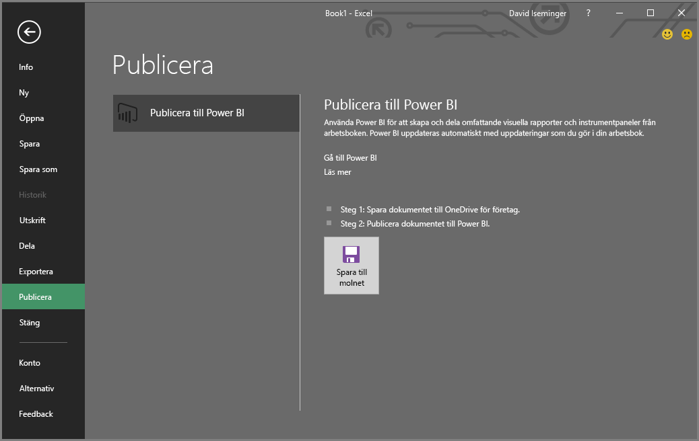
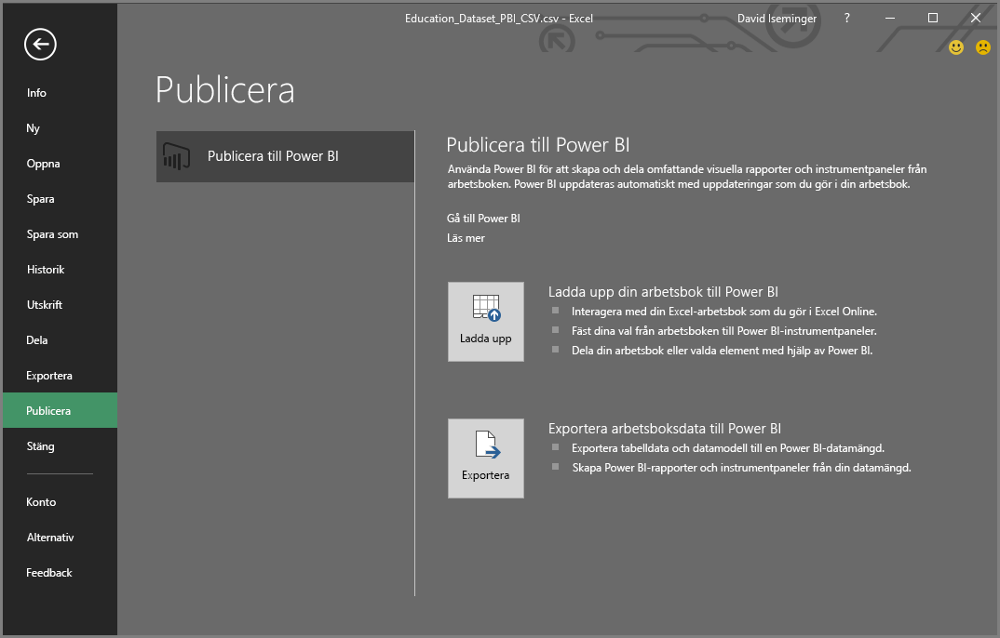

# Publicera till Power BI från Excel 2016
Med Excel 2016 kan du publicera dina Excel-arbetsböcker direkt till din [Power BI](https://powerbi.microsoft.com)-webbplats, där du kan skapa interaktiva rapporter och instrumentpaneler baserat på data i arbetsboken. Du kan sedan dela dina insikter med andra i din organisation.

Innan vi går vidare finns det några saker att tänka på:

* Innan du kan publicera till Power BI måste arbetsboken sparas till OneDrive för företag.
* Du måste använda samma konto för att logga in på Office, OneDrive för företag och Power BI.
* Du kan inte publicera en tom arbetsbok eller en arbetsbok som saknar innehåll som stöds av Power BI.
* Du kan inte publicera krypterade eller lösenordsskyddade arbetsböcker eller arbetsböcker med Information Protection-hantering.
* Publicering till Power BI kräver att modern autentisering är aktiverad (standard). Alternativet Publicera är inte tillgängligt i menyn Arkiv om den är inaktiverad.

## Publicera din Excel-arbetsbok
I Excel väljer du **Arkiv** > **Publicera**.

### Lokal filpublicering
Från och med februari 2017-uppdateringen har Excel 2016 stöd för publicering av lokala Excel-filer. De behöver inte sparas till OneDrive för företag eller SharePoint Online.

> [!IMPORTANT]
> Det är bara Excel 2016 med en Office 365-prenumeration som kommer att kunna publicera med lokala filer. I den fristående installationen av Excel 2016 går det med ”Publicera” endast att spara Excel-arbetsboken till OneDrive för företag eller SharePoint Online.
> 
> 

När du väljer **Publicera** kan du välja vilken arbetsyta du vill publicera till. Det kan vara din personliga arbetsyta eller en grupparbetsyta som du har åtkomst till.

du får två alternativ för hur du vill hämta din arbetsbok till Power BI.

När den har publicerats sparas den som en kopia i Power BI, separat från den lokala filen. Om du vill uppdatera filen i Power BI måste du publicera den uppdaterade versionen igen. Du kan uppdatera datan och ställa in en schemalagd uppdatering av arbetsboken eller datauppsättningen i Power BI.

### Publicera från fristående Excel
Om din arbetsbok inte redan har sparats till OneDrive måste du spara den där först. Klicka på Spara till molnet och välj en plats i OneDrive för företag.

När din arbetsbok har sparats till OneDrive kommer du att få två alternativ för hur du vill hämta din arbetsbok till Power BI när du väljer **Publicera**.

#### Ladda upp din arbetsbok till Power BI
När du väljer det här alternativet visas arbetsboken i Power BI på samma sätt som den skulle ha gjort i Excel Online. Men till skillnad från i Excel Online har du några bra funktioner som hjälper dig fästa element från kalkylbladen till instrumentpanelerna.

Du kan inte redigera din arbetsbok när den är öppen i Power BI, utan om du behöver göra några ändringar kan du välja **Redigera** och sedan välja att redigera din arbetsbok i Excel Online eller öppna den i Excel på datorn. Alla ändringar du gör sparas i arbetsboken på OneDrive.

När du överför skapas inte någon datauppsättning i Power BI. Din arbetsbok visas i Rapporter i navigeringsfönstret för arbetsytan. Arbetsböcker som har överförts till Power BI har en särskild Excel-ikon som visar att de är överförda Excel-arbetsböcker.

Välj det här alternativet om du enbart har data i kalkylbladen eller om du har pivottabeller och diagram som du vill se i Power BI.
Att använda överföring från Publicera till Power BI i Excel är ganska likt att använda Hämta data > Fil > OneDrive för företag > Anslut, hantera och visa Excel i Power BI från Power BI i din webbläsare.

#### Exportera arbetsboksdata till Power BI
När du väljer det här alternativet exporteras alla data som stöds i tabeller och/eller en datamodell till en ny datauppsättning i Power BI. Om du har några Power View-blad kommer de att skapas igen i Power BI som rapporter.

Du kan fortsätta att redigera din arbetsbok. När ändringarna sparas kommer de att synkroniseras med datauppsättningen i Power BI, vanligtvis inom en timme. Om du behöver använda dem snabbare kan du välja Publicera igen för att exportera dina ändringar direkt. Alla visualiseringar som finns i rapporter och instrumentpaneler uppdateras också.

Välj det här alternativet om du har använt Hämta och transformera data eller Power Pivot för att läsa in data i en datamodell, eller om arbetsboken har Power View-blad med visualiseringar som du vill se i Power BI.

Att använda Exportera från Publicera till Power BI i Excel är ganska likt att använda Hämta data > Fil > OneDrive för företag > Exportera Excel-data till Power BI från Power BI i din webbläsare.

## Publicera
När du väljer något av alternativen kommer Excel logga in på Power BI med ditt aktuella konto och sedan publicera din arbetsbok till Power BI-webbplatsen. Håll ett öga på statusfältet i Excel. Där ser du hur det går.

När du är klar kan du gå till Power BI direkt från Excel.

## Nästa steg
[Excel-data i Power BI](service-excel-workbook-files.md)  
Har du fler frågor? [Prova Power BI Community](http://community.powerbi.com/)

