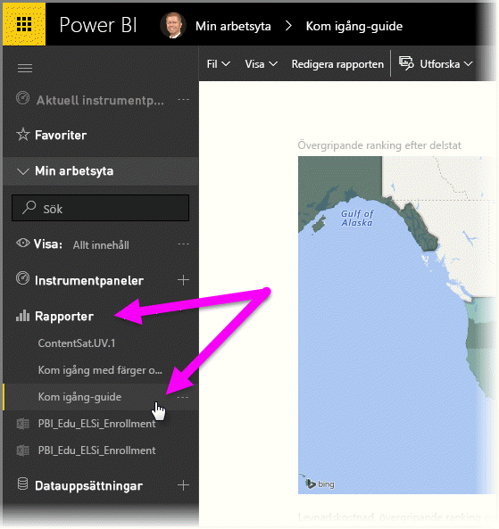
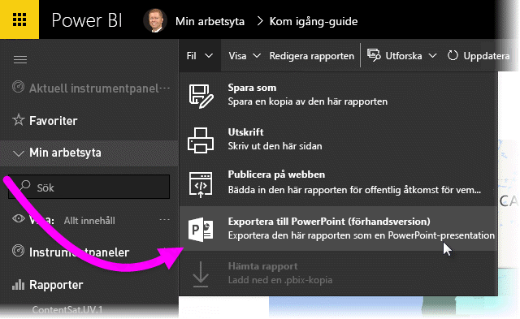
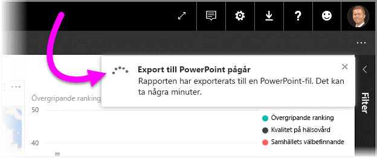
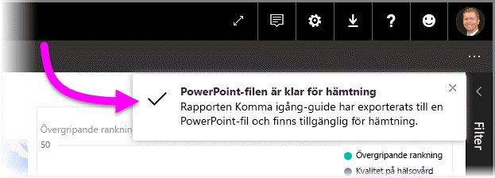
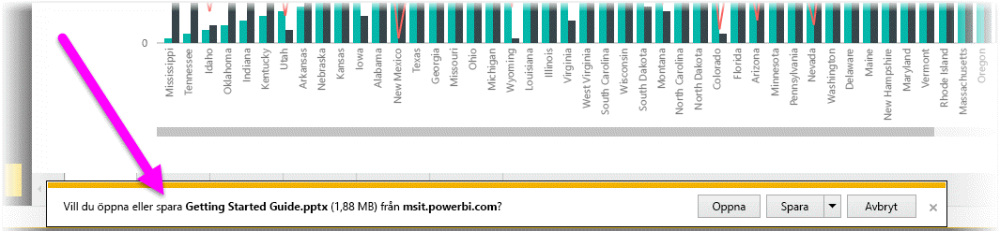
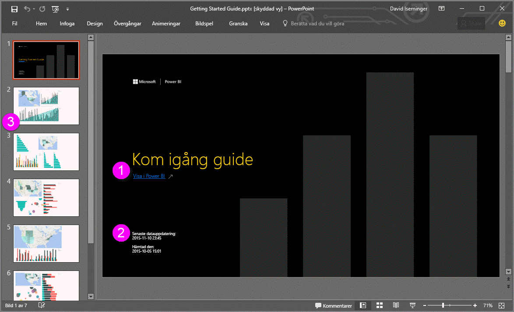

# Exportera rapporter från Power BI till PowerPoint (förhandsgranskning)
Med Power BI, kan du nu publicera din rapport till **Microsoft PowerPoint** och enkelt att skapa ett bildspel baserat på din Power BI-rapport. När du **exporterar till PowerPoint**, inträffar följande:

* Varje sida i Power BI-rapporten blir en enskild bild i PowerPoint
* Varje sida i Power BI-rapporten exporteras som en högupplöst bild i PowerPoint
* Textrutor i Power BI-rapporten blir redigerbara textrutor i PowerPoint
* En länk skapas i PowerPoint som länkar till Power BI-rapporten

Att få din **Power BI-rapport** exporterad till **PowerPoint** är enkelt. Följ bara stegen som beskrivs i nästa avsnitt.

## Så här exporterar du en Power BI-rapport till PowerPoint
I Power BI-tjänsten, väljer du avsnittet **rapporter** i det vänstra navigeringsfönstret för att expandera avsnittet och väljer sedan din rapport för att visa den på arbetsytan. Du kan också välja en rapport från ditt **min arbetsyta**-avsnitt eller dina **favoriter** om rapporten är på någon av de platserna.

När den rapport du vill exportera till PowerPoint visas på arbetsytan, väljer du **fil > exportera till PowerPoint (förhandsgranskning)** från menyraden i Power BI-tjänsten, som det visas i följande bild.

Du ser en meddelandebanderoll i det övre högra hörnet i Power BI-tjänstens webbläsarfönster att rapporten exporteras till PowerPoint. Det kan ta några minuter och du kan fortsätta att arbeta i Power BI medan rapporten exporteras.

När det är klart, ändras meddelandebanderollen så att du vet att Power BI-tjänsten har slutfört exportåtgärden.

Filen är sedan tillgänglig där din webbläsare visar hämtade filer. I följande bild, visas den som en nedladdningsbanderoll längst ned i webbläsarfönstret.

Det är allt. Du kan ladda ned filen, öppna den med PowerPoint och ändra eller förbättra den på samma sätt som andra PowerPoint-presentationer.

## Checka ut din exporterade PowerPoint-fil
När du öppnar PowerPoint-filen som Power BI exporterade, hittar du en del häftiga och användbara element. Ta en titt på följande bild och kolla sedan de numrerade elementen nedan som beskriver några av de smarta funktionerna.

1. Den första sidan i presentationen innehåller namnet på rapporten och en länk så att du kan **visa i Power BI** den rapport som presentationen bygger på.
2. Du får även lite användbar information om rapporten, inklusive den *senaste datauppdateringen* som den exporterade rapporten baseras, på och *nedladdad den* med tid och datum, vilket är när Power BI-rapporten exporterades till en PowerPoint-fil.
3. Varje rapportsida är en separat bild som det visas i det vänstra navigeringsfönstret.
4. Din publicerade rapport återges på det språk som dina Power BI-inställningar anger, eller i annat fall på det språk som anges i webbläsarens språkinställningar. Om du vill se eller ange din språkinställning, klicka på kugghjulsikonen  **> Inställningar > Allmänt > Språk**. Mer information finns i [Språk och länder/regioner som stöds för Power BI](supported-languages-countries-regions.md).
5. PowerPoint-presentationen innehåller en omslagsbild för skydd med den exporterade tiden i korrekt tidszon.

När du går in på en specifik bild, ser du att varje rapportsida är en oberoende bild.

>[!NOTE]
> Att ha en bild för varje rapportsida är ett nytt beteende. Det tidigare beteendet som gav en oberoende bild för varje visuellt objekt implementeras inte längre. 
 

Det är nu upp till dig vad du vill göra med PowerPoint-presentationen eller någon av de högupplösta bilderna!

## Begränsningar
Det finns några överväganden och begränsningar som du bör tänka på när du arbetar med funktionen **exportera till PowerPoint**.

* **R-visualiseringar** stöds inte för tillfället. Alla sådana visualiseringar exporteras som en tom bild till PowerPoint med ett felmeddelande som säger att visualiseringen inte stöds.
* **Anpassade visuella objekt** som har **certifierats** stöds. Mer information om certifierade anpassade visuella objekt, inklusive hur anpassade visuella objekt certifieras, finns i [certifiera anpassade visuella objekt](power-bi-custom-visuals-certified.md). Anpassade visuella objekt som inte har certifierats stöds inte och exporteras som en tom bild till PowerPoint med ett felmeddelande som säger att visualiseringen inte stöds.
* **Certifierade anpassade visuella objekt** stöds. Certifierade anpassade visuella objekt har godkänts för användning med Power BI, uppfyller vissa kodkrav och har klarat strikta säkerhetstester. Du kan [läsa mer om **certifierade anpassade visuella objekt**](power-bi-custom-visuals-certified.md).
* Rapporter med mer än 15 rapportsidor kan för närvarande inte exporteras.
* Att exportera rapporten till PowerPoint kan ta några minuter att slutföra, så ha tålamod. Faktorer som kan påverka den tid som krävs är rapportens struktur och den aktuella belastningen på Power BI-tjänsten.
* Om menyobjektet **exportera till PowerPoint (förhandsgranskning)** inte finns i Power BI-tjänsten, beror det förmodligen på att din klientadministratör har inaktiverat funktionen. Kontakta din klientadministratör för mer information.
* Bakgrundsbilder beskärs med diagrammets markeringsområdet. Vi rekommenderar att du tar bort bakgrundsbilder innan du exporterar till PowerPoint.
* **Interaktivitet för sessionen** till exempel syntaxmarkering och filtrering nedåt och så vidare, stöds inte ännu vid export till PowerPoint. Den exporterade PowerPointen visar de ursprungliga visuella objekten som har sparats i rapporten.
* Sidor i PowerPoint skapas alltid i 9:16 standardstorlek, oavsett ursprungliga sidstorlekar eller dimensioner i Power BI-rapporten.
* Rapporter som ägs av en användare utanför din Power BI-klientdomänen (som en rapport som ägs av någon utanför organisationen och delas med dig) kan inte publiceras till PowerPoint.
* Om du delar en instrumentpanel med någon utanför organisationen (och därmed, en användare som inte är i din Power BI-klient), kommer den användaren inte att kunna exportera delade instrumentpanelers associerade rapporter till PowerPoint. Så om du är aaron@contoso.com kan du dela med david@cohowinery.com. Men david@cohowinery.com kan inte exportera de associerade rapporterna till PowerPoint.
* Som tidigare nämnts, exporteras varje rapportsida som en enskild bild i PowerPoint-filen.
* Power BI-tjänsten använder det språk du har i din Power BI-språkinställning som språk för PowerPoint-exporten. Om du vill se eller ange din språkinställning, klicka på kugghjulsikonen  **> Inställningar > Allmänt > Språk**.
* Klockslaget **Hämtad vid** på omslagsbilden för den exporterade PowerPoint-filen har angetts till datorns tidszon vid tidpunkten för exporten.

## Nästa steg
[Analysera i Excel](service-analyze-in-excel.md)

[Excel-data i Power BI](service-excel-workbook-files.md)

[Få anpassade visuella objekt certifierade](power-bi-custom-visuals-certified.md)

