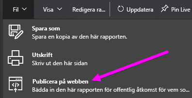
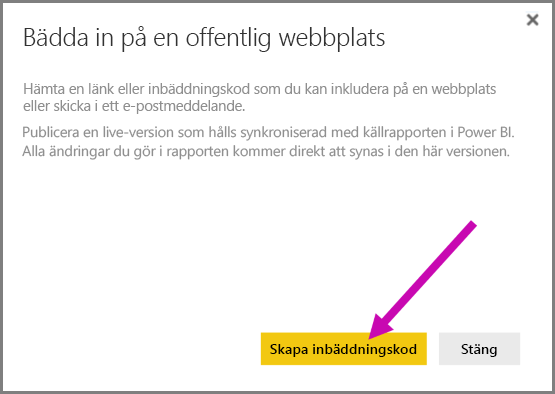
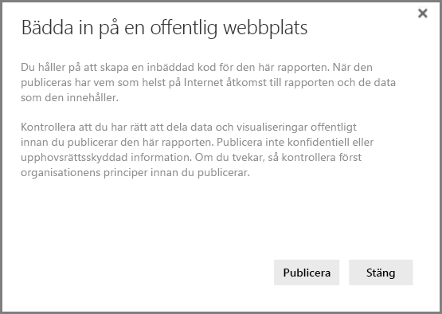
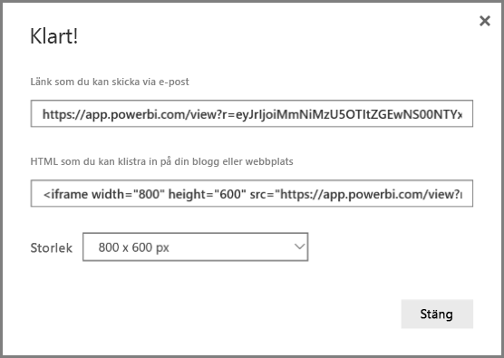
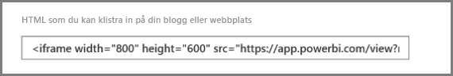
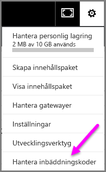
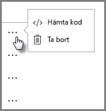
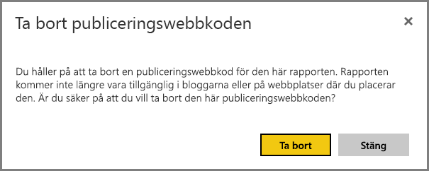

# Publicera på webben från Power BI

Med Power BI **Publicera på webben** kan du enkelt bädda in interaktiva Power BI-visualiseringar online, t.ex. blogginlägg, webbplatser, via e-post eller sociala medier på alla enheter.

Du kan också enkelt redigera, uppdatera eller sluta dela publicerade visuella objekt.

> [!WARNING]
> När du använder **Publicera på webben**, så kan den rapport eller det visuella objekt som du publicerar ses av alla på Internet. Det finns ingen autentisering som används när du visar rapporterna. Använd bara Publicera på webben med rapporter och data som alla på Internet (ej autentiserade vanliga användare) ska kunna se. Detta inkluderar data på detaljnivå som sammanställs i dina rapporter. Kontrollera att du har rätt att dela data och visualiseringar offentligt innan du publicerar den här rapporten. Publicera inte konfidentiell eller upphovsrättsskyddad information. Om du tvekar, så kontrollera först organisationens principer innan du publicerar.

## Så här använder du Publicera på webben

**Publicera på webben** är tillgängligt för rapporter på dina personliga arbetsytor och grupparbetsytor som du kan redigera.  Du kan inte använda Publicera på webben med rapporter som har delats med dig eller rapporter som förlitar sig på att skydda data med säkerhet på radnivå. I avsnittet **Begränsningar** nedan finns en fullständig lista över fall där Publicera på webben inte stöds. Läs avsnittet **Varning** tidigare i den här artikeln innan du använder Publicera på webben.

Du kan se hur den här funktionen fungerar i följande *korta video*. Prova själv genom att följa stegen nedan.

<iframe width="560" height="315" src="https://www.youtube.com/embed/UF9QtqE7s4Y" frameborder="0" allowfullscreen></iframe>

Följande steg beskriver hur du använder **Publicera på webben**.

1. Välj **Arkiv > Publicera på webben** för en rapport på din arbetsyta som du kan redigera.
   
   

2. Granska innehållet i dialogrutan och välj **Skapa inbäddad kod** så som visas i följande dialogruta.
   
   

3. Läs varningen som visas i följande dialogruta, och bekräfta att det är OK om dessa data bäddas in på en offentlig webbplats. Välj **Publicera** om så är fallet.
   
   

4. En dialogruta visas med en länk som kan skickas via e-post, bäddas in i kod (t.ex. en iFrame), eller som du kan klistra in direkt på din webbsida eller blogg.
   
   

5. Om du tidigare har skapat en inbäddningskod för rapporten visas inbäddningskoden snabbt. Du kan bara skapa en inbäddningskod för varje rapport.
   
   

## Tips och tricks för visningslägen

När du bäddar in innehållet i ett blogginlägg måste du normalt få det att rymmas inom en viss storlek på skärmen.  Du kan också justera höjden och bredden i taggen iFrame efter behov, men du kan också behöva kontrollera om rapporten passar inom det angivna området för iFrame. Så du måste även ange ett lämpligt visningsläge när du redigerar rapporten.

Följande tabell innehåller råd om visningsläget och hur det ser ut när det är inbäddat. 

| Visningsläge | Hur det ser ut när det är inbäddat |
| --- | --- |
|  |**Anpassa till sida** tar hänsyn till sidans höjd och bredd i rapporten. Om du ställer in sidan på ”Dynamisk” så skalas förhållanden som 16:9 eller 4:3 så att innehållet passar i den iFrame som du angett. Vid inbäddnng i en iFrame så kan användning av **Anpassa till sida** resultera i **utfyllnad**, där en grå bakgrund visas i områden i iFrame efter det att innehållet har skalats för att rymmas i iFrame. Om du vill minimera utfyllnaden, så anpassa höjd- och breddinställningarna i iFrame. |
|  |**Faktisk storlek** säkerställer att rapporten bevarar den storlek som angetts på sidan. Detta kan resultera i rullningslister i din iFrame. Ange höjd och bredd för iFrame så att du kan undvika rullningslister. |
|  |**Anpassa till bredd** garanterar att innehållet passar in vågrätt i din iFrame. En kantlinje visas fortfarande, men innehållet skalas så att allt tillgängligt vågrätt utrymme används. |

## Tips och tricks för höjd och bredd i iFrame

Den inbäddade koden du får när du publicerar på webben ser ut ungefär så här:

Du kan redigera bredd och höjd manuellt för att se till att det blir exakt så som du vill att det ska se ut på sidan vid inbäddning.

Du kan försöka justera höjddimensionen för iFrame genom att lägga till 56 bildpunkter och därmed få en mer perfekt passning. Detta anpassar den aktuella storleken för det nedre fältet. Om din rapportsida använder dynamisk storlek, så kan du i tabellen nedan se några storlekar som du kan använda för att uppnå en anpassning utan utfyllnad.

| Proportion | Storlek | Dimension (bredd och höjd) |
| --- | --- | --- |
| 16:9 |Liten |640 x 416 px |
| 16:9 |Medium |800 x 506 px |
| 16:9 |Stor |960 x 596 px |
| 4:3 |Liten |640 x 536 px |
| 4:3 |Medium |800 x 656 px |
| 4:3 |Stor |960 x 776 px |

## Hantera inbäddningskoder

När du skapar en inbäddningskod för **Publicera på webben**, så kan du hantera de koder som du skapar på menyn **Inställningar** i Power BI-tjänsten. Hantering av inbäddningskoder omfattar möjligheten att ta bort det visuella målet eller rapporten för en kod (vilket gör inbäddningskoden oanvändbar), eller hämta inbäddningskoden igen.

1. Om du vill hantera dina inbäddningskoder för **Publicera på webben** öppnar du **Inställningar** och väljer **Hantera inbäddningskoder**.
   
   

2. Lista över inbäddningskoder som du har skapat visas så som på följande bild.
   
   

3. För varje inbäddningskod i listan för **Publicera på webben** kan du antingen hämta inbäddningskoden eller ta bort den, och därmed göra så att alla eventuella länkar till rapporten eller det visuella objektet inte längre fungerar.
   
   

4. Om du väljer **Ta bort**, så tillfrågas du om du är säker på att du vill ta bort inbäddningskoden.
   
   

## Uppdateringar av rapporter och datauppdatering

När du har skapat inbäddningskoden för **Publicera på webben** och delat den, så uppdateras rapporten med de eventuella ändringar du gör. Det är viktigt att vara medveten om att det kan ta ett tag för uppdateringen att bli synlig för användarna. För uppdateringar av en rapport eller ett visuellt objekt tar ungefär en timme innan de återspeglas i inbäddningskoderna för Publicera på webben.

När du först använder **Publicera på webben** för att få en inbäddningskod så blir inbäddningskodslänken omedelbart aktiv och kan ses av alla som öppnar länken.  Efter den första Publicera på webben-åtgärden, kan de efterföljande uppdateringarna av rapporter och visuella objekt till vilka en Publicera på webben-länk pekar ta ungefär en timma på sig för att bli synliga för användarna.

Mer information finns i **Så här fungerar det** längre fram i den här artikeln. Om du vill att dina uppdateringar ska vara omedelbart tillgängliga, så kan du ta bort inbäddningskoden och skapa en ny.

## Datauppdatering

Datauppdateringarna återspeglas automatiskt i din inbäddade rapport eller visuella objekt. Det kan ta ungefär en timma för datauppdateringarna att bli synliga från inbäddningskoder. Du kan inaktivera automatisk uppdatering genom att välja **Uppdatera inte** på schemat för den datauppsättning som används av rapporten.  

## Anpassade visuella objekt

Anpassade visuella objekt stöds i **Publicera på webben**. När du använder Publicera på webben, behöver inte användare med vilka du delar ditt publicerade visuella objekt aktivera anpassade visuella objekt för att kunna visa rapporten.

## Begränsningar

**Publicera på webben** stöds för merparten av alla datakällor och rapporter i Power BI-tjänsten. Men följande stöds dock **inte för närvarande eller är inte tillgängligt** med Publicera på webben:

- Rapporter som använder säkerhet på radnivå.
- Rapporter som använder en datakälla för Live-anslutning, som Analysis Services Tabular på lokala flerdimensionella Analysis Services och Azure Analysis Services.
- Rapporter om delas med dig direkt eller via ett organisationsinnehållspaket.
- Rapporter i en grupp som du inte är redigeringsmedlem i.
- Visuella R-objekt stöds för närvarande inte i Publicera på webben-rapporter.
- Exportera data från visualiseringar i en rapport som har publicerats på webben
- ArcGIS Maps för Power BI-visualiseringar
- Rapporter som innehåller DAX-mått på rapportnivå
- Datafrågemodeller för enkel inloggning
- [Säkra konfidentiell eller upphovsrättsskyddad information](#publish-to-web-from-power-bi)

## Klientinställning

Power BI-administratörer kan aktivera eller inaktivera publicering till webbfunktionen. De kan också begränsa åtkomst till specifika grupper. Din möjlighet att skapa en inbäddningskod ändras baserat på den här inställningen.

|Visning av aktuellt objekt |Aktiverad för hela organisationen |Inaktiverad för hela organisationen |Specifika säkerhetsgrupper   |
|---------|---------|---------|---------|
|**Publicera på webben** under rapportens **Fil**meny.|Aktiverad för alla|Inte synlig för alla|Endast synlig för behöriga användare eller grupper.|
|**Hantera inbäddade koder** under **Inställningar**|Aktiverad för alla|Aktiverad för alla|Aktiverad för alla  Alternativet * **Ta bort** endast för behöriga användare eller grupper. * **Hämta koder** aktiverat för alla.|
|**Inbäddade koder** i administrationsportalen|Statusen visas något av följande: * Aktiv * Stöds ej * Blockerad|Statusen visar **Inaktiverad**|Statusen visas något av följande: * Aktiv * Stöds ej * Blockerad  Om en användare inte har behörighet baserad på klientinställningen, visas statusen som **intrång**.|
|Befintliga publicerade rapporter|Alla aktiverade|Alla inaktiverade|Rapporter fortsätta att visas för alla.|

## Förstå statuskolumnen för inbäddningskod

När du visar sidan **Hantera inbäddningskoder** för din **Publicera på webben**-inbäddningskod, så tillhandahålls en statuskolumn. Inbäddningskoder är aktiva som standard, men du kan stöta på alla av de tillstånd som anges nedan.

| Status | Beskrivning |
| --- | --- |
| **Aktiv** |Rapporten är tillgänglig för Internet-användare kan visa och interagera med den. |
| **Blockerad** |Innehållet i rapporten strider mot [användningsvillkoren för Power BI](https://powerbi.microsoft.com/terms-of-service). Det har blockerats av Microsoft. Kontakta supporten om du tror att innehållet har blockerats av misstag. |
| **Stöds ej** |Rapportens datauppsättning använder säkerhet på radnivå eller en annan konfiguration som inte stöds. En fullständig lista finns i avsnittet **Begränsningar**. |
| **Intrång** |Den inbäddade koden ligger utanför den definierade klientprincipen. Detta inträffar vanligtvis när en inbäddningskod har skapats och sedan har publiceringen till webbklientinställningen ändrats för att exkludera användaren som äger den inbäddade koden. Om klientinställningen är inaktiverad eller om användaren inte längre kan skapa inbäddade koder, kommer befintliga inbäddade koder att visa statusen **Intrång**. |

## Hur man rapporterar problem med innehåll för Publicera på webben

Om du vill rapportera ett problem som rör **Publicera på webben** och innehåll som har bäddats in på en webbplats eller i en blogg, så använd **flaggikonen** i det nedre fältet som visas på följande bild. Du ombeds att skicka ett e-postmeddelande till Microsoft som förklarar ditt intresse. Microsoft utvärderar innehållet baserat på Power BI-användarvillkoren och vidtar lämpliga åtgärder.

Om du vill rapportera ett problem, så välj **flaggikonen** i det nedre fältet i den Publicera på webben-rapport som du ser.

## Licensiering och prissättning

Du måste vara en Microsoft Power BI-användare för att kunna använda **Publicera på webben**. Rapportens konsumenter (läsarna, visningsprogrammen) behöver inte vara Power BI-användare.

## Så här fungerar det (teknisk information)

När du skapar en inbäddningskod med rapporten **Publicera på webben** syns rapporten för användare på Internet. Den är offentligt tillgänglig, så du kan förvänta dig att användarna enkelt kan dela rapporten via sociala medier i framtiden. När användarna visar rapporten, antingen genom att öppna den offentliga URL:en direkt, eller visa den inbäddad på en webbsida eller i en blogg, så cachelagrar Power BI rapportdefinitionen och resultaten för de frågor som krävs för att visa rapporten. Den här metoden garanterar att rapporten kan visas med tusentals samtidiga användare utan att det påverkar prestandan negativt.

Cacheminnet är långlivat, så om du uppdaterar rapportdefinitionen (om du t.ex. ändrar läget för dess visningsläge) eller uppdaterar rapportdata, så kan det dröja ungefär en timma innan ändringarna avspeglas i den rapportversion som visas för användarna. Därför rekommenderar vi att du mellanlagrar ditt arbete i förväg och skapa inbäddningskoden för **Publicera på webben** enbart när du är nöjd med inställningarna.

Har du fler frågor? [Prova Power BI Community](http://community.powerbi.com/)
