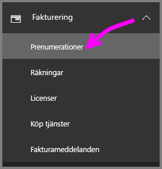
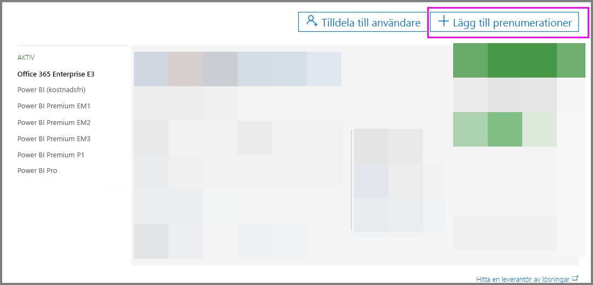
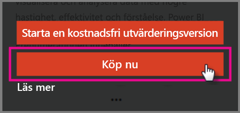

# Köp Power BI Pro

Med Power BI Pro kan du publicera rapporter, dela instrumentpaneler, samarbeta med kollegor på arbetsytor och engagera dig i andra relaterade aktiviteter. Mer information om hur din organisation kan utnyttja Power BI Pro finns i [Power BI Pro i din organisation](service-power-bi-pro-in-your-organization.md).

## Köpa Power BI Pro via Administrationscenter för Office 365

Office IT-administratörer kan köpa Power BI Pro som en del av en Office 365 Enterprise E5-prenumeration eller som en separat Power BI Pro-prenumeration. De kan sedan tilldela Power BI Pro-licenser till lämpliga användare. Mer information om hur du tilldelar licenser finns i [Tilldela licenser till användare i Office 365](https://support.office.com/en-us/article/assign-licenses-to-users-in-office-365-for-business-997596b5-4173-4627-b915-36abac6786dc?ui=en-US&rs=en-US&ad=US).

Följ dessa steg för att köpa Power BI Pro om du är Office IT-administratör:

1. Gå till [administrationscentret för Office 365](https://portal.office.com/adminportal/home#/homepage).
2. Välj Fakturering i det vänstra navigeringsfönstret och klicka sedan på Prenumerationer.

    

3. Klicka på Lägg till prenumerationer i det övre högra hörnet på sidan Prenumerationer.

    

4. Leta reda på önskat prenumerationserbjudande:

    Välj Office 365 Enterprise E5 under Enterprise Suite

    

    Välj Power BI Pro under Andra alternativ

    

5. För pekaren över de tre punkterna (...) för den önskade prenumerationen och välj Köp nu.

    

6. Välj om du vill betala per månad eller för ett helt år.
7. Under "Hur många användare vill du ha?" anger du önskat antal licenser. Klicka sedan på Checka ut nu eller Lägg i kundvagn och slutför transaktionen.
8. Kontrollera att den köpta prenumerationen nu visas på sidan Prenumerationer.

   

> [!NOTE]
> Du kan lägga till fler licenser efter det första köpet. Välj Power BI Pro-prenumerationen på sidan Prenumerationer och klicka sedan på Lägg till/ta bort licenser.
>

## Prissättning

Den senaste prisinformationen hittar du i [Power BI-priser](https://powerbi.microsoft.com/en-us/pricing/).

## Nästa steg
[Självregistrering för Power BI](service-admin-signing-up-for-power-bi-with-a-new-office-365-trial.md)
 
[Power BI (kostnadsfri) i din organisation](service-admin-service-free-in-your-organization.md)
 
[Power BI Pro i din organisation](service-power-bi-pro-in-your-organization.md)
 
[Aktivering av utökad Pro-utvärderingsversion](service-extended-pro-trial.md)
 
[Tilldela Power BI Pro-licenser](service-assigning-power-bi-pro-licenses.md)
 
[Power BI Premium – vad är det?](service-admin-premium-manage.md)
 
[Så här köper du Power BI Premium](service-admin-premium-purchase.md)
 
[Power BI Premium – white paper](https://aka.ms/pbipremiumwhitepaper)

Har du fler frågor? [Fråga Power BI Community](https://community.powerbi.com/)