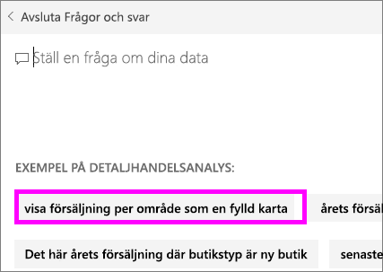
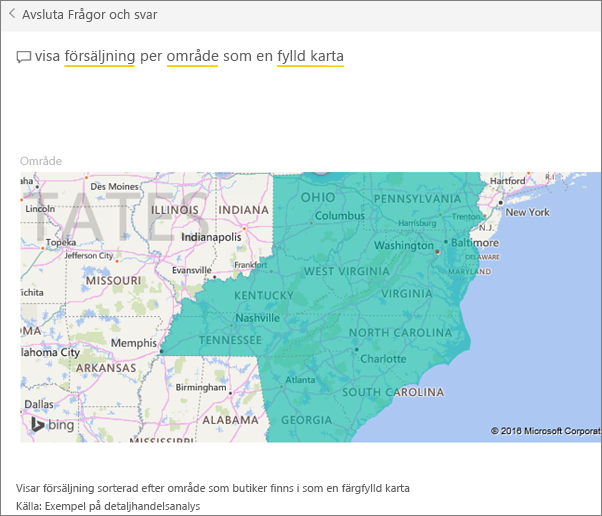

# Skapa aktuella frågor för Frågor och svar i Power BI
Om du äger en datauppsättning, kan du lägga till egna aktuella frågor till den datauppsättningen.  Frågor och svar för Power BI kommer att visa dessa frågor till kollegor som använder (*konsumerar*) din datauppsättning.  Aktuella frågor ger dina kollegor idéer om vilka typer av frågor de kan ställa till datauppsättningen. Det är helt upp till dig vilka aktuella frågor du lägger till – lägg till populära frågor, frågor som ger intressanta resultat eller frågor som kan vara svåra att uttrycka rätt.

Se när Will lägger till några aktuella frågor till frågor och svar i Power BI och därefter använder sig av de aktuella frågorna för att utforska sin datauppsättning. Prova sedan själv genom att följa de stegvisa anvisningarna under videon.

<iframe width="560" height="315" src="https://www.youtube.com/embed/E1mIAyEXuF4" frameborder="0" allowfullscreen></iframe>

> [!NOTE]
> Aktuella frågor för Frågor och svar finns tillgängliga i [Microsoft Power BI-appen för iOS på iPad-, iPhone- och iPod Touch-enheter](consumer/mobile/mobile-apps-ios-qna.md) och i förhandsgranskningen för Frågor och svar för Power BI Desktop. Men att skapa frågor går bara i Power BI-tjänsten (app.powerbi.com).
> 

Den här artikeln använder sig av [exemplet detaljhandelsanalys](sample-datasets.md).

1. Välj frågerutan för Frågor och svar på instrumentpanelen.   Observera att frågor och svar redan gjort sig användbart genom att visa en lista över termer som finns i datauppsättningen.
2. Om du vill lägga till i den här listan, väljer du kugghjulsikonen i det övre högra hörnet av Power BI.  
   
3. Välj **inställningar**&gt;**datauppsättningar** &gt; **exemplet detaljhandelsanalys** &gt; **aktuella frågor**.  
4. Välj **lägg till en fråga**.
   
   
5. Skriv in din fråga i textrutan och välj **tillämpa**.   Du kan också lägga till en annan fråga genom att välja **lägg till en fråga**.  
   
6. Gå tillbaka till Power BI-instrumentpanelen för exemplet detaljhandelsanalys och placera markören i frågor och svar-rutan.   
   
7. Den nya aktuella frågan **försäljning per område som en karta**, är den första i listan. Välj den.  
8. Svaret visas som en fylld kartvisualisering.  
   

### Nästa steg
[Frågor och svar i Power BI](consumer/end-user-q-and-a.md)  
[Självstudier: Introduktion till Power BI frågor och svar](power-bi-visualization-introduction-to-q-and-a.md)  
[Power BI – grundläggande begrepp](consumer/end-user-basic-concepts.md)  
Har du fler frågor? [Prova Power BI Community](http://community.powerbi.com/)

