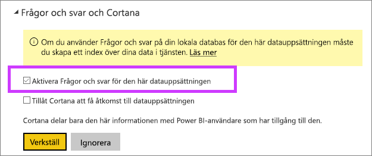

# Aktivera frågor och svar för live-anslutningar
## Vad är den lokala datagatewayen?  Vad är en live-anslutning?
Datauppsättningar i Power BI kan importeras till Power BI eller så kan du skapa en live-anslutning till dem. Datauppsättningar med live-anslutning kallas ofta lokala. Live-anslutningarna hanteras med en [gateway](service-gateway-onprem.md). Data och frågor skickas fram och tillbaka med hjälp av live-frågor.

## Frågor och svar för datauppsättningar för den lokala datagatewayen
Om du vill använda frågor och svar med datauppsättningar som du kommer åt via en gateway, måste du först aktivera dem.

När du har aktiverat dem, skapar Power BI ett index av din datakälla och överför en delmängd av dessa data till Power BI för att aktivera att ställa frågor. Det kan ta flera minuter att skapa det initiala indexet och Power BI bibehåller och uppdaterar indexet automatiskt allteftersom dina data ändras. Använd frågor och svar med de här datauppsättningarna fungerar på samma sätt som med data som publicerats till Power BI. Den fullständiga uppsättningen funktioner som finns i frågor och svar-upplevelsen stöds i bägge fall, inklusive att använda datakällan med Cortana.

När du ställer frågor i Power BI så fastställer frågor och svar den bästa visualiseringen att skapa eller rapportarket att använda för att svara på din fråga med ett index av din datauppsättning. Efter att ha fastställt det bästa potentiella svaret, använder frågor och svar sig av DirectQuery för att hämta live-data från datakällan via gatewayen för att fylla i diagram. Det här säkerställer att resultat från Power BI frågor och svar alltid visar de mest uppdaterade data från den underliggande datakällan.

Eftersom Power BI frågor och svar använder sig av text- och schemavärden från din datakälla för att fastställa hur den ska fråga den underliggande modellen, förlitar sig sökningar för specifika nya eller borttagna textvärden (som att fråga efter ett kundnamn relaterat till en nytillagd textpost) på att indexet är uppdaterat med de senaste värdena. Power BI håller automatiskt text- och schemaindexet uppdaterat inom ett 60 minuter från att ändringar görs.

Mer information finns i:

* Vad är den [lokala datagatewayen](service-gateway-onprem.md)?
* [Introduktion till Power BI frågor och svar](power-bi-q-and-a.md)

## Aktivera frågor och svar
När du har ställt in datagatewayen, kan du ansluta till dina data från Power BI.  Skapa antingen en instrumentpanel med hjälp av dina lokala data eller ladda upp en .pbix-fil som använder lokala data.  Du kan också redan har lokala data i instrumentpaneler, rapporter och datauppsättningar som har delats med dig.

1. I det övre högra hörnet i Power BI väljer du kugghjulsikonen  och **Inställningar**.
   
   
2. Välj **datauppsättningar** och välj datauppsättningen att aktivera för frågor och svar.
   
   
3. Expandera **frågor och svar och Cortana**, markerar kryssrutan för **aktivera frågor och svar för den här datauppsättningen** och välj **tillämpa**.
   
    

## Vilka data cachelagras och hur skyddas sekretessen?
När du aktiverar frågor och svar för dina lokala data, cachelagras en delmängd av dina data i tjänsten. Det här görs för att säkerställa att frågor och svar fungerar med en rimlig prestanda. Power BI utesluter värden som är längre än 24 tecken från cachelagring. Cachen tas bort inom några timmar när du inaktiverar frågor och svar genom att avmarkera **aktivera frågor och svar för den här datauppsättningen**, eller när du tar bort din datauppsättning.

## Överväganden och felsökning
Det finns flera begränsningar under förhandsvisningsfasen av den här funktionen:

* Inledningsvis finns funktionen endast tillgänglig för SQL Server 2016 Analysis Services Tabular-datakällor. Funktionen är optimerad för att arbeta med tabelldata. Vissa funktioner är tillgänglig för flerdimensionella datakällor, men den fullständiga frågor och svar-upplevelsen stöds inte ännu för flera dimensioner. Ytterligare datakällor som stöds av den lokala datagatewayen kommer att lanseras löpande.
* Fullständigt stöd för säkerhet på radnivå som definierats i SQL Server Analysis Services är inte tillgängligt från början i den allmänna förhandsvisningen. När du ställer frågor i frågor och svar, kan automatisk komplettering av frågor medan du skriver visa strängvärden som en användare inte har åtkomst till. RLS som definierats i modellen respekteras dock för visuella objekt i rapporten och diagrammet så inga underliggande numeriska data kan visas. Alternativ för att styra det här beteenden kommer att släppas i kommande uppdateringar.
* Live-anslutningar stöds bara med den lokala datagatewayen. Därmed kan de inte användas med din den personliga gatewayen.

## Nästa steg
[Lokal datagateway](service-gateway-onprem.md)  
[Hantera din datakälla – Analysis Services](service-gateway-enterprise-manage-ssas.md)  
[Power BI – grundläggande begrepp](service-basic-concepts.md)  
[Översikt över Power BI frågor och svar](power-bi-q-and-a.md)  

Har du fler frågor? [Fråga Power BI Community](http://community.powerbi.com/)

