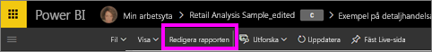
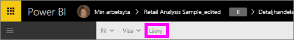

# Läsvyn och redigeringsvyn i Power BI-tjänsterapporter
I Power BI-tjänsten (inte i Power BI Desktop) finns det två lägen för att visa och interagera med rapporter: läsvyn och redigeringsvyn.  

Läsvyn är tillgänglig för alla användare medan redigeringsvyn bara är tillgänglig för rapportskapare och -ägare. Läsvyn är utformad för rapportens *konsumenter*, de kollegor som öppnar rapporter från appar eller som har rapporter som delats med dem. Läsvyn garanterar att varje enskild konsument av en specifik rapport ser samma rapport, samma visualiseringar med samma filter.  Konsumenterna kan interagera med rapporterna men inte spara ändringarna.

>**Obs**: Under vissa omständigheter kan rapportkonsumenterna se olika data beroende på radnivåsäkerhet och databehörighet. 

Redigeringsvyn är endast tillgänglig för den person som skapade rapporten eller som samäger rapporten som medlem eller administratör i en apparbetsyta.

## Läsläge

Läsvyn är ett roligt och säkert sätt att experimentera med och bekanta sig med aktuella data. Läsläge är inte interaktiv som [redigeringsvyn](service-interact-with-a-report-in-editing-view.md), men det finns fortfarande många alternativ för att utforska dina data. Detta är praktiskt när du exempelvis visar rapporter som [delats med dig](service-share-dashboards.md) och som endast kan öppnas i läsvyn.

Mer information finns i [Läsvy för Power BI-rapporter](service-interact-with-a-report-in-reading-view.md).

## Redigeringsvy
I redigeringsvyn i Power BI (jämfört med [läsvyn](service-interact-with-a-report-in-reading-view.md)) kan du granska dina data djupare genom att lägga till och ta bort fält, ändra typen av visualisering, skapa nya visualiseringar och lägga till och ta bort visualiseringar och sidor i rapporten.

Mer information finns i [Redigeringsvy för Power BI-rapporter](service-interact-with-a-report-in-editing-view.md).

## Navigera mellan redigeringsvyn och läsvyn
Kom ihåg att endast rapportskapare och -ägare kan öppna en rapport i redigeringsvyn.

1. Som standard öppnas rapporten vanligtvis läsvyn. Du vet att du är i läsvyn om ser du alternativet **Redigera rapporten**. Om **Redigera rapporten** är gråmarkerat har du inte behörighet att öppna rapporten i redigeringsvyn.

   

2. Om **Redigera rapporten** inte är gråmarkerat, väljer du alternativet för att öppna rapporten i redigeringsvyn. 
   
   
   
   Rapporten är nu i redigeringsvyn och använder samma [visningsinställningar](power-bi-report-display-settings.md) som du senast använde i läsvyn.

2. För att återgå till läsvyn, väljer du **Läsvy** från det övre navigeringsfältet.
   
    

Det finns många sätt att interagera med en rapport i läsvyn, finfördela dina data för att upptäcka insikter och få svar på frågor.  Nästa avsnitt, [Interagera med rapporter i läsvyn](service-interact-with-a-report-in-editing-view.md), tar upp och beskriver dessa i detalj.

### Nästa steg
[Interagera med en rapport i läsvyn](service-interact-with-a-report-in-editing-view.md)    
Tillbaka till [Rapporter i Power BI](service-reports.md)    
Har du fler frågor? [Prova Power BI Community](http://community.powerbi.com/) 

