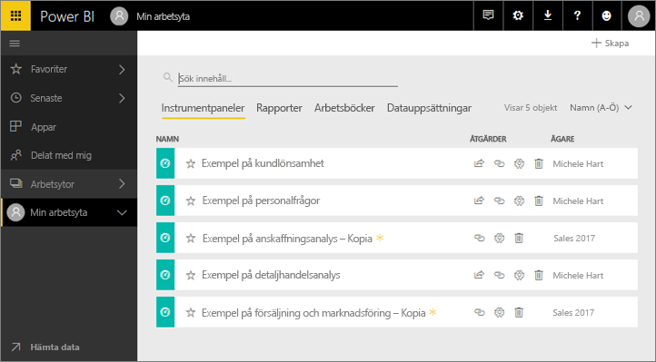
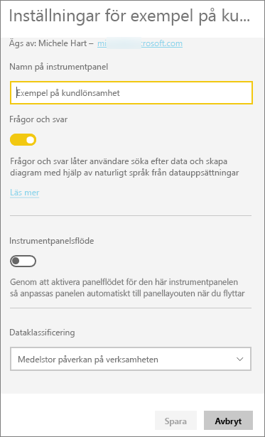
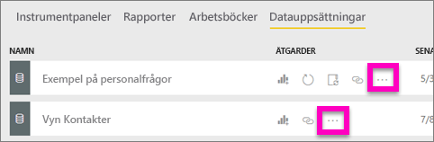
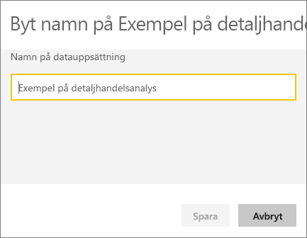
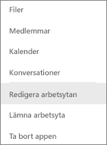
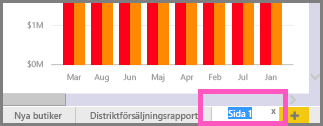
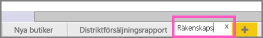

# Byt namn på nästan allt i Power BI-tjänsten
Den här artikeln lär dig hur du byter namn på en instrumentpanel, rapport, rapportsida, arbetsbok, datauppsättning, app och arbetsyta i Power BI-tjänsten.

**Kan jag ändra namnet?**

| Innehållstyp | Jag är författaren eller skaparen | Delat med mig |
| --- | --- | --- |
| Instrumentpanel i en arbetsyta |Ja |Nej |
| Rapport i en arbetsyta |Ja |Nej |
| Arbetsbok i en arbetsyta |Ja |Nej |
| Datauppsättning i en arbetsyta |Ja |Nej |
| arbetsyta |Ja, om du är ägare eller har administratörsbehörigheter |Nej |
| Publicerade appar |Inte från appskärmen, men appnamnet kan ändras från arbetsytan och publiceras igen med ett nytt namn om du har administratörsbehörigheter |Nej |
| Appinnehåll (instrumentpanel, rapport, arbetsbok, datauppsättning) |Inte från appskärmen, men appens innehåll kan döpas om från arbetsytan och publiceras igen med ett nytt namn om du har administratörsbehörigheter |Nej |
| Innehåll i **delat med mig** |Nej |Nej |

## Byt namn på en instrumentpanel, rapport eller arbetsbok
1. Starta i en arbetsyta och välj fliken **instrumentpaneler**, **rapporter** eller **arbetsböcker**. Hovra över objektet du vill byta namn på och välj . Om kugghjulsikonen saknas är du inte behörig att byta namn.
   
   
2. I inställningssidan skriver du det nya namnet och väljer **spara**.
   
   

## Byt namn på en datauppsättning
1. Starta i en arbetsyta och välj fliken **datauppsättningar**.
   
   
2. Hovra över objektet du vill byta namn på, välj **Fler alternativ** (...) och sedan **Byt namn**.  
   
      
   
   > [!NOTE]
   > Alternativen i listrutan varierar.
   > 
   > 
3. På inställningssidan, skriver du ett nytt namn och väljer **spara**.
   
     

## Byta namn på en arbetsyta
Alla med administratörsbehörigheter kan byta namn på en arbetsyta.

1. Starta i den arbetsyta som du vill byta namn på.
2. Välj **Fler alternativ** (...) uppe till höger och sedan **Redigera arbetsyta**. Om du inte ser det här alternativet saknar du behörighet för att byta namn på den här arbetsytan. 
   
    
3. Ange ett nytt arbetsytenamn och välj **spara**.
   
   

## Byt namn på en sida i en rapport
Gillar du inte namnet på en sida i din Power BI-rapport?  Ett nytt namn är bara ett klick bort. Du kan byta namn på sidor i [rapportens redigeringsvy ](service-interact-with-a-report-in-editing-view.md).

1. Öppna rapporten i [redigeringsvy](consumer/end-user-reading-view.md).
2. Leta reda på rapportsideflikarna längst ned i Power BI-fönstret.
   
    
3. Öppna den rapportsida som du vill byta namn på genom att välja fliken.
4. Dubbelklicka på namnet på fliken för att markera det.  
   
    
5. Skriv in ett nytt namn för rapportsidan och tryck retur.
   
    

## Överväganden och felsökning
* Om objektet som du vill byta namn på har delats med dig, eller är del av ett innehållspaket, visas inte kugghjulsikonen och du har inte tillgång till inställningarna.
* Om du inte ser **Fler alternativ** (...) på fliken **Datamängder** expanderar du webbläsarfönstret.

Har du fler frågor? [Prova Power BI Community](https://community.powerbi.com/)

