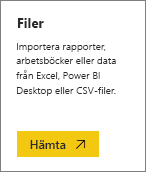
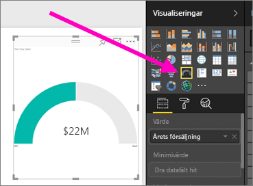
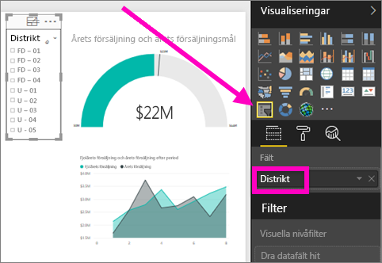

# Skapa en ny rapport i Power BI-tjänsten genom att importera en datauppsättning
Du har läst [Rapporter i Power BI](service-reports.md) och nu vill du skapa en egen. Det finns många olika sätt att skapa en rapport och i den här artikeln börjar vi med att skapa en grundläggande rapport från en Excel-datauppsättning med Power BI-tjänsten. När du förstår grunderna för att skapa en rapport leder **Nästa steg** längst ned till mer avancerade avsnitt om rapporter.  

> **TIPS**: för att skapa en rapport genom att kopiera en befintlig rapport, se [Kopiera en rapport](power-bi-report-copy.md)
> 
### Förutsättningar
- Power BI-tjänsten (information om att skapa rapporter med hjälp av Power BI Desktop finns i [Desktop-rapportvy](desktop-report-view.md))  
- Exempel på detaljhandelsanalys

## Importera datauppsättningen
Den här metoden för att skapa en rapport som börjar med en datauppsättning och en tom rapportarbetsyta. För att följa med in instruktionerna kan du [hämta exempeldatauppsättningen Försäljningsanalys för Excel](http://go.microsoft.com/fwlink/?LinkId=529778) och spara den till OneDrive för företag (rekommenderas) eller lokalt.

1. Vi kommer att skapa rapporten i en arbetsyta för Power BI-tjänsten, så välj en befintlig arbetsyta eller skapa en ny.
   
   
2. Välj **Hämta data** längst ned i det vänstra navigeringsfönstret.
   
   
3. Välj **Arkiv**  och navigera till den plats där du sparade exemplet Säljanalys.
   
    
4. För den här övningen väljer vi **Importera**.
   
   
5. När du har importerat datauppsättningen väljer du **Visa datauppsättning**.
   
   
6. När du visar en datauppsättning öppnas rapportredigeraren.  Du ser en tom arbetsyta och rapportredigeringsverktygen.
   
   

> **TIPS**: Om du inte är bekant med rapportarbetsytan eller behöver en påminnelse kan du besöka [Ta en titt på rapportredigeraren ](service-the-report-editor-take-a-tour.md) innan du fortsätter.
> 
> 

## Lägg till en radiell mätare i rapporten
Nu när vi har importerat vår datauppsättning kan vi börja svara på frågor.  Vår marknadschef (CMO) vill veta hur nära vi kommer att vara till att uppfylla det här årets försäljningsmål. En mätare är ett [bra visualiseringsval](power-bi-report-visualizations.md) för att visa den här typen av information.

1. Välj **Sales (Försäljning)**  >  **This Year Sales (Årets försäljning)** > **Value (Värde)** i fönstret Fält.
   
    
2. Omvandla det visuella objektet till en mätare genom att välja mätarmallen  från fönstret **Visualiseringar**.
   
    
3. Dra **försäljning** > **Årets försäljning** > **Mål** till brunnen **Målvärde**. Vi verkar vara mycket nära vårt mål.
   
    
4. Nu är dags att [spara din rapport](service-report-save.md).
   
   

## Lägg till ett ytdiagram och utsnitt i rapporten
Vår marknadschef har några ytterligare frågor för oss att besvara. Hon vill veta hur försäljningen år jämfört med förra året. Dessutom vill hon se resultaten per distrikt.

1. Först ska vi skapa lite utrymme på arbetsytan. Välj mätaren och flytta den till det övre högra hörnet. Tryck och dra ett av hörnet så att den blir mindre.
2. Avmarkera mätaren. Gå till rutan Fält och välj **Försäljning** > **Försäljning detta år** > **värdet** och välj **Försäljning**  >  **Försäljning förra året**.
   
    
3. Omvandla det visuella objektet till ett ytdiagram genom att välja ytdiagrammallen  från fönstret **Visualiseringar**.
4. Välj **Tid** > **Period** till brunnen **Axel**.
   
    
5. Om du vill sortera visualiseringen enligt tidsperiod, väljer du ellipserna och därefter **Sortera efter period**.
6. Nu ska vi lägga till utsnittet. Markera ett tomt område på arbetsytan och välj mallen Utsnitt     . Detta lägger till ett tomt utsnitt på vår arbetsyta.
   
        
7. Välj **Distrikt** > **Distrikt** på fönstret Fält. Flytta och ändra storlek på utsticket.
   
      
8. Använd utsnittet för att leta efter mönster och insikter enligt distrikt.
   
     

Fortsätt att utforska dina data och lägga till visualiseringar. När du har hittat särskilt intressanta insikter [fäst dem på en instrumentpanel](service-dashboard-pin-tile-from-report.md).

## Nästa steg
* [Lägg till en ny sida i rapporten](power-bi-report-add-page.md)  
* Lär dig hur du [fäster visualiseringar på en instrumentpanel](service-dashboard-pin-tile-from-report.md)   
* Har du fler frågor? [Prova Power BI Community](http://community.powerbi.com/)

