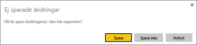
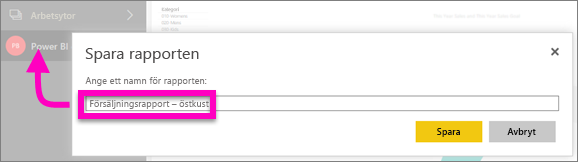

# Spara en rapport i Power BI-tjänsten och Power BI Desktop
När du gör ändringar i en rapport i Power BI kan du spara den, spara med ett nytt namn eller stänga den utan att spara ändringarna. Anta att du öppnar rapporten, skapar en visualisering och fäster den på din instrumentpanel. Om du stänger den nu utan att spara dina ändringar förblir panelen på din instrumentpanel men visualiseringen sparas inte i rapporten. När du klickar på den panelen på instrumentpanelen öppnas rapporten men visualiseringen har försvunnit.

> [!TIP]
> Titta närmare på vilka arbetsyta som är aktiv så att du kan hitta den sparade rapporten. Rapporten har sparats till den aktiva arbetsytan.
> 
> 

### Så här gör du för att spara en rapport:
1. Om du försöker att navigera bort från en rapport och rapporten innehåller ändringar visas en fråga från Power BI.
   
   
2. Ett annat sätt att spara rapporten är att välja **Arkiv** \> **Spara** eller **Spara som**. Om du är i [Läsvy](consumer/end-user-reading-view.md) visas bara alternativet att spara som. 
   
   
3. Om detta är en ny rapport (Spara) eller en ny version av en befintlig rapport (Spara som) kan du ge den ett beskrivande namn.  **Rapporten läggs till i den aktiva arbetsytan**.
   
    

### Nästa steg
Läs mer om [rapporter i Power BI](consumer/end-user-reports.md)

[Power BI – grundläggande begrepp](consumer/end-user-basic-concepts.md)

Har du fler frågor? [Prova Power BI Community](http://community.powerbi.com/)

