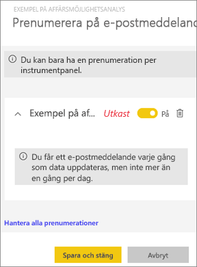
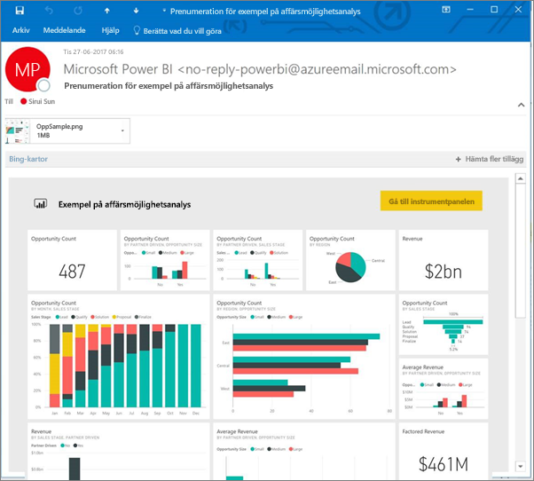
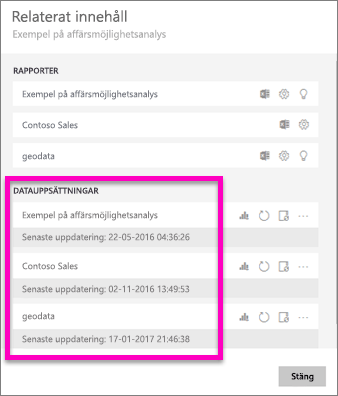
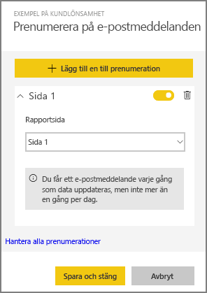
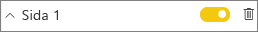
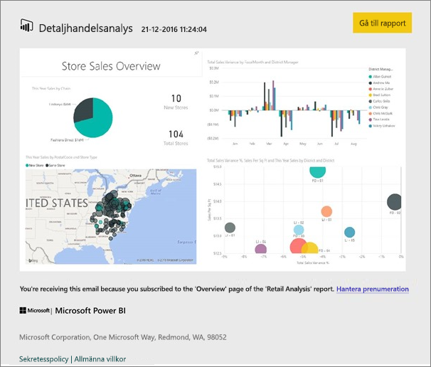
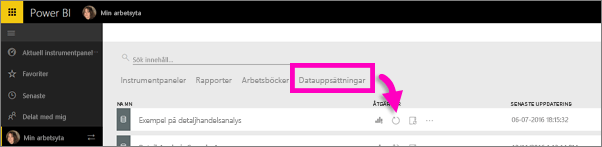

# Prenumerera på en Power BI-rapport eller instrumentpanel
Det har aldrig varit enklare att hålla sig uppdaterad när det gäller viktiga instrumentpaneler och rapporter. Prenumerera på de rapportsidor och instrumentpaneler som är viktigast för dig och Power BI skickar dig ett e-postmeddelande med en ögonblicksbild till din inkorg. Ange hur ofta du vill att Power BI ska skicka dig sådana e-postmeddelanden: från en gång om dagen till en gång i veckan

> [!NOTE]
> Du kan bara skapa prenumerationer i Power BI-tjänsten. När du tar emot e-postmeddelandet så innehåller det en länk med rubriken ”Gå till rapporten/instrumentpanelen”. Om du väljer den här länken på mobila enheter med installerade Power BI-appar, så startas appen (istället för standardåtgärden att rapporten eller instrumentpanelen på webbplatsen Power BI öppnas).
> 
> 

Se hur Sirui konfigurerar en e-postprenumeration för en rapport. Prova sedan själv genom att följa de stegvisa anvisningarna under videon.

<iframe width="560" height="315" src="https://www.youtube.com/embed/saQx7G0pxhc" frameborder="0" allowfullscreen></iframe>

## Krav
Att **skapa** prenumerationer är en Power BI Pro-funktion, och du måste ha visnings- eller redigeringsbehörigheter till innehållet (instrumentpanel eller rapport).

## Prenumerera på en instrumentpanel

1. Öppna instrumentpanelen.
2. Välj **Prenumerera** på den översta menyraden, eller välj kuvertikonen .
   
   
3. Aktivera eller inaktivera prenumerationen med det gula skjutreglaget.  Om du ställer in skjutreglaget på Av så tas inte prenumerationen bort. Om du vill ta bort prenumerationen så väljer du istället papperskorgen.
   
   
4. Spara prenumerationen genom att välja **Spara och stäng**. Du får ett e-ögonblicksbild av instrumentpanelen varje gång några av de underliggande datauppsättningarna ändras. Om instrumentpanelen uppdateras mer än en gång om dagen, så får du e-postmeddelandet med ögonblicksbilden endast efter den första uppdateringen.
   
   
   
   > [!TIP]
   > Vill du se e-postmeddelandet direkt? Utlös ett e-postmeddelande genom att uppdatera en av de datauppsättningar som är associerade med instrumentpanelen. (Om du inte har behörighet att redigera till datauppsättningen, så måste du be någon som har de behörigheterna att göra det åt dig.) Om du vill ta reda på vilka datauppsättningar som används för att skapa instrumentpanelen, så välj ikonen **Visa relaterade** på instrumentpanelen,  så öppnas **Relaterat innehåll**, och välj sedan uppdateringsikonen . 
   > 
   > 
   
   

## Prenumerera på en rapportsida
1. Öppna rapporten i [läsläge](service-report-open-in-reading-view.md).
2. Välj **Prenumerera** på den översta menyraden.
   
   
3. Du kan prenumerera på en rapportsida i taget. Välj rapportsidan i listrutan.
   
   
   
   Fortsätta att lägga till rapportsidor.
4. Aktivera eller inaktivera prenumerationen för respektive rapportsida med det gula skjutreglaget.  Om du ställer in skjutreglaget på Av så tas inte prenumerationen bort. Om du vill ta bort prenumerationen så väljer du istället papperskorgen.
   
   
5. Spara prenumerationen genom att välja **Spara och stäng**. Du får ett e-ögonblicksbild av varje rapportsida när rapporten uppdateras. Om rapporten inte uppdateras får du inte du något e-postmeddelande med ögonblicksbild.  Om rapporten uppdateras mer än en gång om dagen, så får du e-postmeddelandet med ögonblicksbilden endast efter den första uppdateringen.
   
   
   
   > [!TIP]
   > Vill du se e-postmeddelandet direkt? Utlös ett e-postmeddelande genom att öppna din datauppsättning och välja **Uppdatera nu**. Om du inte har behörighet att redigera till datauppsättningen, så måste du be någon som har de behörigheterna att göra det åt dig.
   > 
   > 
   > 
   > 

## Hur e-postschemat för rapporter bestäms
I följande tabell beskrivs hur ofta du får ett e-postmeddelande. Det beror helt på anslutningsmetoden för den datauppsättning som instrumentpanelen eller rapporten baseras på (DirectQuery, Live-anslutning, import till Power BI, Excel-fil i OneDrive eller SharePoint Online) samt på vilka prenumerationsalternativ som är tillgängliga och valda (varje dag, varje vecka eller inget).

|  | **DirectQuery** | **Live Connect** | **Schemalagd uppdatering (import)** | **Excel-fil i OneDrive/SharePoint Online** |
| --- | --- | --- | --- | --- |
| **Hur ofta uppdateras rapporten/instrumentpanelen?** |Var 15:e minut |Power BI kontrollerar var 15: e minut, och om datauppsättningen har ändrats, så uppdateras rapporten. |Användaren väljer inget, varje dag eller varje vecka. Varje dag kan vara upp till 8 gånger per dag. Varje vecka är ett veckoschema som användaren skapar och ställer in uppdateringar från så lite som en gång i veckan upp till varje dag. |En gång i timman |
| **Hur stor kontroll har användaren över schemat för e-postprenumeration?** |Alternativen är: varje dag eller varje vecka |Inga alternativ: användarna får ett e-postmeddelande om rapporten uppdateras, men inte mer än en gång per dag. |Om uppdateringsschemat är varje dag, så är alternativen dagliga och veckovisa.  Om uppdateringsschemat är varje vecka så är endast veckoalternativet tillgängligt. |Inga alternativ: användaren skickas ett e-postmeddelande när datauppsättnngen har uppdaterats, men inte mer än en gång per dag. |

## Hantera dina prenumerationer
Det finns 2 vägar till skärmen för att hantera dina prenumerationer.  Den första hittar du genom att välja **Hantera alla prenumerationer** i dialogrutan **Prenumerera på e-postmeddelanden** (se steg 3 ovan). Den andra hittar du genom att välja kugghjulsikonen i Power BI  från den översta menyraden och sedan välja **Inställningar**.

Vilka enskilda prenumerationer som visas beror på vilken arbetsyta som för närvarande är aktiv.  Om du vill se alla dina prenumerationer på en gång för alla arbetsytor, så kontrollera att **Min arbetsyta** är aktiv. Om du vill ha hjälp med att förstå hur arbetsytor fungerar, så gå till [Arbetsytor i Power BI](service-create-distribute-apps.md).

En prenumeration går ut om Pro-licensen upphör att gälla, om instrumentpanelen eller rapporten tas bort av ägaren eller om det användarkonto som använts för att skapa prenumerationen raderas.

## Överväganden och felsökning
* För närvarande är prenumeration inte tillgängligt för instrumentpaneler och rapporter som kommer från innehållspaket eller Power BI-appar. Men det finns en lösning: kopiera rapporten/instrumentpanelen och lägga till prenumerationer till den versionen istället.
* För e-postprenumerationer på live-anslutningsdatauppsättningar får du endast e-postmeddelanden när data ändras. Så om en uppdatering görs, men inga data ändras, så skickar Power BI dig inget e-postmeddelande.
* E-postprenumerationer har inte stöd för så många [anpassade visuella objekt](power-bi-custom-visuals.md).  Det enda undantaget är de anpassade visuella objekt som har [certifierats](power-bi-custom-visuals-certified.md).  
* E-postprenumerationer skickas med rapportens standardfilter och utsnittstillstånd. Inga ändringar av standardinställningarna som du gör innan du börjar prenumerera visas i e-postmeddelandet.    
* E-postprenumerationer stöds ännu inte ännu för rapportsidor som har skapats med Power BI Desktop-liveanslutning till tjänsten.    
* För prenumerationer på instrumentpaneler så saknar vissa typer av paneler fortfarande stöd.  Detta gäller: strömningspaneler, videopaneler och paneler för anpassat webbinnehåll.     
* Om du delar en instrumentpanel med en kollega utanför din klientorganisation, kan de inte prenumerera på instrumentpanelen eller dess associerade rapportsidor. Så om du är aaron@xyz.com kan du dela med anyone@ABC.com.  Men anyone@ABC.com kan inte prenumerera på delat innehåll.    
* På grund av storleksbegränsningar i e-posten kan prenumerationer på instrumentpaneler och rapporter som innehåller extremt stora bilder misslyckas.    
* Power BI pausar automatiskt uppdateringat för datauppsättningar som är associerade med instrumentpaneler och rapporter som inte har besökts på över två månader.  Men om du lägger till en prenumeration på en instrumentpanel eller en rapport, så pausas den inte, även om den förblir obesökt.    
* Om du inte får någon e-post angående prenumerationen, så kontrollera att ditt UPN (User Principal Name) kan ta emot e-postmeddelanden. [Power BI-teamet arbetar med att släppa på det här kravet](https://community.powerbi.com/t5/Issues/No-Mail-from-Cloud-Service/idc-p/205918#M10163), så håll dig uppdaterad. 

## Nästa steg
* Har du fler frågor? [Fråga Power BI Community](http://community.powerbi.com/)    
* [Läs blogginlägget](https://powerbi.microsoft.com/blog/introducing-dashboard-email-subscriptions-a-360-degree-view-of-your-business-in-your-inbox-every-day/)

