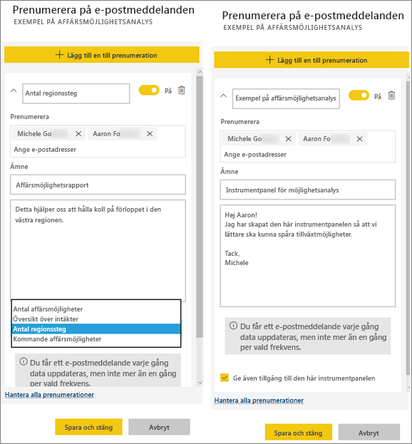

# Prenumerera på en rapport eller en instrumentpanel i Power BI-tjänsten
Det har aldrig varit enklare att hålla sig uppdaterad när det gäller viktiga instrumentpaneler och rapporter. Prenumerera dig själv och dina kollegor på de rapportsidor och instrumentpaneler som är viktigast för dig, så skickas ett e-postmeddelande från Power BI med en ögonblicksbild till din inkorg. Ange hur ofta du vill att Power BI ska skicka dig sådana e-postmeddelanden: från en gång om dagen till en gång i veckan. 

E-post och ögonblicksbild använder det språk som angetts i Power BI-inställningarna (se [språk och länder/regioner som stöds för Power BI](supported-languages-countries-regions.md)). Om inget språk har definierats använder Power BI det språk som är inställt i de nationella inställningarna i din nuvarande webbläsare. Om du vill se eller ange din språkinställning klickar du på kugghjulsikonen  > **Inställningar > Allmänt > Språk**. 

Du kan bara skapa prenumerationer i Power BI-tjänsten. När du får e-postmeddelandet innehåller det en länk med rubriken ”Gå till rapporten eller instrumentpanelen”. Om du väljer den här länken på mobila enheter med installerade Power BI-appar, så startas appen (istället för standardåtgärden att rapporten eller instrumentpanelen på webbplatsen Power BI öppnas).

## Krav
- Att **skapa** prenumerationer är en Power BI Pro-funktion, och du måste ha redigeringsbehörigheter till innehållet (instrumentpanel eller rapport) för att skapa prenumerationen. 
- Eftersom e-post angående prenumerationer endast skickas när en underliggande datauppsättning uppdateras fungerar inte prenumerationer på datamängder som inte uppdateras.

## Prenumerera på instrumentpanel eller en rapportsida
Oavsett om du prenumererar på en instrumentpanel eller en rapport är processerna mycket lika. Du kan använda samma knapp för att prenumerera dig själv (och andra) till Power BI-tjänstens instrumentpaneler och rapporter.
 
.

1. Öppna instrumentpanelen eller rapporten.
2. Välj **Prenumerera** på den översta menyraden, eller välj kuvertikonen .
   
   

3. Aktivera eller inaktivera prenumerationen med det gula skjutreglaget.  Om du ställer in skjutreglaget på Av så tas inte prenumerationen bort. Om du vill ta bort prenumerationen så väljer du istället papperskorgen.

4. Fyll i e-postmeddelandeinformationen. Din e-post är förifylld, men du kan även lägga till andra i prenumerationen. Endast e-postadresser i samma domän kan läggas till (se **Överväganden och felsökning** nedan för mer information). Om rapporten eller instrumentpanelen finns i [Premium-kapacitet](service-premium.md) kan du prenumerera andra med hjälp av enskilda e-postadresser och gruppalias. Om rapporten eller instrumentpanelen inte finns i Premium-kapacitet kan du ändå prenumerera andra med hjälp av deras enskilda e-postadresser, men då måste de också ha Power BI Pro-licenser.

    I skärmbilderna nedan ser du att när du prenumererar på en rapport prenumererar du i själv verket på en rapport*sida*.  Om du vill prenumerera på flera sidor i en rapport väljer du **Lägg till en till prenumeration** och väljer en annan sida. 
      
     

5. Spara prenumerationen genom att välja **Spara och stäng**. De som prenumererar får ett e-postmeddelande och en ögonblicksbild av instrumentpanelen eller rapportsidan varje gång några av de underliggande datamängderna ändras. Om instrumentpanelen eller rapporten uppdateras mer än en gång om dagen skickas e-postmeddelandet endast efter den första uppdateringen.  
   
    
   
   > [!TIP]
   > Vill du se e-postmeddelandet direkt? Utlös ett e-postmeddelande genom att uppdatera en av de datamängder som är associerade med instrumentpanelen eller den datamängd som är associerad med rapporten. (Om du inte har behörighet att redigera till datauppsättningen, så måste du be någon som har de behörigheterna att göra det åt dig.) Om du vill ta reda på vilka datauppsättningar som används väljer du ikonen **Visa relaterade**  så öppnas **Relaterat innehåll** och du kan välja uppdateringsikonen . 
   > 
   > 
   
   

## Hur e-postschemat bestäms
I följande tabell beskrivs hur ofta du får ett e-postmeddelande. Det beror helt på anslutningsmetoden för den datauppsättning som instrumentpanelen eller rapporten baseras på (DirectQuery, Live-anslutning, import till Power BI, Excel-fil i OneDrive eller SharePoint Online) samt på vilka prenumerationsalternativ som är tillgängliga och valda (varje dag, varje vecka eller inget).

|  | **DirectQuery** | **Live Connect** | **Schemalagd uppdatering (import)** | **Excel-fil i OneDrive/SharePoint Online** |
| --- | --- | --- | --- | --- |
| **Hur ofta uppdateras rapporten/instrumentpanelen?** |Var 15:e minut |Power BI kontrollerar var 15: e minut, och om datauppsättningen har ändrats, så uppdateras rapporten. |Användaren väljer inget, varje dag eller varje vecka. Varje dag kan vara upp till 8 gånger per dag. Varje vecka är ett veckoschema som användaren skapar och ställer in uppdateringar från så lite som en gång i veckan upp till varje dag. |En gång i timman |
| **Hur stor kontroll har användaren över schemat för e-postprenumeration?** |Alternativen är: varje dag eller varje vecka |Inga alternativ: användarna får ett e-postmeddelande om rapporten uppdateras, men inte mer än en gång per dag. |Om uppdateringsschemat är varje dag, så är alternativen dagliga och veckovisa.  Om uppdateringsschemat är varje vecka så är endast veckoalternativet tillgängligt. |Inga alternativ: användaren skickas ett e-postmeddelande när datauppsättnngen har uppdaterats, men inte mer än en gång per dag. |

## Hantera dina prenumerationer
Endast den person som skapade prenumerationen kan hantera den.  Det finns 2 vägar till skärmen för att hantera dina prenumerationer.  Den första är att välja **Hantera alla prenumerationer** i dialogrutan **Prenumerera på e-postmeddelanden** (se skärmbilderna nedanför steg 4 ovan). Den andra hittar du genom att välja kugghjulsikonen i Power BI  på den översta menyraden sedan välja **Inställningar**.

Vilka enskilda prenumerationer som visas beror på vilken arbetsyta som för närvarande är aktiv.  Om du vill se alla dina prenumerationer på en gång för alla arbetsytor, så kontrollera att **Min arbetsyta** är aktiv. Om du vill ha hjälp med att förstå hur arbetsytor fungerar, så gå till [Arbetsytor i Power BI](service-create-distribute-apps.md).

En prenumeration går ut om Pro-licensen upphör att gälla, om instrumentpanelen eller rapporten tas bort av ägaren eller om det användarkonto som använts för att skapa prenumerationen raderas.

## Överväganden och felsökning
* För e-postprenumerationer på instrumentpaneler visas inte paneler som har säkerhet på radnivå (RLS) tillämpat.  För e-postprenumerationer på rapporter går det inte att skapa en prenumeration om datauppsättningen använder RLS.
* Rapportsideprenumerationer är knutna till namnet på rapportsidan. Om du prenumererar på en rapportsida och byter namn på den, måste du återskapa din prenumeration
* Din organisation kan konfigurera vissa inställningar i Azure Active Directory som begränsar möjligheten att använda e-postprenumerationer i Power BI.  Detta inkluderar, men inte begränsat till, att ha multifaktorautentisering eller begränsningar för IP-intervallet vid åtkomst till resurser.
* E-postprenumerationer för rapporter/instrumentpaneler som använder live-anslutningsdatauppsättningar stöds för närvarande inte när du andra användare än du prenumererar.
* För e-postprenumerationer på live-anslutningsdatauppsättningar får du endast e-postmeddelanden när data ändras. Så om en uppdatering görs, men inga data ändras, så skickar Power BI dig inget e-postmeddelande.
* E-postprenumerationer har inte stöd för så många [anpassade visuella objekt](power-bi-custom-visuals.md).  Det enda undantaget är de anpassade visuella objekt som har [certifierats](power-bi-custom-visuals-certified.md).  
* E-postprenumerationer har för närvarande inte stöd för R-baserade anpassade visuella objekt.  
* Om det finns paneler på instrumentpanelen som har säkerhet på radnivå (RLS) tillämpat visas inte de panelerna.
* Du kan inte prenumerera andra användare på en rapport med säkerhet på radnivå (RLS) tillämpat.
* E-postprenumerationer skickas med rapportens standardfilter och utsnittstillstånd. Inga ändringar av standardinställningarna som du gör efter att du börjar prenumerera visas i e-postmeddelandet.    
* E-postprenumerationer stöds ännu inte ännu för rapportsidor som har skapats med Power BI Desktop-liveanslutning till tjänsten.    
* För prenumerationer på instrumentpaneler så saknar vissa typer av paneler fortfarande stöd.  Detta gäller: strömningspaneler, videopaneler och paneler för anpassat webbinnehåll.     
* Om du delar en instrumentpanel med en kollega utanför din klientorganisation kan du inte skapa en prenumeration till den kollegan. Om du till exempel är aaron@xyz.com kan du dela med anyone@ABC.com, men du kan ännu inte prenumerera anyone@ABC.com, och den personen kan inte prenumerera på delat innehåll.      
* På grund av storleksbegränsningar i e-posten kan prenumerationer på instrumentpaneler och rapporter som innehåller extremt stora bilder misslyckas.    
* Power BI pausar automatiskt uppdateringat för datauppsättningar som är associerade med instrumentpaneler och rapporter som inte har besökts på över två månader.  Men om du lägger till en prenumeration på en instrumentpanel eller en rapport, så pausas den inte, även om den förblir obesökt.    
* Om du inte får någon e-post angående prenumerationen, så kontrollera att ditt UPN (User Principal Name) kan ta emot e-postmeddelanden. [Power BI-teamet arbetar med att släppa på det här kravet](https://community.powerbi.com/t5/Issues/No-Mail-from-Cloud-Service/idc-p/205918#M10163), så håll dig uppdaterad. 
* Om din instrumentpanel eller rapport finns i Premium-kapacitet kan du använda grupp-e-postalias för prenumerationer i stället för att prenumerera kollegor med en e-postadress i taget. Alias baseras på aktuell aktiv katalog. 

## Nästa steg
* Har du fler frågor? [Fråga Power BI Community](http://community.powerbi.com/)    
* [Läs blogginlägget](https://powerbi.microsoft.com/blog/introducing-dashboard-email-subscriptions-a-360-degree-view-of-your-business-in-your-inbox-every-day/)

