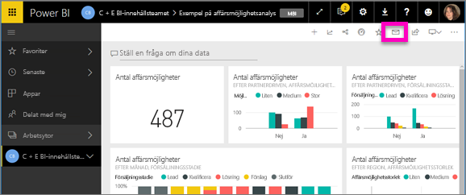
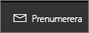
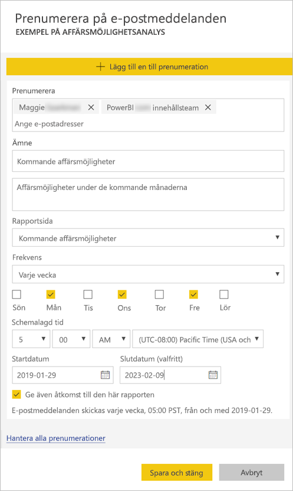
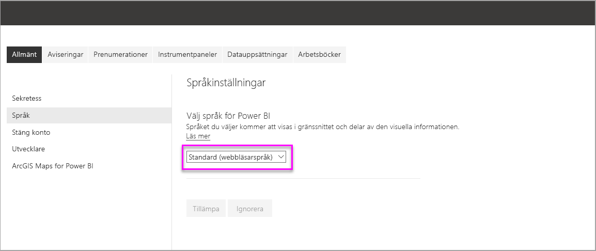
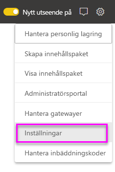
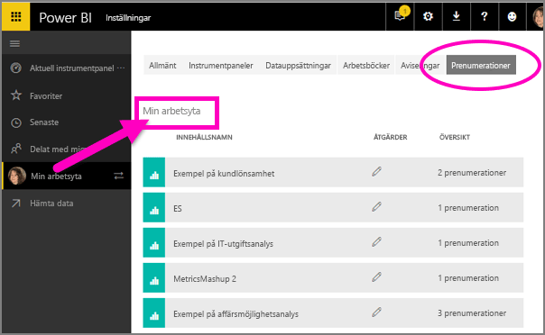

# Skapa en prenumeration åt dig eller andra på rapporter och instrumentpaneler i Power BI-tjänsten

Du kan skapa en prenumeration åt dig själv och dina kollegor på de rapportsidor, instrumentpaneler och sidnumrerade rapporter som är viktigast för er. Power BI skickar en ögonblicksbild via e-post till din inkorg. Ange hur ofta du vill att Power BI ska skicka dig sådana e-postmeddelanden: varje dag, varje vecka, varje timme, varje månad eller efter den första datauppdateringen.  Om du väljer varje dag, varje vecka, varje timme eller varje månad kan du välja den tid du vill att prenumerationen ska löpa.  Du kan ställa in upp till 24 olika prenumerationer per rapport eller instrumentpanel.

 

Du kan bara skapa prenumerationer i Power BI-tjänsten. Du får ett e-postmeddelande med en ögonblicksbild av rapportsidan eller instrumentpanelen, med en länk till att öppna rapporten eller instrumentpanelen. Om du väljer den här länken på mobila enheter med installerade Power BI-appar, så startas Power BI-appen, i stället för att öppna rapporten eller instrumentpanelen på Power BI-webbplatsen.

## Krav

Följande kan **skapa** en prenumeration:

- Användare med Power BI Pro-licens
- Användare som visar innehåll i en Premium-arbetsyta eller -app kan också prenumerera på innehåll som finns där, även utan Power BI Pro-licens.

Du behöver inte redigera behörigheter för innehållet (instrumentpanel eller rapport) för att skapa en prenumeration åt dig själv men du måste ha redigeringsbehörigheter för att skapa en åt någon annan. 

## Prenumerera på en instrumentpanel, en rapportsida eller en sidnumrerad rapport

Oavsett om du prenumererar på en instrumentpanel, rapport eller sidnumrerad rapport är processen likadan. Du kan använda samma knapp för att prenumerera på Power BI-tjänstens instrumentpaneler och rapporter.

Prenumeration på sidnumrerade rapporter fungerar lite annorlunda. Mer information finns i [Skapa en prenumeration åt dig själv och andra på en sidnumrerad rapport i Power BI-tjänsten](consumer/paginated-reports-subscriptions.md).
 
.

1. Öppna instrumentpanelen eller rapporten.
2. Välj **Prenumerera** på den översta menyraden, eller välj kuvertikonen .
   
   

3. Aktivera eller inaktivera prenumerationen med det gula skjutreglaget.  Om du ställer in skjutreglaget på **Av** så tas inte prenumerationen bort. Om du vill ta bort prenumerationen så väljer du istället papperskorgen.

4. Din e-postadress finns redan i rutan **Prenumerera**. Du kan också lägga till andra e-postadresser i prenumerationen men bara i samma domän. Om rapporten eller instrumentpanelen finns i [Premium-kapacitet](service-premium-what-is.md) kan du skapa prenumerationer för andra enskilda e-postadresser och gruppalias. Om rapporten eller instrumentpanelen inte finns i Premium-kapacitet kan du skapa prenumerationer för andra personer men de måste också ha Power BI Pro-licenser. Mer information finns i [Överväganden och felsökning](#considerations-and-troubleshooting) nedan. 

5. Fyll i information om **Ämne** och **Meddelande** för e-posten. 

5. Välj en **frekvens** för prenumerationen: **Varje dag**, **Varje timme**, **Varje vecka**, **Varje månad** eller **Efter datauppdatering (en gång per dag)**.  Om du bara vill få e-post för prenumerationen på vissa dagar väljer du **Varje timme** eller **Varje vecka** och vilka dagar du vill få den.  Om du till exempel bara vill ha e-post för prenumerationen på vardagar väljer du **Varje vecka** och avmarkerar rutorna **Lör** och **Sön**.  Om du väljer **Varje månad** anger du den eller de dagar i månaden som du vill ta emot prenumerationsmeddelandet via e-post.  

6. Om du väljer **Varje dag**, **Varje timme**, **Varje månad** eller **Varje vecka** kan du även välja en **Schemalagd tid** för prenumerationen.  Du kan köra den på heltimme eller 15, 30 eller 45 minuter över.  Välj morgon (AM) eller eftermiddag/kväll (PM). Du kan även ange tidszon.  Om du väljer **Varje timma** ska du välja **Schemalagd tid** då du vill att prenumerationen ska starta, så körs den varje timme efter det.

7. Som standard är startdatum för prenumerationen det datum du skapar den. Du har möjlighet att välja ett slutdatum. Om du inte anger ett slutdatum är slutdatumet automatiskt ett år efter startdatumet. Du kan ändra det till vilket datum som helst i framtiden (upp till år 9999) när som helst innan prenumerationen avslutas. När en prenumeration når ett slutdatum stoppas den tills du aktiverar den igen. Du får ett eller flera meddelanden innan det schemalagda slutdatumet där du tillfrågas om du vill förlänga den.    

    I skärmbilderna nedan ser du att när du prenumererar på en rapport prenumererar du i själv verket på en rapport*sida*.  Om du vill prenumerera på flera sidor i en rapport väljer du **Lägg till en till prenumeration** och väljer en annan sida. 
      
     

7. Välj **Spara och stäng**. Användare som prenumererar får ett e-postmeddelande och en ögonblicksbild eller rapportsida för den frekvens och tid du har valt. Totalt kan du skapa upp till 24 prenumerationer per rapport eller instrumentpanel och kan ange unika mottagare, tider och frekvenser för varje prenumeration.  Alla prenumerationer med frekvensen **Efter datauppdatering** inställd för din instrumentpanel eller rapport skickar fortfarande bara ett e-postmeddelande efter den första schemalagda uppdateringen.   
      
   > [!TIP]
   > Vill du skicka e-postmeddelandet från en prenumeration direkt eller på begäran vid valfri tidpunkt? Välj **Kör nu** för prenumerationerna för den instrumentpanel eller rapport som du vill skicka. Du får därmed ett meddelande om att ett e-postmeddelande skickas till alla för den specifika prenumerationen.  Den här åtgärden räknas inte mot din gräns på 24 schemalagda prenumerationskörningar per dag per rapport eller instrumentpanel. Detta utlöser INTE en datauppdatering av den underliggande datamängden. 
   > 
   > 
   
## E-postspråk

E-post och ögonblicksbild använder det språk som angetts i Power BI-inställningarna (se [språk och länder/regioner som stöds för Power BI](supported-languages-countries-regions.md)). Om inget språk har definierats använder Power BI det språk som är inställt i de nationella inställningarna i din nuvarande webbläsare. Om du vill se eller ange din språkinställning klickar du på kugghjulsikonen  > **Inställningar > Allmänt > Språk**. 

## Hantera dina prenumerationer
Endast den person som skapade prenumerationen kan hantera den.  Det finns två vägar till skärmen för att hantera dina prenumerationer.  Den första är att välja **Hantera alla prenumerationer** i dialogrutan **Prenumerera på e-postmeddelanden** (se skärmbilderna nedanför steg 4 ovan). Den andra hittar du genom att välja kugghjulsikonen i Power BI  på den översta menyraden sedan välja **Inställningar**.

Vilka enskilda prenumerationer som visas beror på vilken arbetsyta som för närvarande är aktiv.  Om du vill se alla dina prenumerationer på en gång för alla arbetsytor, så kontrollera att **Min arbetsyta** är aktiv. Om du vill ha hjälp med att förstå hur arbetsytor fungerar, så gå till [Arbetsytor i Power BI](service-create-workspaces.md).

En prenumeration går ut om Pro-licensen upphör att gälla, om ägaren tar bort instrumentpanelen eller om det användarkonto som använts för att skapa prenumerationen raderas.

## Överväganden och felsökning

* Instrumentpaneler med fler än 25 fästa paneler, eller fyra fästa liverapportsidor, kanske inte återges till fullo i prenumerationsmeddelanden som skickas till användare via e-post.  Prenumerationer på instrumentpaneler över detta antal paneler blockeras inte. Däremot betraktas de som ej stödda om du stöter på problem. Överväg att ändra dem därefter så att de omfattas av stöd.
* I sällsynta fall kan e-postprenumerationer ta längre tid än 15 minuter at levereras till mottagarna. Om detta inträffar rekommenderar vi att du kör datauppdateringen och e-postprenumerationen vid olika tider för att säkerställa leverans i tid. Om problemet kvarstår kontaktar du supporten för Power BI.
* För e-postprenumerationer på instrumentpaneler visas inte paneler som har säkerhet på radnivå (RLS) tillämpat.  
* För e-postprenumerationer på rapporter kan du skapa en prenumeration åt dig själv om datamängden använder RLS. Du kan inte skapa prenumerationer av en rapport åt andra med säkerhet på radnivå (RLS), såvida du inte använder en sidnumrerad rapport, vilket i så fall gör att du kan skicka prenumerationen till andra med hjälp av din säkerhetskontext. 
* Rapportsideprenumerationer är knutna till namnet på rapportsidan. Om du prenumererar på en rapportsida och sedan byter namn på den, måste du återskapa din prenumeration.
* Din organisation kan konfigurera vissa inställningar i Azure Active Directory som begränsar möjligheten att använda e-postprenumerationer i Power BI.  Dessa begränsningar inkluderar, men begränsas inte till, att ha multifaktorautentisering eller begränsningar för IP-intervallet vid åtkomst till resurser.
* För närvarande stöds inte e-postprenumerationer för rapporter/instrumentpaneler som använder datauppsättningar från realtidsanslutningar när du skapar prenumerationer åt andra användare än dig själv, såvida du inte använder en sidnumrerad rapport, vilket i så fall gör att du kan skicka prenumerationen till andra med hjälp av din säkerhetskontext. 
* E-postprenumerationer har inte stöd för så många [anpassade visuella objekt](developer/power-bi-custom-visuals.md).  Det enda undantaget är de anpassade visuella objekt som har [certifierats](developer/power-bi-custom-visuals-certified.md).  
* E-postprenumerationer har för närvarande inte stöd för R-baserade anpassade visuella objekt.  
* E-postprenumerationer skickas med rapportens standardfilter och utsnittstillstånd. Inga ändringar av standardinställningarna som du gör efter att du börjar prenumerera visas i e-postmeddelandet.  Sidnumrerade rapporter har stöd för den här funktionen och gör att du kan ställa in specifika parametervärden per prenumeration.   
* För prenumerationer på instrumentpaneler så saknar vissa typer av paneler fortfarande stöd.  Detta gäller: strömningspaneler, videopaneler och paneler för anpassat webbinnehåll.     
* Om du delar en instrumentpanel med en kollega utanför din klientorganisation kan du inte skapa en prenumeration till den kollegan. Om du till exempel är aaron@xyz.com kan du dela med anyone@ABC.com, men du kan ännu inte prenumerera anyone@ABC.com, och den personen kan inte prenumerera på delat innehåll.      
* Power BI pausar automatiskt uppdateringar för datauppsättningar som är associerade med instrumentpaneler och rapporter som inte har besökts på över två månader.  Men om du lägger till en prenumeration på en instrumentpanel eller en rapport, så pausas den inte, även om den förblir obesökt.    
* Om du inte får någon e-post angående prenumerationen, så kontrollera att ditt UPN (User Principal Name) kan ta emot e-postmeddelanden. 
* Om din instrumentpanel eller rapport finns i Premium-kapacitet kan du använda grupp-e-postalias för prenumerationer i stället för att prenumerera kollegor med en e-postadress i taget. Alias baseras på aktuell aktiv katalog. 

## Nästa steg

- [Skapa en prenumeration åt dig själv och andra på en sidnumrerad rapport i Power BI-tjänsten](consumer/paginated-reports-subscriptions.md)
- Har du fler frågor? [Fråga Power BI Community](https://community.powerbi.com/)    
- [Läs blogginlägget](https://powerbi.microsoft.com/blog/introducing-dashboard-email-subscriptions-a-360-degree-view-of-your-business-in-your-inbox-every-day/)
