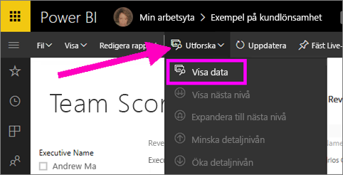
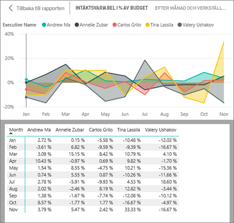
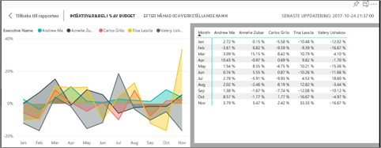
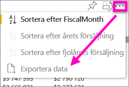

# Visa data som används för att skapa visualiseringen
## Visa data
En Power BI-visualisering konstrueras med data från dina datauppsättningar. Om du är intresserad av att se vad som pågår i bakgrunden, Power BI kan *visa* de data som används för att skapa visualiseringen. När du väljer **Visa data** visar Power BI dessa data under (eller bredvid) visualiseringen.

Du kan också exportera de data som används för att skapa visualiseringen som en .xlsx- eller .csv-fil och visa dem i Excel. Mer information finns i [Exportera data från visualiseringar i Power BI](power-bi-visualization-export-data.md).

> [!NOTE]
> *Visa Data* och *Exportera data* finns både i Power BI-tjänsten och Power BI Desktop. Dock ger Power BI Desktop ett ytterligare lager med information: [ *Visa poster* visar de faktiska raderna i datauppsättningen](desktop-see-data-see-records.md).
> 
> 

## Använda *Visa data* i Power BI-tjänsten
1. I Power BI-tjänsten, öppnar du en rapport i [Läsvyn eller Redigeringsvyn](service-reading-view-and-editing-view.md) och väljer ett visuellt objekt.  Öppna rapportvyn i Power BI Desktop.
2. Om du vill visa bakomliggande data, välj **Utforska** > **Visa data**.
   
   
3. Som standard visas data under visualiseringen.
   
   
4. Välj om du vill ändra orientering väljer du lodrät layout  från det övre högra hörnet av visualiseringen.
   
   
5. Om du vill exportera data till en .csv-fil väljer du ellipserna och sedan **Exportera data**.
   
    
   
    Mer information om att exportera data till Excel finns i [Exportera data från visualiseringar i Power BI](power-bi-visualization-export-data.md).
6. Om du vill dölja data avmarkerar du **Utforska** > **Visa data**.

### Nästa steg
[Exportera data från ett visuellt Power BI-objekt](power-bi-visualization-export-data.md)    
[Visuella objekt i Power BI-rapporter](power-bi-report-visualizations.md)    
[Power BI-rapporter](service-reports.md)    
[Power BI – grundläggande begrepp](service-basic-concepts.md)    
Har du fler frågor? [Prova Power BI Community](http://community.powerbi.com/)

