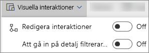
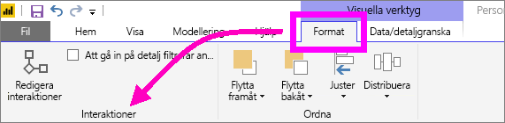
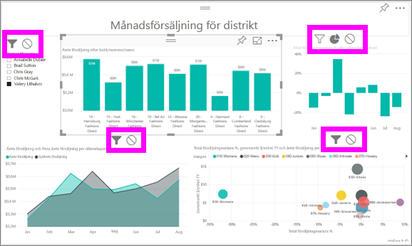

# Visualiseringsinteraktioner i en Power BI-rapport
Om du har redigeringsbehörighet för en rapport kan du använda **Visuella interaktioner** för att ändra hur visualiseringar på en rapportsida påverkar varandra. 

Som standard kan visualiseringar på en rapportsida användas för korsfilter och korsmarkeringar i andra visualiseringar på sidan.
Du kan till exempel välja ett tillstånd i en kartvisualisering som visar kolumndiagrammet och filtrerar linjediagrammet till de data som gäller för detta tillstånd.
Se [Om filtrering och markering](power-bi-reports-filters-and-highlighting.md). Om du har en visualisering som stöder [detaljgranskning](power-bi-visualization-drill-down.md) så har detaljgranskning av en visualisering som standard ingen inverkan på andra visualiseringar på rapportsidan. Båda de här standardbeteendena kan åsidosättas och interaktioner kan anges per visualisering.

Den här artikeln visar hur du använder **Visuella interaktioner** i Power BI-tjänsten [Redigeringsvyn](service-interact-with-a-report-in-editing-view.md) och i Power BI Desktop. Om en rapport har delats med dig kan du inte ändra inställningarna för visuella interaktioner.

> [!NOTE]
> Termerna *Korsfilter* och *Korsmarkering* används för att särskilja det beteende som beskrivs här från vad som händer när du använder fönstret **Filter** till att filtrera och markera visualiseringar.  
> 
> 

<iframe width="560" height="315" src="https://www.youtube.com/embed/N_xYsCbyHPw?list=PL1N57mwBHtN0JFoKSR0n-tBkUJHeMP2cP" frameborder="0" allowfullscreen></iframe>

1. Välj en visualisering för att aktivera den.  
2. Visa alternativen för **Visuella interaktioner**.
    - Välj listrutan på menyraden för rapportering i Power BI-tjänsten.

       

    - På skrivbordet väljer du **Format > Interaktioner**.

        

3. Välj **Redigera interaktioner** för att aktivera kontroller för visualiseringsinteraktioner. Power BI lägger till ikoner för korsfiltrering och korsmarkering i alla andra visualiseringar på rapportsidan.
   
    
3. Bestäm vilken effekt den valda visualiseringen ska ha på de andra visualiseringarna.  Du kan också upprepa detta för alla andra visualiseringar på rapportsidan.
   
   * Om du vill korsfiltrera visualiseringen väljer du ikonen **Filter** .
   * Om du vill korsmarkera visualiseringen väljer du ikonen **Markera** .
   * Om den inte ska ha någon effekt väljer du ikonen **Ingen inverkan** .

4. Om du vill aktivera detaljgranskningskontroller väljer du **Att gå in på detalj filtrerar andra visuella objekt**.  Nu när du ökar detaljnivån i en visualisering ändras de andra visualiseringarna på rapportsidan för att återspegla din aktuella detaljgranskningsmarkering. 

   

### Nästa steg
[Så här använder du rapportfilter](power-bi-how-to-report-filter.md)

[Filtrera och markera i rapporter](power-bi-reports-filters-and-highlighting.md)

[Power BI – grundläggande begrepp](service-basic-concepts.md)

Har du fler frågor? [Prova Power BI Community](http://community.powerbi.com/)

