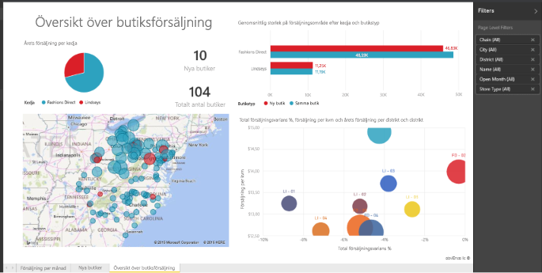

# Rapporter i Power BI
## Vad är en Power BI-rapport?
En Power BI-***rapport*** visar en datauppsättning från flera perspektiv med visualiseringar som visar olika insikter och resultat från datauppsättningen.  En rapport kan ha en enda visualisering eller sidor som är fulla av visualiseringar. Beroende på din arbetsroll kan du vara någon som *skapar* rapporter och/eller någon som *förbrukar* eller använder rapporterna.

Den här rapporten innehåller 3 sidor (eller flikar) och vi visar översiktssidan för Butiksförsäljning. Den här sidan har 6 olika visualiseringar och en titelsida. Visualiseringar kan vara *fästa* på instrumentpaneler. När den fästa visualiseringen har valts öppnas rapporten som den fästes från.

Om du har använt Power BI kan du få en god grund genom att läsa [Grundläggande begrepp i Power BI](service-basic-concepts.md)

Rapporter är en funktion i Power BI-tjänsten och Power BI Desktop. Upplevelse av att arbeta med rapporter är nästan identisk. Du kan inte skapa rapporter för mobila enheter, men du kan [visa, dela och kommentera rapporter](mobile-reports-in-the-mobile-apps.md).

## Fördelar med rapporter
Rapporter baseras på en enda datauppsättning. Visualiseringar i en rapport representerar en liten mängd information. Visualiseringar är inte statiska. Du kan ta bort och lägga till data, ändra visualiseringstyper och lägga till filter och utsnitt när du granskar dina data djupare för att upptäcka insikter och hitta svar. Som en instrumentpanel, men ännu mer. En rapport är interaktiv och anpassningsbar och visualiseringarna uppdateras när underliggande data ändras.

## Instrumentpaneler jämfört med rapporter
[Instrumentpaneler](service-dashboards.md) förväxlas ofta med rapporter, eftersom också de är arbetsytor fulla av visualiseringar. Men det finns några viktiga skillnader.  

| **Kapacitet** | **Instrumentpaneler** | **Rapporter** |
| --- | --- | --- |
| Sidor |En sida |En eller flera sidor |
| Datakällor |En eller flera rapporter och en eller flera datauppsättningar per instrumentpanel |En enskild datauppsättning per rapport |
| Tillgängliga i Power BI Desktop |Nej |Ja, du kan skapa och visa rapporter i Desktop |
| Fästning |Det går bara att fästa befintliga visualiseringar (paneler) från den aktuella instrumentpanelen till dina övriga instrumentpaneler |Det går att fästa visualiseringar (som paneler) på alla dina instrumentpaneler. Det går att fästa hela rapportsidor på alla dina instrumentpaneler. |
| Prenumerera |Det går inte att prenumerera på en instrumentpanel |Det går att prenumerera på rapportsidor |
| Filtrering |Det går inte att filtrera eller dela upp |Det finns många olika sätt att filtrera, markera och dela upp |
| Ställa in avisering |Det går att skapa e-postaviseringar när vissa villkor uppfylls |Nej |
| Visning av aktuellt objekt |Det går att ange en instrumentpanel som din ”aktuella” instrumentpanel |Det går inte att skapa en aktuell rapport |
| Frågor med naturligt språk |Tillgängligt från instrumentpanelen |Inte tillgängligt från rapporter |
| Det går att ändra visualiseringstyp |Nej. Den fästa visualiseringen på instrumentpanelen uppdateras inte om rapportägaren ändrar visualiseringstyp i rapporten |Ja |
| Det går att visa tabeller och fält från den underliggande datauppsättningen |Nej. Det går att exportera data men tabeller och fält visas inte i själva instrumentpanelen. |Ja. Det går att visa datauppsättningens tabeller, fält och värden. |
| Kan skapa visualiseringar |Det går endast att lägga till widgetar i instrumentpanelen med hjälp av ”Lägg till panel” |Det går att skapa många olika typer av visualiseringar, lägga till anpassade visuella objekt, redigera visualiseringar med mera med Redigera behörigheter |
| Anpassning |Det går att ändra visualiseringarna (panelerna). Det går att flytta och ordna dem, byta storlek, lägga till länkar, byta namn, ta bort och visa dem i helskärmsläge. Men alla data och visuella objekt är skrivskyddade. |I läsvyn kan du publicera, bädda in, filtrera, exportera, hämta som.pbix, visa relaterat innehåll, generera QR-koder, analysera i Excel och annat.  Du kan göra allt det ovanstående och mycket mer i Redigera vy. |

## Rapport***skapare*** och rapport***användare***
Beroende på din roll skapar du antingen rapporter för eget bruk eller för att dela med dina kollegor. Du kanske vill lära dig att skapa och dela rapporter. Eller också är du någon som tar emot rapporter från andra. Du vill lära dig att förstå och interagera med rapporter.

Här följer några avsnitt, ordande enligt roll, som hjälper dig att komma igång.

### Om du ska skapa och dela rapporter
* Börja med en [rundtur av Power BI-tjänsten](service-basic-concepts.md) så att du vet var du hittar rapportverktyg och rapporter.
* Ta en titt på [rapportredigeraren](service-the-report-editor-take-a-tour.md).
* Lär dig att [skapa en ny rapport från en datauppsättning](service-report-create-new.md).
* [Lär dig hur du använder filter på sid-, visualisering- och rapportnivå](power-bi-how-to-report-filter.md)
* Identifiera de olika sätt som du kan [dela en rapport med kollegor](service-share-dashboards.md).

### Om du ska ta emot och använda rapporter
* Börja med en [rundtur av Power BI-tjänsten](service-basic-concepts.md) så att du vet var du hittar rapportverktyg och rapporter.
* Lär dig att [öppna en rapport](service-report-open.md) och alla interaktioner som är möjliga i [läsläget](service-reading-view-and-editing-view.md).
* Bekanta dig mer rapporter genom att ta en titt på ett av våra [exempel](sample-tutorial-connect-to-the-samples.md).  
* Behöver du inte rapporten längre? Du kan [ta bort den](service-delete.md).
* För att se vilken datauppsättning som används av rapporten och vilka instrumentpaneler som har paneler som har fästs från rapporten kan du [visa relaterat innehåll](service-related-content.md).

> [!TIP]
> Om du inte hittar det du söker efter här kan använda innehållsförteckningen till vänster för att bläddra igenom alla avsnitt i *rapporten*.
> 
> 

## Nästa steg
[Kom igång med Power BI](service-get-started.md) 

[Power BI – grundläggande begrepp](service-basic-concepts.md)

Har du fler frågor? [Prova Power BI Community](http://community.powerbi.com/)

