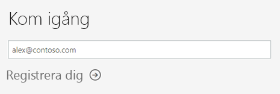
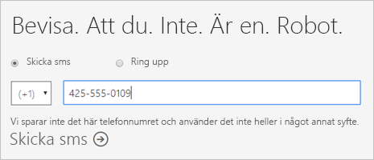
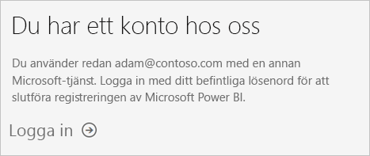
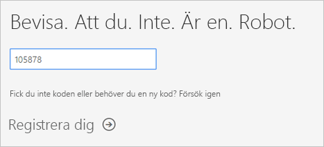
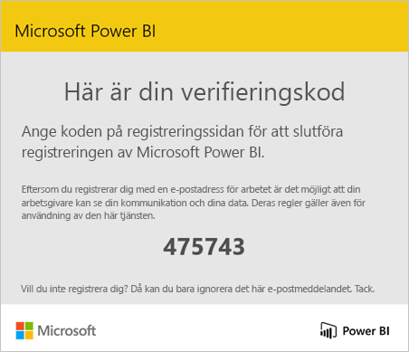
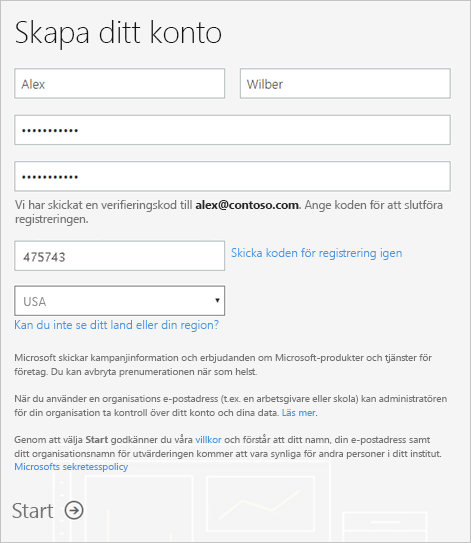
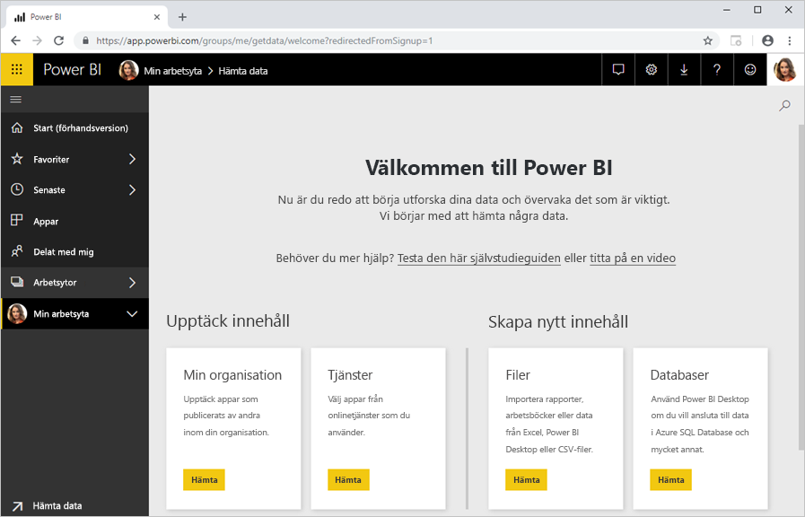

# Registrera dig själv som enskild individ för Power BI

Power BI kan vara ditt personliga verktyg för dataanalys och visualisering, och det kan även fungera som analys- och beslutsmotor för grupprojekt, avdelningar eller hela företag. I den här artikeln förklaras hur du registrerar dig för Power BI som enskild individ. Om du är Power BI-administratör kan du läsa [Power BI-licensiering i din organisation](service-admin-licensing-organization.md).

## E-postadresser som stöds

Innan du börjar registreringen är det viktigt att du vet vilka typer av e-postadresser du kan använda i Power BI-registreringen:

* Power BI kräver att du använder en e-postadress som är kopplad till ditt arbete eller din skola. Du kan inte registrera dig med e-postadresser som tillhandahålls av e-posttjänster för konsumenter eller telekomleverantörer. Några exempel är outlook.com, hotmail.com och gmail.com.

* När du har loggat in kan du [bjuda in gästanvändare](https://docs.microsoft.com/azure/active-directory/active-directory-b2b-what-is-azure-ad-b2b) för att visa innehåll i din Power BI-klientorganisation med valfri e-postadress, inklusive personliga konton.

* Du kan registrera dig för Power BI med .gov- eller .mil-adresser, men det kräver en annan process. Läs mer på sidan [Registrera din amerikanska myndighetsorganisation i Power BI-tjänsten](service-govus-signup.md).

## Registrera dig för ett Power BI-konto

Följ de här instruktionerna för att registrera ett Power BI-konto. När du har slutfört den här processen har du en (kostnadsfri) Power BI)-licens som du kan använda till att testa Power BI på egen hand via Min arbetsyta, använda innehåll från en Power BI-arbetsyta som är tilldelad till en Power BI Premium-kapacitet eller börja använda en enskild utvärderingsversion av Power BI Pro. Mer information finns i [Power BI-funktioner efter licenstyp](service-features-license-type.md). 

1. Gå till [registreringssidan](https://signup.microsoft.com/signup?sku=a403ebcc-fae0-4ca2-8c8c-7a907fd6c235).

1. Ange din e-postadress och välj sedan **Sign up** (Registrera).

    

1. Om du ser ett meddelande som det här ska du välja alternativet för att få en verifieringskod och fortsätta till nästa steg i proceduren.

    

    Om du ser ett meddelande som liknar det här slutför du stegen för att logga in och använda Power BI.

    

1. Ange koden som du har fått och välj sedan **Sign up** (Registrera).

    

1. Kontrollera din e-post och se om du har fått ett meddelande som liknar det här.

    

1. På nästa skärm anger du din information och verifieringskoden från e-postmeddelandet. Välj en region, granska de principer som är länkade från den här skärmen och välj sedan **Starta**.

    

1. Sedan dirigeras du till [inloggningssidan för Power BI](https://powerbi.microsoft.com/landing/signin/) och du kan börja använda tjänsten.

    

## Förfallodatum för kostnadsfri utvärderingsversion

När du har slutfört registreringen kan du registrera dig för en utvärderingsversion av Power BI Pro i Power BI-tjänsten. När utvärderingen upphör att gälla återfår du din (kostnadsfria) Power BI-licens. Då har du inte längre tillgång till funktioner som kräver en Power BI Pro-licens. Mer information finns i avsnittet med [funktioner per licenstyp](service-features-license-type.md).

Om du klarar dig med en kostnadsfri Power BI-licens behöver du inte göra något annat. Om du vill använda Power BI Pro-funktioner kan du kontakta IT-administratören om att köpa en Power BI Pro-licens.

## Felsöka registreringen

I de flesta fall kan du registrera dig för Power BI genom att följa processen som beskrivs. I den här tabellen beskrivs några av de problem som kan förhindra att du registrerar dig samt möjliga lösningar.

| Symtom/felmeddelande | Orsak och lösning |
| ----------------------- | -------------------- |
| <strong>Personliga e-postadresser (till exempel nancy@gmail.com)</strong> Du får ett meddelande som liknar detta under registreringen:    *Du angav en personlig e-postadress: Ange din e-postadress till arbetet, så vi kan lagra företagets data på ett säkert sätt.*    eller    *Det där ser ut som en personlig e-postadress. Ange din adress till arbetet så att vi kan ansluta dig till andra i företaget. Oroa dig inte. Vi kommer inte att dela din adress med vem som helst.* | Power BI stöder inte e-postadresser som tillhandahålls av e-posttjänster för konsumenter eller telekommunikationsleverantörer.    Försök att slutföra registreringen igen med en e-postadress som tilldelats av ditt arbete eller din skola.    Om du ändå inte kan registrera dig och är villig att genomföra en mer avancerad konfigurationsprocess, så kan du [registrera dig för en ny Office 365-utvärderingsprenumeration och använda den e-postadressen för att registrera dig](service-admin-signing-up-for-power-bi-with-a-new-office-365-trial.md).    En befintlig användare kan även [bjuda in dig som gäst](service-admin-azure-ad-b2b.md). |
| **Självbetjäningsregistreringen är inaktiverad**: Du får ett meddelande som liknar detta under registreringen:    *Vi kan inte slutföra din registrering. IT-avdelningen har inaktiverat registrering för Microsoft Power BI. Kontakta dem så att du kan slutföra registreringen.*    eller    *Det där ser ut som en personlig e-postadress. Ange din adress till arbetet så att vi kan ansluta dig till andra i företaget. Oroa dig inte. Vi kommer inte att dela din adress med vem som helst.* | Organisationens IT-administratör har inaktiverat självbetjäningsregistrering för Power BI.    Slutför registreringen genom att kontakta IT-avdelningen och be dem [följa instruktionerna för att aktivera registreringen](service-admin-licensing-organization.md#enable-or-disable-individual-user-sign-up-in-azure-active-directory).    Det här problemet kan också uppstå om du har [registrerat dig för Office 365 via en partner](service-admin-syndication-partner.md). |
| **E-postadressen är inte ett ID för Office 365** Du får ett meddelande som liknar detta under registreringen:    *Vi hittar dig inte på contoso.com.  Använder du ett annat ID i arbetet eller skolan?   Prova med att logga in med det, och om detta inte fungerar kan du kontakta IT-avdelningen.* | Din organisation använder ID:n som skiljer sig från din e-postadress för att logga in på Office 365 och andra Microsoft-tjänster.  Din e-postadress kan t.ex. vara Nancy.Smith@contoso.com, medan ditt ID är nancys@contoso.com.    Slutför registreringen med det ID som organisationen har tilldelat dig för att logga in i Office 365 och andra Microsoft-tjänster.  Om du inte känner till det här ID:t kan du kontakta IT-administratören.    Om du ändå inte kan registrera dig och är villig att genomföra en mer avancerad konfigurationsprocess, så kan du [registrera dig för en ny Office 365-utvärderingsprenumeration och använda den e-postadressen för att registrera dig](service-admin-signing-up-for-power-bi-with-a-new-office-365-trial.md). |

## Nästa steg

[Köp Power BI Pro](service-admin-purchasing-power-bi-pro.md)  
[Power BI-serviceavtal för enskilda användare](https://powerbi.microsoft.com/terms-of-service/)  

Har du fler frågor? [Fråga Power BI Community](https://community.powerbi.com/)
