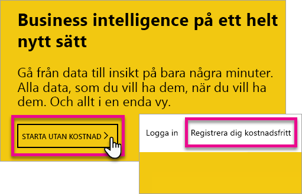
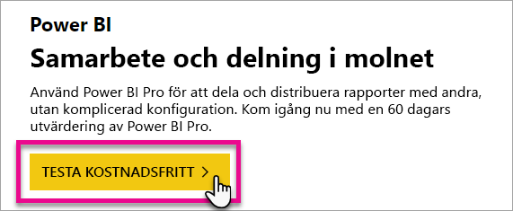
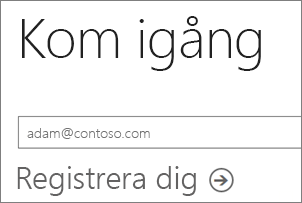
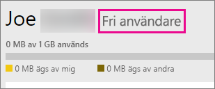
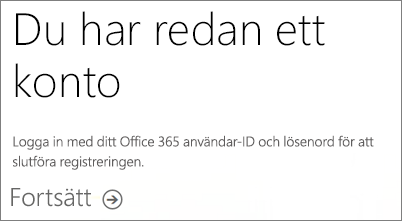
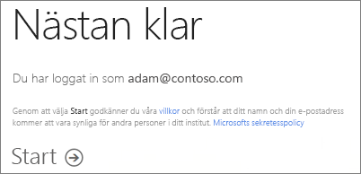
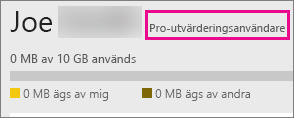

# Registrera dig själv som enskild individ för Power BI
Lär dig hur du registrerar dig för Power BI och börja använda det för dina personliga rapport- och visualiseringsbehov.

Power BI kan vara ditt personliga verktyg för rapportering och visualisering och kan även fungera som analys- och beslutsmotor för grupprojekt, avdelningar eller hela bolag.

Den här artikeln beskrivs de alternativ du har för att registrera dig och börja använda Power BI-tjänsten. Mer information om skillnaderna mellan kostnadsfria Power BI (kostnadsfri) och Power BI Pro finns i [Power BI (kostnadsfri) och Power BI Pro](service-free-vs-pro.md).

## Du har några alternativ att välja bland
Som enskild individ har du flera alternativ för att registrera dig och börja använda Power BI. Du kan välja att registrera dig för en kostnadsfri version eller så kan du köpa en prenumeration på Power BI Pro. Om du registrerar dig för ett kostnadsfritt konto när du väl har loggat in till tjänsten, kan du välja en kostnadsfri 60 dagars utvärderingsversion av Power BI Pro.

Om du tillhör en befintlig organisation som använder Office 365, kan du fortfarande registrera dig för ett kostnadsfritt konto. Din IT-administratör har också olika alternativ när det gäller att köpa Power BI Pro och tilldela licenser. Mer information om vilka alternativ som är tillgängliga för IT-administratör finns i [Köpa Power BI Pro](service-admin-purchasing-power-bi-pro.md).

> [!NOTE]
> Om du arbetar i en organisation kan det vara så att individuell registrering har inaktiverats. Mer information om fel som indikerar inaktivering finns i [Individuell registrering har inaktiverats](#individual-sign-up-has-been-turned-off).
>

## Vad behöver jag för att registrera mig?

Om du vill registrera dig för Power BI måste du ha e-postadress till ditt arbete. Du kan inte använda en privat e-postadress när du registrerar dig för Power BI.

### Vilka e-postadresser kan användas med Power BI?
Power BI kräver att du använder en e-postadress som är kopplad till ditt arbete eller din skola. Power BI stöder inte e-postadresser som tillhandahålls av e-posttjänster för konsumenter eller telekommunikationsleverantörer. Detta kan vara outlook.com, hotmail.com, gmail.com och andra.

Om du försöker logga med en personlig e-postadress visas ett meddelande som säger att du måste använda en e-postadress till ditt arbete eller din skola.

> [!NOTE]
> Du kan registrera dig för Power BI om du har en adress som slutar på .gov eller .mil. Mer information finns i artikeln [Registrera din amerikanska myndighetsorganisation i Power BI-tjänsten](https://docs.microsoft.com/en-us/power-bi/service-govus-signup).
>

> [!NOTE]
> När du har loggat in kan du [bjuda in gästanvändare](https://docs.microsoft.com/en-us/azure/active-directory/active-directory-b2b-what-is-azure-ad-b2b) för att visa innehåll i din Power BI-klientorganisation med valfri e-postadress, inklusive personliga konton.
>

## Vilken licenstyp behöver du?
Du kan fastställa vilken du behöver genom att kontrollera vad som ingår i respektive licenstyp. De som använder den kostnadsfria tjänsten har tillgång till de flesta funktionerna, med undantag för delnings- och samarbetsfunktionerna. Power BI Pro-användare kan utnyttja alla funktioner i tjänsten, men det är inte gratis. Om du inte behöver dela innehåll kan den kostnadsfria varianten vara rätt lösning för dig. Läs mer på sidan [Prissättning för Power BI](https://powerbi.microsoft.com//pricing/).

Återstoden av den här artikeln ägnas åt hur du registrerar dig för varje enskilt alternativ.

## Registrera dig (kostnadsfritt) som enskild individ för Power BI
Det snabbaste sättet på vilket du kan registrera dig för Power BI är att registrera dig för ett (kostnadsfritt) Power BI-konto. Det här kontot kostar ingenting, och du kan använda många av de funktioner som är tillgängliga i tjänsten.

> [!NOTE]
> Om du får ett meddelande om att vi redan känner dig, så försök att gå till https://app.powerbi.com och logga in.
> 
> 

Du kan registrera dig för Power BI genom att göra följande.

1. Gå till [powerbi.com](https://powerbi.microsoft.com).
2. Välj **Starta kostnadsfri** eller **Registrera dig kostnadsfritt**.
   
    
3. Välj **Testa kostnadsfritt >** under Power BI på startsidan.
   
    
4. Ange den e-postadress som du registrerar dig med och välj sedan **Registrera**. Kontrollera att e-postadressen får användas för registrering. Mer information om vilka e-postadresser du kan använda finns i [Vilka e-postadresser kan användas med Power BI](#what-email-address-can-be-used-with-power-bi).
   
    
5. Du får ett e-postmeddelande som indikerar att du bör kontrollera din e-postadress.
   
    
6. Verifiera din e-postadress via länken i e-postmeddelandet. Då kommer du tillbaka till registreringsflödet. Du kan behöva ange ytterligare information om dig själv.
7. Sedan leds du vidare till https://app.powerbi.com där du kan börja använda Power BI kostnadsfritt.

### Så här ser det ut i tjänsten
När du använder tjänsten kan du kontrollera att du har ett kostnadsfritt konto genom att gå till **kugghjulsikonen** ikon och välja **Hantera personlig lagring**.

### Vad gäller om du redan är en del av en befintlig organisation?
Om ditt konto är en del av en befintlig organisation får du ett meddelande där du uppmanas att logga in med det kontot. Välj **Fortsätt** och logga in med din Office 365-inloggning.

Sedan visas ett meddelande där du uppmanas att välja **Start**.

## 60 dagars utvärderingsversion av Power BI Pro-tjänsten
När du har registrerat dig för ett kostnadsfritt konto kan du välja att testa Pro kostnadsfritt under 60 dagar. Du får åtkomst till alla Pro-funktioner under utvärderingsperioden. Power BI Pro innehåller alla funktionerna i den kostnadsfria versionen av Power BI och ytterligare funktioner för delning och samarbete. Mer information finns i [Power BI-prissättning](https://powerbi.microsoft.com/pricing). Registrera dig för Power BI om du vill testa en 60 dagars kostnadsfri utvärderingsversion av Power BI Pro, och testa någon av dessa Power BI Pro-funktioner:

* [Skapa en apparbetsyta](service-create-distribute-apps.md)
* [Dela en instrumentpanel](service-share-dashboards.md)

När du testar någon av dessa funktioner uppmanas du att starta den kostnadsfria utvärderingsversionen. Du kan också välja att använda den genom att gå till kugghjulsikonen och välja **Hantera personlig lagring**. Välj sedan **Testa Pro kostnadsfritt** till höger.

Sedan kan du välja **Starta utvärdering**.

>[!NOTE]
>Användare som utnyttjar denna Power BI Pro-utvärderingsversion visas inte i Office 365-administratörsportalen som Power BI Pro-utvärderingsanvändare (de visas som användare av den kostnadsfria Power BI-versionen). De visas dock som Power BI Pro-utvärderingsanvändare på sidan **Hantera lagring** i Power BI.

>[!NOTE]
>Om du är en IT-administratör som vill hämta och distribuera Power BI-utvärderingslicenser till flera användare i din organisation utan att de enskilda användarna ska behöva godkänna användningsvillkoren individuellt, så kan du registrera dig för en [utvärderingsprenumeration på Power BI Pro](https://portal.office.com/Signup/MainSignup15.aspx?OfferId=d59682f3-3e3b-4686-9c00-7c7c1c736085&dl=POWER_BI_PRO). Du måste vara global administratör eller faktureringsadministratör för Office 365 eller skapa en ny klient för att kunna registrera dig för en administratörsutvärderingsversion. Mer information finns i [Köpa Power BI Pro](service-admin-purchasing-power-bi-pro.md).
> 
> [!NOTE]
> Tillgängligheten av Power BI Premium och de ändringar som gjorts i den kostnadsfria versionen av Power BI den 1 juni 2017 innebär att du är berättigad till en utökad Pro-utvärderingsversion. Mer information finns i [Aktivering av utökad Pro-utvärderingsversion](service-extended-pro-trial.md).
> 
> 

### Så här ser det ut i tjänsten
När du använder tjänsten kan du kontrollera att du har ett konto för en utvärderingsversion av Pro genom att gå till **kugghjulsikonen* och välja **Hantera personlig lagring**.

## Vad gör du om du vill att den fullständiga versionen av Power BI Pro?
Det går inte att skaffa någon Power BI Pro-licens som enskild individ. Du måste tala med din IT-administratör om att köpa licensen och tilldela kontot licensen. Mer information finns i [Köpa Power BI Pro](service-admin-purchasing-power-bi-pro.md).

## Felsökning
I många fall kan du registrera dig för Power BI genom att följa den enkla processen för självbetjäningsregistreringen som anges ovan. Det finns dock flera orsaker som kan medföra att du inte kan slutföra självbetjäningsregistreringen.  I tabellen nedan sammanfattas några av de vanligaste orsakerna som kan leda till problem vid registreringen och de åtgärder du kan vidta för att lösa problemen.

| **Symtom / Felmeddelande** | **Orsak och lösning** |
| --- | --- |
| **Personliga e-postadresser (t.ex. nancy@gmail.com)** Du får ett meddelande som detta under registreringen:    *Du har angett en personlig e-postadress. Ange din e-postadress till arbetet, så vi kan lagra företagets data på ett säkert sätt.*    eller    *Det där ser ut som en personlig e-postadress. Ange din adress till arbetet så att vi kan ansluta dig till andra i företaget. Oroa dig inte. Vi kommer inte att dela din adress med vem som helst.* |Power BI stöder inte e-postadresser som tillhandahålls av e-posttjänster för konsumenter eller telekommunikationsleverantörer.    Gör ett nytt försök att slutföra registreringen med en e-postadress som tilldelats av ditt arbete eller din skola.    Om du ändå inte kan registrera dig och är villig att genomföra en mer avancerad konfigurationsprocess, så kan du [registrera dig för en ny Office 365-utvärderingsprenumeration och använda den e-postadressen för att registrera dig](service-admin-signing-up-for-power-bi-with-a-new-office-365-trial.md).    Bjud in användarkontot som [Azure B2B-gäst](https://docs.microsoft.com/en-us/azure/active-directory/active-directory-b2b-what-is-azure-ad-b2b). |
| **Självbetjäningsregistrering har inaktiverats** Du får ett meddelande som detta under registreringen:    *Vi kan inte slutföra din registrering. IT-avdelningen har inaktiverat registrering för Microsoft Power BI. Kontakta dem så att du kan slutföra registreringen.*    eller    *Det där ser ut som en personlig e-postadress. Ange din adress till arbetet så att vi kan ansluta dig till andra i företaget. Oroa dig inte. Vi kommer inte att dela din adress med vem som helst.* |Din organisations IT-administratör har inaktiverat självbetjäningsregistrering för Power BI.    Slutför registreringen genom att kontakta IT-administrationen och be dem att följa anvisningarna på nedanstående sida så att befintliga användare kan registrera sig för Power BI och nya användare kan ansluta till din befintliga klient.    Det här problemet kan också uppstå om du har registrerat dig för Office 365 via en partner. [Läs mer](service-admin-syndication-partner.md)    [Power BI i din organisation](https://support.office.com/en-ca/article/Power-BI-in-your-Organization-d7941332-8aec-4e5e-87e8-92073ce73dc5#BKMK_HowCanIAllowO365Tenant) |
| **E-postadressen är inte ett Office 365-ID** Du får ett meddelande som detta under registreringen:    *Vi hittar dig inte på contoso.com.  Använder du ett annat ID i arbetet eller skolan?   Prova med att logga in med det, och om detta inte fungerar kan du kontakta IT-avdelningen.* |Din organisation använder ID:n som skiljer sig från din e-postadress för att logga in på Office 365 och andra Microsoft-tjänster.  Din e-postadress kan t.ex. vara Nancy.Smith@contoso.com, medan ditt ID är nancys@contoso.com.    Slutför registreringen genom att använda det ID som din organisation har tilldelat dig för att logga in på Office 365 eller andra Microsoft-tjänster.  Om du inte känner till ditt ID kan du kontakta IT-administratören.    Om du ändå inte kan registrera dig men kan genomföra en mer avancerad konfigurationsprocess, så kan du [registrera dig för en ny Office 365-utvärderingsprenumeration och använda den e-postadressen för att registrera dig](service-admin-signing-up-for-power-bi-with-a-new-office-365-trial.md). |

## Nästa steg
[Power BI (kostnadsfri) i din organisation](service-admin-service-free-in-your-organization.md)  
[Köpa Power BI Pro](service-admin-purchasing-power-bi-pro.md)  
[Power BI-serviceavtal för enskilda användare](https://powerbi.microsoft.com/terms-of-service/)  
[Power BI Premium – vad är det?](service-premium.md)  
[Power BI Premium – white paper](https://aka.ms/pbipremiumwhitepaper)  

Har du fler frågor? [Fråga Power BI Community](http://community.powerbi.com/)

