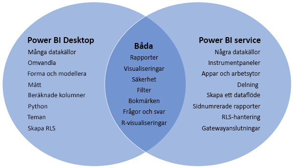
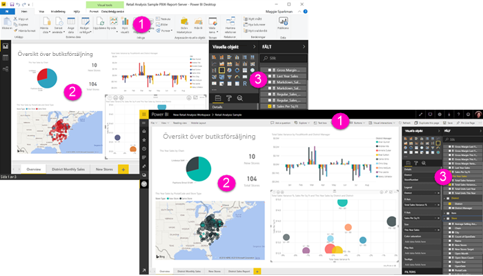

# Jämföra Power BI Desktop och Power BI-tjänsten

I ett Venndiagram där Power BI Desktop och Power BI-tjänsten jämförs skulle området i mitten visa hur de två överlappar. Vissa uppgifter kan du utföra i både Power BI Desktop och i tjänsten. Men på de två kanterna i Venndiagrammet har programmet och tjänsten unika funktioner.  

**Power BI Desktop** är ett komplett verktyg för dataanalys och rapportskapande. När du installerar det kostnadsfria programmet på en lokal dator kan du ansluta till många olika datakällor och kombinera dem (kallas ofta modellering) i en datamodell. [Kom igång-guiden för Power BI Desktop](desktop-getting-started.md) går igenom processen.

**Power BI-tjänsten** är en molnbaserad onlinetjänst för enklare rapportredigering och samarbete för team och företag. Du kan ansluta till datakällor i Power BI-tjänsten också men modelleringen är begränsad. 

De flesta rapportdesigners som arbetar i Business Intelligence-projekt använder **Power BI Desktop** för att skapa rapporter och använder sedan **Power BI-tjänsten** för att dela sina rapporter med andra.

## Rapportredigering

I både programmet och tjänsten kan du skapa och redigera *rapporter*. En rapport kan bestå av en eller flera sidor, med visuella objekt och samlingar med visuella objekt. Du kan lägga till bokmärken, knappar, filter och detaljinformation för att förbättra navigeringen i rapporterna.

Rapportredigerarna i Power BI Desktop och i tjänsten liknar varandra. De består av tre avsnitt:  

1. De övre navigeringsfälten, skiljer sig i Power BI Desktop och tjänsten    
2. Rapportarbetsytan     
3. Fönstren **Fält**, **Visualiseringar** och **Filter**

I den här videon visas rapportredigeraren i Power BI Desktop. 

<iframe width="560" height="315" src="https://www.youtube.com/embed/IkJda4O7oGs" frameborder="0" allowfullscreen></iframe>

## Samarbete i Power BI-tjänsten

När du har skapat dina rapporter kan du spara dem på en *arbetsyta* i **Power BI-tjänsten**, där du och dina kollegor samarbetar. Du skapar *instrumentpaneler* på de rapporterna. Sedan delar du de instrumentpanelerna och rapporterna med rapportanvändare inom och utanför organisationen. Rapportanvändarna visar dem i Power BI-tjänsten i [läsvyn](consumer/end-user-reading-view.md), inte redigeringsvyn. De har inte åtkomst till alla funktioner som är tillgänglig för rapportskapare. 

## Nästa steg

[Vad är Power BI Desktop?](desktop-what-is-desktop.md)

[Skapa en rapport](service-report-create-new.md) i Power BI-tjänsten

[Grundläggande begrepp för rapportdesigners](service-basic-concepts.md)

Har du fler frågor? [Prova Power BI Community](http://community.powerbi.com/)

