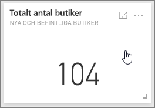
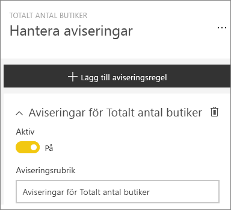
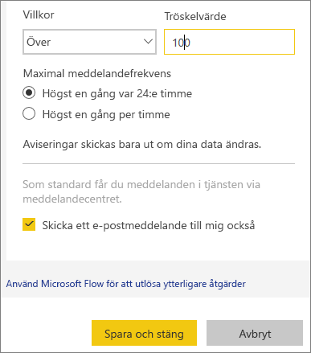
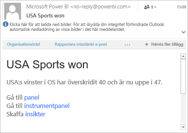
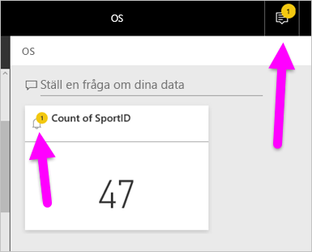
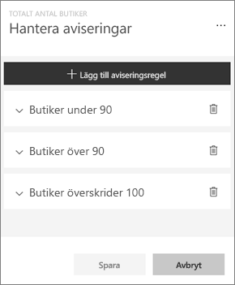
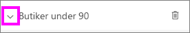
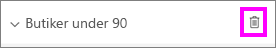
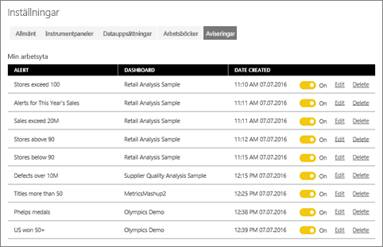

# Datavarningar i Power BI-tjänsten

Ställ in aviseringar som meddelar dig när data i dina instrumentpaneler har ändrats så att de överskrider de gränser du har angett.

Du kan konfigurera aviseringar på paneler om du har en Power BI Pro-licens. Du kan även konfigurera aviseringar om någon delar en instrumentpanel som finns i en [Premium](service-premium-what-is.md)-kapacitet. Aviseringar kan endast konfigureras på paneler som har fästs från visuella objekt i rapporter och endast på mätare, KPI:er och kort. Aviseringar kan konfigureras för visuella objekt som skapats från direktuppspelande datamängder som du fäster från en rapport på en instrumentpanel. Aviseringar kan inte konfigureras på direktuppspelande paneler som skapats direkt på instrumentpanelen med hjälp av **Lägg till panel** > **Anpassade direktuppspelande data**.

Du kan endast se aviseringar som du anger, även om du delar din instrumentpanel. Inte ens instrumentpanelens ägare kan se de aviseringar du anger i din vy av instrumentpanelen. Datavarningar är helt synkroniserade på plattformar. Ställ in och visa datavarningar [i Power BI-appar](consumer/mobile/mobile-set-data-alerts-in-the-mobile-apps.md) och i Power BI-tjänsten. De är inte tillgängliga för Power BI Desktop. Du kan till och med automatisera och integrera aviseringar med Power Automate. Du kan prova själv i den här artikeln om [Power Automate och Power BI](service-flow-integration.md).

> [!WARNING]
> Datadrivna aviseringar ger information om dina data. Om du visar dina Power BI-data på en mobil enhet och den tappas bort eller blir stulen bör du använda Power BI-tjänsten för att inaktivera alla datagenererade aviseringar.

## Ange datavarningar i Power BI-tjänsten

Se när Amanda lägger till aviseringar i rutor på instrumentpanelen. Prova sedan själv genom att följa de stegvisa anvisningarna under videon.

<iframe width="560" height="315" src="https://www.youtube.com/embed/JbL2-HJ8clE" frameborder="0" allowfullscreen></iframe>

I det här exemplet används en kortpanel från exempelinstrumentpanelen detaljhandelsanalys. Om du vill följa med kan du [hämta Exempel på detaljhandelsanalys](sample-retail-analysis.md#get-the-content-pack-for-this-sample).

1. Starta på en instrumentpanel. Från panelen **Totalt antal butiker** väljer du ellipsen.

   

1. Välj klockikonen  för att lägga till en eller flera aviseringar för **Totalt antal butiker**.

1. För att starta väljer du **+ Lägg till varningsregel**, kontrollerar att skjutreglaget **Aktiv** är inställt till **På** och ge aviseringen en rubrik. Namnet hjälper dig att identifiera aviseringarna.

   

1. Bläddra nedåt och ange detaljerad information om aviseringen.  I det här exemplet skapar du en avisering som meddelar dig en gång om dagen om det totala antalet butiker överstiger 100.

   

    Aviseringar visas i **Meddelandecenter**. Power BI skickar även ett e-postmeddelande om aviseringen om du markerar kryssrutan.

1. Välj **Spara och stäng**.

## Ta emot aviseringar

När spårade data når något av dina angivna tröskelvärden sker flera saker. Först kontrollerar Power BI om mer än en timme eller mer än 24 timmar (beroende på vilket alternativ du valde) har gått sedan den senaste aviseringen. Om data överskrider tröskelvärdet får du en avisering.

Därefter skickar Power BI en avisering till **Meddelandecenter** och, om du vill, via e-post. Varje avisering innehåller en direktlänk till dina data. Klicka på länken om du vill se den berörda panelen där du kan utforska, dela och visa mer information.  

* Om du har valt att skicka ett e-postmeddelande kommer du att se följande i din inkorg.

   

* Power BI lägger till ett meddelande i **meddelandecentret** och lägger till en ny aviseringsikon i den berörda panelen.

   

* **Meddelandecenter** visar information om aviseringen.

    

   > [!NOTE]
   > Aviseringar fungerar endast på uppdaterade data. När data uppdateras söker Power BI för att se om en avisering har angetts för dessa data. Om data har uppnått ett aviseringströskelvärde utlöser Power BI en avisering.

## Hantera aviseringar

Det finns många sätt att hantera dina aviseringar:

* På instrumentpanelen.

* På inställningsmenyn för Power BI.

* På en panel i [Power BI-mobilapparna](consumer/mobile/mobile-set-data-alerts-in-the-mobile-apps.md).

### På instrumentpanelen

1. Om du behöver ändra eller ta bort en avisering för en panel öppnar du fönstret **Hantera aviseringar** på nytt genom att välja klockikonen .

    Power BI visar alla aviseringar som du har angett för den panelen.

    

1. Om du vill ändra en avisering, väljer du pilen till vänster om aviseringens namn.

    

1. Om du vill ta bort en avisering, väljer du papperskorgen till höger om aviseringens namn.

      

### På inställningsmenyn för Power BI

1. Välj kugghjulsikonen från menyfältet i Power BI och välj **Inställningar**.

    .

1. Välj **Aviseringar** under **Inställningar**.

    

1. Härifrån kan du aktivera och inaktivera aviseringar, öppna fönstret **Hantera aviseringar** för att ändra eller ta bort aviseringen.

## Överväganden och felsökning

* Aviseringar stöds inte för kortpaneler med datum-/tidsmått.
* Aviseringar fungerar bara med numeriska datatyper.
* Aviseringar fungerar endast på uppdaterade data. De fungerar inte på statiska data.
* Aviseringar fungerar endast på direktuppspelade datamängder om du bygger ett visuellt objekt för KPI, kort eller mätare och sedan fäster det visuella objektet på instrumentpanelen.

## Nästa steg

* [Skapa ett Power Automate som innehåller en datavarning](service-flow-integration.md).

* [Konfigurera datavarningar på din mobila enhet](consumer/mobile/mobile-set-data-alerts-in-the-mobile-apps.md).

* [Vad är Power BI?](fundamentals/power-bi-overview.md)

Har du fler frågor? [Fråga Power BI Community](https://community.powerbi.com/)
