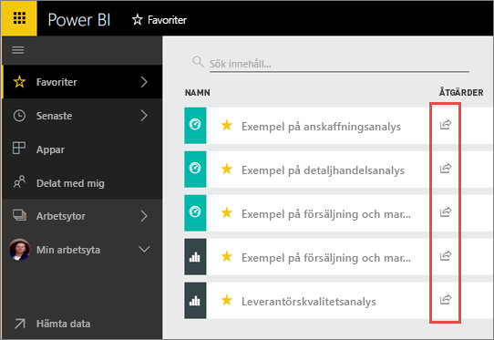
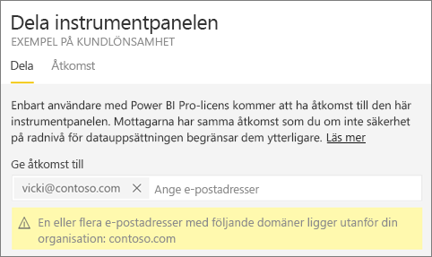
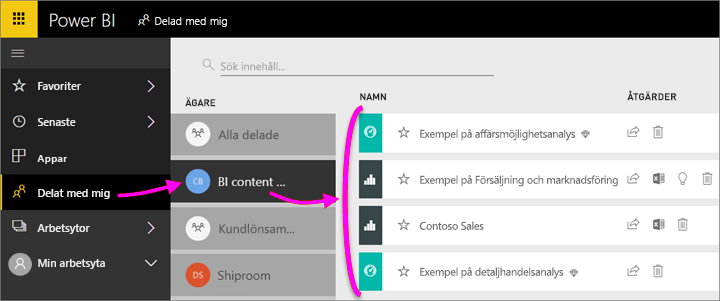
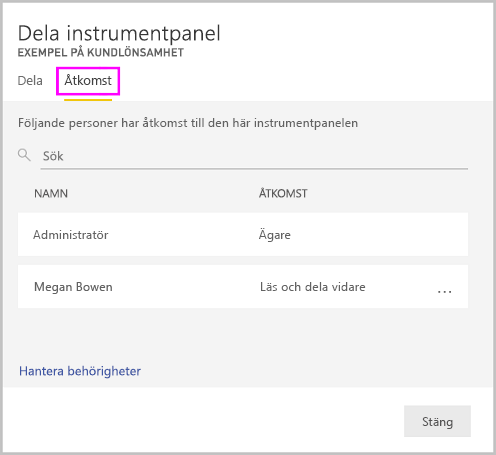
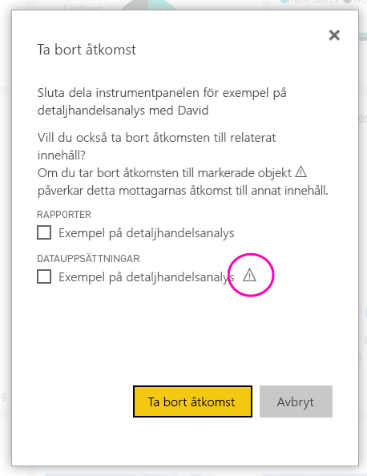
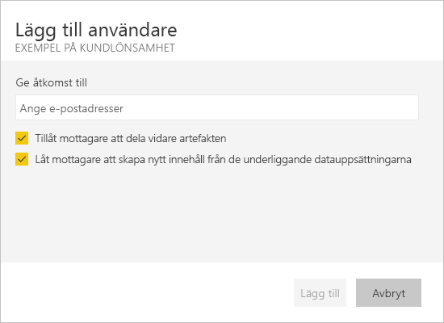
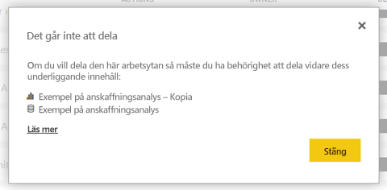

# Dela Power BI-instrumentpaneler och -rapporter med kollegor och andra
*Dela* är ett bra sätt att ge ett fåtal användare åtkomst till dina instrumentpaneler och rapporter. Power BI erbjuder också [flera andra sätt att samarbeta och distribuera instrumentpaneler och rapporter på](service-how-to-collaborate-distribute-dashboards-reports.md).

Med delning, vare sig om du delar innehåll i eller utanför din organisation, behöver du en [Power BI Pro-licens](service-features-license-type.md). Mottagarna behöver också Power BI Pro-licenser, såvida inte innehållet är i en [premiumkapacitet](service-premium-what-is.md). 

Du kan dela instrumentpaneler och rapporter från de flesta platser i Power BI-tjänsten: Favoriter, senaste, delade med mig (om ägaren tillåter det), Min arbetsyta eller andra arbetsytor. När du delar en instrumentpanel eller en rapport, kan de som du delar med se den och interagera med den, men inte redigera den. De ser samma data som visas på instrumentpanelen eller i rapporterna, såvida inte [säkerhet på radnivå (RLS)](service-admin-rls.md) tillämpas. De medarbetare som du delar med kan också dela den med sina medarbetare, om du tillåter detta. Personer utanför organisationen kan också visa och interagera med instrumentpanelen eller rapporten, men kan inte dela den. 

Du kan också [dela en instrumentpanel från vilken Power BI-mobilapp du vill](consumer/mobile/mobile-share-dashboard-from-the-mobile-apps.md). Men kan inte du dela instrumentpaneler från Power BI Desktop.

## Video: Dela en instrumentpanel
Se hur Amanda delar sin instrumentpanel med dina kollegor i och utanför företaget. Prova sedan själv genom att följa de stegvisa anvisningarna under videon.

<iframe width="560" height="315" src="https://www.youtube.com/embed/0tUwn8DHo3s?list=PL1N57mwBHtN0JFoKSR0n-tBkUJHeMP2cP" frameborder="0" allowfullscreen></iframe>

## Dela en instrumentpanel eller en rapport

1. Välj i en lista över instrumentpaneler och rapporter, eller i en öppen instrumentpanel eller rapport välj **Resurs** .

2. Ange fullständiga e-postadresser för enskilda användare, distributionsgrupper och säkerhetsgrupper i den översta rutan. Du kan inte dela med dynamiska distributionslistor. 
   
   Du kan dela med användare vars postadresser finns utanför organisationen, men en varning visas.
   
    
 
   >[!NOTE]
   >Textrutan stöder högst 100 användare eller grupper. Om du vill dela med stort antal användare kan du skapa instrumentpanelen i en arbetsyta och [distribuerar som en app](service-create-distribute-apps.md).
   > 
   > 

3. Lägg till ett meddelande om du vill. Det är valfritt.
4. Om du vill att dina medarbetare ska kunna dela innehåll med andra, kontrollera **Tillåt mottagare att dela din instrumentpanel (eller rapport)** .
   
   Att låta andra dela kallas *dela om*. Om du låter dem göra det, kan de dela om från Power BI-tjänsten och de mobila apparna, eller vidarebefordra e-postinbjudan till andra i din organisation. Inbjudan upphör att gälla efter en månad. Personer utanför organisationen kan inte dela om. Som ägare av innehållet kan du inaktivera delning igen eller återkalla delning igen på individuell grund. Se [sluta dela eller hindra andra från att dela](#stop-sharing-or-stop-others-from-sharing).

5. Välj **Dela.**
   
     
   
   Powerbi skickar en e-postinbjudan till enskilda individer, men inte till grupper med en länk till det delade innehållet. Du ser ett meddelande om att det **Lyckades**. 
   
   När mottagare i din organisation klickar på länken, så lägger Power BI till instrumentpanelen eller rapporten på sidan **Delat med mig**. De kan markera namnet för att se allt innehåll som du delar med dem. 
   
   
   
   När mottagare utanför organisationen klickar på länken kan de se instrumentpanelen eller rapporten, men inte i den vanliga Power BI-portalen. Mer information finns i [dela en instrumentpanel eller rapport med personer utanför organisationen](#share-a-dashboard-or-report-with-people-outside-your-organization).

## Vem har tillgång till en instrumentpanel eller rapport som du delat?
Ibland måste du se vilka personer du har delat med, och se vilka de har delat den med:

1. I listan över instrumentpaneler och rapporter, eller i själva instrumentpanelen eller rapporten, välj **Resurs** . 
2. I den **dela instrumentpanel** eller **dela rapporten** dialogrutan **åtkomst**.
   
    

    Personer utanför organisationen listas som **Gäst**.

## Sluta dela eller hindra andra från att dela
Endast en instrumentpanels eller rapports ägare kan aktivera eller inaktivera omdelning.

### Om du inte har skickat delningsinbjudan ännu
* Rensa den **Tillåt mottagare att dela din instrumentpanel (eller rapport)** kryssrutan längst ned i inbjudan innan du skickar den.

### Om du redan har delat instrumentpanelen eller rapporten
1. I listan över instrumentpaneler och rapporter, eller i själva instrumentpanelen eller rapporten, välj **Resurs** . 
2. I den **dela instrumentpanel** eller **dela rapporten** dialogrutan **åtkomst**.
   
    
3. Markera ellipsen ( **...** ) intill **Läs och dela vidare** och välj:
   
   
   
   * **Läs** om du vill förhindra den personen från att dela med någon annan.
   * **Ta bort åtkomst** om du vill förhindra personen från att se delat innehåll överhuvudtaget.

4. I den **ta bort åtkomst** dialogrutan bestämmer du om du även vill ta bort åtkomsten till relaterat innehåll, till exempel rapporter och datauppsättningar. Om du tar bort objekt med en varningsikon , är det bäst att även ta bort relaterat innehåll eftersom det inte visas korrekt.

    

## Dela en instrumentpanel eller rapport med personer utanför din organisation
När du delar med personer utanför organisationen, får de ett e-postmeddelande med en länk till den delade instrumentpanelen eller rapporten som de måste logga in till Power BI att se. Om de inte har någon Power BI Pro-licens kan de registrera sig för en licens efter att ha klickat på länken.

När de har loggat in visas den delade instrumentpanelen eller rapporten i ett eget webbläsarfönster, inte i den vanliga Power BI-portalen. De måste bokmärka länken om du vill ha åtkomst till den här instrumentpanelen eller rapporten.

De kan inte redigera något innehåll i den här instrumentpanelen eller rapporten. Även om de kan interagera med diagrammen och ändra filter eller utsnitt, kan inte de spara sina ändringar. 

Endast dina direkta mottagare kan se den delade instrumentpanelen eller rapporten. Om du t.ex. skickade e-postmeddelandet till Vicki@contoso.com, så kan endast Vicki se instrumentpanelen. Ingen annan kan se instrumentpanelen, även om de har länken. Vicki måste använda samma e-postadress för att komma åt den. Om hon loggar med e-postadress, hon inte åtkomst till instrumentpanelen.

Personer utanför organisationen kan inte se några data om roll - eller säkerhet på radnivå har implementerats på lokala Analysis Services-tabellmodeller.

Om du skickar en länk från en Power BI-mobilapp till personer utanför organisationen, öppnas klickar på länken instrumentpanelen i en webbläsare, inte i Power BI-mobilappen.

Om du [att externa gästanvändare redigera och hantera innehåll i organisationen](service-admin-portal.md#export-and-sharing-settings), endast förbrukning standardupplevelse gäller inte för dem. [Läs mer](service-admin-azure-ad-b2b.md).

## Begränsningar och överväganden
Saker att tänka på när det gäller att dela instrumentpaneler och rapporter:

* Normalt ser du och dina kollegor samma data på instrumentpanelen eller rapporten. Så om du har behörighet att se mer data än vad de har, så kan de se alla dina data på instrumentpanelen eller rapporten. Men om [säkerhet på radnivå (RLS)](service-admin-rls.md) tillämpas på instrumentpanelens eller rapportens underliggande datauppsättning, då avgör de enskilda användarnas autentiseringsuppgifter vilka data de har åtkomst till.
* Alla som du delar din instrumentpanel med kan se den och interagera med relaterade rapporter i [läsvyn](consumer/end-user-reading-view.md#reading-view). De kan inte skapa rapporter eller spara ändringar i befintliga rapporter.
* Även om ingen kan se eller hämta datauppsättningen, kan de komma åt datauppsättningen direkt med hjälp av analysera i Excel-funktionen. En administratör kan begränsa möjligheten att använda analysera i Excel för alla användare i en grupp. Begränsningen gäller dock för alla användare i gruppen, för varje arbetsyta som gruppen tillhör.
* Alla kan [uppdatera data](refresh-data.md) manuellt.
* Om du använder Office 365 för e-post kan du dela med medlemmar i en distributionsgrupp genom att ange den e-postadress som är kopplad till distributionsgruppen.
* Medarbetare som delar din e-postdomän och medarbetare vars domäner är olika men registrerade inom samma klientorganisation kan dela instrumentpanelen med andra. Till exempel om domänerna contoso.com och contoso2.com har registrerats i samma klient och din e-postadress är konrads@contoso.com, så kan både ravali@contoso.com och gustav@contoso2.com kan dela, så länge som du har gett dem behörighet att dela.
* Om dina medarbetare redan har åtkomst till en specifik instrumentpanel eller rapport, kan du skicka en direktlänk genom att kopiera Webbadressen när du är på instrumentpanelen eller rapporten. Exempel: `https://powerbi.com/dashboards/g12466b5-a452-4e55-8634-xxxxxxxxxxxx`
* På samma sätt, om dina medarbetare redan har åtkomst till en specifik instrumentpanel, kan du [skicka en direktlänk till den underliggande rapporten](service-share-reports.md). 
* Du kan dela med, högst 100 användare eller grupper i en enda resurs-åtgärd. Du kan dock ge mer än 500 användare åtkomst till ett objekt. Du gör detta genom att dela flera gånger genom att ange användarna individuellt eller dela med en grupp som innehåller alla användare.

## Felsöka delning

### Mina instrumentpanelsmottagare ser en låsikon i en panel eller ett meddelande om ”Behörighet krävs”

De personer som du delar med kan se en låst panel på en instrumentpanel eller ett meddelande om att ”behörighet krävs” när de försöker visa en rapport.

I så fall måste du ge dem behörighet till den underliggande datauppsättningen:

1. Gå till fliken **Datauppsättningar** i listan med innehåll.

1. Välj ellipsen ( **...** ) bredvid datauppsättningen, Välj **hantera behörigheter**.

    

1. Välj **Lägg till användare**.

    

1. Ange fullständiga e-postadresser för enskilda användare, distributionsgrupper och säkerhetsgrupper. Du kan inte dela med dynamiska distributionslistor.

    

1. Välj **Lägg till**.

### Jag kan inte dela en instrumentpanel eller en rapport

Om du vill dela en instrumentpanel eller rapport, behöver du behörighet att dela det underliggande innehållet; det vill säga relaterade rapporter och datauppsättningar. Om du ser ett meddelande om att du inte kan dela be rapportskaparen att ge dela för dessa rapporter och datauppsättningar.

## Nästa steg
* Har du feedback till oss? Gå till [Power BI Community-webbplatsen](https://community.powerbi.com/) med dina förslag.
* [Hur ska jag samarbeta kring och dela instrumentpaneler och rapporter?](service-how-to-collaborate-distribute-dashboards-reports.md)
* [Dela en filtrerad Power BI-rapport](service-share-reports.md).
* Har du några frågor? [Testa Power BI Community](http://community.powerbi.com/).

