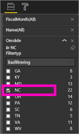
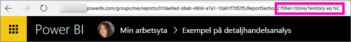

# Dela Power BI-rapporter med dina medarbetare
*Dela* är ett bra sätt att ge ett fåtal användare åtkomst till dina instrumentpaneler och rapporter. I Power BI finns [flera olika sätt att samarbeta och distribuera rapporter](service-how-to-collaborate-distribute-dashboards-reports.md) – att dela är bara en av dem.

För att kunna dela måste både du och mottagaren ha en [Power BI Pro-licens](service-free-vs-pro.md), annars måste innehållet finnas i en [Premium-kapacitet](service-premium.md). Har du förslag? Power BI-teamet är alltid intresserade av din feedback, så du är välkommen till [Power BI Community-webbplatsen](https://community.powerbi.com/).

Du kan dela en rapport med kolleger i samma e-postdomän som du, från din egen Min arbetsyta eller från en apparbetsyta. När du delar en rapport kan de som du delar med se den och interagera med den, men de kan inte redigera den. De ser samma data som visas i rapporten såvida inte [Säkerhet på radnivå (RLS)](service-admin-rls.md) tillämpas. 

## Dela en Power BI-rapport
1. I Power BI-tjänsten [skapar du en instrumentpanel](service-dashboard-create.md) med minst en panel som länkar till den rapport som du vill dela. 
   
    Även om du bara vill dela rapporten måste du skapa en instrumentpanel som länkar till rapporten först och sedan dela den. 

1. I det övre högra hörnet på instrumentpanelen väljer du **Dela**.

     
  
2. Skicka den till mottagarna. Om du inte vill skicka e-post om instrumentpanelen, avmarkerar du kryssrutan **Skicka e-postmeddelanden till mottagarna**.

     

4. Välj **Dela**.

      De personer som du delar instrumentpanelen med har nu behörighet att se den underliggande rapporten. 

1. Öppna rapporten i Power BI-tjänsten, kopiera rapportsidans URL och skicka den till dina medarbetare. 
   
    När de väljer länken öppnas en skrivskyddad version av rapporten i Power BI.

## Dela en filtrerad version av en rapport
Hur gör du om du vill dela en filtrerad version av en rapport? Kanske en rapport som endast visar data för en viss ort, säljare eller år. Detta gör du genom att skapa en anpassad URL.

1. Öppna rapporten i [redigeringsvyn](service-reading-view-and-editing-view.md), använd filtret och spara rapporten.
   
   I det här exemplet filtrerar vi [Exempel på detaljhandelsanalys](sample-tutorial-connect-to-the-samples.md) till att endast visa värden där **Område** är lika med **NC**.
   
   
2. Lägg till följande i slutet av rapportsidans URL:
   
   ?filter=*tabellnamn*/*fältnamn* eq *värde*
   
    Fältet måste vara av typen **sträng** och varken *tabellnamn* eller *fältnamn* får innehålla blanksteg.
   
   I vårt exempel är namnet på tabellen **Butik**, namnet på fältet är **Område** och värdet som vi vill filtrera på är **NC**:
   
    ?filter=Butik/Område eq 'NC'
   
   
   
   Webbläsaren lägger till specialtecken som motsvarar snedstreck, blanksteg och apostrofer, så resultatet blir:
   
   app.powerbi.com/groups/me/reports/010ae9ad-a9ab-4904-a7a1-10a61f70f2f5/ReportSection2?filter=Store%252FTerritory%20eq%20%27NC%27

3. Skicka denna URL till dina medarbetare. 
   
   När de väljer länken öppnas en skrivskyddad version av den filtrerade rapporten i Power BI.

## Nästa steg
* Har du feedback till oss? Gå till [Power BI Community-webbplatsen](https://community.powerbi.com/) med dina förslag.
* [Hur ska jag samarbeta kring och dela instrumentpaneler och rapporter?](service-how-to-collaborate-distribute-dashboards-reports.md)
* [Dela en instrumentpanel](service-share-dashboards.md)
* Har du fler frågor? [Testa Power BI Community](http://community.powerbi.com/).

