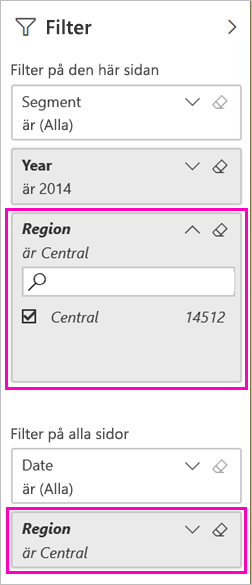
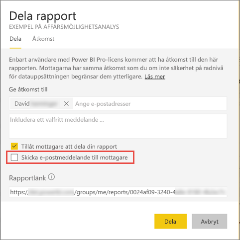

# Två sätt att dela en filtrerad Power BI-rapport
*Dela* är ett bra sätt att ge ett fåtal användare åtkomst till dina instrumentpaneler och rapporter. Hur gör du om du vill dela en filtrerad version av en rapport? Kanske en rapport som endast visar data för en viss ort, säljare eller år. Prova att filtrera en rapport och dela den eller skapa en anpassad URL. Rapporten filtreras när mottagarna öppnar den för första gången. De kan ta bort filtret genom att ändra URL:en. 

Power BI erbjuder också [andra sätt att samarbeta och distribuera dina rapporter på](service-how-to-collaborate-distribute-dashboards-reports.md). För att kunna dela måste både du och mottagaren ha en [Power BI Pro-licens](service-features-license-type.md), annars måste innehållet finnas i en [Premium-kapacitet](service-premium-what-is.md). 

## Två sätt att filtrera en rapport

För båda filtrerings teknikerna använder vi exempelappen Marknadsföring och försäljning som mall. Vill du testa? Du kan också installera exempelappen [Marknadsföring och försäljning](https://appsource.microsoft.com/product/power-bi/microsoft-retail-analysis-sample.salesandmarketingsample?tab=Overview).

### Lägg till ett filter

Lägga till ett rapport i [redigeringsvyn](consumer/end-user-reading-view.md) och lägga till ett filter.

I det här exemplet ska vi filtrera kategorin YTD i exempelappen Marknadsföring och försäljning för att endast visa värden där **Region** är lika med **Central**. 
 

Spara rapporten.

### Skapa ett filter i URL:en

När du lägger till filtret i slutet av rapportsidans URL beter den sig lite annorlunda. Den filtrerade sidan ser likadan ut. Men Power BI lägger till filtret i hela rapporten och tar bort de andra värdena från filterfönstret.  

Lägg till följande i slutet av rapportsidans URL:
   
    ?filter=*tablename*/*fieldname* eq *value*
   
Fältet måste vara av typen siffra, datum/tid eller sträng. Värdet för *tabellnamn* eller *fältnamn* kan inte innehålla blanksteg.
   
I vårt exempel är namnet på tabellen **Geo**, namnet på fältet är **Region** och värdet som vi vill filtrera på är **Central**:
   
    ?filter=Geo/Region eq 'Central'

Webbläsaren lägger till specialtecken som motsvarar snedstreck, blanksteg och apostrofer, så resultatet blir ungefär så här:
   
    app.powerbi.com/groups/xxxx/reports/xxxx/ReportSection4d00c3887644123e310e?filter=Geo~2FRegion%20eq%20'Central'

Spara rapporten.

Se artikeln [Filtrera en rapport med frågesträngparametrar i URL:en](service-url-filters.md) för mycket mer information.

## Dela en filtrerad rapport

1. När du [delar rapporten](service-share-dashboards.md) ska du avmarkera kryssrutan **Skicka e-postmeddelande till mottagare**.

    

4. Skicka en länk med filtret som du skapade tidigare.

## Nästa steg
* [Olika sätt att dela ditt arbete i Power BI](service-how-to-collaborate-distribute-dashboards-reports.md)
* [Dela en instrumentpanel](service-share-dashboards.md)
* Har du fler frågor? [Testa Power BI Community](https://community.powerbi.com/).
* Har du feedback till oss? Gå till [Power BI Community-webbplatsen](https://community.powerbi.com/) med dina förslag.

