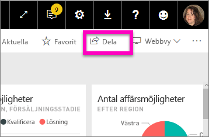
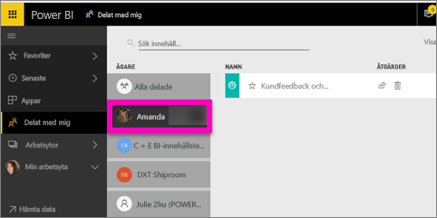

# Visa Power BI-instrumentpaneler som har delats med mig
## Delat med mig

När en kollega delar en instrumentpanel med dig, läggs dess panel till i din **delat med mig**-lista. Instrumentpanelen är endast tillgänglig från **delat med mig** och inte från en arbetsyta eller från **appar**.

Titta när Amanda förklarar innehållslistan **delat med mig** och visar hur du navigera och filtrerar listan. Prova sedan själv genom att följa de stegvisa anvisningarna under videon. Om du vill visa instrumentpaneler som delas med dig, måste du ha en Power BI Pro-licens. Läs [Vad är Power BI Premium?](service-premium.md) för mer information.

<iframe width="560" height="315" src="https://www.youtube.com/embed/G26dr2PsEpk" frameborder="0" allowfullscreen></iframe>

Du kommer att ha många alternativ för att interagera med instrumentpanelen och dess underliggande rapport, beroende på vilka behörigheter som ägaren ger dig. Det inkluderar att kunna göra kopior av instrumentpanelen, öppna rapporten [i läsvy](service-reading-view-and-editing-view.md) och att dela vidare till andra kollegor.

## Åtgärder som är tillgängliga från **delat med mig**-skärmen
* Välj stjärnikonen för att [favoritmarkera en instrumentpanel](service-dashboard-favorite.md).
* [Ta bort en instrumentpanel](service-delete.md)  
* Vissa instrumentpaneler kan delas vidare  
* Om dina listor över instrumentpaneler blir långa, kan du dessutom [använda sökfältet och sortering för att hitta vad du behöver](service-navigation-search-filter-sort.md).
  
  > [!NOTE]
  > Välj klassificeringsknappen för information om EGRC-klassificeringar, eller [besök klassificering av instrumentpanelsdata ](service-data-classification.md).
  > 
  > 
* Välj namnet på en instrumentpanel för att öppna den och utforska. När du har öppnat den delade instrumentpanelen, kan du använda frågor och svar för att ställa frågor om underliggande data eller välja en panel för att öppna och interagera med rapporten i läsvy.

## Filtrera delade instrumentpaneler efter ägare
Innehållet i skärmen **delat med mig** kan filtreras ytterligare efter innehållsägare. Om jag till exempel väljer **Amanda**, visas bara den instrumentpanel som Amanda har delat med mig.

## Nästa steg
[Power BI – grundläggande begrepp](service-basic-concepts.md)  
[Power BI Premium – vad är det?](service-premium.md)  

Har du fler frågor? [Fråga Power BI Community](http://community.powerbi.com/)

