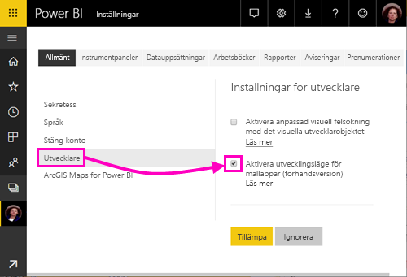
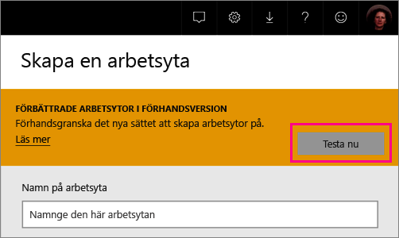
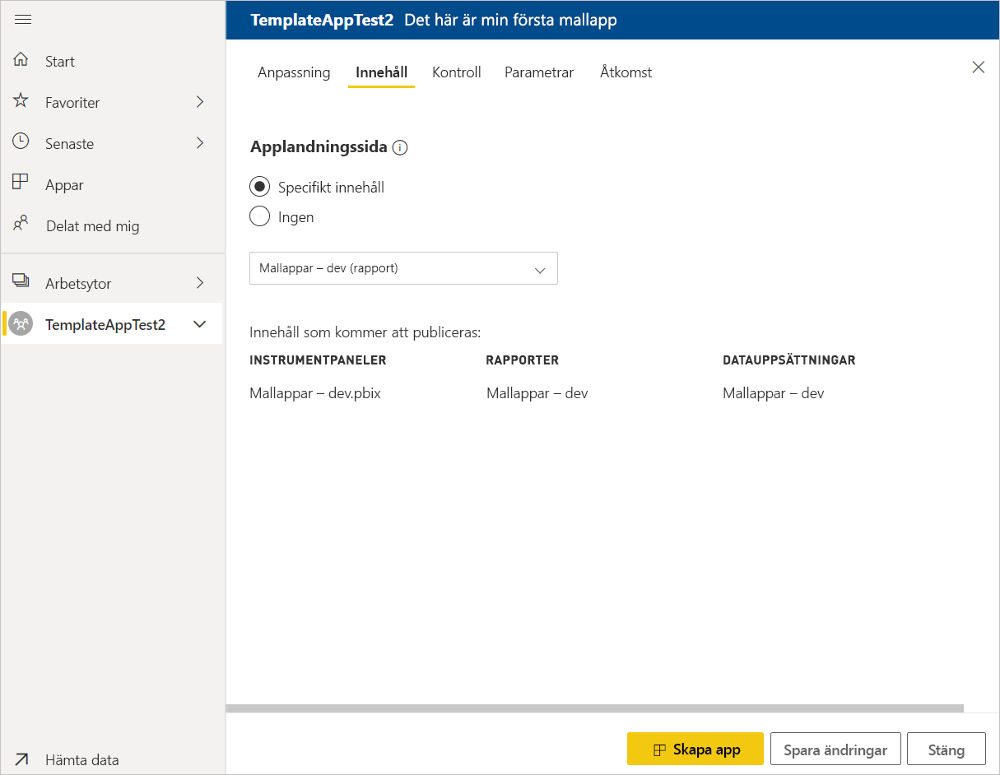
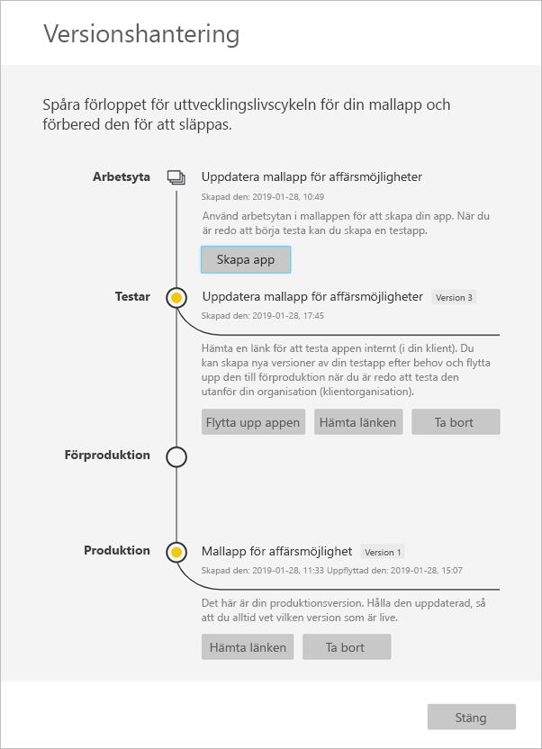

# Skapa en mallapp i Power BI (förhandsversion)

Med de nya Power BI-*mallapparna* kan Power BI-partner skapa Power BI-appar med lite eller ingen kodning och sedan distribuera dem till Power BI-kunder.  Den här artikeln innehåller stegvisa instruktioner för hur du skapar en mallapp i Power BI.

Om du kan skapa Power BI-rapporter och instrumentpaneler, kan du bli en *mall app builder* och skapar och paketerar analytiskt innehåll till en *app*. Du kan distribuera din app till andra Power BI-klienter via alla tillgängliga plattformar, till exempel AppSource eller genom att använda det i din egen webbtjänst. Som en builder har du möjlighet att skapa en skyddad analytics-paket för distribution.

Power BI-klientadministratörer styr vem i organisationen som kan skapa mallappar och vem som kan installera dem. De användare som har behörighet kan installera din mallapp, och sedan ändrar du den och distribuera den till Power BI-användare i organisationen.

## Förutsättningar

Här följer kraven för att skapa en mallapp:  

- En [Power BI Pro-licens](service-self-service-signup-for-power-bi.md)
- En [installation av Power BI Desktop](desktop-get-the-desktop.md) (valfritt)
- Bekant med den [grundläggande begrepp för Power BI](service-basic-concepts.md)
- Behörighet att skapa en mallapp. Se [mallappinställningarna i Power BI-administratörsportalen](service-admin-portal.md#template-apps-settings-preview) för mer information.

## Aktivera läget för apputveckling

För att kunna skapa en mallapp som kan distribueras till andra Power BI-klienter måste du vara i läget för apputveckling. Annars skapar du bara en app för Power BI-användare i din organisation.

1. Öppna Power BI-tjänsten i en webbläsare.
2. Gå till **Inställningar** > **Allmänt** > **Utvecklare** > **Aktivera mallappens utvecklingsläge**.

    

    Om du inte ser det alternativet ber du Power BI-administratören ge dig [behörighet för mallapputveckling](service-admin-portal.md#template-apps-settings-preview) i administratörsportalen.

3. Välj **Tillämpa**.

## Skapa en arbetsyta för mallappen

För att kunna skapa en mallapp som du kan distribuera till andra Power BI-klientorganisationer måste du skapa den i de nya apparbetsytorna.

1. Välj **Arbetsytor** > **Skapa app-arbetsyta** i Power BI-tjänsten.

    

2. I **Skapa en app-arbetsyta**, i **Förbättrade arbetsytor i förhandsversion**, väljer du **Prova nu**.

    

3. Ange ett namn, en beskrivning (valfritt) och en logotypbild (valfritt) för din apparbetsyta.

4. Välj **Utveckla en mallapp**.

    

5. Välj **Spara**.
>[!NOTE]
>Du behöver behörighet från Power BI-administratören att göra mallen appar.

## Skapa innehållet i din mallapp

Som med en vanlig Power BI-apparbetsyta är nästa steg att skapa innehållet på arbetsytan.  I förhandsversionen av mallapparna stöder vi bara en av varje typ: en datauppsättning, en rapport och en instrumentpanel.

- [Skapa ditt Power BI-innehåll](power-bi-creator-landing.md) på apparbetsytan.

Om du använder parametrar i Power Query måste du se till att de har korrekt definierad typ (till exempel Text). Typerna Any och Binary stöds inte.

I [Tips för att skapa mallappar i Power BI (förhandsversion)](service-template-apps-tips.md) finns förslag på saker du kan överväga när du skapar rapporter och instrumentpaneler för din mallapp.

## Skapa en testmallapp

Nu när du har innehåll på arbetsytan är du redo att paketera det i en mallapp. Det första steget är att skapa en testmallapp som endast är tillgänglig inom din organisation i din klientorganisation.

1. Välj **Skapa app** på arbetsytan för mallappen.

    

    Här kan fylla du i ytterligare byggnad alternativ för din mallapp i fem kategorier:

    **Anpassning**

    
    - Appnamn
    - Beskrivning
    - Supportwebbplats (länk visas under appinfo efter distribuera mallapp som org app)
    - Applogotyp (45K gränsen för filstorlek, 1:1 bredd-höjd-förhållande, .png .jpg, .jpeg format)
    - Temafärg för App

    **Innehåll**

    **Applandningssida:** Definiera en rapport eller instrumentpanel ska vara startsidan för din app, använder en landningssida som får ett gott intryck:

    

    **Kontroll**

    Ange gränser och begränsningar som programanvändare har med innehållet i ditt program. Du kan använda den här kontrollen för att skydda immateriell egendom i din app.

    

    >[!NOTE]
    >Exportera till .pbix-format blockeras alltid för användare som installerar appen.

    **Parametrar**

    Använd den här kategorin för att hantera parametern beteende när du ansluter till datakällor. Läs mer om [skapar frågeparametrar](https://powerbi.microsoft.com/blog/deep-dive-into-query-parameters-and-power-bi-templates/).

    
    - **Värdet**: standardvärde för parametern.
    - **Krävs**: Använd detta för att kräva installationsprogrammet för att en viss användare indataparameter.
    - **Lås**: Låsning förhindrar att installationsprogrammet uppdaterar en parameter.
    - **Statisk**: Aktivera om appen innehåller *endast* exempeldata. När du väljer **Statiska**, installationsguiden inte be användare att ansluta en datakälla.

    **Åtkomst** i testfasen, bestämmer du vilka andra i organisationen kan installera och testa din app. Oroa dig inte, du kan alltid gå tillbaka och ändra inställningarna senare (inställningen påverkar inte åtkomst till appen distribuerade mall).

2. Välj **Skapa app**.

    Ett meddelande om att testappen är klar visas med en länk som du kan kopiera och dela med apptestarna.

    

    Du har också gjort det första steget i versionshanteringsprocessen.

## Hantera publiceringen av mallappen

Innan du gör mallappen allmänt tillgänglig vill du försäkra dig om att den är klar. I Power BI finns ett versionshanteringsfönster där du kan följa och inspektera den fullständiga versionshanteringsvägen för appen. Du kan också utlösa övergången från steg till steg. De vanliga stegen är:

- Skapa en testapp: endast för test inom organisationen.
- Höj upp testpaketet till förproduktionssteget: testa utanför organisationen.
- Höj upp förproduktionspaketet till produktion: produktionsversion.
- Ta bort alla paket eller börja om från föregående steg.

URL: en ändras inte när du flyttar mellan versionen faser. Befordran påverkar inte själva URL: en.

Vi ska gå igenom stegen:

1. Välj **Versionshantering** i arbetsytan för mallappen.

    

2. Välj **Skapa app**.

    Om du skapade testappen i **Skapa testmallappen** ovan är den gula punkten bredvid **Testar** redan fylld och du behöver inte välja **Skapa app** här. Om du väljer den går du tillbaka till processen för att skapa en mallapp.

3. Välj **Hämta länk**.

    

4. Om du vill testa appinstallationsupplevelsen kopierar du länken i meddelandefönstret och klistrar in den i ett nytt webbläsarfönster.

    Därifrån följer du samma procedur som användarna följer. Se [Installera och distribuera mallappar i organisationen](service-template-apps-install-distribute.md) om du vill se deras version.

5. Välj **Installera** i dialogrutan.

    När installationen är klar visas ett meddelande om att den nya appen är klar.

6. Välj **Gå till app**.
7. I **Kom igång med din nya app** visas appen så som dina kunder kommer att se den.

    
8. Välj **Utforska appen** att verifiera testappen med exempeldata.
9. Om du vill göra ändringar går du tillbaka till appen i den ursprungliga arbetsytan. Gör ändringar i testappen tills du är nöjd.
10. När du är redo att marknadsföra din app till Förproduktion utföra ytterligare tester utanför din klientorganisation går du tillbaka till den **Release Management** rutan och välj **befordra app**. 

    

    >[!NOTE]
    > När appen höjs blir den allmänt tillgängliga utanför din organisation.

11. Välj **Höj en nivå** för att bekräfta ditt val.
12. Kopiera den nya URL:en så att du kan dela den för testning utanför din klientorganisation. Den här länken är också det som du skickar in för att börja distribuera din app på AppSource genom att skapa en [nytt erbjudande om partnerportalen i molnet](https://docs.microsoft.com/azure/marketplace/cloud-partner-portal/power-bi/cpp-publish-offer). Skicka endast Förproduktion länkar till partnerportalen i molnet. Endast när appen har godkänts och du får meddelandet att publiceras den i AppSource, kan du flytta upp det här paketet till produktion i Power BI.
13. När appen är klar för produktion eller delning via AppSource går du tillbaka till fönstret **Versionshantering** och väljer **Höj upp appen** bredvid **Förproduktion**.
14. Välj **Höj en nivå** för att bekräfta ditt val.

    Nu är din app i produktion och klar för distribution.

    

Vi rekommenderar att du skickar appen till AppSource så att den blir allmänt tillgänglig för tusentals Power BI-användare runt om i världen. Se [Power BI Application offer](https://docs.microsoft.com/azure/marketplace/cloud-partner-portal/power-bi/cpp-power-bi-offer) (Power BI-programerbjudande) för mer information.

## Uppdatera din app

Nu när appen är i produktion kan börja du om i testfasen, utan att det påverkar appen i produktion.

1. Välj **Skapa app** i fönstret **Versionshantering**.
2. Börja om skapandeprocessen.
3. När du har angett **Anpassning**, **Innehåll**, **Kontroll** och **Åtkomst** väljer du **Skapa app** på nytt.
4. Välj **Stäng** och gå tillbaka till **Versionshantering**.

   Nu kan du se att du har två versioner: Versionen som är i produktion, samt en ny version i testning.

    

5. När du är redo att marknadsföra din app till Förproduktion utföra ytterligare tester utanför din klientorganisation går du tillbaka till fönstret versionshantering och välj **befordra app** bredvid **testning**.
6. Länken är nu live, skicka den igen till partnerportalen i molnet genom att följa stegen i [Power BI-appen erbjudandet uppdatering](https://docs.microsoft.com/azure/marketplace/cloud-partner-portal/power-bi/cpp-update-existing-offer).

>[!NOTE]
>Uppgradera din app till produktion steg förrän din app har godkänts av partnerportalen i molnet och du har publicerat.

## Nästa steg

Se hur dina kunder interagerar med din mallapp i [Installera, anpassa och distribuera mallappar i organisationen](service-template-apps-install-distribute.md).

Se [Power BI Application offer](https://docs.microsoft.com/azure/marketplace/cloud-partner-portal/power-bi/cpp-power-bi-offer) (Power BI-programerbjudande) för mer information.
