# Skapa en mallapp i Power BI

Med de nya Power BI-*mallapparna* kan Power BI-partner skapa Power BI-appar med lite eller ingen kodning och sedan distribuera dem till Power BI-kunder.  Den här artikeln innehåller stegvisa instruktioner för hur du skapar en mallapp i Power BI.

Om du kan skapa rapporter och instrumentpaneler i Power BI kan du även bli en *mallapputvecklare* som skapar och paketerar analytiskt innehåll i en *app*. Du kan distribuera appen till andra Power BI-klientorganisationer via valfri tillgänglig plattform, till exempel AppSource, eller genom att använda den i din egen webbtjänst. Som utvecklare kan du skapa ett skyddat analyspaket för distribution.

Power BI-klientadministratörer styr vem i organisationen som kan skapa mallappar och vem som kan installera dem. Användare med behörighet kan installera din mallapp och sedan ändra den och distribuera den till Power BI-kunder i sin egen organisation.

## Förutsättningar

Här följer kraven för att skapa en mallapp:  

- En [Power BI Pro-licens](service-self-service-signup-for-power-bi.md)
- En [installation av Power BI Desktop](desktop-get-the-desktop.md) (valfritt)
- Kunskap om [grundläggande begrepp i Power BI](service-basic-concepts.md)
- Behörighet för att dela en mallapp offentligt. Se [mallappinställningarna i Power BI-administratörsportalen](service-admin-portal.md#template-apps-settings) för mer information.

## Skapa mallarbetsytan

När du ska skapa en mallapp som du kan distribuera till andra klientorganisationer i Power BI måste du skapa den i en av de nya arbetsytorna.

1. Välj **Arbetsytor** > **Skapa arbetsyta** i Power BI-tjänsten.

    

2. I **Skapa en arbetsyta** väljer du **Uppgradera till ny**.

    

3. Ange ett namn, en beskrivning (valfritt) och en logotypbild (valfritt) för arbetsytan.

4. Expandera avsnittet **Avancerat** och välj **Utveckla en mallapp**.

    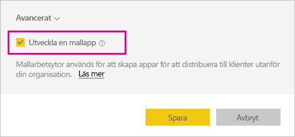

5. Välj **Spara**.
>[!NOTE]
>Du behöver behörighet från Power BI-administratören för att sprida mallappar.

## Skapa innehållet i din mallapp

Precis som med en vanlig Power BI-arbetsyta är nästa steg att skapa innehållet på arbetsytan.  

- [Skapa ditt Power BI-innehåll](power-bi-creator-landing.md) på arbetsytan.

Om du använder parametrar i Power Query måste du se till att de har korrekt definierad typ (till exempel Text). Typerna Any och Binary stöds inte.

I [Tips för att skapa mallappar i Power BI](service-template-apps-tips.md) finns förslag på saker du kan överväga när du skapar rapporter och instrumentpaneler för din mallapp.

## Skapa en testmallapp

Nu när du har innehåll på arbetsytan är du redo att paketera det i en mallapp. Det första steget är att skapa en testmallapp som endast är tillgänglig inom din organisation i din klientorganisation.

1. Välj **Skapa app** på mallarbetsytan.

    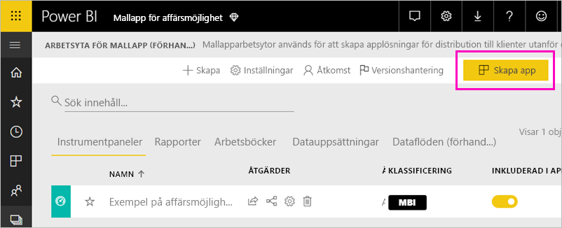

    Här fyller du i ytterligare alternativ för mallappen i fem kategorier:

    **Anpassning**

    
    - Appnamn
    - Beskrivning
    - Supportwebbplats (länken visas under appinformationen när mallappen har distribuerats om som en organisationsapp)
    - Applogotyp (filen får vara max 45 kB, den ska ha bildförhållandet 1:1 och formaten .png, .jpg och .jpeg stöds)
    - Appens temafärg

    **Navigering**

    Aktivera **Nytt navigeringsverktyg** där du kan definiera appens navigeringsfönster (mer information finns i [Utforma navigeringsfunktionen](service-create-distribute-apps.md#design-the-navigation-experience) i den här artikeln).

   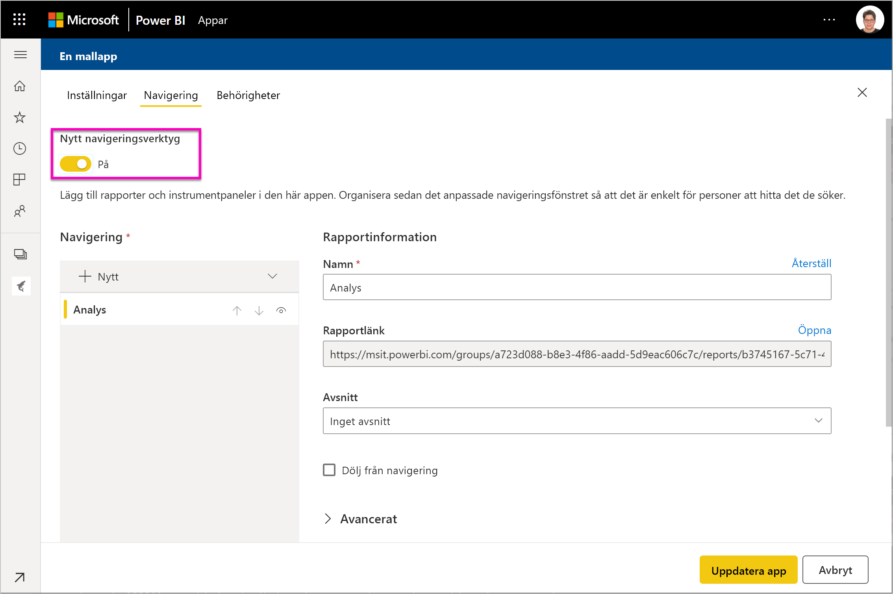
    
    **Applandningssida:** Om du bestämmer dig för att välja bort navigeringsverktyget har du alternativet att välja applandningssidan. Ange en rapport eller instrumentpanel som ska vara landningssida för din app. Använd en landningssida som ger rätt intryck.

    **Kontroll**

    Ange vilka innehållsbegränsningar som ska gälla för appanvändarna. På det här sättet kan du skydda immateriell egendom i appen.

    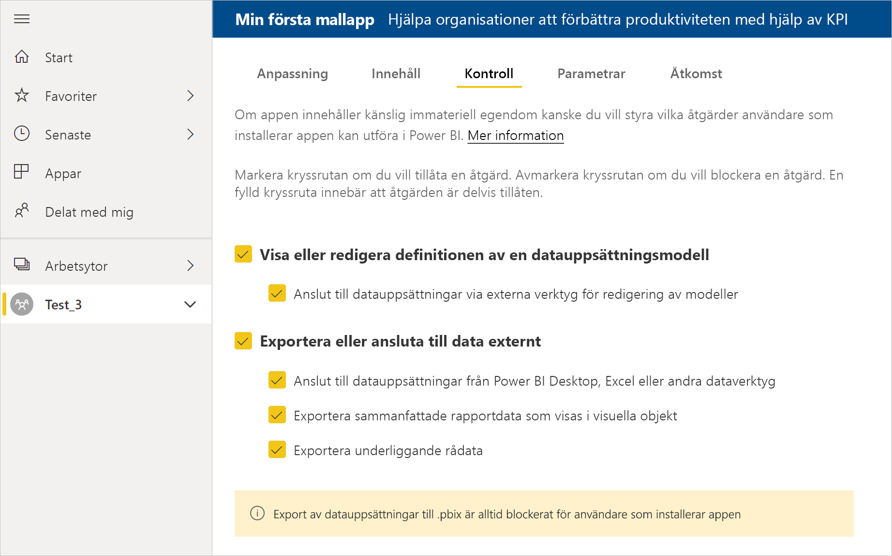

    >[!NOTE]
    >Export till .pbix-format är alltid blockerad för användare som installerar appen.

    **Parametrar**

    Använd den här kategorin till att hantera parametrarnas beteende vid anslutning till datakällor. Läs mer om att [skapa frågeparametrar](https://powerbi.microsoft.com/blog/deep-dive-into-query-parameters-and-power-bi-templates/).

    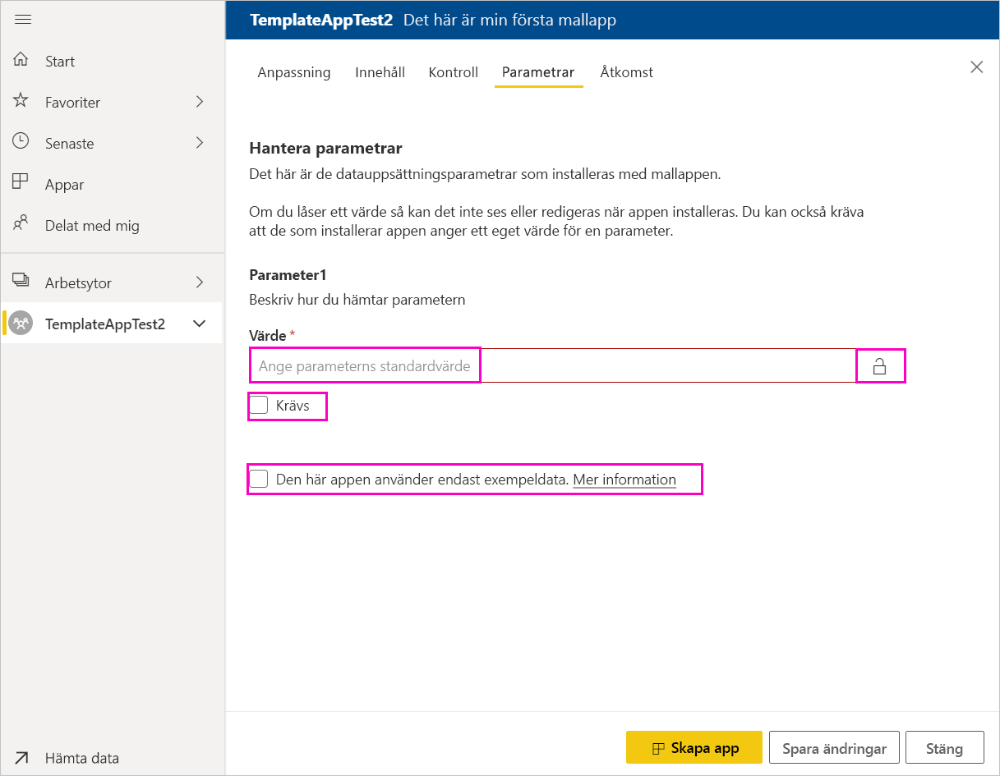
    - **Värde**: parameterns standardvärde.
    - **Krävs**: ange det här om den som installerar måste ange ett användarspecifikt värde.
    - **Lås**: låsning förhindrar att installationsprogrammet uppdaterar en parameter.

    **Åtkomst**: under testfasen kan du avgöra vilka personer i organisationen som ska kunna installera och testa appen. Oroa dig inte, du kan alltid gå tillbaka och ändra de här inställningarna senare (inställningarna påverkar inte åtkomsten till den distribuerade mallappen).

2. Välj **Skapa app**.

    Ett meddelande om att testappen är klar visas med en länk som du kan kopiera och dela med apptestarna.

    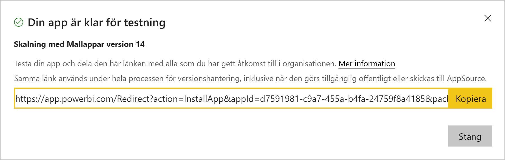

    Du har också gjort det första steget i versionshanteringsprocessen.

## Hantera publiceringen av mallappen

Innan du gör mallappen allmänt tillgänglig vill du försäkra dig om att den är klar. I Power BI finns ett versionshanteringsfönster där du kan följa och inspektera den fullständiga versionshanteringsvägen för appen. Du kan också utlösa övergången från steg till steg. De vanliga stegen är:

- Skapa en testapp: endast för test inom organisationen.
- Höj upp testpaketet till förproduktionssteget: testa utanför organisationen.
- Höj upp förproduktionspaketet till produktion: produktionsversion.
- Ta bort alla paket eller börja om från föregående steg.

Webbadressen ändras inte när du växlar mellan olika versionssteg. Upphöjning påverkar inte själva webbadressen.

Lås oss gå igenom de olika stegen:

1. Välj **Versionshantering** i mallarbetsytan.

    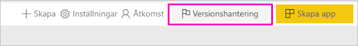

2. Välj **Skapa app**.

    Om du skapade testappen i **Skapa testmallappen** ovan är den gula punkten bredvid **Testar** redan fylld och du behöver inte välja **Skapa app** här. Om du väljer den går du tillbaka till processen för att skapa en mallapp.

3. Välj **Hämta länk**.

    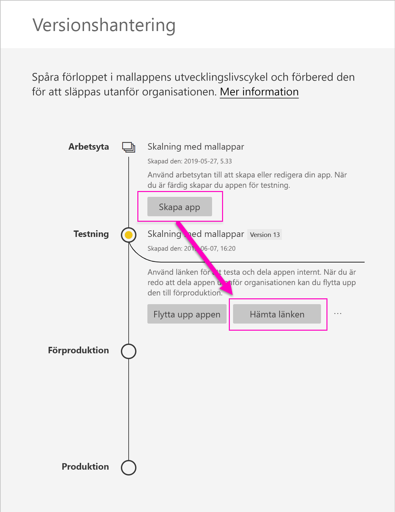

4. Om du vill testa appinstallationsupplevelsen kopierar du länken i meddelandefönstret och klistrar in den i ett nytt webbläsarfönster.

    Därifrån följer du samma procedur som användarna följer. Se [Installera och distribuera mallappar i organisationen](service-template-apps-install-distribute.md) om du vill se deras version.

5. Välj **Installera** i dialogrutan.

    När installationen är klar visas ett meddelande om att den nya appen är klar.

6. Välj **Gå till app**.
7. I **Kom igång med din nya app** visas appen så som dina kunder kommer att se den.

    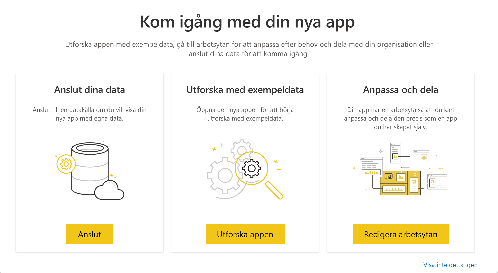
8. Välj **Utforska appen** att verifiera testappen med exempeldata.
9. Om du vill göra ändringar går du tillbaka till appen i den ursprungliga arbetsytan. Gör ändringar i testappen tills du är nöjd.
10. När du är redo att flytta upp appen till förproduktion för ytterligare testning utanför klientorganisationen går du tillbaka till fönstret **Versionshantering** och väljer**Höj upp appen**. 

    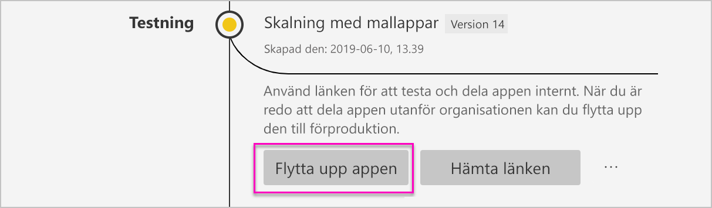
    >[!NOTE]
    > När appen höjs upp blir den allmänt tillgänglig utanför organisationen.

    Om du inte ser det alternativet ber du Power BI-administratören ge dig [behörighet för mallapputveckling](service-admin-portal.md#template-apps-settings) i administratörsportalen.
11. Välj **Höj en nivå** för att bekräfta ditt val.
12. Kopiera den nya URL:en så att du kan dela den för testning utanför din klientorganisation. Det är också den här länken du skickar för att börja distribuera app i AppSource genom att skapa ett [nytt Cloud Partner Portal-erbjudande](https://docs.microsoft.com/azure/marketplace/cloud-partner-portal/power-bi/cpp-publish-offer). Skicka endast förproduktionslänkar till Cloud Partner Portal. När appen har godkänts och du får ett meddelande om att den publicerats i AppSource kan du flytta upp paketet till produktion i Power BI.
13. När appen är klar för produktion eller delning via AppSource går du tillbaka till fönstret **Versionshantering** och väljer **Höj upp appen** bredvid **Förproduktion**.
14. Välj **Höj en nivå** för att bekräfta ditt val.

    Nu är din app i produktion och klar för distribution.

    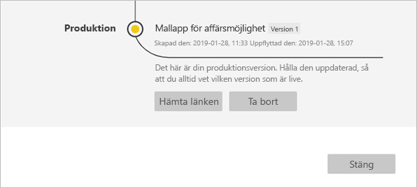

Vi rekommenderar att du skickar appen till AppSource så att den blir allmänt tillgänglig för tusentals Power BI-användare runt om i världen. Se [Power BI Application offer](https://docs.microsoft.com/azure/marketplace/cloud-partner-portal/power-bi/cpp-power-bi-offer) (Power BI-programerbjudande) för mer information.

## Nästa steg

Se hur dina kunder interagerar med din mallapp i [Installera, anpassa och distribuera mallappar i organisationen](service-template-apps-install-distribute.md).

Se [Power BI Application offer](https://docs.microsoft.com/azure/marketplace/cloud-partner-portal/power-bi/cpp-power-bi-offer) (Power BI-programerbjudande) för mer information.
