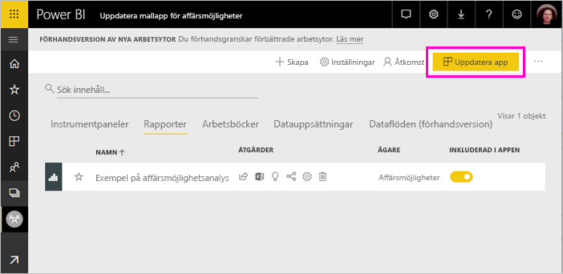
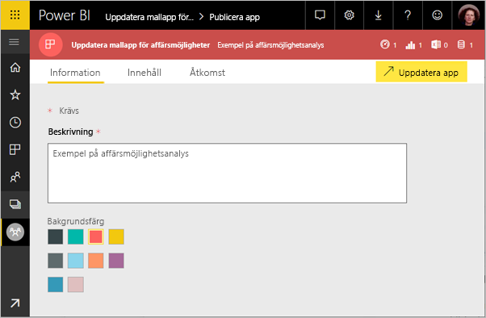
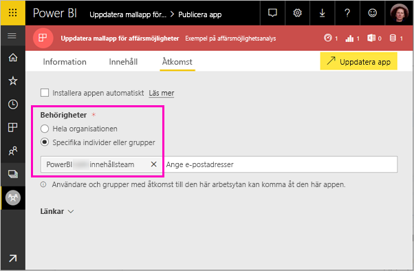

# Installera och distribuera mallappar i organisationen – Power BI (förhandsversion)

Med de nya Power BI-*mallapparna* kan Power BI-partner skapa Power BI-appar med lite eller ingen kodning och sedan distribuera dem till Power BI-kunder. Den här artikeln är till för Power BI-analytiker. Den förklarar hur du installerar, anpassar och distribuerar en mallapp som skapats av en Power BI-partner. Om du är intresserad av att skapa mallappar som du kan distribuera själv, kan du läsa [Skapa en mallapp i Power BI](service-template-apps-create.md).

När du installerar en mallapp som en Power BI-partner har skapat kan du anpassa den efter behoven i din organisation, och sedan distribuera den till dina kolleger som en app.  

## Förutsättningar  

Här följer kraven för att installera, anpassa och distribuera en mallapp:  

- A [Power BI Pro-licens](service-self-service-signup-for-power-bi.md)
- Bekanta dig med [grundläggande begrepp för Power BI ](service-basic-concepts.md)
- Giltigt installationslänk från den som skapat mallappen eller AppSource. 
- Behörighet att installera mallappar. 

## Installera en mallapp

Du kan få en länk till en mallapp. Annars kan du söka på AppSource efter något som intresserar dig. När du har installerat appen kan du ändra den och distribuera den till din egen organisation.

### Söka i AppSource från en webbläsare

Välj den här länken i en webbläsare för att öppna AppSource filtrerat på Power BI-appar:

- https://appsource.microsoft.com/marketplace/apps?product=power-bi

### Söka på AppSource från Power BI-tjänsten

1. Välj **Appar** > **Hämta appar** i navigeringsfönstret till vänster i Power BI-tjänsten.

    

2. Välj **Appar** i AppSource.

    

3. Bläddra eller sök efter appen och välj sedan **Hämta nu**.

2. Välj **Installera** i dialogrutan.

    Om du har en Power BI Pro-licens installeras appen med dess tillhörande arbetsyta. Du kan anpassa appen i arbetsytan.

    När installationen är klar visas ett meddelande om att din nya app är klar. 

3. Välj **Gå till app**.
4. I **Kom igång med din nya app** väljer du ett av följande tre alternativ:

    

    - **Utforska appen**: Utforskning av data med grundläggande exempel. Börja här för att få en känsla av appen. 
    - **Anslut data**: Ändra datakällan från exempeldata till din egen datakälla. Du kan definiera om datauppsättningsparametrar och autentiseringsuppgifter för datakällan. Se [Kända begränsningar](service-template-apps-tips.md#known-limitations) i artikeln om tips för mallappar. 
    - **Gå till arbetsytan** (avancerat alternativ): du kan göra de ändringar som apputvecklaren tillåter.

    Eller så kan du hoppa över den här dialogrutan och gå direkt till den tillhörande arbetsytan via **Arbetsytor** i det vänstra navigeringsfönstret.   
 
5. Innan du delar den med dina medarbetare ansluter du till dina egna data. Du kanske också vill ändra rapporten eller instrumentpanelen så att den passar din organisation. Du kan även lägga till andra rapporter eller instrumentpaneler i det här läget.

## Uppdatera och distribuera appen

När du har anpassat appen för din organisation är du redo att publicera den. Stegen är desamma som för publicering av andra appar. 

1. När du är klar med anpassningen väljer du **Uppdatera app** längst upp till höger i listvyn för arbetsytan.  

    

2. I **Information** kan du ändra beskrivningen och bakgrundsfärgen.

   

3. I **Innehåll** kan du välja en landningssida, antingen instrumentpanelen eller rapporten.

   

4. I **Åtkomst** ger du åtkomst till valda användare eller hela organisationen.  

   

5. Välj **Uppdatera app**. 

6. När den har publicerats kan du kopiera länken och dela den med de personer som du har beviljat åtkomst till. De som du delar länken med kan också se den på fliken **Min organisation** i AppSource.

## Nästa steg 

[Skapa arbetsytor med dina kollegor i Power BI](service-create-workspaces.md)

  

 
