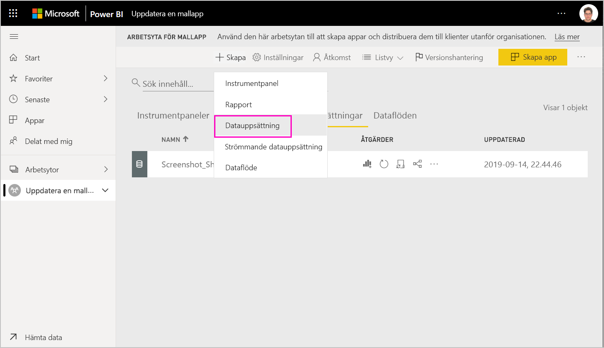
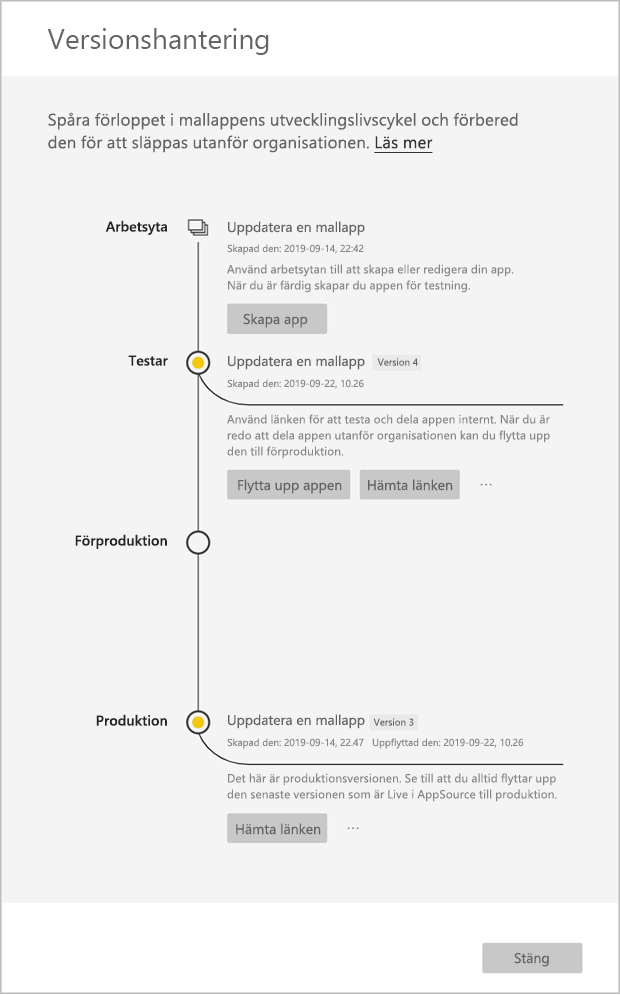
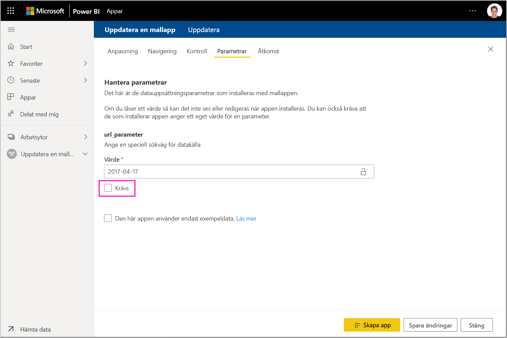

# Uppdatera, ta bort och extrahera en mallapp

Nu när appen är i produktion kan börja du om i testfasen, utan att det påverkar appen i produktion.
## Uppdatera din app

Om du har gjort ändringarna i Power BI Desktop börjar du med steg (1). Om du inte har gjort ändringarna i Power BI Desktop börjar du med steg (4).

1. Ladda upp den uppdaterade datauppsättningen och skriv över datauppsättningen. **Se till att använda exakt samma datauppsättningsnamn**. Om du använder ett annat namn skapas en nu datauppsättning för användare som uppdaterar appen.

1. Importera pbix-filen från datorn.

1. Bekräfta överskrivningen.

1. Välj **Skapa app** i fönstret **Versionshantering**.
1. Börja om skapandeprocessen.
1. När du har angett **Anpassning**, **Innehåll**, **Kontroll** och **Åtkomst** väljer du **Skapa app** på nytt.
1. Välj **Stäng** och gå tillbaka till **Versionshantering**.

   Nu kan du se att du har två versioner: Versionen som är i produktion, samt en ny version i testning.

    

5. När du är redo att flytta upp appen till förproduktion för ytterligare testning utanför klientorganisationen, går du tillbaka till versionshanteringsfönstret och väljer **Höj upp appen** bredvid **Testar**.
6. Länken är nu live. Skicka den igen till Cloud Partner Portal (CPP) genom att följa stegen i [Uppdatera ett Power BI-apperbjudande](https://docs.microsoft.com/azure/marketplace/cloud-partner-portal/power-bi/cpp-update-existing-offer).
7. I Cloud Partner Portal måste du **publicera** ditt erbjudande igen samt få det validerat igen.

   >[!NOTE]
   >Höj inte upp appen till produktion förrän den har godkänts i Cloud Partner Portal och du publicerar den.

### Uppdateringsfunktioner

1. Om du uppdaterar appen kan installationsprogrammet för mallappen [uppdatera en mallapp](service-template-apps-install-distribute.md#update-a-template-app) på den redan installerade arbetsytan utan att förlora anslutningskonfigurationen.
1. Se installationens [överskrivningsfunktioner](service-template-apps-install-distribute.md#overwrite-behavior) för att få reda på hur ändringar i datauppsättningen påverkar den installerade mallappen.
1. När du uppdaterar (skriver över) en mallapp återgår den först till exempeldata och ansluter automatiskt igen till användarens konfiguration (parametrar och autentisering). Innan uppdateringen har slutförts visas exempeldatabanderollen för rapporter, instrumentpaneler och organisationsappen.
1. Om du har lagt till en ny frågeparameter till den uppdaterade datauppsättningen som kräver indata från användaren måste du markera kryssrutan *obligatoriskt*. Detta anger anslutningssträngen för installationsprogrammet när appen har uppdaterats.
 

## Extrahera arbetsyta
Att återgå till en tidigare version av en mallapp är nu enklare än någonsin med extraheringsfunktionen. Med följande steg kan du extrahera en specifik appversion från olika versionsstadier till en ny arbetsyta:

1. I versionshanteringsfönstret trycker du på mer **(...)**  och sedan på **Extrahera**.

     
2. I dialogrutan anger du namnet för den extraherade arbetsytan. En ny arbetsyta kommer att läggas till.

Din nya arbetsyteversion återställs och du kan fortsätta att utveckla och distribuera mallappen från den nyligen extraherade arbetsytan.

## Ta bort mallappsversion
En mallappsarbetsyta är källan till en aktiv distribuerad mallapp. För att skydda mallappsanvändarna går det inte att ta bort en arbetsyta utan att först ta bort alla skapade appversioner på arbetsytan.
Om du tar bort en appversion, tas även app-URL:en bort som inte längre fungerar.

1. I versionshanteringsfönstret trycker du på ellipsen **(...)**  och sedan på **Ta bort**.
 
  

>[!NOTE]
>Se till att du inte ta bort en appversion som används av kunder eller **AppSource**, då fungerar de inte längre.

## Nästa steg

Se hur dina kunder interagerar med din mallapp i [Installera, anpassa och distribuera mallappar i organisationen](service-template-apps-install-distribute.md).

Se [Power BI Application offer](https://docs.microsoft.com/azure/marketplace/cloud-partner-portal/power-bi/cpp-power-bi-offer) (Power BI-programerbjudande) för mer information.
