# Navigera i Power BI-tjänsten

Om du har använt Power BI-tjänsten en längre tid har du säker märkt att vi har ändrat användargränssnittet avsevärt.  De flesta av de här ändringarna påverkar hur ditt innehåll (instrumentpaneler, rapporter, datauppsättningar) har ordnats och sökvägarna (klick) som du använder för att utföra åtgärder på innehållet. 

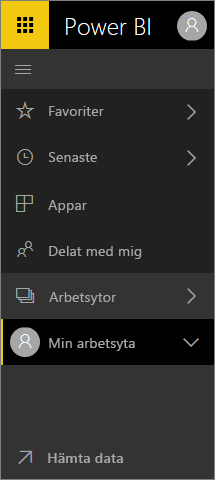

## Hur gör jag för att...
För de som är bekanta med det tidigare gränssnittet för Power BI-tjänsten visar den här guiden hur saker går till i det nya gränssnittet. Vi förstår att det kan vara förvirrande i början men vi tror att du kommer att upptäcka många tidsbesparande förbättringar hos den nya layouten med tiden. 

**Snabbguide**

| Åtgärd | Ny (aktuell) väg |
| --- | --- | --- |
| Favoritmarkera en instrumentpanel |Arbetsyta > Instrumentpaneler och markera stjärnikonen så att den blir gul |
| Visa en lista över dina favoritinstrumentpaneler |Välj **Favoriter** från det vänstra navigeringsfönstret |
| Visa en lista över nyligen besökta instrumentpaneler och rapporter |Välj **Senaste** från det vänstra navigeringsfönstret |
| Visa en lista över instrumentpaneler som har delats med dig |Välj **Delade med mig** från det vänstra navigeringsfönstret |
| Dela en instrumentpanel |Öppna instrumentpanelen och välj **Dela** eller skapa och publicera en app |
| Ta bort en instrumentpanel |Min arbetsyta > Instrumentpaneler > Papperskorgikonen |
| Ta bort en rapport |Min arbetsyta > Rapporter > Papperskorgikonen |
| Ta bort en datauppsättning |Min arbetsyta > Datauppsättningar >... > Ta bort |
| Öppna en instrumentpanel |Arbetsytan > Instrumentpaneler > och välj namnet på instrumentpanelen |
| Öppna en rapport |Arbetsytan > Rapporter > och välj namnet på rapporten |
| Öppna en datauppsättning |Arbetsytan > Rapporter > och välj namnet på datauppsättningen |
| Skapa en instrumentpanel |Välj Skapa > Instrumentpanel från det övre navigeringsfältet |
| Skapa en rapport |Välj Skapa > Rapport från det övre navigeringsfältet |
| Skapa en datauppsättning |Välj Skapa > Datauppsättning från det övre navigeringsfältet |
| Skapa en app |Arbetsytor > Skapa en apparbetsyta |
| Visa en lista över alla instrumentpaneler, rapporter och datauppsättningar som du äger |Arbetsytor > Min arbetsyta |

## Varför har vi ändrat navigeringsupplevelsen för Power BI-tjänsten?
* effektiva listor för instrumentpaneler, rapporter, arbetsböcker och datauppsättningar    
* snabbare åtkomst med listrutor för favoriter, senaste och val av arbetsyta    
* nytt sätt att identifiera relaterat innehåll för instrumentpaneler, rapporter och datauppsättningar    
* separat innehållsområde för arbetsböcker    
* separat område för dina favoritinstrumentpaneler    
* separat område för innehåll som har delats med dig 
* separat område för ditt senaste innehåll  
* det behövs färre klick för att utföra åtgärder – innehållslistor har kombinerats och åtgärderna som du kan utföra på innehållet visas på samma skärm. Till exempel, att växla mellan instrumentpaneler och rapporter.</td></tr></table>

Låt Amanda visa dig den nya navigeringsmiljön medan hon förklarar och visar förbättringarna.  Prova sedan själv genom att följa de stegvisa anvisningarna under videon.

<iframe width="560" height="315" src="https://www.youtube.com/embed/G26dr2PsEpk" frameborder="0" allowfullscreen></iframe>

## Vi har lagt till några helt nya funktioner
Prova sedan själv genom att följa de stegvisa anvisningarna.

### Visa innehåll (instrumentpaneler, rapporter, arbetsböcker, datauppsättningar, arbetsytor, appar)
Låt oss börja med att titta på hur grundläggande innehåll är organiserat (instrumentpaneler, rapporter, datauppsättningar, arbetsböcker). Tidigare var allt ditt innehåll listat i det vänstra navigeringsfönstret. Du kan fortfarande välja det alternativet men standard är att visa enligt innehållstyp inom en arbetsyta. Välj en arbetsyta från det vänstra navigeringsfönstret. Tabeller för det associerade innehållet (instrumentpaneler, rapporter, arbetsböcker och datauppsättningar) kommer att fylla Power BI-arbetsytan till höger.

Om du har Power BI Free kan du bara se en arbetsyta – **Min arbetsyta**.

### Favoritinstrumentpaneler
Med **Favoriter** kan du snabbt komma åt de instrumentpaneler som är viktigast för dig.  

1. Välj **Favorit** från det övre högra hörnet när instrumentpanelen är öppen.
   
   
   
   **Favorit** ändras till **Ej favorit** och stjärnikonen blir gul.
   
   
2. Om du vill visa en lista över alla instrumentpaneler som du har lagt till som favoriter i det vänstra navigeringsfältet väljer du pilen till höger om **Favoriter**. Eftersom det vänstra navigeringsfältet är en permanent funktion i Power BI-tjänsten har du åtkomst till den här listan från var som helst i Power BI-tjänsten.
   
    
   
    Härifrån kan du välja en instrumentpanel och öppna den.
3. Öppna rutan **Favoriter** i det vänstra navigeringsfältet och välj **Favoriter** eller klicka på ikonen Favoriter .
   
   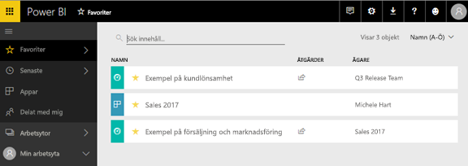
   
   Här kan du välja en instrumentpanel att öppna, se vem som äger en instrumentpanel, avmarkera en instrumentpanel som favorit eller dela en instrumentpanel med kollegor.
4. Ett annat sätt att markera en instrumentpanel som en favorit är från fliken **Instrumentpaneler**.  Öppna arbetsytan som innehåller instrumentpanelen och välj stjärnikonen till vänster om instrumentpanelens namn.
   
   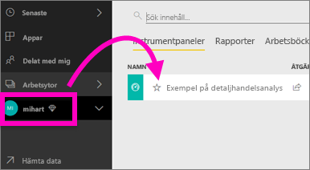

Läs mer i [Favoritmarkera en instrumentpanel](service-dashboard-favorite.md)

### Senaste
Få snabb tillgång rapporter och instrumentpaneler som du nyligen öppnat genom att gå till panelen **Senaste**. Detta omfattar innehåll från alla dina arbetsytor.

  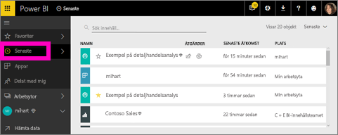

Precis som favoriter kan du snabbt komma åt ditt senaste innehåll från var som helst i Power BI-tjänsten genom att välja pilen bredvid **Senaste** i det vänstra navigeringsfältet.

  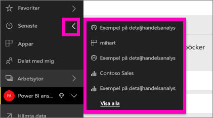

Läs mer i [Senaste i Power BI](service-recent.md)

### Appar
En app är en samling av instrumentpaneler och rapporter som används för att leverera nyckelvärden på samma plats. Du kan välja att låta apparna vara interna för din organisation och även ha [appar för externa tjänster](service-connect-to-services.md), till exempel Google Analytics och Microsoft Dynamics CRM. 

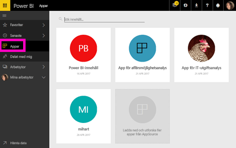

Läs mer i **Apparbetsytor** (nedan) och [Vad är Power BI-appar](service-install-use-apps.md).

### Delat med mig
**Delat med mig** är platsen för alla instrumentpaneler som kollegor har delat med dig.  Filtrera efter instrumentpanelens ägare, använd sökfältet för att hitta relevant information för dig eller sortera objekten efter datum.  Och för delat innehåll som du besöker ofta är det enklare att favoritmarkera det direkt från vyn **Delas med mig**.

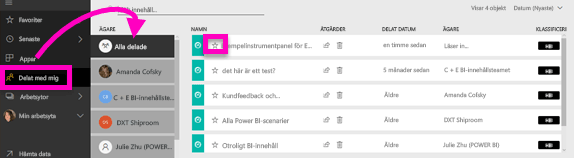

Läs mer i [delas med mig](service-shared-with-me.md)

### Arbeta med arbetsytor
*Arbetsytor* är nästa del av det vänstra navigeringsfältet. Arbetsytor kan betraktas som *behållare* för Power BI-innehåll. Det finns två typer av arbetsytor: **Min arbetsyta** och apparbetsytor.

Om du inte är medlem i en arbetsyta i appen eller en administratör kan du kanske inte se apparbetsytor i det vänstra navigeringsfältet. Och om du är en Power BI-kund (kostnadsfri) kan du inte se apparbetsytor.

#### Min arbetsyta
**Min arbetsyta** lagrar allt innehåll som du äger. Du kan se det som det personliga utvecklingsutrymme eller ett område för ditt eget innehåll. Du kan dela innehåll från Min arbetsyta med kollegor. I Min arbetsyta är innehållet uppdelat i 4 flikar: instrumentpaneler, rapporter, arbetsböcker och datauppsättningar.

#### Apparbetsytor
Appar och apparbetsytor är en funktion i Power BI Pro. Om du skapar instrumentpaneler och rapporter för andra kommer du att använda apparbetsytor. En apparbetsyta är den plats där du skapar appen, så om du vill skapa en app måste du först skapa en apparbetsyta. De är en utveckling av grupparbetsytor – mellanlagringsområden och behållare för innehållet i din app.  Du och dina kollegor kan samarbeta på instrumentpaneler, rapporter och annat innehåll som du planerar att distribuera till en bredare publik eller hela organisationen.

För att lära dig mer om detta kan du besöka [Skapa och distribuera en app i Power BI](service-create-distribute-apps.md#app-workspaces).

Precis som i **Min arbetsyta** är innehållet uppdelat i 4 flikar: instrumentpaneler, rapporter, arbetsböcker och datauppsättningar.

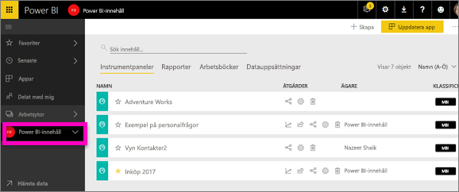

Växla arbetsytor genom att välja **arbetsytor** i det vänstra navigeringsfältet.

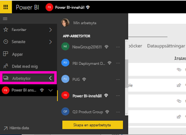

### Söka efter och sortera innehåll
Den nya innehållsvyn gör det lättare att söka efter, filtrera och sortera ditt innehåll. Skriv i sökområdet om du vill söka efter en instrumentpanel, en rapport eller en arbetsbok. Power BI filtrerar fram det innehåll vars namn innehåller din söksträng.

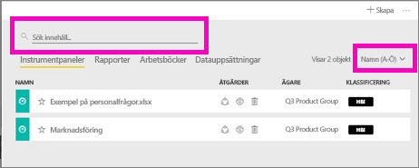

Du kan också sortera innehåll efter namn eller ägare.  

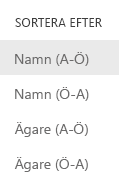

Läs mer i [Power BI-navigering: söka efter, sortera, filtrera](service-navigation-search-filter-sort.md)

## Nästa steg
Har du några frågor eller feedback? [Besök Power BI Community](http://community.powerbi.com/t5/Navigation-Preview-Forum/bd-p/NavigationPreview)

