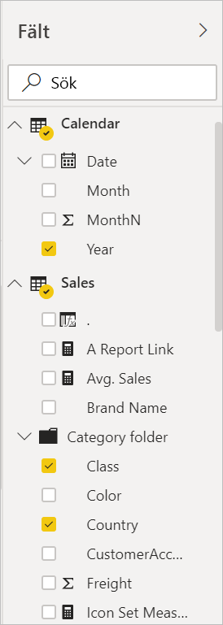

# Upptäck rapportredigeraren i Power BI

I Power BI Desktop och i Power BI-tjänsten är *rapportredigeraren* det ställe där du utformar de rapporter som dina konsumenter ser, med diagram, tabeller, kartor och andra visuella objekt. Det fungerar på liknande sätt i de två miljöerna. Vanligtvis börjar du med att skapa en rapport i Power BI Desktop. Sedan publicerar du den till Power BI-tjänsten, där du kan fortsätta att arbeta med den. I Power BI-tjänsten kan du också skapa instrumentpaneler utifrån dina rapporter.

När du har skapat dina instrumentpaneler och rapporter kan du distribuera dem till rapportanvändarna. Beroende på hur du delar rapporter kan slutanvändarna interagera med dem i läsvyn i Power BI-tjänsten, men de kan inte redigera dem. Läs mer om [vad rapportanvändare kan göra i Power BI-tjänsten](consumer/end-user-reading-view.md). 

I den här videon visas rapportredigeraren i Power BI Desktop. I den här artikeln visas även rapportredigeraren i Power BI Desktop. 

<iframe width="560" height="315" src="https://www.youtube.com/embed/IkJda4O7oGs" frameborder="0" allowfullscreen></iframe>

I Power BI-tjänsten är rapportredigeraren endast tillgänglig i redigeringsvyn. Om du vill öppna en rapport i redigeringsvyn måste du vara rapportens ägare eller skapare, eller vara deltagare för den arbetsyta där rapporten finns.

Power BI-rapportredigeraren är indelad i flera huvudavsnitt:  

1. Översta navigeringsfältet
1. Rapportarbetsytan
1. Filterfönstret
1. Visualiseringsfönster
1. Fönstret Fält

## 1. Översta navigeringsfältet
Det finns många åtgärder tillgängliga i det övre navigeringsfältet, och nya åtgärder läggs till hela tiden. Använd Power BI-dokumentationens innehållsförteckning eller sökrutan om du vill ha information om en viss åtgärd.

## 2. Rapportarbetsytan
Rapportarbetsytan är den plats där arbetet visas. När du använder fönstren Fält, Filter och Visualiseringar för att skapa visuella objekt, så skapas och visas dessa på rapportarbetsytan. Varje flik längst ned på arbetsytan visar en sida i rapporten. Öppna en sida genom att välja dess flik. 

## Rapportredigerarens fönster

Tre fönster visas när du först öppnar en rapport: Filter, Visualiseringar och Fält. De första två fönstren till vänster, Filter och Visualiseringar, styr visualiseringarnas utseende: typ, färger, filtrering och formatering. Det sista fönstret till höger, Fält, hanterar de underliggande data som används i visualiseringarna. Innehållet som visas i rapportredigeraren varierar beroende på vilka val du gör på rapportarbetsytan. 

Följande gäller om du till exempel väljer ett enskilt visuellt objekt såsom det här kolumndiagrammet:

**Filterfönstret** visar eventuella filter på det visuella objektet, på sidan eller på alla sidor. I det här fallet finns det filter på sidnivå men inga filter på visuell nivå.

**Överst i visualiseringsfönstret** identifieras den typ av visuellt objekt som används. I det här exemplet är det ett grupperat stående stapeldiagram. 

**Längst ned i visualiseringsfönstret** finns tre flikar:

 **Fält** visar fälten i det visuella objektet. Du kan behöva bläddra nedåt för att se all information. Det här diagrammet använder StoreNumberName och Årets försäljning.

 **Format** Välj rollerikonen om du vill visa formatfönstret för den valda visualiseringen.

 **Analys** Välj förstoringsglasikonen om du vill visa analysfönstret.

**Fönstret Fält** visar alla tillgängliga tabeller i datamodellen. När du expanderar en tabell visas fälten i den tabellen. Den gula kryssmarkeringen anger att minst ett fält från den tabellen finns i en visualisering.

Läs vidare om du vill få mer information om varje fönster.

## 3. Fönstret Filter
Använd fönstret Filter för att visa, ange och ändra beständiga filter för rapporten på sidan, rapporten, visningen av detaljerad information och visuell nivå. Ja, du kan göra ad hoc-filtrering på rapportsidor och visuella objekt genom att välja element av den visuella informationen eller med hjälp av verktyg såsom utsnitt. Filtrering i fönstret Filter har fördelen att filtrens tillstånd sparas med rapporten. 

Filterfönstret har ytterligare en kraftfull funktion: du kan filtrera med ett fält *som inte redan finns i något av de visuella objekten i rapporten*. Låt mig förklara. När du skapar en visualisering lägger Power BI automatiskt till alla fält i visualiseringen till området för filter på visuell nivå i fönstret Filter. Om du vill ange ett filter för visuellt objekt, sida, visning av detaljerad information eller rapport med hjälp av ett fält som för närvarande inte används visualiseringen kan du helt enkelt dra det till någon av Filter-bucketarna.

Den nya filterupplevelsen ger större flexibilitet. Till exempel kan du formatera filter så att de ser ut som själva rapporten. Du kan också låsa filter eller dölja dem för rapportanvändare. 

Läs mer om [den nya filterupplevelsen](power-bi-report-filter.md).

## 4. Fönstret Visualiseringar

Visualiseringsfönstret innehåller i sig fyra avsnitt. Vi börjar överst i fönstret.

Det är här du väljer en visualiseringstyp. De små ikonerna visar de olika typer av visualiseringar som du kan skapa. I bilden ovan har bubbeldiagrammet valts. Om du börjar skapa en visualisering genom att välja fält utan att först välja en visualiseringstyp väljer Power BI visualiseringstypen åt dig. Du kan behålla valet från Power BI eller ändra typen genom att välja en annan ikon.

Du kan ladda ned anpassade visualiseringar till Power BI Desktop. Ikonerna för dem visas också i det här fönstret. 

### Hantera fälten i en visualisering

Bucketarna (kallas ibland *källor*) i det här fönstret varierar beroende på vilken typ av visualisering du har valt.  Om du till exempel har valt ett stapeldiagram visas Axel, Förklaring och Värden. När du markerar ett fält eller drar det till arbetsytan lägger Power BI till det fältet i någon av bucketarna.  Du kan också dra fält från fältlistan direkt till bucketarna.  Vissa bucketar är begränsade till vissa datatyper.  **Värden** accepterar t.ex. inte icke-numeriska fält. Om du drar ett **Kategori**-fält till bucketen **Värden** ändrar Power BI den till **Antal per kategori**.

Mer information finns i [Lägga till visualiseringar i en Power BI-rapport](visuals/power-bi-report-add-visualizations-i.md).

Den här delen av fönstret innehåller även alternativ för att kontrollera [visning av detaljerad information](desktop-drillthrough.md) och filterbeteende.

### Formatera dina visuella objekt
Öppna formatfönstret genom att välja färgrollerikonen. Vilka alternativ som är tillgängliga beror på vilken visualiseringstyp som har valts.

Formateringsmöjligheterna är omfattande.  Om du vill veta mer, så utforska på egen hand eller läs följande artiklar:

* [Anpassa visualiseringens rubrik, bakgrund och förklaring](visuals/power-bi-visualization-customize-title-background-and-legend.md)
* [Färgformatering](visuals/service-getting-started-with-color-formatting-and-axis-properties.md)
* [Anpassa egenskaper för x-axeln och y-axeln](visuals/power-bi-visualization-customize-x-axis-and-y-axis.md)

### Lägg till analys i din visualiseringar
Välj förstoringsglasikonen om du vill visa analysfönstret. Vilka alternativ som är tillgängliga beror på vilken visualiseringstyp som har valts.

I analysfönstret i Power BI-tjänsten kan du lägga till dynamiska referensrader i visualiseringar och lägga fokus på viktiga trender eller insikter. Mer information finns i [Analysfönstret i Power BI Desktop](desktop-analytics-pane.md).

## 5. Fönstret Fält
Fönstret Fält visar de tabeller, mappar och fält i dina data som är tillgängliga så att du kan använda dem för att skapa visualiseringar.

|  |  |
| --- | --- |
|  |<ul><li>Starta en ny visualisering genom att dra ett fält till sidan.  Du kan också dra ett fält till en befintlig visualisering så att fältet läggs till i visualiseringen.  </li> <li>När du lägger till en bock bredvid ett fält så lägger Power BI till det fältet i den aktiva (eller nya) visualiseringen. Och det avgör även i vilken bucket fältet ska placeras.  Ska fältet t.ex. användas som en förklaring, en axel eller ett värde? Power BI gör en kvalificerad gissning, och du kan flytta den från en bucket till en annan, om så skulle behövas.   </li><li>Oavsett hur du gör, så har varje markerat fält lagts till i fönstret Visualiseringar i Rapportredigeraren.</li></ul> |

I Power BI Desktop har du även alternativ för att visa/dölja fält, lägga till beräkningar osv.

## Fältikonerna

Power BI använder ett antal olika ikoner för att ange fälttyperna i en rapport. När du känner igen dem förstår du bättre hur de fungerar i olika visuella objekt. Här följer några vanliga sådana.

|Ikon  |Innebörd  |
|---------|---------|
|  | Mapp i fältlistan |
| | Numeriskt fält: Numeriska fält är aggregeringar som till exempel kan summeras eller aggregeras. Aggregeringar importeras med data och definieras i den datamodell som rapporten baseras på. Mer information finns i [Aggregeringar i Power BI-rapporter](service-aggregates.md). |
| | Beräknad kolumn med en icke-numerisk datatyp: En ny icke-numerisk kolumn som du skapar med en DAX-formel (Data Analysis Expressions) som definierar kolumnens värden. Läs mer om [beräknade kolumner](desktop-calculated-columns.md). |
|     |   Numerisk beräknad kolumn: En ny kolumn som du skapar med en DAX-formel (Data Analysis-uttryck) som definierar kolumnens värden. Läs mer om [beräknade kolumner](desktop-calculated-columns.md). |
| |  Mått: Ett beräknat mått har sin egen hårdkodade formel. Du kan t.ex. inte ändra beräkningen om den är en summa. Den kan bara vara en summa. Värdena lagras inte i en kolumn. De beräknas direkt enbart baserat på deras plats i ett visuellt objekt. Mer information finns i [Förstå mått](desktop-measures.md). |
|     | Måttgrupp  |
| |      KPI: En visuell indikator som anger de framsteg som gjorts mot ett mätbart mål. Läs mer om [visuella KPI-objekt (Key Performance Indicator)](visuals/power-bi-visualization-kpi.md) |
|     |  Hierarki med fält: Välj pilen om du vill visa vilka fält som bildar hierarkin.  Titta på den här Power BI-videon på YouTube om du vill veta mer om att [skapa och arbeta med hierarkier](https://www.youtube.com/watch?v=q8WDUAiTGeU). |
|     | Geodata: De här platsfälten kan användas för att skapa kartvisualiseringar. |
|      | Identitetsfält: Fält med den här ikonen är *unika fält* som är inställda på att visa alla värden, även om de har dubbletter. Dina data kan till exempel ha poster för två olika personer som heter ”Robin Smith”, och var och en behandlas som unika. De summeras inte.   |
|   | Parameter: Ange parametrar för att göra så att delar av dina rapporter och datamodeller (till exempel ett frågefilter, en referens för datakälla, en måttdefinition osv.) blir beroende av ett eller flera parametervärden. Mer information finns i det här Power BI-blogginlägget om [frågeparametrar](https://powerbi.microsoft.com/blog/deep-dive-into-query-parameters-and-power-bi-templates/). |
|  | Kalenderdatumfält med inbyggd datumtabell |

## Nästa steg
[Skapa en rapport](service-report-create-new.md)

Mer om rapporter i [Power BI-tjänsten](service-report-create-new.md), [Power BI Desktop](desktop-report-view.md) och [Power BI-mobilappar](consumer/mobile/mobile-apps-view-phone-report.md).

[Grundläggande begrepp för Power BI-designers](service-basic-concepts.md)

Har du fler frågor? [Prova Power BI Community](http://community.powerbi.com/)

