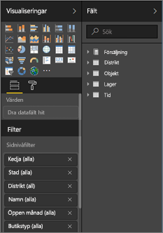
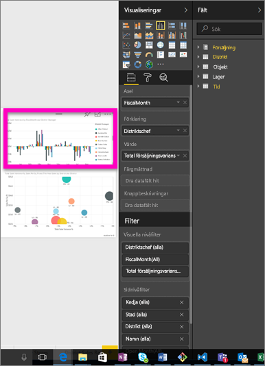
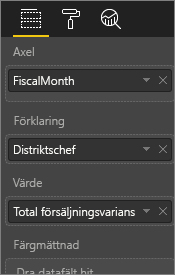
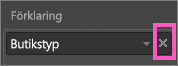
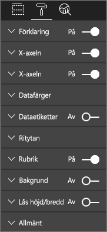
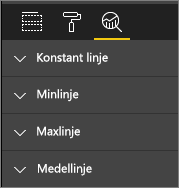
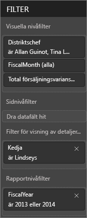
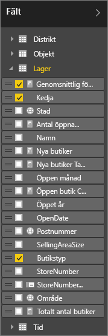

# Rapportredigeraren... Ta en rundtur
## Redigera rapporter i Power BI-tjänsten och Power BI Desktop
Rapportredigeraren i Power BI-tjänsten och rapportredigeraren i Power BI Desktop liknar varandra mycket. Videon visar rapportredigeraren i Power BI Desktop och den här artikeln beskriver rapportredigeraren i Power BI-tjänsten. 

## Skillnaden mellan rapport*skapare* och rapport*konsumenter*
Möjligheten att skapa och redigera en rapport är begränsad till rapportens ägare (aka *skapare*). Om du *konsumerar* en rapport som har delats med dig kommer du fortfarande att kunna öppna och interagera med rapporten i Power BI-tjänsten [Endast läsvy](service-reading-view-and-editing-view.md), men kommer inte att ha alla stabila och omfattande funktioner som är tillgängliga för rapportskaparen.  

Mer information om rapportens läsvy finns i [Läsvyn och Redigeringsvyn i Power BI-tjänsten](service-reading-view-and-editing-view.md) 

<iframe width="560" height="315" src="https://www.youtube.com/embed/IkJda4O7oGs" frameborder="0" allowfullscreen></iframe>

I Power BI-tjänsten är *rapportredigeraren* endast tillgänglig i [redigeringsvyn](service-reading-view-and-editing-view.md). Om du vill öppna en rapport i redigeringsvyn måste du vara rapportägare eller -skapare.

Power BI-Rapportredigeraren består av 3 delar:  

1. Fönster för**fält**, **visualiseringar** och **filter**
2. övre navigeringsfälten    
3. rapportarbetsytan     

## 1. Rapportredigerarens fönster

Det finns 3 synliga fönster första gången som du öppnar en rapport: visualiseringar, filter och fält. Fönstren till vänster, visualiseringar och filter, styr visualiseringarnas utseende, t.ex. typ, färger, filtrering, formatering.  Och fönstret till höger, fält, hanterar de underliggande data som används i visualiseringarna. 

Innehållet som visas i rapportredigeraren varierar beroende på vilka val du gör på rapportarbetsytan.  När du t.ex. väljer ett enskilt visuellt objekt, 

|  |  |
| --- | --- |
|  |<ul><li>Överst i visualiseringsfönstret identifieras det visuella objektets typ. I det här exemplet är det ett klustrat stapeldiagram.  </li> <li>Längst ned i visualiseringsfönstret (du kanske måste rulla nedåt) visas de fält som används i det visuella objektet. Det här diagrammet använder FiscalMonth, DistrictManager och Total Sales Variance.   </li><li>Fönstret Filter (du kanske måste rulla nedåt) visar eventuella filter som har tillämpats.   </li><li>Fönstret Fält innehåller de tabeller som är tillgängliga, och om du expanderar ett tabellnamn visas fälten som utgör tabellen. Ett gult teckensnitt indikerar att minst ett fält från tabellen används i visualiseringen.  </li><li> Välj rollerikonen om du vill visa formateringsfönstret för den valda visualiseringen.  </li><li> Välj förstoringsglasikonen om du vill visa analysfönstret.</ul> |

## Visualiseringsfönstret (uppifrån och ned)

Det är här du väljer visualiseringstyp. De små bilderna kallas *mallar*. I bilden ovan har det klustrade stapeldiagrammet valts. Om du inte väljer visualiseringstyp först, men i stället börja skapa en visualisering genom att välja fält, så väljer Power BI en visualiseringstyp åt dig. Du kan behålla den visualiseringstyp som Power BI har valt, eller så ändrar du typ genom att välja en annan mall. Byt så många gånger du vill, så att du verkligen hittar den visualiseringstyp som representerar dina data på bästa sätt.

### Hantera det fält som används i ditt visuella objekt.

De bucketar (kallas ibland *källor*) som visas i det här fönstret varierar beroende på vilken typ av visualisering du har valt.  Om du t.ex. har valt ett stapeldiagram visas bucketar för: värden, axel och förklaring. När du markerar ett fält eller drar det till arbetsytan, så lägger Power BI till det fältet i någon av bucketarna.  Du kan också dra fält från fältlistan direkt till bucketarna.  Vissa bucketar är begränsade till vissa datatyper.  **Värden** accepterar t.ex. inte icke-numeriska fält. Om du drar ett **employeename**-fält till bucketen **Values** så ändrar Power BI den till **antal employeename**.

### Ta bort ett fält
Om du vill ta bort ett fält från visualiseringen så markera **X** till höger om fältnamnet.

Mer information finns i [Lägga till visualiseringar i en Power BI-rapport](visuals/power-bi-report-add-visualizations-i.md)

### Formatera dina visuella objekt
Öppna formatfönstret genom att välja färgrollerikonen. Vilket alternativ som är tillgängligt beror på vilken visualiseringstyp som har valts.

Formateringsmöjligheterna är nästan oändliga.  Om du vill veta mer, så utforska på egen hand eller läs följande artiklar:

* [Anpassa visualiseringens rubrik, bakgrund och förklaring](visuals/power-bi-visualization-customize-title-background-and-legend.md)
* [Färgformatering](visuals/service-getting-started-with-color-formatting-and-axis-properties.md)
* [Anpassa egenskaper för x-axeln och y-axeln](visuals/power-bi-visualization-customize-x-axis-and-y-axis.md)

### Lägg till analys i din visualiseringar
Välj förstoringsglasikonen om du vill visa analysfönstret. Vilket alternativ som är tillgängligt beror på vilken visualiseringstyp som har valts.

    
Med fönstret Analytics i Power BI-tjänsten kan du lägga till dynamiska referensrader i visualiseringar och ange fokus för viktiga trender eller insikter. Läs mer i [Fönstret Analytics i Power BI-tjänsten](service-analytics-pane.md) eller [Fönstret Analytics i Power BI Desktop](desktop-analytics-pane.md).

- - -
## Fönstret Filter
Använd fönstret Filter för att visa, ange och ändra beständiga filter för rapporten på sidan, rapporten, visningen av detaljerad information och visuell nivå. Ja, du kan göra ad hoc-filtrering på rapportsidor och visuell information genom att välja element av den visuella informationen eller med hjälp av verktyg som utsnitt, men genom att använda fönstret Filter sparas tillståndet för filtren i rapporten. 

Fönstret Filter har en andra kraftfull funktion – möjlighet att filtrera med ett fält ***som inte redan används i en av visualiseringarna i rapporten***. Låt mig förklara. När du skapar en rapportsida, lägger Power BI automatiskt till alla fält som du använder i din visuella information till filterområdet för visuell information i fönstret Filter.  Men om du vill ange ett filter för visuell information, sida, visning av detaljerad information eller rapport som för närvarande använder ett fält som inte används i en visualisering, bara dra det till ett av filtrets buckets.   

Mer information finns i [Lägg till ett filter till en rapport](power-bi-report-add-filter.md).

- - -
## Fönstret Fält
Fönstret Fält visar de tabeller och fält som finns i dina data och som är tillgängliga så att du kan använda dem för att skapa visualiseringar.

|  |  |
| --- | --- |
|  |<ul><li>Starta en ny visualisering genom att dra ett fält till sidan.  Du kan också dra ett fält till en befintlig visualisering så att fältet läggs till i visualiseringen.  </li> <li>När du lägger till en bock bredvid ett fält så lägger Power BI till det fältet i den aktiva (eller nya) visualiseringen. Och det avgör även i vilken bucket fältet ska placeras.  Ska fältet t.ex. används som en förklaring, en axel eller ett värde? Power BI gör en kvalificerad gissning, och du kan flytta den från en bucket till en annan, om så skulle behövas.   </li><li>Oavsett hur du gör, så har varje markerat fält lagts till i fönstret Visualiseringar i Rapportredigeraren.</li></ul> |

**Obs!** Om du använder Power BI Desktop du har också alternativ för att visa/dölja fält, lägga till beräkningar osv.

### Vad betyder fältikonerna?
* **∑ Aggregeringar** En aggregering är ett numeriskt värde som t.ex. ska summeras eller utgöra ett genomsnitt. Aggregeringar importeras med data (som definieras i den datamodell som rapporten baseras på).
  Mer information finns i [Aggregeringar i Power BI-rapporter](service-aggregates.md).
*  **Beräknade mått (kallas även beräknade fält)**  
   Varje beräknat fält har en egen hårdkodad formel. Du kan t.ex. inte ändra beräkningen om den är en summa. Den kan bara vara en summa. Mer information finns i [Förstå mått](desktop-measures.md)
*  **Unika fält**  
   Fält med den här ikonen importerades från Excel och är inställda på att visa alla värden, även om de har dubbletter. Dina data kan t.ex. ha två poster för personer med namnet ”John Smith”, och var och en behandlas som unik – de summeras inte.  
* ** Geografifält**  
   Platsfält kan användas för att skapa kartvisualiseringar. 
* ** Hierarki**  
   Markera pilen om du vill visa vilka fält som bildar hierarkin. 

- - -
## 2. Översta navigeringsfältet
Åtgärder som är tillgängliga från det övre navigeringsfältet är ett stort antal, och nya åtgärder läggs till hela tiden. Använd Power BI-dokumentationens innehållsförteckning eller sökrutan om du vill ha information om en viss åtgärd.

## 3. Rapportarbetsytan
Rapportarbetsytan är den plats där arbetet visas. När du använder fönstren Fält, Filter och Visualiseringar för att skapa visuella objekt, så skapas och visas dessa på rapportarbetsytan. Varje flik längst ned på arbetsytan representerar en sida i rapporten. Öppna en sida genom att välja dess flik. 

## Nästa steg:
[Skapa en rapport](service-report-create-new.md)

Läs mer om rapporter i [Power BI-tjänsten](service-reports.md), [Power BI Desktop](desktop-report-view.md) och [Power BI Mobile](consumer/mobile/mobile-apps-view-phone-report.md).

[Power BI – grundläggande begrepp](service-basic-concepts.md)

Har du fler frågor? [Prova Power BI Community](http://community.powerbi.com/)

